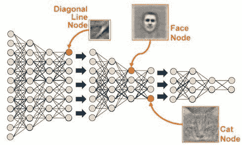

# 数据科学难题，解释

> 原文：[`www.kdnuggets.com/2016/03/data-science-puzzle-explained.html/2`](https://www.kdnuggets.com/2016/03/data-science-puzzle-explained.html/2)

由**[Matthew Mayo](https://www.kdnuggets.com/author/matt-mayo "Posts by Matthew Mayo")**撰写，KDnuggets 主编，2016 年 3 月 10 日，发表于[人工智能](https://www.kdnuggets.com/tag/artificial-intelligence)、[数据挖掘](https://www.kdnuggets.com/tag/data-mining)、[数据科学](https://www.kdnuggets.com/tag/data-science)、[深度学习](https://www.kdnuggets.com/tag/deep-learning)、[解释](https://www.kdnuggets.com/tag/explained)、[机器学习](https://www.kdnuggets.com/tag/machine-learning)

**数据挖掘**

[Fayyad, Piatetsky-Shapiro & Smyth](http://www.csd.uwo.ca/faculty/ling/cs435/fayyad.pdf) 将数据挖掘定义为“应用特定算法从数据中提取模式”。这表明，在数据挖掘中，重点在于算法的应用，而非算法本身。我们可以将机器学习与数据挖掘的关系定义为：数据挖掘是一个**过程**，在此过程中，机器学习算法被用作**工具**来提取数据集中潜在的有价值模式。

* * *

## 我们的前三大课程推荐

 1\. [谷歌网络安全证书](https://www.kdnuggets.com/google-cybersecurity) - 快速进入网络安全职业生涯。

 2\. [谷歌数据分析专业证书](https://www.kdnuggets.com/google-data-analytics) - 提升你的数据分析能力

 3\. [谷歌 IT 支持专业证书](https://www.kdnuggets.com/google-itsupport) - 支持你的组织的 IT 需求

* * *

数据挖掘，作为机器学习的姊妹术语，也是数据科学的重要组成部分。在数据科学这个术语爆炸之前，实际上数据挖掘作为谷歌搜索术语享有更大的成功。查看比上述图形所示时间更久的谷歌趋势，数据挖掘曾经更加流行。然而，如今，数据挖掘似乎在机器学习和数据科学之间作为一个概念存在。如果接受上述解释，即数据挖掘是一个*过程*，那么将数据科学视为数据挖掘的超集以及继承术语是有意义的。

**深度学习**

深度学习是一个相对较新的术语，尽管在最近的网络搜索中出现了剧增。深度学习因其在多个领域取得的巨大成功而享受着研究和行业的激增，它是应用深度神经网络技术的过程——即具有多个隐藏层的神经网络架构——来解决问题。深度学习是一个过程，就像数据挖掘一样，它使用深度神经网络架构，这些架构是特定类型的机器学习算法。

深度学习最近取得了一系列令人印象深刻的成就。鉴于此，至少在我看来，重要的是要牢记以下几点：

+   深度学习不是万灵药——它不是一个适用于所有问题的万能解决方案。

+   它不是传说中的万能算法——深度学习不会取代所有其他的机器学习算法和数据科学技术，或者说，至少到目前为止，它还没有证明这一点。

+   适度的期望是必要的——虽然最近在各种分类问题上取得了巨大进展，特别是在计算机视觉、自然语言处理、强化学习等领域，但当代深度学习并不能扩展到解决像“解决世界和平”这样非常复杂的问题上。

+   深度学习和人工智能并不是同义词

深度学习可以为数据科学提供大量的附加过程和工具来帮助解决问题，从这个角度来看，深度学习是数据科学领域中一个非常有价值的补充。

**人工智能**

大多数人发现对人工智能进行精确、甚至广泛的定义是困难的。我不是人工智能研究员，所以我的回答可能与某些人的看法大相径庭，甚至可能会让其他领域的人感到不满。我多年来对人工智能这一概念进行了许多思考，我得出的结论是，人工智能，至少是我们在**考虑**时通常想到的那个概念，并不存在。

在我看来，人工智能是一个标准，是一个不断变化的目标，是一个无法实现的理想。每当我们走向人工智能的成就时，这些成就似乎总是会被称作其他东西。

我曾经读过类似这样的说法：如果你在 1960 年代问一位 AI 研究人员他们对人工智能的定义，他们可能会一致认为，一个可以放在口袋里的小设备，能够帮助预测我们的下一步动作和愿望，并且随时可以获得所有人类知识，这样的设备就是真正的人工智能。然而，我们今天都使用智能手机，极少有人会把它们称作人工智能。

人工智能在数据科学中适合什么位置？嗯，正如我所说的，我不认为人工智能是任何实际存在的东西，所以很难说它适合在哪里。但在与数据科学和机器学习相关的许多领域中，人工智能提供了**动机**，有时这种动机与实际的价值同等重要；计算机视觉和现代深度学习研究都受益于*人工智能精神*，即使不是无限期地。

人工智能可能是一个最有资金投入但在其名字行业中却从未实际产生任何东西的研究与开发工具。虽然我认为从人工智能直接过渡到数据科学可能不是理解这两者关系的最佳方式，但在某种形式下，许多两者之间的中介步骤已经由人工智能开发和完善。

**数据科学**

那么，在讨论这些相关概念及其在数据科学中的位置后，究竟**什么是**数据科学？对我来说，这是最难精确定义的概念。数据科学是一个多面向的学科，涵盖了机器学习和其他分析过程、统计学及相关的数学分支，并越来越多地借鉴高性能科学计算，最终目的是从数据中提取洞察力，并利用这些新发现的信息讲述故事。这些故事通常伴随图像（我们称之为可视化），并且旨在服务于行业、研究，甚至只是为了我们自己，目的是从数据中获取一些新的想法。

数据科学运用各种不同领域的工具（请参阅你上面读到的所有内容）。数据科学既与数据挖掘同义，也包含了**包括**数据挖掘的概念。

数据科学产生各种不同的结果，但它们都有一个共同的方面——洞察力。数据科学不仅包括这些，还可能对你来说是完全不同的东西……而且我们还没有涉及数据的获取、清洗、整理和预处理呢！顺便问一下，**什么是**数据？数据总是很大吗？

我认为我的数据科学难题的构想，至少是可以用上述图表表示的版本，与本文顶部的皮亚特斯基-沙皮罗的维恩图相吻合。我还建议它与德鲁·康威的[数据科学维恩图](http://drewconway.com/zia/2013/3/26/the-data-science-venn-diagram)基本一致，尽管我有一个保留意见：我相信他那非常有理有据且有用的图表实际上是指**数据科学家**，而不是数据科学。这可能是在斤斤计较，但我不认为数据科学的{领域 | 学科 | 概念}本身包括黑客技能；我认为这是一种科学家具备的技能，用来使他们能够**做**数据科学。诚然，这可能是在钻研语义问题，但在我看来是有道理的。

当然，这并不是整个领域的全貌，该领域在不断发展。例如，我记得不久前读到，数据挖掘曾是商业智能的一个子领域！即使存在意见分歧，我真的无法想象今天这还是一个有效的观点（老实说，几年前很难接受）。

就这样：你的一些最喜欢的术语被以你不会原谅我的新方式扭曲了。如果你现在非常愤怒，迫不及待地想告诉我我有多么错误，请记住这篇文章的要点：你刚刚读到的是一个人的观点。在这个精神下，欢迎在评论中提出你（可能是激烈且尖锐的）对立观点。否则，我希望这篇文章要么让新读者了解数据科学这一难题，要么迫使他们重新审视自己心中的数据科学难题。

**相关**：

+   真正的数据科学家请站出来

+   十大数据挖掘算法解析

+   商业领袖的数据分析解析

### 相关主题

+   [数据科学家、数据工程师及其他数据职业解析](https://www.kdnuggets.com/2021/05/data-scientist-data-engineer-data-careers-explained.html)

+   [数据治理与可观察性解析](https://www.kdnuggets.com/2022/08/data-governance-observability-explained.html)

+   [数据库关键术语解析](https://www.kdnuggets.com/2016/07/database-key-terms-explained.html)

+   [描述性统计学关键术语解析](https://www.kdnuggets.com/2017/05/descriptive-statistics-key-terms-explained.html)

+   [决策树算法解析](https://www.kdnuggets.com/2020/01/decision-tree-algorithm-explained.html)

+   [键值数据库解析](https://www.kdnuggets.com/2021/04/nosql-explained-understanding-key-value-databases.html)
