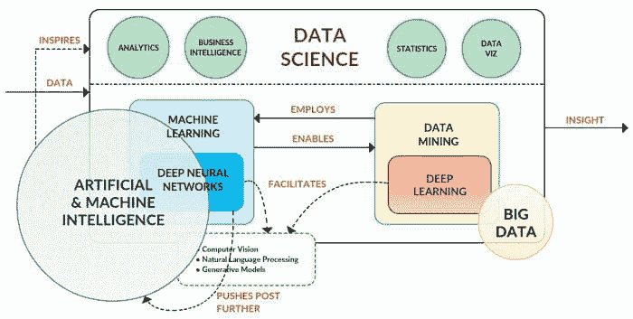

# 数据科学拼图，再次审视

> 原文：[`www.kdnuggets.com/2017/01/data-science-puzzle-revisited.html`](https://www.kdnuggets.com/2017/01/data-science-puzzle-revisited.html)

 评论

去年我写了一篇概述文章，定义了与数据科学相关的多个关键概念——包括数据科学本身——并尝试解释这些部分如何拼接成一个所谓的“数据科学拼图”。随着新年的开始，以及过去一年取得的进展、洞见和成就被纳入我们的集体职业展望，我认为重新审视这个拼图是明智的，注意并整合任何可能有助于重新排列拼图的变化和更新，并在适当的时候提供一些附加评论。

* * *

## 我们的前 3 个课程推荐

 1\. [谷歌网络安全证书](https://www.kdnuggets.com/google-cybersecurity) - 快速开启网络安全职业生涯。

 2\. [谷歌数据分析专业证书](https://www.kdnuggets.com/google-data-analytics) - 提升您的数据分析技能

 3\. [谷歌 IT 支持专业证书](https://www.kdnuggets.com/google-itsupport) - 支持您的组织 IT

* * *

**大数据**在数据科学中仍然重要。无论你选择什么比喻，但无论怎么看，大数据仍然是推动数据科学革命的原材料。

关于大数据，我相信从商业角度看，数据获取和保存的合理性、期望大数据项目开始提供实际的财务回报，以及与数据隐私和安全相关的挑战，将成为不仅是 2017 年，而且是未来大数据的重大故事。简而言之，是时候从大数据中获得丰厚的回报，并对其进行大力保护了。

然而，正如其他人所评论的，大数据现在“只是存在”，也许不再是值得特别关注的实体，它已经获得了近十年的特别关注。

**机器学习**是数据科学的主要技术驱动因素之一。数据科学的目标是从数据中提取洞见，而机器学习是实现这一过程自动化的引擎。机器学习算法不断促进计算机程序从经验中自动改进，这些算法在各种不同领域变得越来越重要。

我相信（而且我并不是唯一的一个）自动化机器学习将越来越成为一种工业级的强大力量，辅助数据科学家完成各种机器学习和建模任务，但还不会取代数据科学家……至少现在还不会。*对模型的解释* 仍然是必要的，虽然人眼的细微差别和精细度不能完全外包给机器学习管道，但大部分的算法和特征选择可以，多个模型的评估和比较以寻找最佳拟合也是如此。

我以前提到过机器学习和**数据挖掘**之间复杂的关系（我假设大多数人对此有所了解）。我认为这两个学科之间的界限比过去更模糊了（如果这可能的话）。我之前强调了机器学习是一个促进数据挖掘*过程*的*工具*；然而，随着机器学习成为一个更主流的术语，我预见到它们的加速普及和混淆。

**深度学习**也是一个*过程*；它是将深度神经网络技术——具有多个隐藏层的神经网络架构（这些是特定类型的机器学习算法）——应用于解决问题的过程。作为一个过程，深度学习对于神经网络而言，就像数据挖掘对于“传统”机器学习一样（这是一种略显欠缺细微差别的比较，但在一个非常高的层面上，我仍然支持这个观点）。

尽管深度学习在过去一年中引起了极大的关注和夸大的成功，但它仍然没有像人们想象的那样普及。然而，我确实看到它（缓慢地）在未来几年中成为数据科学家的一个常用工具。尽管如此，随着它成为一种常用的分类技术，记住*深度学习不是万灵药*变得越来越重要，它在广泛（多数？）情况下甚至不是一个有效的选择。此外，深度学习和人工智能并不等同。

当我想到**人工智能**时，以下观点对我来说仍然是真实的：

> 在我看来，人工智能是一个标准，一个不断变化的目标，一个无法实现的目标。

但这并不意味着人工智能不值得追求；人工智能研究带来的回报以*启发*和*激励*的形式体现。然而，如你所见，人工智能存在认知问题。正如数据挖掘曾是一个主流术语，让许多人感到恐惧（主要与隐私入侵有关），人工智能从完全不同的视角恐吓大众，这种视角引发了类似 SkyNet 的恐惧。我不知道是感谢媒体、埃隆·马斯克、将人工智能与深度学习及其成功混淆，还是其他原因，但我认为结果是不可避免的：这一认知问题是真实存在的，未接触者正变得恐惧。

还有这一点：尽管机器学习、人工智能、深度学习、计算机视觉和自然语言处理（以及这些“智能”技术的各种其他应用）都是各自独立的领域和应用领域，即使是从业者和研究人员也不得不承认，这些领域正在经历一种不断发展的“概念蔓延”，超出了以往的常规混乱和困惑。这没关系；这些领域最初都是其他领域（计算机科学、统计学、语言学等）的细分学科，因此它们的持续演变是可以预期的。虽然确保所有*应该*对这些领域差异有基本理解的人确实具备这种理解在某种程度上是重要的，但在数据科学等领域应用这些技术时，我谦虚地认为，过于深入语义上的细节对从业者的长期利益不大。

人工智能和机器智能 到 2030 年将与现在大相径庭，对这一不断发展的技术集合和支撑它们的研究缺乏基本理解，或者在作为数据科学家时对其应用缺乏开放性，将对你的长期成功产生不利影响。

我之前将**数据科学**定义为：

> 数据科学是一个多面向的学科，涵盖了机器学习和其他分析过程、统计学及相关数学分支，越来越多地借鉴高性能科学计算，最终目的是从数据中提取洞察并利用这些新获得的信息讲述故事。

我实际上对这个定义还是很满意的。特别是，我发现过去一年中，数据科学和数据挖掘之间存在相当大的混淆。虽然这并非定论，我仍然坚持以下观点：

> 数据科学使用了来自各种相关领域的各种工具（见上文）。数据科学既与数据挖掘同义，也包括数据挖掘的概念。

因此，尽管[原始数据科学难题图示](https://i.imgur.com/ml4wKRT.jpg)并非完全过时，我还是根据上述讨论点进行了如下修改：

特别地，请注意以下几点：

+   大数据作为一个独立的实体已变得不再重要（大数据不再是新兴事物；它只是现实）。

+   人工智能、机器学习和深度学习之间的关系总是在某种程度上发生变化，并将持续被重新考虑。

+   人工智能向人工与机器智能领域的蜕变，反映了认知与智能技术的重要性增加。

+   自然语言处理、计算机视觉和生成模型与一个新的**人工与机器智能**关系领域联系更为密切，反映了现实情况。

+   机器学习和数据挖掘与神经网络和深度学习之间的关系没有发生变化；然而，展示功能关系可能会变得比突出类似关系（如当前所示）更为重要（至少在我看来更为重要）。

+   尽管我提到过**高性能科学计算**及其在数据科学中的作用，但它在图示中并未显示；鉴于分布式和并行计算能力（包括 GPU 并行性）的重要性增加，以及对原始计算资源的需求，我预计明年可能会有所变化。

我相信数据科学将继续发展，并将新的工具和技术纳入其工具箱，一旦这些工具对该行业的作用变得明显。尽管我仍然不完全满意数据科学这个术语，但毫无疑问，它确实存在、真实，并受到许多人的热烈欢迎，并且它的采用率只会随着时间的推移而增加。

再次提醒你，在对上述内容感到不满之前，请将其视为：仅仅是一个人的观点。

**相关**：

+   数据科学难题的解释

+   预测科学与数据科学

+   为什么我们需要数据科学

### 更多相关话题

+   [停止学习数据科学以寻找目标，去寻找目标……](https://www.kdnuggets.com/2021/12/stop-learning-data-science-find-purpose.html)

+   数据科学基础：你需要知道的 10 项必备技能

+   [KDnuggets™ 新闻 22:n06，2 月 9 日：数据科学编程…](https://www.kdnuggets.com/2022/n06.html)

+   [数据科学定义幽默：一些古怪的名言集合…](https://www.kdnuggets.com/2022/02/data-science-definition-humor.html)

+   [5 个数据科学项目，学习 5 项关键数据科学技能](https://www.kdnuggets.com/2022/03/5-data-science-projects-learn-5-critical-data-science-skills.html)

+   [KDnuggets 新闻，11 月 30 日：什么是切比雪夫定理及其如何…](https://www.kdnuggets.com/2022/n46.html)
