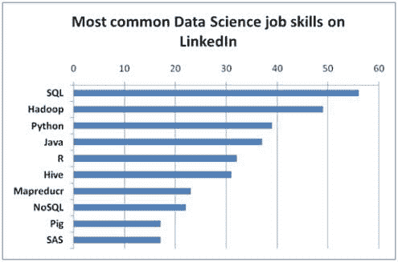

# 2016 年的数据科学技能

> 原文：[`www.kdnuggets.com/2016/02/data-science-skills-2016.html`](https://www.kdnuggets.com/2016/02/data-science-skills-2016.html)

 评论

**作者：Seamus Breslin, Solas Consulting**

数据科学家在 2016 年需求很高。现在“数据科学家”被称为今年的[最热门职位](http://www.computerworld.com/article/3025440/data-analytics/why-data-scientist-is-this-years-hottest-job.html)，你是否具备所需的技能？获得数据科学家职位并不容易，尤其是在大公司，因为可能会有许多类似的候选人竞争同一职位。然而，有些技能是雇主寻找的，可能会让你在竞争中脱颖而出。

* * *

## 我们的前三个课程推荐

 1\. [谷歌网络安全证书](https://www.kdnuggets.com/google-cybersecurity) - 快速进入网络安全职业生涯。

 2\. [谷歌数据分析专业证书](https://www.kdnuggets.com/google-data-analytics) - 提升你的数据分析水平

 3\. [谷歌 IT 支持专业证书](https://www.kdnuggets.com/google-itsupport) - 支持你的组织的 IT

* * *

在我看来，2016 年需要的顶级数据科学技能如下：

**SQL**

SQL 仍然是成功的数据科学家所需的最重要工具之一，因为大多数企业存储的数据都在这些数据库中。

CrowdFlower 最近对 LinkedIn 上的 3,490 个数据科学职位进行了[分析](http://www.crowdflower.com/blog/what-skills-should-data-scientists-have-in-2016)，SQL 是他们分析中提到的超过一半职位的技能，这意味着 SQL 是最常被提及的技能。

**图 1. 根据 Crowdflower 的数据科学工作技能最常见的技能**

**数据可视化**

依赖数据驱动决策的公司极度依赖数据科学家通过分析数据来可视化和传达故事的能力，因为数据科学家需要将数据驱动的洞察力传达给公司内的技术人员和非技术人员。

**沟通技能**

沟通仍然像以往一样重要，也是数据科学专业人员必备的另一项技能。例如，沟通在通过演示文稿分享结果或发布结果时至关重要。他们应该能够与高级管理层沟通，以便用他们的语言表达数据，并将数据转化为决策和行动。

**Hadoop**

学习 Hadoop 和大数据分析将使你在竞争中脱颖而出。大数据在企业中的一个主要障碍是缺乏 Hadoop 相关技能。

**Spark**

Spark 位于那些为了满足对大数据建模和分析日益增长需求而不断发展的技术前沿。

Spark 是一项在大数据领域越来越受到关注的技能，因为它的速度和易用性。

**Python**

Python 是另一个需求上升的领域。这种编程语言帮助工程师用比 Java 或 C++更少的代码创建概念，因此被视为更高效、出错率更低，并有可能创建更清晰的程序。

还对 Python 不够信服？Python 不仅易于学习，还有一个不断增长的大型活跃社区。如果你遇到编码问题，社区中有各种专家可以提供帮助。根据一项[研究](https://www.packtpub.com/skillup/data-salary-report)，Python 仍然是数据科学的首选工具。

**统计学**

这是你作为数据科学家所能提供的核心内容。统计学始终是数据科学家的一个重要组成部分，因此他们能够决定最合适的统计技术来解决不同类别的问题并应用相关技术，非常重要。

**R**

人们常说，数据科学中的 80%工作是数据处理。尽管如此，R 使得数据处理变得简单，因为 R 拥有一些最优秀的数据管理工具。

R 是金融和分析驱动型公司（如谷歌、Facebook 和 LinkedIn）的重要工具，因此如果你还没有深入了解 R，那么值得进一步研究。

**创造力**

任何人都可以按部就班。2016 年的企业希望创新，以在销售和对消费者展示的形象上与竞争对手区分开来。

创造力是将上述技术技能应用于实践的能力，并以不同于遵循预先得出的公式的方式，创造有价值的东西。

**个人简介：西默斯·布雷斯林**是[Solas Consulting](http://www.solasconsulting.ie/)的创始人兼董事总经理，拥有超过 11 年的 IT 行业经验。Solas 专注于招聘数据、BI、SQL、Oracle、Java 和.Net 专业人士。

**相关：**

+   回顾成为数据科学家前三个月的经历

+   约翰·施基特卡：SAP 谈我们需要什么样的数据科学家

+   数据科学家是适合你的职业道路吗？诚恳的建议

### 了解更多相关话题

+   [数据科学基础：你需要知道的 10 项必备技能…](https://www.kdnuggets.com/2020/10/data-science-minimum-10-essential-skills.html)

+   [5 个数据科学项目来学习 5 项关键的数据科学技能](https://www.kdnuggets.com/2022/03/5-data-science-projects-learn-5-critical-data-science-skills.html)

+   [为什么谦逊会提升你的数据科学技能](https://www.kdnuggets.com/2022/01/humbling-improve-data-science-skills.html)

+   [提升技能的顶级数据科学项目](https://www.kdnuggets.com/2022/04/top-data-science-projects-build-skills.html)

+   [利用你的数据科学技能创建 5 个收入来源](https://www.kdnuggets.com/2023/03/data-science-skills-create-5-streams-income.html)

+   [9 个平台来练习关键的数据科学技能](https://www.kdnuggets.com/2023/03/9-top-platforms-practice-key-data-science-skills.html)
