# 顶级科技公司数据科学 SQL 面试问题

> 原文：[`www.kdnuggets.com/2021/10/data-science-sql-interview-questions.html`](https://www.kdnuggets.com/2021/10/data-science-sql-interview-questions.html)

评论


结构化查询语言，通常称为 SQL，是最强大的数据工具之一，使我们能够处理和分析大规模的数据。因此，任何使用大量数据的公司都将受益于拥有扎实 SQL 基础的员工。SQL 可以在公司每个层面上广泛使用，并且能够使用 SQL 可以确立一个人在数据处理方面的基本能力。在任何与数据相关的角色中，即使是基础的 SQL 能力也为候选人增加了额外的价值：能够根据个人需求查询数据是一项宝贵的技能，即使是在如产品经理或业务分析师等数据相关性较低的角色中。同时，在任何数据科学角色中，强大的 SQL 技能几乎是硬性要求。

* * *

## 我们的前三大课程推荐

 1\. [Google 网络安全证书](https://www.kdnuggets.com/google-cybersecurity) - 快速进入网络安全职业生涯。

 2\. [Google 数据分析专业证书](https://www.kdnuggets.com/google-data-analytics) - 提升你的数据分析能力

 3\. [Google IT 支持专业证书](https://www.kdnuggets.com/google-itsupport) - 支持你的组织进行 IT 管理

* * *

当然，还有许多其他方法可以大规模地存储和检索数据，包括 Spark、Hadoop/HIVE、Snowflake、Python 库 Pandas，甚至 Excel 和 Google Sheets。然而，每种方法都有其自身的局限性，没有一种能够在灵活性、可扩展性和易用性上超越 SQL，成为数据科学行业的标准。

面试中可能会出现各种问题，但 SQL 几乎是你可以期待被考核的基础内容，特别是针对数据相关的职位。我们将探讨一些你需要了解的关键概念和想法，以准备这些 SQL 面试问题，重点是 FAANG 公司的要求，然后在实际面试中走一遍几个 SQL 问题。

让我们开始吧。

## 数据科学 SQL 面试概念和问题

大型科技公司，即 FAANG（Facebook、Apple、Amazon、Netflix、Google），是数据科学职位的主要雇主，任何对数据行业感兴趣的人自然会关注这些公司的职位。但 FAANG 公司在面试中提出的 SQL 问题与其他公司有什么不同？通常，FAANG 公司将面试问题组织为案例研究，以测试你在其产品背景下的分析技能。例如，Google 可能会有分析其搜索引擎或电子邮件账户使用情况的 SQL 问题，而 Facebook 可能会涉及平台活动，如用户评论和好友关系。

在你面试的任何公司中，确保你在使用公司平台和产品方面至少有一定的舒适度是很重要的。对于强调这一点的 FAANG 公司来说，这一点尤为重要。虽然你可能凭借对代码的了解合理地回答标准的 SQL 面试问题，但能够理解你所处理的内容，从而讨论场景、权衡甚至潜在的边界情况，这样可以在面试中留下更深刻的印象。

### 数据科学 SQL 面试问题的类型

让我们深入探讨面试中涉及的 SQL 特定问题。SQL 面试问题通常可以分为三种不同的类别：基础定义、报告和抽象问题解决。

**基础 SQL 定义**

面试中最基础的 SQL 问题以定义为主。这些问题直接测试你对 SQL 基础知识的掌握，例如使用常见函数如 SUM、MIN/MAX 和 COUNT。通常，这些问题会询问关于 SQL 功能的基本定义，例如区分不同类型的连接或连接与并集的不同。这些问题也可能要求你编写某些短小的查询，可能需要从一小组表中提取和汇总基本信息以完成简单的功能。

通常，这些最早的问题会引导你创建基础查询，这些查询构成了可以进一步扩展成更复杂问题的框架。

**报告与洞察**

接下来是 SQL 报告问题，这些问题通常测试你编写日常数据分析工作中所需的常见查询的能力，例如识别和提取关键指标和数据，如日活跃用户（DAU）、月活跃用户（MAU）、增长率、时间变化百分比和留存率等常见报告关键绩效指标（KPI）。

之前的基本 SQL 定义，包括如 MIN 和 MAX 等聚合函数，将是必需的，同时还需要能够连接数据集并使用公共表表达式（CTEs）和子查询创建自己的视图。在更高级的报告层次中，常常会测试百分位数和排名，使用如 NTILE 和 RANK 等函数。通常，这些问题与窗口分区结合，这些是高级技术报告概念。

根据面试的结构，这可以在之前基本 SQL 定义的问题基础上构建，增加那些已覆盖概念的复杂性。在这些问题中，理解你所给的数据和你期望的输出是非常重要的。如果给出多个表，它们将需要一些连接，而问题中的限制因素意味着你需要了解应该应用哪些过滤器。

在之前的博客文章中，我们深入探讨了需要准备的[SQL 面试问题](https://www.stratascratch.com/blog/sql-interview-questions-you-must-prepare-the-ultimate-guide/)。我们还曾写过一些流行公司提问的[SQL 窗口函数类型](https://www.stratascratch.com/blog/types-of-window-functions-in-sql-and-questions-asked-by-airbnb-netflix-twitter-and-uber/)。

**用 SQL 解决问题**

在最高级、最先进的层次是问题解决 SQL 问题。这些是开放性的、通常含糊不清的问题，测试你如何用 SQL 解决问题。与之前的报告 SQL 面试问题有些相似，但这些问题增加了模糊性的复杂性，你不仅需要考虑要报告的 SQL 输出，还要考虑如何提取特定的数据以及你想要提取的数据到底是什么。

这些类型的面试问题通常可以进一步细分为 ETL 和数据库设计问题。ETL 代表“提取、转换、加载”，这是一个将数据从一个源复制到另一个源或上下文的通用数据处理程序，包括所需的数据提取、转换和上传。数据库设计是根据数据库模型组织数据，这个模型是通过数据分类和识别这些数据点之间的关系来创建的。

ETL 可以是构建数据科学基础设施的起点，第一步是收集数据并将其转换为可用格式。虽然这些概念通常在数据工程专门的面试中进行测试，但大多数数据科学家仍然需要具备创建、插入和更新表的扎实基础。与 API 的工作将是技能发展的额外步骤，为数据科学工作流中的下一步——创建模型和仪表盘——奠定基础。

解决问题的 SQL 问题比之前的报告问题复杂得多，除了根据既定参数查询和返回数据之外，你还必须在不同来源和上下文之间转换数据，有时甚至需要设计整个数据管道。当然，考虑到面试设置的时间限制，任何问题的答案的复杂性自然会受到限制，仅覆盖一般步骤或宽泛的理论。

查看我们的视频 [解决复杂的 SQL 面试问题](https://www.youtube.com/watch?v=vLjAG9eXkcU)。我们还在视频 [你需要的唯一数据科学项目](https://www.youtube.com/watch?v=c4Af2FcgamA)中讨论了数据科学基础设施管道。

最后，请记住面试过程中还会问到非 SQL 问题。这些问题包括个人或行为问题、产品感觉和商业案例、数据分析以及其他语言如 R 和 Python 的编码问题，还有人工智能和建模问题。我们在 [顶尖 5 家数据科学公司终极指南](https://www.stratascratch.com/blog/ultimate-guide-to-the-top-5-data-science-companies/)中涵盖了 FAANG 各公司的整体面试流程。

## 数据科学 SQL 面试问题：FAANG 各公司提出的问题

显然，每个公司根据其自身的价值观和产品，甚至是团队和角色的不同，关注点和重点都不同。我们将探讨 FAANG 的一些面试问题，这些公司是业内最大的 数据科学 雇主之一。虽然我们会讨论一些问题的解决方案，但在查看答案之前，一定要自己尝试解决这些问题，或者至少花一分钟考虑一下你会如何解决这个问题，然后再深入了解解决方案。

### Facebook

社交媒体集团除了 SQL 还会问很多产品感觉的问题。Facebook 旗下的各种社交媒体平台意味着其面试问题将集中在这些平台至关重要的指标上，特别是用户活动。我们来看看：

**过去 30 天每个用户的评论数量**

**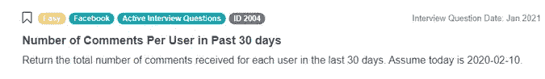***[​问题链接](https://platform.stratascratch.com/coding/2004-number-of-comments-per-user-in-past-30-days)*​

这个来自 Facebook 的数据科学 SQL 面试问题测试了你基于日期条件过滤数据的能力。查看下面的视频，获取一些如何解决该问题的提示。

**活跃用户的比例**​ 

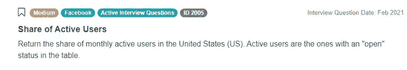

*[问题链接](https://platform.stratascratch.com/coding/2005-share-of-active-users)*​

**每个国家的排名方差**​ 

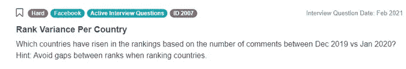

[*链接到问题*](https://platform.stratascratch.com/coding/2007-rank-variance-per-country)​

首先，让我们看看我们获得的表格：

*fb_comments_count​*

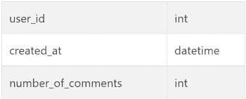

*fb_active_users​*

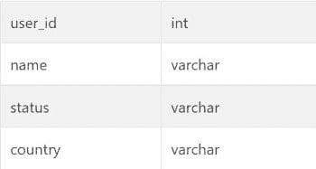

为了回答这个数据科学 SQL 面试问题，我们是否需要澄清一些内容？措辞可能有些令人困惑，因此在面试过程中，如果你有一点不确定，一定要提问澄清。“基于评论数量的排名上升”在两个月之间的意思是，国家在一个月到另一个月之间用户评论数量的增加。例如，澳大利亚用户在 2019 年 12 月的评论数量为 5，而在 2020 年 1 月增加到 6，因此澳大利亚的排名会有所上升。（可以在 [StrataScratch 平台](https://platform.stratascratch.com/coding/2007-rank-variance-per-country)上查看这些表格！）

除此之外，考虑一下我们可能需要处理的任何边界情况。一个大问题可能是如果用户没有任何位置数据，从而导致国家列的空值。我们可以通过过滤掉这种情况的行来处理。此外，也可能有些国家在前一个月（2019 年 12 月）没有评论，但在后一个月（2020 年 1 月）有评论。根据我们创建连接的方式，这将产生一个额外的空值，我们需要在最后的步骤中加以考虑。

现在，让我们考虑一下输出应该是什么样的。我们寻找的是一个简单的国家列表，但这个列表将基于隐藏的数字，这些数字过滤出在两个月之间“基于评论数量的排名上升”的条件。那么我们需要做什么才能实现这一点？

首先，我们需要隔离每个月的评论数量。幸运的是，评论数量已经在表 fb_comments_count 中汇总，因此这个初步步骤将是两个表之间的直接连接。由于单个用户不重要，我们将按国家分组并汇总评论数量。

```py
SELECT
    	country,
    	sum(number_of_comments) as number_of_comments_dec,
	FROM fb_active_users as a
	LEFT JOIN fb_comments_count as b
  	on a.user_id = b.user_id
	WHERE country IS NOT NULL
	GROUP BY country

```

注意到问题的措辞，为了简化，我们将根据每个国家评论的总数来分配排名。根据提示，我们被告知要避免排名之间的间隙，因此我们将使用 DENSE_RANK 函数，而不是 RANK 函数。虽然 RANK 和 DENSE_RANK 通常会根据其他值的比较为等级分配相同的排名，但 DENSE_RANK 会使用下一个顺序排名值，而不是像 RANK 那样跳过到下一个值。例如，RANK 会是 [1, 2, 2, 4, 5]，而 DENSE_RANK 会是 [1, 2, 2, 3, 4]。

现在让我们把它添加到查询中。

```py
SELECT
    	country,
    	sum(number_of_comments) as number_of_comments_dec,
    	dense_rank() over(order by sum(number_of_comments) DESC) as country_rank
	FROM fb_active_users as a
	LEFT JOIN fb_comments_count as b
  	on a.user_id = b.user_id
	WHERE country IS NOT NULL
	GROUP BY country

```

不过，目前这个查询实际上返回的是所有用户评论活动的汇总，而我们实际上想要将两个具体的时间段进行划分和比较。接下来，我们将分开 2019 年 12 月和 2020 年 1 月的评论。我们可以使用 WITH 头来创建两个单独的月份的用户评论活动表。例如，2019 年 12 月的活动会如下所示：

```py
SELECT
    	country,
    	sum(number_of_comments) as number_of_comments_dec,
    	dense_rank() over(order by sum(number_of_comments) DESC) as country_rank
	FROM fb_active_users as a
	LEFT JOIN fb_comments_count as b
  	on a.user_id = b.user_id
	WHERE created_at <= '2019-12-31' and created_at >= '2019-12-01'
  	AND country IS NOT NULL
	GROUP BY country

```

下一步显而易见的是，通过调整我们 WHERE 语句过滤的日期值，将 2019 年 12 月的代码移到 2020 年 1 月，并将两个部分合并在一起。在到达这一步之前，我们想要建立我们查询的完整骨架。因此，我们将暂时使用单独月份的 WITH 语句的占位符伪代码以提高可读性。请注意，12 月和 1 月的表将具有相同的列，并且可以通过唯一的国家名称进行连接。此外，我们正在寻找 1 月 2020 年排名高于 2019 年 12 月排名的情况，这在数值上意味着较低的值。

```py
WITH dec_summary as (CODE BLOCK), 
jan_summary as (CODE BLOCK) 
SELECT j.country 
FROM jan_summary j 
LEFT JOIN dec_summary d on d.country = j.country
WHERE (j.country_rank < d.country_rank)

```

现在在我们将所有完全编写的代码重新整合之前，还有最后一步：正如我们之前提到的，我们还想捕捉到一个边缘情况，即 2019 年 12 月可能没有用户评论活动。根据我们的表连接方式，2019 年 12 月的`dec_summary`表中不会有列值。由于我们从`jan.summary`表开始，这意味着我们 LEFT JOIN 到 1 月汇总的 12 月值将导致 12 月值为 null。因此，我们必须添加额外的 null 条件作为 OR，这样结果就是：

```py
WITH dec_summary as (CODE BLOCK),
jan_summary as (CODE BLOCK)
SELECT j.country
FROM jan_summary j
LEFT JOIN dec_summary d on d.country = j.country
WHERE (j.country_rank < d.country_rank) 
OR d.country is NULL

```

最后，让我们将这些全部整合在一起吧！

```py
with dec_summary as (
	SELECT
    	country,
    	sum(number_of_comments) as number_of_comments_dec,
    	dense_rank() over(order by sum(number_of_comments) DESC) as country_rank
	FROM fb_active_users as a
	LEFT JOIN fb_comments_count as b
  	on a.user_id = b.user_id
	WHERE created_at <= '2019-12-31' and created_at >= '2019-12-01'
  	AND country IS NOT NULL
	GROUP BY country
),
jan_summary as (
	SELECT
  	country,
  	sum(number_of_comments) as number_of_comments_jan,
  	dense_rank() over(order by sum(number_of_comments) DESC) as country_rank
	FROM fb_active_users as a
	LEFT JOIN fb_comments_count as b
  	on a.user_id = b.user_id
	WHERE created_at <= '2020-01-31' and created_at >= '2020-01-01'
    	AND country IS NOT NULL
	GROUP BY country
	)
SELECT j.country
FROM jan_summary j
LEFT JOIN dec_summary d on d.country = j.country
WHERE (j.country_rank < d.country_rank) 
OR d.country is NULL

```

查看我们的 [Facebook 数据科学家面试指南](https://www.stratascratch.com/blog/facebook-data-scientist-interview-guide/)。我们在有关 [了解 Facebook 数据科学家面试流程](https://www.stratascratch.com/blog/facebook-data-scientist-interview-process/)的文章中也讨论了更广泛的面试流程。

### 亚马逊

这家跨国科技公司被说在面试问题中非常重视建模，例如捕捉客户行为和保留。亚马逊也有许多产品在其公司旗下，当然，你在面试中实际被问到的问题会根据你申请的具体团队或职位有所不同。也就是说，让我们来看几个关于亚马逊电子商务最知名产品的数据科学 SQL 面试问题：

**订单总成本**​

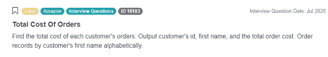

[*问题链接*](https://platform.stratascratch.com/coding/10183-total-cost-of-orders​)

首先，让我们看一下我们提供的表：

*客户*

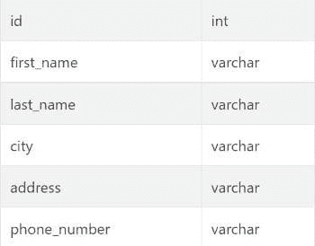

*订单*

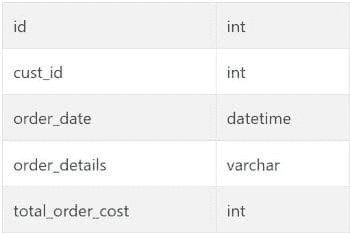

一如既往，首先问自己一些关键问题：这个问题的输出应该是什么样的？我们是否需要再次确认任何细节？问题明确指出了它的要求：我们需要按字母顺序获取客户 ID、客户名称和订单总费用。这应该是对我们给定的客户和订单表的直接连接，我们可以按客户 ID 和名称分组，然后求和他们的订单总费用。

让我们首先进行连接：

```py
SELECT customers.id,
   	customers.first_name,
FROM orders
JOIN customers ON customers.id = orders.cust_id

```

接下来，我们需要汇总每个客户订单的总费用，这里是 total_order_cost 的 SUM。因此，我们将对其他相关列进行分组，然后提取我们订单费用字段的 SUM。

```py
SELECT customers.id,
   	customers.first_name,
   	SUM(total_order_cost)
FROM orders
JOIN customers ON customers.id = orders.cust_id
GROUP BY customers.id,
     	customers.first_name
ORDER BY customers.first_name ASC;

```

最后，问题要求我们按客户的名字字母顺序排列，这需要在查询末尾简单地使用 ORDER BY：

```py
SELECT customers.id,
   	customers.first_name,
   	SUM(total_order_cost)
FROM orders
JOIN customers ON customers.id = orders.cust_id
GROUP BY customers.id,
     	customers.first_name
ORDER BY customers.first_name ASC;

```

就这样！

下面查看一些来自 Amazon 的额外数据科学 SQL 面试问题：

**查找用户购买**

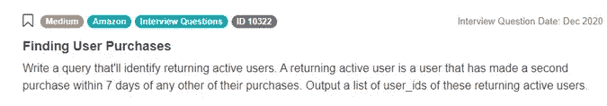

[*问题链接*](https://platform.stratascratch.com/coding/10322-finding-user-purchases​)

**营销活动成功 [高级]**

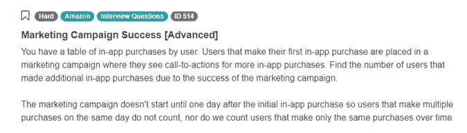

[*问题链接*](https://platform.stratascratch.com/coding/514-marketing-campaign-success-advanced)

这个数据科学 SQL 面试问题涉及处理复杂逻辑并实现多个场景和边界情况。查看下面的视频，了解如何处理这个高级 SQL 面试问题。

查看我们的文章 [Amazon 数据科学家面试问题](https://www.stratascratch.com/blog/amazon-data-scientist-interview-questions/)。我们还在我们的 [Amazon 数据科学家面试指南](https://www.stratascratch.com/blog/amazon-data-scientist-interview-guide/) 中讨论了更广泛的面试过程。

### Google

这家跨国科技公司也被认为会询问许多建模问题，并且额外的产品问题更侧重于业务方面。同样，问题的具体类型和重点将根据你申请的团队和职位而有所不同。

让我们看看一些来自 Google 的 SQL 数据科学面试问题。

**总 AdWords 收入**


[*问题链接*](https://platform.stratascratch.com/coding/10164-total-adwords-earnings​)

**用户电子邮件标签**

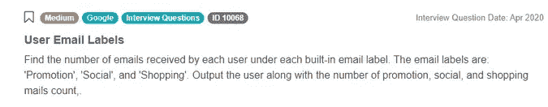

[*问题链接*](https://platform.stratascratch.com/coding/10068-user-email-labels)​

再次，让我们从查看提供的表格开始。

*google_gmail_emails*

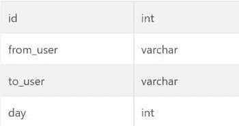

*google_gmail_labels*

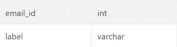

和往常一样，我们首先了解我们期望的输出，然后获得可能需要的任何澄清或考虑任何潜在的边缘情况。在这里，我们想返回带有标签的电子邮件，这些标签存储在单独的表中，因此我们将从简单的连接开始。由于我们专注于每个用户，并计算他们从每种标签收到的电子邮件数量，我们可以通过对 *user* 和 *label* 列进行分组，然后分别计数开始：

```py
SELECT mails.to_user,
      	labels.label,
      	COUNT(*) AS cnt
   FROM google_gmail_emails mails
   INNER JOIN google_gmail_labels labels ON mails.id = labels.email_id
   GROUP BY mails.to_user,
        	labels.label

```

注意我们使用 COUNT 函数而不是 SUM 函数，因为 COUNT 忽略了空值。如果使用 SUM，对于包含空值的任何分组值，我们将得到空白输出。然后可以使用这个必需的连接作为我们 SELECT 的表，并且我们可以根据各个标签单独进行划分。我们想要来自每个标签的数字，通过一些基本的探索或对 Gmail 的一般熟悉，我们知道这些标签是“Promotion”、“Social”和“Shopping”。从这里开始，我们可以为每个不同的标签整理各自的 COUNTS，这将需要一个类似于上述的外部 GROUP。我们将使用一些伪代码以便于阅读，然后再完全整合上述代码：

```py
SELECT 
	to_user, 
SUM(CASE
           		WHEN label = 'Promotion' THEN cnt
           	ELSE 0
       			END) AS promotion_count,
   	SUM(CASE
           	WHEN label = 'Social' THEN cnt
           		ELSE 0
       	END) AS social_count,
   	SUM(CASE
           	WHEN label = 'Shopping' THEN cnt
           		ELSE 0
       	END) AS shopping_count
FROM (CODE BLOCK) 
GROUP BY to_user
ORDER BY to_user

```

最后，我们在初始连接表中进行写入。

```py
SELECT 
	to_user, 
SUM(CASE
           		WHEN label = 'Promotion' THEN cnt
           	ELSE 0
       			END) AS promotion_count,
   	SUM(CASE
           	WHEN label = 'Social' THEN cnt
           		ELSE 0
       	END) AS social_count,
   	SUM(CASE
           	WHEN label = 'Shopping' THEN cnt
           		ELSE 0
       	END) AS shopping_count
FROM (SELECT mails.to_user,
      		labels.label,
      		COUNT(*) AS cnt
 	  FROM google_gmail_emails mails
   	INNER JOIN google_gmail_labels labels ON mails.id = labels.email_id
   	GROUP BY mails.to_user,
        		labels.label) 
GROUP BY to_user
ORDER BY to_user

```

就是这样！

**活动排名**

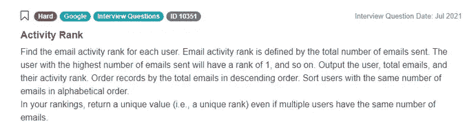

[*问题链接*](https://platform.stratascratch.com/coding/10351-activity-rank​)

查看我们的 [成为 Google 数据科学家的终极指南](https://www.stratascratch.com/blog/the-ultimate-guide-to-become-a-data-scientist-at-google/)。我们还在 [Google 数据科学家面试指南](https://www.stratascratch.com/blog/google-data-scientist-interview-guide/) 中讨论了更广泛的面试过程。

我们在另一篇博客文章 [高级 SQL 面试问题](https://www.stratascratch.com/blog/advanced-sql-interview-questions-you-must-know-how-to-answer/) 中也涵盖了流行公司提出的其他 SQL 问题。

## 最后的提醒

既然我们已经介绍了一些 FAANG 公司各自的数据科学 SQL 面试问题，接下来我们简要回顾一下在准备大型面试时提升 SQL 能力的最佳实践。建立 SQL 技能至关重要，因为它们对任何处理数据的角色都可能很重要。能够阅读和理解他人的代码，甚至提取自己的数据，都是极其强大的能力。

建立这些 SQL 能力的良好第一步就是来到这里！获得实际的 SQL 经验非常有帮助，因为你将超越你从课堂或类似培训中获得的理论框架，进行实际操作。

在你练习 SQL 数据科学面试问题时，先尝试在不运行代码编辑器的情况下构建解决方案。花大约 15 分钟思考你编写的原始代码，尽力确保没有语法错误或漏洞。你甚至可以通过在纸上实际写下代码而不是在代码编辑器中工作来强化这一过程。如果遇到困难，可以快速查看提示。

在实际工作环境中，你通常可以反复运行任何你想测试的代码，以解决可能出现的每一个错误。以这种方式工作是巩固 SQL 知识的好方法，通过训练自己在第一次尝试时能够得到最全面的答案。此外，在面试过程中处理这些数据科学 SQL 面试问题时，第一时间得到一个好的、稳固的答案非常重要。虽然不需要百分之百完美，但代码中充满小的语法错误会给面试官留下不好的印象。

还需要注意的是，在极端情况下，反复运行代码可能也不切实际，例如当你处理的数据库非常大，每个查询都需要很长时间才能完成时。大型查询运行几个小时后才发现你不小心做了错误的连接，这可能导致大量的时间浪费。

接下来，在你在短期内尽可能确信代码中没有更多错误后，在代码编辑器中进行实际运行。查看任何弹出的错误或问题，这些是你在前一步中可能遗漏的，并进行必要的更改。记录你遗漏的内容也是一个好习惯，并且在处理多个练习 SQL 面试问题时，观察是否有揭示你知识空白、问题习惯或常见问题的模式。

最后，将你的工作与其他可用解决方案进行比较，以便比较方法和了解潜在的优化。首先是官方解决方案，你应该问自己几个问题。

+   你是否还有其他方法可以进一步优化你的代码？

+   你的代码中是否存在低效的地方？

+   解决问题的替代方法与你的方法有何不同？它们是否是你可以从中学习的更好方法？

此外，阅读每个问题的讨论线程，识别与问题相关的任何主题，如边界案例或替代方法，甚至是与给定场景类似的问题。

从那里开始，你已准备好在数据科学面试中迎接任何 SQL 问题。

[原文](https://www.stratascratch.com/blog/data-science-sql-interview-questions-from-faang-companies/)。经许可转载。

**简介：** [内森·罗西迪](https://www.stratascratch.com/)是一名数据科学家和产品策略专家。他还是一名兼职教授，教授分析学，并且是 StrataScratch 的创始人，这是一个帮助数据科学家准备面试的的平台，提供来自顶级公司的真实面试问题。

**相关：**

+   [SQL 中的数据准备及备忘单！](https://www.kdnuggets.com/2021/05/data-preparation-sql-cheat-sheet.html)

+   [最常见的数据科学面试问题及答案](https://www.kdnuggets.com/2021/08/common-data-science-interview-questions-answers.html)

+   [破解 SQL 面试](https://www.kdnuggets.com/2020/12/crack-sql-interviews.html)

### 更多相关主题

+   [成为优秀数据科学家所需的 5 项关键技能](https://www.kdnuggets.com/2021/12/5-key-skills-needed-become-great-data-scientist.html)

+   [每个初学者数据科学家应掌握的 6 种预测模型](https://www.kdnuggets.com/2021/12/6-predictive-models-every-beginner-data-scientist-master.html)

+   [2021 年最佳 ETL 工具](https://www.kdnuggets.com/2021/12/mozart-best-etl-tools-2021.html)

+   [数据科学学习统计的最佳资源](https://www.kdnuggets.com/2021/12/springboard-top-resources-learn-data-science-statistics.html)

+   [停止学习数据科学以寻找目标，并以寻找目标为…](https://www.kdnuggets.com/2021/12/stop-learning-data-science-find-purpose.html)

+   [建立一个稳固的数据团队](https://www.kdnuggets.com/2021/12/build-solid-data-team.html)
