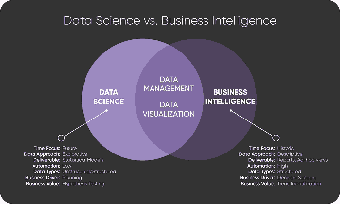

# 数据科学与商业智能的解释

> 原文：[`www.kdnuggets.com/2021/02/data-science-vs-business-intelligence-explained.html`](https://www.kdnuggets.com/2021/02/data-science-vs-business-intelligence-explained.html)

评论

定义数据科学和商业智能这两个术语以及它们之间的关系，一直是热烈讨论的主题。虽然这些术语相关，但未能掌握它们背后的独立而明确的概念可能会带来重大后果。

例如，未来几年将出现数十万个数据科学（DS）和商业智能（BI）职位。候选人的数量可能显得极其稀少或意外庞大，这取决于你对每个职位所需技能的相关性和实用性的判断。BI 专家能否成功转型为 DS 角色？DS 对 BI 职位是否重要？

* * *

## 我们的前三大课程推荐

 1\. [谷歌网络安全证书](https://www.kdnuggets.com/google-cybersecurity) - 快速进入网络安全职业道路。

 2\. [谷歌数据分析专业证书](https://www.kdnuggets.com/google-data-analytics) - 提升你的数据分析能力

 3\. [谷歌 IT 支持专业证书](https://www.kdnuggets.com/google-itsupport) - 支持你的组织在 IT 领域

* * *

在 2021 年，商业高管将评估数十亿美元的新项目。哪些项目获得批准，哪些被搁置，将受到高管及其团队对这两个术语理解和定义的影响。项目负责人通常会迅速将行业流行词附加到他们的项目上，以跟随最新趋势，但这些项目是否只是旧想法的重新包装？

图 1 提供了 BI 和 DS 全景的一个视角：

**图 1: BI 和数据科学的全景图。**

### 基础没有改变

数据管理和数据可视化仍然是理解和规划业务的核心。这些涉及捕获、清理、标准化、整合、可视化和安全管理数据的技术和流程。Excel 不够用。漂亮的仪表盘也不够。你必须长期承诺将数据作为资产，并且需要有纪律性来建立和维护数据湖和数据仓库环境。

关键点在于，任何没有坚实数据基础的 DS 或 BI 项目都将无法持续。任何建立在手动、不一致流程上的过程都会缓慢、不可靠且资源密集。最终，这些过程需要通过专业 IT 帮助来成熟，否则将因自身重量而崩溃。

### 商业智能

自 1980 年代以来，几乎每家公司都尝试使用计算机和数据库来管理和理解他们的历史数据。然而，问题在于——经过近 40 年，没有人真正掌握它。每年，公司都会增加或更换软件系统，而 IT 部门很少跟得上，因此企业不断优先处理项目，以查看哪些数据受到关注，哪些数据被忽视（抱歉，市场部门）。

你可以通过商业智能的图表、仪表盘、数据库图示和数据集成项目来识别它。这很昂贵且令人沮丧——但却是不可或缺的。

商业智能相对于数据科学具有永久的优势，因为它有具体的数据点；少量、简单的假设；自解释的指标；以及自动化的过程。此外，商业智能永远不会消失。它将始终是一个不断发展的过程，因为你永远不会停止改变你的业务或升级和更换源系统。

### 数据科学

从数据的后视镜中查看是重要且有帮助的，但它是有限的，永远无法让你到达目标的地方。在某些时候，你需要展望未来。商业智能需要与数据科学相辅相成。

数据科学是复杂且精密的规划和优化形式。例子包括：

+   实时预测客户最有可能购买的产品。

+   在商业微事件和微响应之间形成一个加权网络，以便可以在没有人工干预的情况下做出决策，然后随着每一个结果更新该网络，使其在行动中不断学习。

+   按 SKU 级别进行预测，按日统计每笔销售。

+   识别和预测稀有事件，例如信用卡欺诈，并向客户和/或员工发送自动通知。

+   根据几十种属性和行为创建客户群体，然后用定制的消息进行针对性营销。

传统规划是在离散的、由人类主导的会议中完成的，而数据科学技术应该将规划和优化步骤嵌入到软件中，并作为自动化过程的一部分运行。模型使用历史数据进行训练，留出一部分数据以验证预测的准确性。如果结果令人满意，那么模型将被部署并进行监控，通常使用商业智能报告。

为数据科学项目寻找业务支持是一项挑战，因为这些技术难以解释和可视化。这些项目难以管理，通常涉及非结构化或半结构化数据、复杂的假设、统计模型、走入死胡同的探索性项目，以及有限或混淆的可视化。

结果是，试点项目可能启动缓慢且难以维持。由于工作的不可预测性，你所取得的结果可能会时断时续。预测未来永远不会简单。

虽然 BI 项目通常由单个人完成，但 DS 项目需要不同领域的员工广泛合作，包括数据工程师、统计学家、业务专家和软件开发人员。每个职位的技能都需要多年的掌握。数据科学家通常在统计学方面具有深厚的专业知识，但软件开发技能仅处于基础水平，业务专长有限。数据科学团队需要与 IT 和业务部门合作，以创建真正集成的解决方案。

### 让一切运转起来

根本问题在于，术语之间的区别在于你是否需要回顾（BI）或展望（数据科学）。BI 收集数据以了解过去的事件。数据科学生成数据以建模尚未发生的事件。

了解这些实践之间的差异对于批准或拒绝提议的项目、招聘具有 BI 或 DS 项目所需技能的员工以及设计能够支持两者的数据管理平台至关重要。我们应避免将它们视为竞争性的倡议或会过去的潮流。数据科学和商业智能将长期存在，并将成为充分利用其潜力的业务的重要区分因素。

**简介：[Stan Pugsley](https://www.linkedin.com/in/spugsley/)** 是一位数据仓库和分析顾问，隶属于位于盐湖城的[Eide Bailly 技术咨询](https://technologyconsulting.eidebailly.com/services/data-analytics/)。他还是犹他大学埃克尔斯商学院的兼职教师。你可以通过电子邮件联系作者。

[原文](https://tdwi.org/articles/2017/12/05/bi-all-understanding-differences-data-science-and-bi.aspx)。经许可转载。

**相关：**

+   机器学习难题解释

+   什么是数据科学？

+   分析与统计学之间的区别是什么？

### 更多相关话题

+   [建立一个强大的数据团队](https://www.kdnuggets.com/2021/12/build-solid-data-team.html)

+   [使用管道编写干净的 Python 代码](https://www.kdnuggets.com/2021/12/write-clean-python-code-pipes.html)

+   [停止学习数据科学来寻找目标，并找到目标来……](https://www.kdnuggets.com/2021/12/stop-learning-data-science-find-purpose.html)

+   [学习数据科学统计学的顶级资源](https://www.kdnuggets.com/2021/12/springboard-top-resources-learn-data-science-statistics.html)

+   [成功数据科学家的 5 个特征](https://www.kdnuggets.com/2021/12/5-characteristics-successful-data-scientist.html)

+   [成为优秀数据科学家所需的 5 个关键技能](https://www.kdnuggets.com/2021/12/5-key-skills-needed-become-great-data-scientist.html)
