# 使用 Optimus 进行数据科学 第二部分：设置你的 DataOps 环境

> 原文：[`www.kdnuggets.com/2019/04/data-science-with-optimus-part-2-setting-dataops-environment.html`](https://www.kdnuggets.com/2019/04/data-science-with-optimus-part-2-setting-dataops-environment.html)

 评论

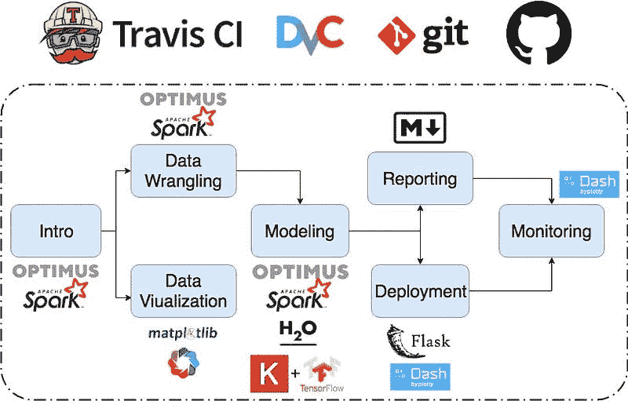

欢迎回到使用 Optimus 的数据科学系列。在第一部分：

* * *

## 我们的前三个课程推荐

 1\. [谷歌网络安全证书](https://www.kdnuggets.com/google-cybersecurity) - 快速进入网络安全职业生涯。

 2\. [谷歌数据分析专业证书](https://www.kdnuggets.com/google-data-analytics) - 提升你的数据分析能力

 3\. [谷歌 IT 支持专业证书](https://www.kdnuggets.com/google-itsupport) - 支持你的组织 IT

* * *

[**使用 Optimus 进行数据科学. 第一部分：介绍。**

*通过 Python、Spark 和 Optimus 拆解数据科学。* [towardsdatascience.com](https://towardsdatascience.com/data-science-with-optimus-part-1-intro-1f3e2392b02a)

我们开始这个旅程时讨论了 Optimus、Spark 和创建我们的环境。为此，我们使用了 MatrixDS：

[**一个由数据科学家为数据科学家创建的社区**](https://community.platform.matrixds.com/community/project/5c5907039298c0508b9589d2/files)

数据社区的工作台 [matrixds.com](https://matrixds.com/)

只需点击下方即可访问该仓库：

[**MatrixDS | 数据项目工作台**](https://matrixds.com/)

*MatrixDS 是一个用于构建、分享和管理任何规模数据项目的地方。* [community.platform.matrixds.com](https://community.platform.matrixds.com/community/project/5c5907039298c0508b9589d2/files)

然后在 MatrixDS 上点击“叉车”：

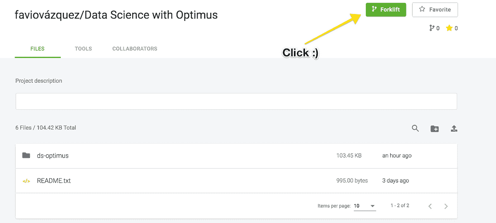

GitHub 上也有一个仓库：

[**FavioVazquez/ds-optimus**](https://github.com/FavioVazquez/ds-optimus)

*如何使用 Optimus、Spark 和 Python 进行数据科学。 — FavioVazquez/ds-optimus* [github.com](https://github.com/FavioVazquez/ds-optimus)

你只需要克隆它。

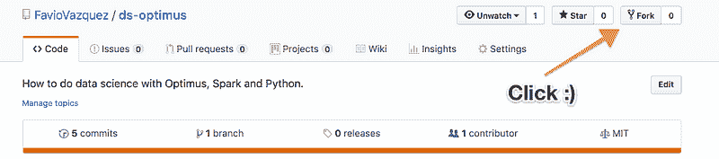

### DataOps


来自 [DataKitchen](https://www.datakitchen.io/) 的优秀团队：

> DataOps 可以加速数据分析团队创建和发布新分析结果给用户的能力。它需要敏捷的思维方式，并且还必须得到一个自动化平台的支持，该平台将现有工具整合到 DataOps 开发管道中。DataOps 涵盖了整个分析过程，从数据获取到洞察交付。

所以对我来说，DataOps（数据操作）可以被看作这些领域的交集：

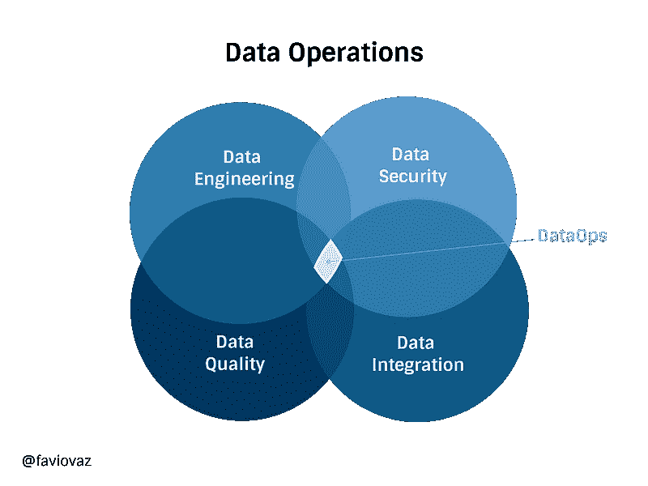

其功能组件包括：

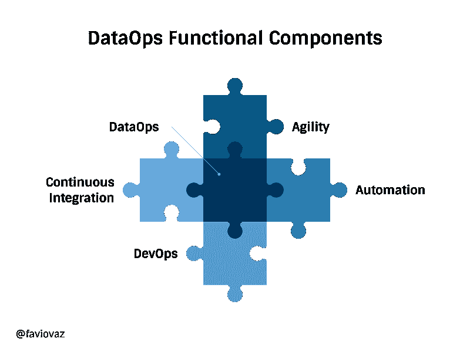

你可以在我的朋友 [Andreas Kretz](https://medium.com/@andreaskayy) 的出版物中阅读更多关于这些主题的信息：

[**数据科学的管道工**

*数据科学背后的工程与大数据社区* medium.com](https://medium.com/plumbersofdatascience)

### 在 MatrixDS 上设置环境


[`matrixds.com/`](https://matrixds.com/)

我们将在平台上使用以下工具创建一个简单（但强大的）DataOps 环境：TravisCI、DVC、Git 和 GitHub。

### Git：


[`git-scm.com/`](https://git-scm.com/)

Git 是一个免费的开源分布式版本控制系统，设计用于以速度和效率处理从小型到大型项目的所有任务。

在数据科学中，**git** 就像我们内部的一个记忆力超强的经理。它会记住你做过的所有事情，如何做的，以及仓库中每个文件的历史记录。

Git 在 MatrixDS 中默认安装，但我们需要设置两个配置。首先，打开一个新的终端并输入：

```py
git config --global user.name "FIRST_NAME LAST_NAME"
```

设置你的姓名，然后

```py
git config --global user.email "MY_NAME@example.com"
```

设置你的电子邮件。

我建议你在这里输入的电子邮件与 GitHub 上的电子邮件相同。

要开始使用这个仓库，只需克隆它：

```py
git clone **https://github.com/FavioVazquez/ds-optimus.git**
```

然后进入目录：

```py
cd ds-optimus
```

因为这是一个已经存在的 Git 仓库，你不需要初始化它，但如果你是从头开始，你需要输入：

```py
git init
```

在你希望放置仓库的文件夹中。

### DVC：

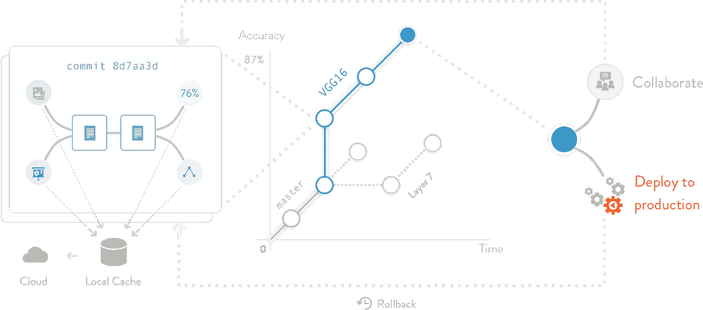

[`dvc.org/`](https://dvc.org/)

DVC 或数据版本控制是一个开源版本控制系统，适用于机器学习项目和数据科学项目。这个视频解释得更好：

因为我们使用 Python，我们将通过以下步骤安装 DVC：

```py
pip install --user dvc
```

根据文档的说明，为了开始使用 DVC，你需要首先在项目目录中初始化它。DVC 不要求使用 Git，也可以在没有任何源代码管理系统的情况下工作，但**为了获得最佳体验，我们推荐在 Git 仓库上使用 DVC。**

**重要提示：**

> **目前在 MatrixDS 上 DVC 的一些配置存在错误，因此为了运行 DVC，你必须在不同的文件夹中进行，而不是在 /home/matrix 中。为此，请执行以下操作（假设你将原始项目保存在默认文件夹中）：**

```py
cd /home/
sudo mkdir project
cd project
cp -r ../matrix/ds-optimus/ .
cd ds-optimus
```

所以要开始在我们的仓库中使用 DVC，只需输入：

```py
dvc init
```

如果由于某种原因，这在 MatrixDS 上不起作用，请为 Linux 安装 DVC：

```py
wget https://dvc.org/deb/dvc.list
sudo cp dvc.list /etc/apt/sources.list.d/
sudo apt-get update
sudo apt-get install dvc
```

如果由于某种原因你遇到错误：

```py
W: chown to root:adm of file /var/log/apt/term.log failed - OpenLog (1: Operation not permitted)
```

执行一个

```py
sudo su
```

然后输入：

```py
apt-get install dvc
```

好的，所以如果你在这个仓库上运行了 **dvc init**，你会看到：

```py
Adding '.dvc/state' to '.dvc/.gitignore'.
Adding '.dvc/lock' to '.dvc/.gitignore'.
Adding '.dvc/config.local' to '.dvc/.gitignore'.
Adding '.dvc/updater' to '.dvc/.gitignore'.
Adding '.dvc/updater.lock' to '.dvc/.gitignore'.
Adding '.dvc/state-journal' to '.dvc/.gitignore'.
Adding '.dvc/state-wal' to '.dvc/.gitignore'.
Adding '.dvc/cache' to '.dvc/.gitignore'.
```

```py
You can now commit the changes to git.
```

```py
+-----------------------------------------------------------------+
|                                                                 |    |                                                                 |
|        DVC has enabled anonymous aggregate usage analytics.     |    |                                                                 |
|     Read the analytics documentation (and how to opt-out) here: |     |                                                                 |
|              https://dvc.org/doc/user-guide/analytics           |           |                                                                 |
|                                                                 |             |                                                                 |
+-----------------------------------------------------------------+

What's next?
------------
- Check out the documentation: https://dvc.org/doc
- Get help and share ideas: https://dvc.org/chat
- Star us on GitHub: https://github.com/iterative/dvc
```

然后提交你的工作（如果你更改了文件夹，可能需要重新配置 Git）：

```py
git add .
git commit -m "Add DVC to project"
```

### Travis CI：

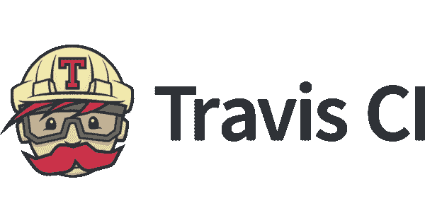

[`travis-ci.org/`](https://travis-ci.org/)

Travis CI（持续集成）是我最喜欢的 CI 工具。持续集成是指经常合并小的代码更改，而不是在开发周期结束时合并大量更改。目标是通过在较小的增量中开发和测试来构建更健康的软件。

这里的隐藏概念是对你正在做的工作进行自动测试。当我们编程时，我们一直在做很多事情，我们在测试新事物，尝试新库等等，搞砸的情况并不少见。CI 帮助你解决这个问题，因为你将开始你的工作，用 Git 提交一部分内容，你应该有必要的测试来查看你新编写的代码或分析是否对你的项目产生影响（无论是好是坏）。

关于 Travis 和 CI 工具还有很多需要了解的内容，但这里的计划是使用它，你会在过程中学习到。所以你首先需要做的是访问：

[**Travis CI - 自信地测试和部署你的代码**](https://travis-ci.org/)

travis-ci.org](https://travis-ci.org/)

并使用你的 GitHub 个人资料创建一个账户。

然后你将前往**（在这里我假设你已经成功地从 GitHub 上 fork 了这个仓库）**，然后在 [`travis-ci.org/account/repositories`](https://travis-ci.org/account/repositories) 你将选择** ds-optimus：**

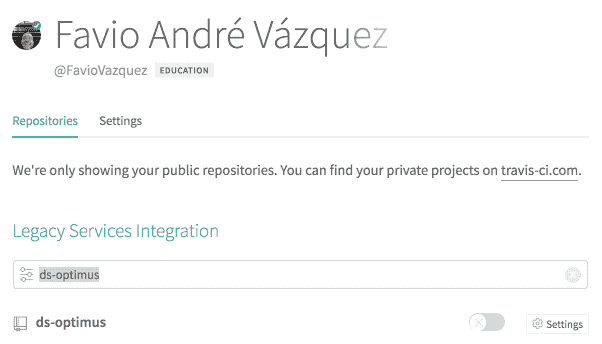

然后激活这个仓库

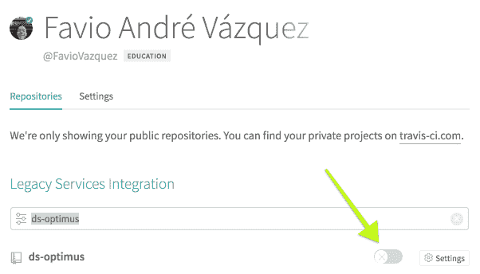

如果一切顺利，你会看到类似这样的内容：

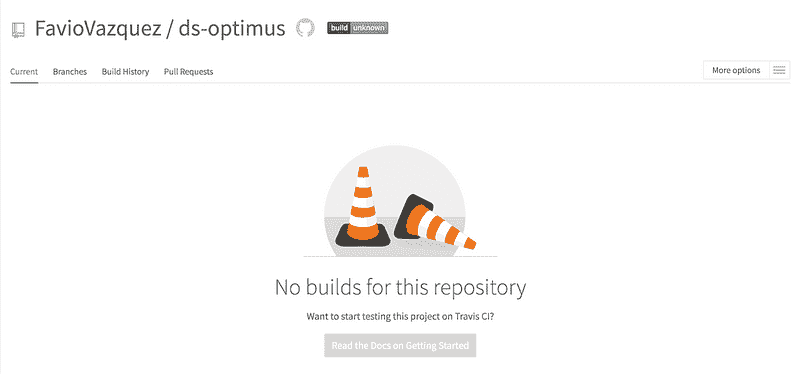

目前这是空的，因为我们还没有任何东西可以测试。这没关系，我们会在接下来的文章中处理这个问题。但现在我们需要创建一个基本的文件来触发“travis 构建”。

为此我们需要一个 .travis.yml 文件，它应该包含以下基本内容：

```py
language: python
python:
  - "3.6"
# Before upgrade pip and pytest
before_install:
- pip install --upgrade pip
- pip install pytest
# command to install dependencies
install:
  - pip install -r requirements.txt
# command to run tests
#script: pytest
```

正如你所看到的，我们还需要一个 requirements.txt 文件，在我们这个例子中，它现在只会包含 optimus。

> 如果你在 GitHub 上有项目的 fork，请确保将我的 master 添加为上游，因为文件已经在那里。

如果你不知道如何添加上游仓库，以下是方法：

[**如何使下游 Git 仓库与上游仓库的更改保持同步**](https://medium.com/sweetmeat/how-to-keep-a-downstream-git-repository-current-with-upstream-repository-changes-10b76fad6d97)

*这篇文章演示了如何在执行操作时保持下游仓库与上游仓库的同步…* [medium.com](https://medium.com/sweetmeat/how-to-keep-a-downstream-git-repository-current-with-upstream-repository-changes-10b76fad6d97)

然后我们需要推送一个包含“.travis.yml”的提交到项目中。

然后当你再次访问 Travis 时，你将看到你的第一次构建：

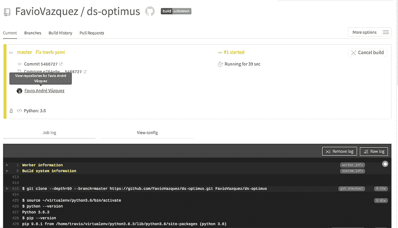

现在它会给我们一个错误，因为我们还没有创建任何要运行的测试：

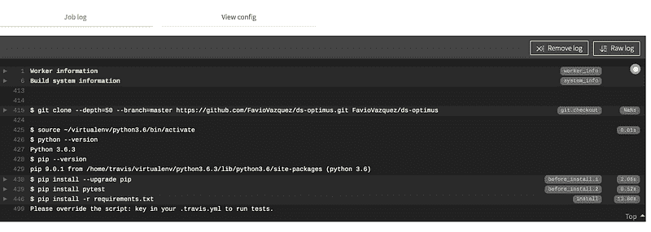

但不要担心，我们稍后会解决这个问题。

感谢查看更新，并开始为这个项目设置环境。如果你有任何问题，请在这里写信给我：

[**法比奥·巴斯克斯 - 创始人 / 首席数据科学家 - Ciencia y Datos | LinkedIn**](https://www.linkedin.com/in/faviovazquez/)

*加入 LinkedIn ‼️‼️ 重要说明：由于 LinkedIn 的技术限制，我现在只能接受连接请求…*www.linkedin.com](https://www.linkedin.com/in/faviovazquez/)

**简介： [法比奥·巴斯克斯](https://www.linkedin.com/in/faviovazquez/)** 是一名物理学家和计算机工程师，专注于数据科学和计算宇宙学。他对科学、哲学、编程和音乐充满热情。他是 Ciencia y Datos 的创始人，这是一本西班牙语的数据科学出版物。他喜欢新的挑战，和优秀的团队合作，并解决有趣的问题。他参与了 Apache Spark 的合作，帮助 MLlib、Core 和文档工作。他热爱运用自己的科学知识和专业技能，帮助世界变得更美好。

[原文](https://towardsdatascience.com/data-science-with-optimus-part-2-setting-your-dataops-environment-248b0bd3bce3)。经允许重新发布。

**相关：**

+   10 分钟内掌握实用 Apache Spark

+   数据管道、Luigi、Airflow：你需要知道的一切

+   你的机器学习代码可能糟糕的 4 个原因

### 更多相关主题

+   [通过 DataOps.live 解锁 DataOps 成功 - 在 Gartner…中亮相](https://www.kdnuggets.com/2023/07/dataopslive-unlock-dataops-success-featured-gartner-market-guide.html)

+   [通过 DataOps.live 解锁 DataOps 成功：在 Gartner 市场指南中亮相！](https://www.kdnuggets.com/2023/07/dataopslive-unlock-dataops-success-featured-gartner-market-guide-2.html)

+   [停止学习数据科学以寻找目标，并寻找目标来……](https://www.kdnuggets.com/2021/12/stop-learning-data-science-find-purpose.html)

+   [学习数据科学统计的顶级资源](https://www.kdnuggets.com/2021/12/springboard-top-resources-learn-data-science-statistics.html)

+   [成功数据科学家的 5 个特征](https://www.kdnuggets.com/2021/12/5-characteristics-successful-data-scientist.html)

+   [每个数据科学家都应该知道的三个 R 库（即使你使用 Python）](https://www.kdnuggets.com/2021/12/three-r-libraries-every-data-scientist-know-even-python.html)
