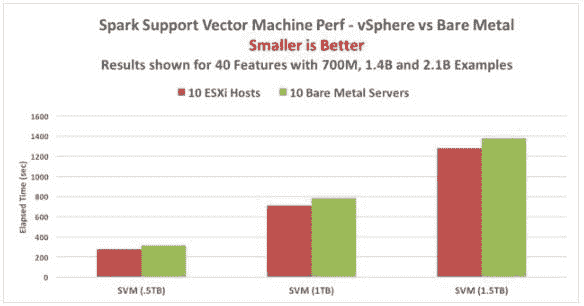

# 为什么数据科学家和数据工程师需要了解云中的虚拟化

> 原文：[`www.kdnuggets.com/2017/01/data-scientist-engineer-understand-virtualization-cloud.html/2`](https://www.kdnuggets.com/2017/01/data-scientist-engineer-understand-virtualization-cloud.html/2)

**隔离与安全**

将一个团队的工作与另一个团队的工作分开很重要，以便他们能够实现业务所需的服务水平协议（SLA）。在虚拟化领域，这种分离是通过将服务器和虚拟机分组到各自的资源池中来实现的，以限制它们对外部工作负载的影响。

* * *

## 我们的前 3 名课程推荐

 1\. [Google 网络安全证书](https://www.kdnuggets.com/google-cybersecurity) - 快速进入网络安全职业的快车道。

 2\. [Google 数据分析专业证书](https://www.kdnuggets.com/google-data-analytics) - 提升你的数据分析技能

 3\. [Google IT 支持专业证书](https://www.kdnuggets.com/google-itsupport) - 支持你的组织的 IT 需求

* * *

示例：一家医疗保健公司中的不同团队使用一个 Hortonworks 集群进行某些分析工作，同时在同一基础设施上运行 MapR 集群进行其他分析目的。

在专门构建的虚拟机中可以部署分布式防火墙，以排除对某些集群和数据的访问，这些集群和数据可能位于相同的基础设施上。由于这些分布式防火墙位于虚拟机中，它们可以随工作负载一起移动，而不受物理边界的限制。

**性能**

数据科学家需要在时间限制内找到他们查询的答案。执行其工作的系统性能对这个群体至关重要。

为了测试数据科学程序在虚拟机上的性能，VMware 工程师在 Spark 集群上执行了一组机器学习（ML）算法，其中集群中的每个节点都保存在虚拟机中。这些测试也在没有虚拟化的相同服务器上执行，并对测试结果进行了比较。以下是一个结果示例。

这些类型的系统最初使用大量示例数据来训练模型，以便模型能够识别数据中的某些模式。这些示例集在上述设置中范围从 7 亿到 21 亿条记录。每个示例都有 40 个特征或数据记录的不同方面（例如交易金额和信用卡购买的到期日期）。

模型在大量示例上训练完成后，会被呈现一个新的事务实例。例如，这可能是一个信用卡交易或客户申请新信用卡。分析模型需要将该事务分类为良好或欺诈。通过使用统计技术，模型对此问题给出二元答案。这种类型的分析称为二元分类。也测试了几种其他机器学习算法。

结果显示，这些在 vSphere 上运行的 ML 算法表现良好，在某些情况下，比相同测试代码的裸金属实现性能更佳。有关这些工作负载和观察到的结果的详细技术描述请参见 [`www.vmware.com/content/dam/digitalmarketing/vmware/en/pdf/techpaper/bigdata-perf-vsphere6.pdf`](http://www.vmware.com/content/dam/digitalmarketing/vmware/en/pdf/techpaper/bigdata-perf-vsphere6.pdf)

**云部署的虚拟化选择**

数据科学家/数据工程师以及基础设施管理团队在开始在云中部署分析基础设施软件时，面临的技术选择在此处突出显示。

1.  正确调整虚拟机的规模

1.  将虚拟机放置到最合适的主机服务器上

1.  虚拟机中不同软件角色的配置

1.  将计算资源分配给不同的团队

1.  快速供应

1.  在基础设施级别监控应用程序

**虚拟机的规模调整**

在创建虚拟机时，你选择内存量、虚拟 CPU 数量、存储布局和网络配置——如果需要，之后也可以更改。这些都是软件构造，而非硬件构造，因此更容易更改。在大数据实践中，我们已经看到最低值为 4 vCPUs，对于运行 Hadoop/Spark 类型工作负载的高端虚拟机，一般经验值为 16 vCPUs。虽然能够利用超过 16 vCPUs 的应用程序很少见，但仍然是可行的。例如，这些应用程序的代码高度并行化，并且有大量的并发线程。

虚拟机所需的内存量可以与物理内存一样大，尽管我们看到现代工作负载的配置内存通常为 256Gb 或 512Gb。经典 Hadoop 工作节点的基本操作可以适应 128Gb 内存边界。这些大小将由应用平台架构师决定，但对最终用户、数据科学家和数据工程师来说，了解每台虚拟机适用的约束条件也很重要。根据硬件容量，这些数字可以迅速扩展，以查看在新条件下工作是否更快完成。

**将虚拟机放置到服务器上**

在某些云环境中，你可以选择将虚拟机适配到主机服务器及其包含的机架上；在其他环境中则不能。如果你被提供了这种选择，你可以做出决策来优化应用程序的性能。例如，在私有云中，你可以选择不对服务器的物理内存或物理 CPU 进行过度分配，即不要将虚拟机的数量或虚拟机资源的配置设得过大。避免这种对物理资源的过度分配通常有助于那些资源密集型的应用程序，如数据分析应用程序的性能。

这里的一个相关问题是，任何一个物理主机服务器上应该有多少个虚拟机。在我们的虚拟化测试工作中，每台服务器上两个到四个适当大小的虚拟机可以作为一个起点得到良好的结果——随着对平台和工作负载经验的增加，这个数字可以进一步增加。在你能够看到服务器硬件类型和配置的情况下，虚拟机的大小应尊重 NUMA 边界，以便从机器上获得最佳的性能。上述提到的虚拟化最佳实践文档在这方面提供了详细的技术建议。

**虚拟机中的不同软件角色**

在大多数现代分布式数据平台中，软件过程角色被分为“主节点”和“工作节点”。控制过程运行在前者上，而驱动个别任务的执行程序则运行在工作节点上。你为这些不同的角色创建一个模板虚拟机（一个“黄金主机”），然后根据你需要的该角色实例的数量复制或克隆该虚拟机。可能会有一个选项，将分析软件组件本身安装到模板虚拟机中，从而在实例化克隆或集群成员时节省重复安装的时间。这些节点在集群的生命周期中可以通过供应商的管理工具随时进行新的软件服务的自定义。我们也可以以相同的方式从集群中退役某些角色，例如当我们需要更少的工作节点来执行分析工作时。

**将计算资源组分配给不同的团队**

云虚拟化方法的一个固有价值是硬件资源的池化，这样可以将总 CPU/内存的部分聚合力量分配给特定的目的和团队。虚拟化包括“资源池”的概念，能够保留一定的计算和内存资源用于此目的（跨多个机器）。一个部门的虚拟机集合存在于其资源池的有限空间内，而另一个部门则存在于另一个资源池。这些资源池在物理上可能是相邻的。根据需要，计算资源可以动态分配给一个或另一个。这使得拥有来自不同团队竞争请求的数据科学部门的管理者对资源分配有了更多控制权，取决于每个团队项目工作的需求和相对重要性。

**快速供应**

为数据科学家创建一组虚拟机当然比提供新的物理机器更快速，从而提高了生产工作的时间。虚拟机集合的进一步扩展和收缩灵活性更为重要。在我们所见的大型分析应用部署中，初期的快速扩展从 20 个节点（虚拟机）迅速增加到一个集群中的 300 多个节点。随着时间的推移和新类型负载的出现，这种大型基础设施可能会收缩，以便在同一硬件集合中容纳新的基础设施，尽管被分隔到不同的资源池中。这种灵活性是虚拟化的功能。以前为各个团队划定的严格所有权边界在这里被打破了。

**基础设施级别的应用监控**

数据科学家/工程师想知道为什么查询需要这么长时间才能完成。我们对各种类型数据库的历史都非常了解这一现象。SQL 引擎是今天大数据基础设施上最受欢迎的层之一——实际上，几乎每个供应商都有一个。不断需要找到效率低下或结构不良的查询，这些查询占用了系统资源。虚拟机和资源池最初提供了对这些异常查询的隔离。但更进一步，如果云服务提供商允许的话，能够在基础设施级别查看代码的效果提供了有价值的数据，以追踪其影响并优化执行时间。

**云基础设施在不断发展**

在我们的开场白中，我们提到了公共云、私有云和混合云。对跨这些云类型使用通用基础设施和管理工具有广泛的兴趣。当这些基础元素在私有云和公共云中相同时，应用程序可以根据业务需求的最佳匹配存在于任意云中。实际上，应用程序可以以有序的方式从一个云迁移到另一个云，而无需进行更改。数据科学家/工程师的界限会变得模糊，因为一个特定的分析工作项目可能从公共云中的实验开始，随着其成熟，迁移到私有云以优化其性能。反向迁移也可能发生。2016 年底宣布，完整的 VMware 软件定义数据中心产品组合将在 AWS 上作为服务运行。这种跨私有云和公共云的通用基础设施扩展了数据科学家/数据工程师的灵活性和选择性。VMware Cloud on AWS 上的分析工作负载现在可以以本地方式访问 AWS 上的 S3 存储，在共同的数据中心内，从而降低数据访问的延迟。

在本文中，我们已经看到，对于数据科学家和数据工程师来说，理解虚拟化构造的价值，因为他们将分析部署到各种云平台上。虚拟化是这些数据工作者需要了解的关键使能层，以便获得最佳结果。

**大数据/Hadoop 在 VMware vSphere 上的参考资料**

部署指南：

1.  虚拟化 Hadoop - 部署指南

    [www.vmware.com/bde](http://www.vmware.com/bde)  在资源 -> 入门，或更直接地：

    [www.vmware.com/files/pdf/products/vsphere/Hadoop-Deployment-Guide-USLET.pdf](http://www.vmware.com/files/pdf/products/vsphere/Hadoop-Deployment-Guide-USLET.pdf)

1.  使用 Isilon 存储在 vSphere 上部署虚拟化的 Cloudera CDH - EMC/Isilon 的技术指南

    [hsk-cdh.readthedocs.org/en/latest/hsk.html#deploy-a-cloudera-hadoop-cluster](https://urldefense.proofpoint.com/v2/url?u=http-3A__hsk-2Dcdh.readthedocs.org_en_latest_hsk.html-23deploy-2Da-2Dcloudera-2Dhadoop-2Dcluster&d=AAMFAw&c=Sqcl0Ez6M0X8aeM67LKIiDJAXVeAw-YihVMNtXt-uEs&r=_MJE4XiBiWsXd4egNduIpJhdnAwm4uba3wOzdrllJfU&m=5Irnh2t-m180pvuGRKqlxlbI3nC0TBh9YVu69qvhCH8&s=w-l1c5EVQDxjuCfCcf478iD7ICQX2fFmaFhYkcecjdI&e=)

    或在 [community.emc.com/docs/DOC-26892](https://community.emc.com/docs/DOC-26892) 查找最新版本

1.  使用 Isilon 存储在 vSphere 上部署虚拟化的 Hortonworks HDP - EMC/Isilon 的技术指南

    [hsk-hwx.readthedocs.org/en/latest/hsk.html#deploy-a-hortonworks-hadoop-cluster-with-isilon-for-hdfs](https://urldefense.proofpoint.com/v2/url?u=http-3A__hsk-2Dhwx.readthedocs.org_en_latest_hsk.html-23deploy-2Da-2Dhortonworks-2Dhadoop-2Dcluster-2Dwith-2Disilon-2Dfor-2Dhdfs&d=AAMFAw&c=Sqcl0Ez6M0X8aeM67LKIiDJAXVeAw-YihVMNtXt-uEs&r=_MJE4XiBiWsXd4egNduIpJhdnAwm4uba3wOzdrllJfU&m=5Irnh2t-m180pvuGRKqlxlbI3nC0TBh9YVu69qvhCH8&s=1L55fgiFfIKAT0ENwlHauUOVW9PdRmVlAPxAkP2gtQ8&e=)

    或参考上述 [community.emc.com/docs/DOC-26892](https://community.emc.com/docs/DOC-26892)

参考架构：

1.  Cloudera 参考架构 - Isilon 版本

    [www.cloudera.com/content/cloudera/en/documentation/reference-architecture/latest/PDF/cloudera_ref_arch_vmware_isilon.pdf](https://www.cloudera.com/content/cloudera/en/documentation/reference-architecture/latest/PDF/cloudera_ref_arch_vmware_isilon.pdf)

1.  Cloudera 参考架构 – 直接附加存储版本

    [www.cloudera.com/content/cloudera/en/documentation/reference-architecture/latest/PDF/cloudera_ref_arch_vmware_local_storage.pdf](https://www.cloudera.com/content/cloudera/en/documentation/reference-architecture/latest/PDF/cloudera_ref_arch_vmware_local_storage.pdf)

1.  使用 Cisco UCS 和 EMC Isilon 的大数据：构建 60 节点 Hadoop 集群（使用 Cloudera）

    [www.cisco.com/c/dam/en/us/td/docs/unified_computing/ucs/UCS_CVDs/Cisco_UCS_and_EMC_Isilon-with-Cloudera_CDH5.pdf](http://www.cisco.com/c/dam/en/us/td/docs/unified_computing/ucs/UCS_CVDs/Cisco_UCS_and_EMC_Isilon-with-Cloudera_CDH5.pdf)

1.  在 VMware vSphere 上部署 Hortonworks 数据平台 (HDP) – 技术参考架构

    [hortonworks.com/wp-content/uploads/2014/02/1514.Deploying-Hortonworks-Data-Platform-VMware-vSphere-0402161.pdf](https://urldefense.proofpoint.com/v2/url?u=http-3A__hortonworks.com_wp-2Dcontent_uploads_2014_02_1514.Deploying-2DHortonworks-2DData-2DPlatform-2DVMware-2DvSphere-2D0402161.pdf&d=CwMF-g&c=Sqcl0Ez6M0X8aeM67LKIiDJAXVeAw-YihVMNtXt-uEs&r=SOgN0aaEng7AKOMYtRIpCw&m=_FQ0HHBVlPkrhJkDTfzWeOkcHV1SvJpLfwXVS_UGFpw&s=Ecnqao9QBEHPgmRev3jWEixynkATJflvkbwRlVxRrCc&e=)

案例研究：

1.  Adobe 在 VMware vSphere 上部署 Hadoop 作为服务

    [www.vmware.com/files/pdf/products/vsphere/VMware-vSphere-Adobe-Deploys-HAAS-CS.pdf](http://www.vmware.com/files/pdf/products/vsphere/VMware-vSphere-Adobe-Deploys-HAAS-CS.pdf)

1.  在大规模基础设施中虚拟化 Hadoop – EMC 技术白皮书

    [community.emc.com/docs/DOC-41473](https://community.emc.com/docs/DOC-41473)

1.  Skyscape Cloud Services 在 vSphere 上部署 Hadoop 云服务

    [www.vmware.com/files/pdf/products/vsphere/VMware-vSphere-Skyscape-Cloud-Services-Deploys-Hadoop-Cloud.pdf](http://www.vmware.com/files/pdf/products/vsphere/VMware-vSphere-Skyscape-Cloud-Services-Deploys-Hadoop-Cloud.pdf)

1.  在 VMware IT 中虚拟化大数据 – 从小规模开始

    [blogs.vmware.com/vsphere/2015/11/virtualizing-big-data-at-vmware-it-starting-out-at-small-scale.html](https://blogs.vmware.com/vsphere/2015/11/virtualizing-big-data-at-vmware-it-starting-out-at-small-scale.html)

性能：

1.  vSphere® 6 上的大数据性能 – 优化虚拟化大数据应用的最佳实践（2016 年）

    [www.vmware.com/content/dam/digitalmarketing/vmware/en/pdf/techpaper/bigdata-perf-vsphere6.pdf](http://www.vmware.com/content/dam/digitalmarketing/vmware/en/pdf/techpaper/bigdata-perf-vsphere6.pdf)

1.  使用 VMware vSphere® 6 在高性能服务器上的虚拟化 Hadoop 性能（2015 年）

    [www.vmware.com/resources/techresources/10452](http://www.vmware.com/resources/techresources/10452)

1.  虚拟化的 Hadoop 性能与 VMware vSphere 5.1

    [www.vmware.com/resources/techresources/10360](http://www.vmware.com/resources/techresources/10360)

    上述两篇技术论文中包含了一些非常有用的最佳实践。

1.  在 vSphere 5 上虚拟化 Hadoop 性能的基准案例研究

    [www.vmware.com/resources/techresources/10222](http://www.vmware.com/resources/techresources/10222)

1.  事务处理委员会 – TPCx-HS 基准测试结果（Cloudera 在 VMware 上的性能，由 Dell 提交）

    [www.tpc.org/tpcx-hs/results/tpcxhs_results.asp](http://www.tpc.org/tpcx-hs/results/tpcxhs_results.asp)

1.  ESG 实验室评审：VCE vBlock 系统与 EMC Isilon 适用于企业 Hadoop

    [www.esg-global.com/lab-reports/esg-lab-review-vce-vblock-systems-with-emc-isilon-for-enterprise-hadoop/](http://www.esg-global.com/lab-reports/esg-lab-review-vce-vblock-systems-with-emc-isilon-for-enterprise-hadoop/)

    [labs.vmware.com/flings/big-data-extensions-for-vsphere-standard-edition](https://labs.vmware.com/flings/big-data-extensions-for-vsphere-standard-edition)

其他 vSphere 特性与大数据：

1.  使用 VMware vSphere 5 故障容错保护 Hadoop

    [www.vmware.com/files/pdf/techpaper/VMware-vSphere-Hadoop-FT.pdf](http://www.vmware.com/files/pdf/techpaper/VMware-vSphere-Hadoop-FT.pdf)

1.  朝向弹性大象 – 为云环境启用 Hadoop

    [labs.vmware.com/vmtj/toward-an-elastic-elephant-enabling-hadoop-for-the-cloud](http://labs.vmware.com/vmtj/toward-an-elastic-elephant-enabling-hadoop-for-the-cloud)

1.  Apache Flume 和 Apache Scoop 数据导入到 VMware vSphere 上的 Apache Hadoop 集群

    [www.vmware.com/files/pdf/products/vsphere/VMware-vSphere-Data-Ingestion-Solution-Guide.pdf](https://www.vmware.com/files/pdf/products/vsphere/VMware-vSphere-Data-Ingestion-Solution-Guide.pdf)

1.  Hadoop 虚拟化扩展 (HVE):

    [www.vmware.com/files/pdf/Hadoop-Virtualization-Extensions-on-VMware-vSphere-5.pdf](http://www.vmware.com/files/pdf/Hadoop-Virtualization-Extensions-on-VMware-vSphere-5.pdf)

VMware 首席技术官与 Cloudera 首席技术官的访谈视频和 Adobe 参考视频：

[hwww.youtube.com/playlist?list=PL9MeVsU0uG662xAjTB8XSD83GXSDuDzuk](https://www.youtube.com/playlist?list=PL9MeVsU0uG662xAjTB8XSD83GXSDuDzuk)

**简介：贾斯廷·穆雷** ([**@johjustinmurray**](https://twitter.com/johjustinmurray)) 是 VMware 加州帕洛阿尔托的技术营销架构师。他自 2007 年以来在 VMware 从事过各种技术和联盟角色。贾斯廷与 VMware 的客户和现场工程师合作，制定使用虚拟化技术进行大数据的指南和最佳实践。他在各种会议上讲解了这些主题，并在 [博客](http://blogs.vmware.com/vsphere)、白皮书及其他材料中发表过文章。

**相关：**

+   云计算关键术语解释

+   机器学习趋势与人工智能的未来

+   介绍云托管深度学习模型

### 更多相关内容

+   [24 本最佳（且免费）机器学习书籍](https://www.kdnuggets.com/2020/03/24-best-free-books-understand-machine-learning.html)

+   [图形：理解数据的自然方式](https://www.kdnuggets.com/2022/10/manning-graphs-natural-way-understand-data.html)

+   [使用 SQL 理解数据科学职业趋势](https://www.kdnuggets.com/using-sql-to-understand-data-science-career-trends)

+   [挑选实例以理解机器学习模型](https://www.kdnuggets.com/2022/11/picking-examples-understand-machine-learning-model.html)

+   [11 个最佳实践：云和数据迁移到 AWS 云](https://www.kdnuggets.com/2023/04/11-best-practices-cloud-data-migration-aws-cloud.html)

+   [云存储的采用是企业当务之急](https://www.kdnuggets.com/2022/02/cloud-storage-adoption-need-hour-business.html)
