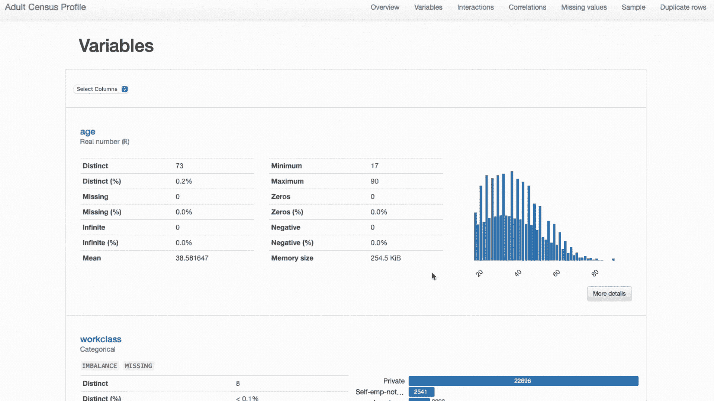
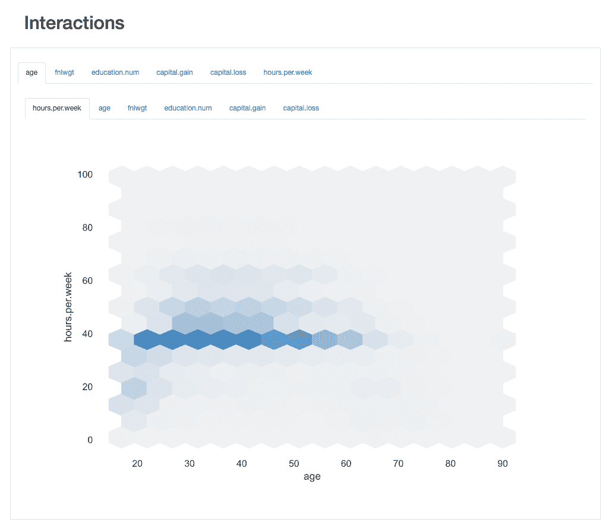
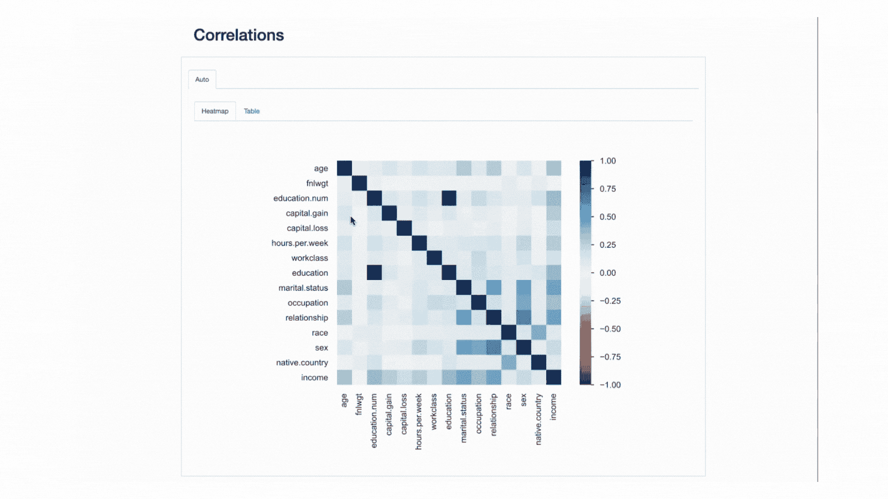
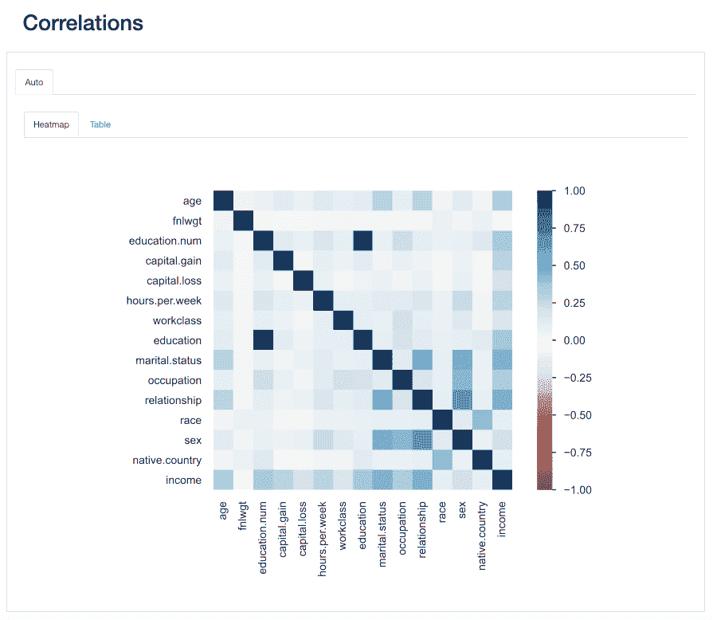
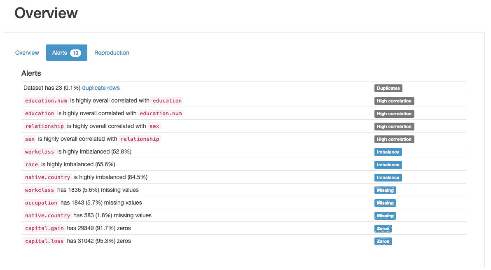
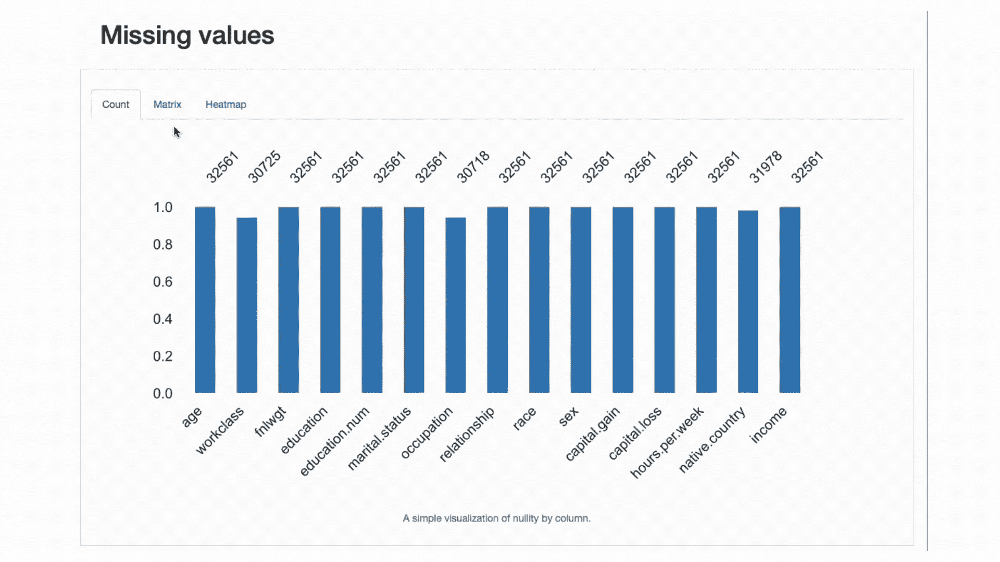

# 数据科学家必备的探索性数据分析指南

> 原文：[`www.kdnuggets.com/2023/06/data-scientist-essential-guide-exploratory-data-analysis.html`](https://www.kdnuggets.com/2023/06/data-scientist-essential-guide-exploratory-data-analysis.html)


Bing Image Creator 提供的图像

# 介绍

* * *

## 我们的三大课程推荐

 1\. [谷歌网络安全证书](https://www.kdnuggets.com/google-cybersecurity) - 快速进入网络安全职业。

 2\. [谷歌数据分析专业证书](https://www.kdnuggets.com/google-data-analytics) - 提升你的数据分析技能

 3\. [谷歌 IT 支持专业证书](https://www.kdnuggets.com/google-itsupport) - 支持你的组织进行 IT 工作

* * *

探索性数据分析（EDA）是每个数据科学项目开始时最重要的任务。

本质上，这涉及到彻底检查和描述您的数据，以发现其潜在的**特征**、可能的**异常**以及隐藏的**模式**和**关系**。

对数据的理解将是**指导您机器学习管道接下来的步骤**的终极关键，从数据预处理到模型构建以及结果分析。

## EDA 的过程基本包括三个主要任务：

+   **步骤 1:** *数据集概述和描述性统计*

+   **步骤 2:** *特征评估和可视化*，以及

+   **步骤 3:** *数据质量评估*

如你所猜测的，每项任务可能需要相当全面的分析，这将让你*像疯子一样切片、打印和绘制你的 pandas 数据框*。

## 除非你选择了合适的工具。

在这篇文章中，**我们将深入探讨** **有效 EDA 过程的每个步骤**，并讨论为什么你应该将`[ydata-profiling](https://github.com/ydataai/ydata-profiling)` 变成你的终极工具来掌握它。

```py`` To **demonstrate best practices and investigate insights**, we’ll be using the [Adult Census Income Dataset](https://www.kaggle.com/datasets/uciml/adult-census-income), freely available on Kaggle or UCI Repository (License: [CC0: Public Domain](https://creativecommons.org/publicdomain/zero/1.0/)).    # Step 1: Data Overview an Descriptive Statistics    When we first get our hands on an unknown dataset, there is an automatic thought that pops up right away: *What am I working with?*    ## We need to have a deep understanding of our data to handle it efficiently in future machine learning tasks    As a rule of thumb, we traditionally start by characterizing the data relatively to the number of *observations*, number and *types of features*, overall *missing rate*, and percentage of *duplicate* observations.    With some pandas manipulation and the right cheatsheet, we could eventually print out the above information with some short snippets of code:    Dataset Overview: Adult Census Dataset. Number of observations, features, feature types, duplicated rows, and missing values. Snippet by Author.     All in all, the output format is not ideal… If you’re familiar with pandas, you’ll also know the standard *modus operandi* of starting an EDA process — `df.describe()`:   Adult Dataset: Main statistics presented with **df.describe()**. Image by Author.     This however, only considers **numeric features**. We could use a `df.describe(include='object')` to print out some additional information on **categorical features** (count, unique, mode, frequency), but a simple check of existing categories would involve something a little more verbose:    Dataset Overview: Adult Census Dataset. Printing the existing categories and respective frequencies for each categorical feature in data. Snippet by Author.     However, we can do this — *and guess what, all of the subsequent EDA tasks!* — **in a single line of code**, using `[ydata-profiling](https://github.com/ydataai/ydata-profiling):`   ```` 成人普查数据集的概况报告，使用 ydata-profiling 生成。摘录作者提供。**上述代码生成了数据的完整概况报告**，我们可以利用这些报告进一步推进我们的 EDA 过程，而无需编写更多代码！接下来，我们将通过报告的各个部分。关于**数据的总体特征**，我们寻找的信息都包含在***概述*部分**中：  ydata-profiling: 数据概况报告 — 数据集概述。图片由作者提供。我们可以看到我们的数据集包含**15 个特征和 32561 个观察值，**，其中**23 条重复记录，以及总体缺失率为 0.9%**。此外，数据集已被正确识别为**表格数据集**，且相当异质，呈现出**数值和分类特征**。对于**时间序列数据**，这类数据具有时间依赖性，并展示出不同类型的模式，`ydata-profiling`会在报告中加入[其他统计数据和分析](https://towardsdatascience.com/how-to-do-an-eda-for-time-series-cbb92b3b1913)。我们可以进一步检查**原始数据和现有的重复记录**，以便对特征有一个整体的了解，然后再进行更复杂的分析：  ydata-profiling: 数据概况报告 — 样本预览。图片由作者提供。**从简要的样本预览**中，我们可以立即看到，尽管数据集总体上缺失数据的比例较低，但**某些特征可能会受到影响**程度较大。我们还可以识别出某些特征具有相当**数量的类别**，以及具有 0 值的特征（或者至少有大量的 0）。  ydata-profiling: 数据概况报告 — 重复行预览。图片由作者提供。**关于重复行**，考虑到大多数特征代表了多个可能“同时符合”的类别，发现“重复”观察值并不奇怪。然而，也许**“数据异味”**可能是这些观察值共享相同的`age`值（这是可以理解的）和完全相同的`fnlwgt`，考虑到所展示的值，这似乎更难以置信。因此需要进一步分析，但我们**很可能会在后续阶段删除这些重复项**。总体而言，数据概述可能是一个简单的分析，但却是**极其重要的**，因为它将帮助我们定义即将到来的任务。# 第 2 步：特征评估和可视化在对整体数据描述进行初步了解后，我们需要**深入分析数据集的特征**，以获取其个别属性的见解 — **单变量分析** — 以及它们的交互和关系 — **多变量分析**。这两个任务都高度依赖于**调查适当的统计数据和可视化**，这些统计数据和可视化需要**针对特征类型**（例如，数值型、分类型）**和我们希望剖析的行为**（例如，交互、相关性）进行定制。## 让我们来看一下每项任务的最佳实践。## 单变量分析分析每个特征的个体特征至关重要，因为它将帮助我们决定其**对分析的相关性**以及**所需的数据准备类型**，以实现最佳结果。例如，我们可能会发现一些极端值，这些值可能指示**不一致性**或**异常值**。我们可能需要对**数值数据**进行**标准化**，或根据现有类别的数量对分类特征进行**独热编码**。或者，我们可能需要执行额外的数据准备，以处理那些**偏移或偏斜**的数值特征，如果我们打算使用的机器学习算法期望特定的分布（通常是高斯分布）。最佳实践因此要求对描述性统计和数据分布等个体属性进行彻底调查。**这些将突出出后续任务的需要，包括异常值移除、标准化、标签编码、数据填充、数据增强和其他类型的预处理。**让我们更详细地研究`race`和`capital.gain`。*我们能立即发现什么？*  ydata-profiling: 数据概况报告（race 和 capital.gain）。图片由作者提供。**对`capital.gain`的评估是直接的：** ```py Given the data distribution, we might question if the feature adds any value to our analysis, as 91.7% of values are “0”.    **Analyzing **`**race**** is slightly more complex:**`   ``There’s a clear underrepresentation of races other than `White`. This brings two main issues to mind:    *   One is the general tendency of machine learning algorithms to **overlook less represented concepts**, known as the problem of [small disjuncts](https://towardsdatascience.com/data-quality-issues-that-kill-your-machine-learning-models-961591340b40), that leads to reduced learning performance; *   The other is somewhat derivative of this issue: as we’re dealing with a sensitive feature, this “overlooking tendency” may have consequences that directly relate to ***bias* and *fairness* issues**. Something that we definitely don’t want to creep into our models.    Taking this into account, maybe we should **consider performing data augmentation** conditioned on the underrepresented categories, as well as considering **fairness-aware metrics for model evaluation**, to check for any discrepancies in performance that relate to `race` values.    **We will further detail on other data characteristics that need to be addressed when we discuss data quality best practices (Step 3).** This example just goes to show how much insights we can take just by assessing each individual feature’s *properties*.    **Finally, note how, as previously mentioned, different feature types call for different statistics and visualization strategies:**    *   **Numeric features** most often comprise information regarding mean, standard deviation, skewness, kurtosis, and other quantile statistics, and are best represented using histogram plots; *   **Categorical features** are usually described using the mode, median, and frequency tables, and represented using bar plots for category analysis.   ydata-profiling: Profiling Report. Presented statistics and visualizations are adjusted to each feature type. Screencast by Author.     Such a detailed analysis would be cumbersome to carry out with general pandas manipulation, but fortunately `ydata-profiling` **has all of this functionality built into the** `ProfileReport` for our convenience: no extra lines of code were added to the snippet!    ## Multivariate Analysis    For Multivariate Analysis, best practices focus mainly on two strategies: analyzing the **interactions** between features, and analyzing their **correlations**.    ## Analyzing Interactions    Interactions let us **visually explore how each pair of features behaves**, i.e., how the values of one feature relate to the values of the other.    For instance, they may exhibit *positive* or *negative* relationships, depending on whether the increase of one’s values is associated with an increase or decrease of the values of the other, respectively.   ydata-profiling: Profiling Report — Interactions. Image by Author.     Taking the interaction between `age` and `hours.per.week`as an example, we can see that the great majority of the working force works a standard of 40 hours. However, there are some “busy bees” that work past that (up until 60 or even 65 hours) between the ages of 30 and 45\. People in their 20’s are less likely to overwork, and may have a more light work schedule on some weeks.    ## Analyzing Correlations    Similarly to interactions, **correlations let us** **analyze the relationship **between features. Correlations, however, “put a value” on it, so that it is easier for us to determine the “strength” of that relationship.    This “strength” is **measured by correlation coefficients** and can be analyzed either numerically (e.g., inspecting a **correlation matrix**) or with a **heatmap**, that uses color and shading to visually highlight interesting patterns:   ydata-profiling: Profiling Report — Heatmap and Correlation Matrix. Screencast by Author.     Regarding our dataset, notice how the correlation between `education` and `education.num` stands out. In fact, **they hold the same information**, and `education.num` is just a binning of the `education` values.    Other pattern that catches the eye is the the correlation between `sex` and `relationship` although again not very informative: looking at the values of both features, we would realize that these features are most likely related because `male` and `female` will correspond to `husband` and `wife`, respectively.    **These type of redundancies may be checked to see whether we may remove some of these features from the analysis** (`marital.status` is also related to `relationship` and `sex`; `native.country` and `race` for instance, among others).   ydata-profiling: Profiling Report — Correlations. Image by Author.     **However, there are other correlations that stand out and could be interesting for the purpose of our analysis.**    For instance, the correlation between`sex` and `occupation`, or `sex` and `hours.per.week`.    **Finally, the correlations between **`income`** and the remaining features are truly informative**, **specially in case we’re trying to map out a classification problem.** Knowing what are the *most correlated* features to our target class helps us identify the* most discriminative* features and well as find possible data leakers that may affect our model.    From the heatmap, seems that `marital.status` or `relationship` are amongst the most important predictors, while `fnlwgt` for instance, does not seem to have a great impact on the outcome.    **Similarly to data descriptors and visualizations, interactions and correlations also need to attend to the types of features at hand.**    In other words, different combinations will be measured with different correlation coefficients. By default, `ydata-profiling` runs correlations on `auto`, which means that:    *   **Numeric versus Numeric** correlations are measured using [Spearman’s rank](https://en.wikipedia.org/wiki/Spearman%27s_rank_correlation_coefficient) correlation coefficient; *   **Categorical versus Categorical **correlations are measured using [Cramer’s V](https://en.wikipedia.org/wiki/Cram%C3%A9r%27s_V#:~:text=In%20statistics%2C%20Cram%C3%A9r%27s%20V%20(sometimes,by%20Harald%20Cram%C3%A9r%20in%201946.); *   **Numeric versus Categorical** correlations also use Cramer’s V, where the numeric feature is first discretized;    And if you want to check **other correlation coefficients** (e.g., Pearson’s, Kendall’s, Phi) you can easily [configure the report’s parameters](https://ydata-profiling.ydata.ai/docs/master/pages/advanced_usage/available_settings.html#correlations%0A).    # Step 3: Data Quality Evaluation    As we navigate towards a *data-centric paradigm* of AI development, being on top of the **possible complicating factors** that arise in our data is essential.    With “complicating factors”, we refer to *errors* that may occurs during the data collection of processing, or [*data intrinsic characteristics*](https://towardsdatascience.com/data-quality-issues-that-kill-your-machine-learning-models-961591340b40) that are simply a reflection of the *nature* of the data.    These include *missing* data, *imbalanced* data, *constant* values, *duplicates*, highly *correlated* or *redundant* features, *noisy* data, among others.   Data Quality Issues: Errors and Data Intrinsic Charcateristics. Image by Author.     Finding these data quality issues at the beginning of a project (and monitoring them continuously during development) is critical.    **If they are not identified and addressed prior to the model building stage, they can jeopardize the whole ML pipeline and the subsequent analyses and conclusions that may derive from it.**    Without an automated process, the ability to identify and address these issues would be left entirely to the personal experience and expertise of the person conducting the EDA analysis, which is obvious not ideal. *Plus, what a weight to have on one’s shoulders, especially considering high-dimensional datasets. Incoming nightmare alert!*    This is one of the most highly appreciated features of `ydata-profiling`, the **automatic generation of data quality alerts**:   ydata-profiling: Profiling Report — Data Quality Alerts. Image by Author.     **The profile outputs at least 5 different types of data quality issues**, namely `duplicates`, `high correlation`, `imbalance`, `missing`, and `zeros`.    Indeed, we had already identified some of these before, as we went through step 2: `race` is a highly imbalanced feature and `capital.gain` is predominantly populated by 0’s. We’ve also seen the tight correlation between `education` and `education.num`, and `relationship` and `sex`.    ## Analyzing Missing Data Patterns    Among the comprehensive scope of alerts considered, `ydata-profiling` is especially helpful in **analyzing missing data patterns**.    Since missing data is a very common problem in real-world domains and may compromise the application of some classifiers altogether or severely bias their predictions, **another best practice is to carefully analyze the missing data **percentage and behavior that our features may display:   ydata-profiling: Profiling Report — Analyzing Missing Values. Screencast by Author.     From the data alerts section, we already knew that `workclass`, `occupation`, and `native.country` had absent observations.** The heatmap further tells us that there is a direct relationship with the missing pattern** in `occupation` and `workclass`: when there’s a missing value in one feature, the other will also be missing.    ## Key Insight: Data Profiling goes beyond EDA!    So far, we’ve been discussing the tasks that make up a thorough EDA process and how **the assessment of data quality issues and characteristics **— **a process we can refer to as Data Profiling** — is definitely a best practice.    Yet, it is important do clarify that [**data profiling**](https://towardsdatascience.com/awesome-data-science-tools-to-master-in-2023-data-profiling-edition-29d29310f779)** goes beyond EDA. **Whereas we generally define EDA as the exploratory, interactive step before developing any type of data pipeline, **data profiling is an iterative process that **[**should occur at every step**](https://medium.com/towards-artificial-intelligence/how-to-compare-2-dataset-with-pandas-profiling-2ae3a9d7695e)** of data preprocessing and model building.**    # Conclusions    **An efficient EDA lays the foundation of a successful machine learning pipeline.**    It’s like running a diagnosis on your data, learning everything you need to know about what it entails — its *properties*, *relationships*, *issues* — so that you can later address them in the best way possible.    **It’s also the start of our inspiration phase: it’s from EDA that questions and hypotheses start arising, and analysis are planned to validate or reject them along the way.**    Throughout the article, we’ve covered **the 3 main fundamental steps that will guide you through an effective EDA,** and discussed the impact of having a top-notch tool — `ydata-profiling` — to point us in the right direction, and **save us a tremendous amount of time and mental burden.**    **I hope this guide will help you master the art of “playing data detective”** and as always, feedback, questions, and suggestions are much appreciated. Let me know what other topics would like me to write about, or better yet, come meet me at the [Data-Centric AI Community](https://discord.gg/W2wBzyMvU2) and let’s collaborate!        **[Miriam Santos](https://www.linkedin.com/in/miriamseoanesantos/)** focus on educating the Data Science & Machine Learning Communities on how to move from raw, dirty, "bad" or imperfect data to smart, intelligent, high-quality data, enabling machine learning classifiers to draw accurate and reliable inferences across several industries (Fintech, Healthcare & Pharma, Telecomm, and Retail).      [Original](https://medium.com/towards-data-science/a-data-scientists-essential-guide-to-exploratory-data-analysis-25637eee0cf6). Reposted with permission.       ### More On This Topic    *   [Collection of Guides on Mastering SQL, Python, Data Cleaning, Data…](https://www.kdnuggets.com/collection-of-guides-on-mastering-sql-python-data-cleaning-data-wrangling-and-exploratory-data-analysis) *   [Exploratory Data Analysis Techniques for Unstructured Data](https://www.kdnuggets.com/2023/05/exploratory-data-analysis-techniques-unstructured-data.html) *   [7 Steps to Mastering Exploratory Data Analysis](https://www.kdnuggets.com/7-steps-to-mastering-exploratory-data-analysis) *   [A Comprehensive Guide to Essential Tools for Data Analysts](https://www.kdnuggets.com/a-comprehensive-guide-to-essential-tools-for-data-analysts) *   [Essential Machine Learning Algorithms: A Beginner's Guide](https://www.kdnuggets.com/2021/05/essential-machine-learning-algorithms-beginners.html) *   [The Essential Guide to SQL’s Execution Order](https://www.kdnuggets.com/the-essential-guide-to-sql-execution-order)`` ``` ```py` `````
