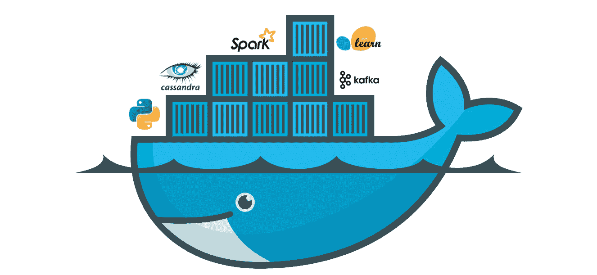
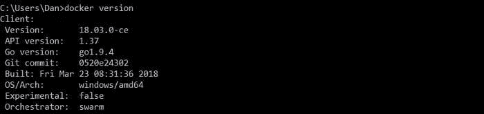
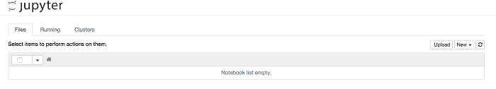
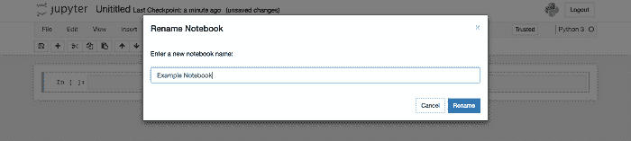

# 数据科学家 Docker 入门指南

> 原文：[`www.kdnuggets.com/2018/08/data-scientist-guide-getting-started-docker.html`](https://www.kdnuggets.com/2018/08/data-scientist-guide-getting-started-docker.html)

 评论



### **介绍**

Docker 是一个日益流行的工具，旨在简化在容器中创建、部署和运行应用程序的过程。容器非常有用，因为它们允许开发人员将应用程序及其所需的所有组件（如库和其他依赖项）打包在一起，并作为一个整体进行分发。虽然软件工程师经常使用 Docker，但数据科学家如何开始使用这个强大的工具呢？在我们进入入门指南之前，让我们先讨论一些你可能想要在数据科学中使用 Docker 的原因。

### **为什么选择 Docker？**

#### 可重复性

* * *

## 我们的前三个课程推荐

 1\. [Google Cybersecurity Certificate](https://www.kdnuggets.com/google-cybersecurity) - 快速进入网络安全职业道路

 2\. [Google Data Analytics Professional Certificate](https://www.kdnuggets.com/google-data-analytics) - 提升你的数据分析技能

 3\. [Google IT Support Professional Certificate](https://www.kdnuggets.com/google-itsupport) - 支持你的组织的 IT 需求

* * *

Docker 最大的吸引力之一是其可重复性。除了共享 Docker 镜像本身，你理论上还可以共享一个 Python 脚本，将结果嵌入 Docker 中。然后，某位同事可以运行这个脚本，亲自查看 Docker 镜像中的内容。

#### **时间**

你可以节省大量时间，因为你不必安装单独的包，因为它们都包含在 Docker 镜像中。此外，Docker 容器启动时间约为 50 毫秒，比运行传统虚拟机要快得多。

#### 灵活性

这是一个非常灵活的工具，因为你可以快速运行 Docker 库中创建的任何软件。

#### ­构建环境

Docker 对于在将构建环境托管到实际服务器之前进行测试非常有用。你可以将 Docker 容器配置成与服务器的环境相同，从而简化测试过程。

#### 分发

数据科学家可能会花费数小时来准备机器以适应特定的框架。例如，设置一个 Caffe 环境有 30 多种独特的方法。Docker 提供了一个一致的平台来共享这些工具，从而减少了寻找特定操作系统安装程序和库的时间浪费。

#### 可访问性

Docker 生态系统——docker compose 和 docker machine——使其对任何人都容易访问。这意味着公司中不熟悉内部代码的成员仍然可以运行它。非常适合销售团队成员或高层管理人员展示你正在构建的新数据科学应用！

### **入门指南**

希望我们已经向你展示了使用 Docker 的好处，现在是时候开始了。首先，你需要前往 [Docker](https://docs.docker.com/install/) 网站安装软件的一个版本。

为了确保它已正确安装，打开命令行并输入 **docker version**。这应该显示如下内容：



现在我们已经安装了 Docker，让我们研究一个相对简单、常见的示例：

```py

docker run -p 8000:8000 jupyter/notebook

```

对于刚接触 Docker 的人来说，这看起来可能有点吓人，所以让我们来拆解一下：

**docker run**——这个命令找到镜像（在这个示例中是 jupyter notebook），加载一个容器，然后在该容器中运行一个命令。

**-p 8000:8000**——‘p’关键字代表端口，因此这部分命令是打开主机和容器之间的端口，格式为 **-p <host_port>:<container_port>**。

**jupyter/notebook**——要加载的镜像。除了 Jupyter notebook，你还可以浏览官方的[Docker 库](https://hub.docker.com/)，查找数千种最受欢迎的软件工具。

一旦你运行了这个命令并导航到 [`localhost:8000/`](http://localhost:8000/)，你应该会看到以下内容：



非常简单，对吧？考虑到你通常需要下载 Python、运行时库和 Jupyter 包，通过 Docker 运行这些是极其高效的。

好了，现在已经启动运行了，让我们深入了解如何在主机和容器之间共享 Jupyter 笔记本。首先，我们需要在主机上创建一个目录来存储笔记本，我们称之为 /jupyter-notebooks。运行 Docker 命令时共享目录与端口的工作方式类似，我们需要添加以下内容：

```py

-v ~/jupyter-notebooks:/home/joyvan jupyter/notebook

```

所以，我们在这里做的是将 **<host_directory>:<container_directory>** 进行映射（例如，将主机上的 **~/jupyter-notebooks** 映射到容器上的 **/home/joyvan**）。这个容器目录来自 Jupyter Docker 文档，是此类镜像指定的工作目录。

将其与之前运行的命令结合起来，完整的命令应该是这样的：

```py

docker run -p 8000 :8000 -v ~/jupyter-notebooks:/home/joyvan jupyter/notebook

```

现在简单地启动本地主机服务器，创建一个新的笔记本，并将其从“未命名”重命名为“示例笔记本”。最后，检查你本地机器上的 **~/jupyter-notebooks** 目录，你应该会看到：Example Notebook.ipynb。瞧！



### **Dockerfile**

Dockerfile 是一个文本文件，其中包含用于自动创建 Docker 镜像的命令。这是一种有效的方式来保存 Docker 命令并通过 **Docker build /path/to/dockerfile** 命令按顺序执行它们。

我们的 Jupyter notebook 示例的 Dockerfile 如下所示：

```py

FROM ubuntu:latest 
RUN apt-get update && apt-get install -y python3 \ python3-pip 
RUN pip3 install jupyter
WORKDIR /home/jupyter
COPY  /src/jupyter ./
EXPOSE 8000
ENTRYPOINT ["jupyter", "notebook", "--ip=*"]

```

现在，让我们讨论每一部分：

**FROM ubuntu:latest**

这告诉 Docker 新镜像的基础应该是什么，在这个例子中是 ubuntu。**:latest** 只是抓取最新版本。如果你想测试旧版本，可以输入版本号。

**RUN apt-get update && apt-get install -y python3 \ python3-pip**

这一行确保系统是最新的，然后安装 python3 和 pip3。

**RUN pip3 install jupyter**

这会安装 Jupyter。

**WORKDIR /home/jupyter**

**COPY  /src/jupyter ./**

设置 Docker 镜像容器的工作目录，然后从本地主机复制所需的文件。

**EXPOSE 8000**

类似于之前的 -p，这会暴露 8000 端口。

**ENTRYPOINT ["jupyter", "notebook", "--ip=*"]**

启动 Jupyter notebook。

Dockerfile 非常有用，因为它们允许其他团队成员轻松运行 Docker 容器。

### **结论**

正如你所看到的，我们成功地让 Docker 在数据科学中快速运行了一个工作用例。我们只是触及了你可以做的事情的表面，但得益于 Docker 的出色库，可能性是无穷的！掌握 Docker 不仅可以帮助你进行本地开发，还能在与数据科学团队合作时节省大量时间、金钱和精力。请继续关注 KDnuggets，我们很快将发布一篇 Docker 备忘单文章。

**相关：**

+   [Docker 如何帮助你成为更有效的数据科学家](https://www.kdnuggets.com/2018/01/docker-help-become-more-effective-data-scientist.html)

+   [Docker 首先数据科学的 Torus](https://www.kdnuggets.com/2018/05/torus-docker-first-data-science.html)

+   [初学者数据科学家的七个实用想法](https://www.kdnuggets.com/2018/08/seven-practical-ideas-beginner-data-scientists.html)

### 更多相关话题

+   [成为优秀数据科学家所需的 5 种关键技能](https://www.kdnuggets.com/2021/12/5-key-skills-needed-become-great-data-scientist.html)

+   [每个初学者数据科学家都应该掌握的 6 种预测模型](https://www.kdnuggets.com/2021/12/6-predictive-models-every-beginner-data-scientist-master.html)

+   [2021 年最佳 ETL 工具](https://www.kdnuggets.com/2021/12/mozart-best-etl-tools-2021.html)

+   [成功数据科学家的 5 个特征](https://www.kdnuggets.com/2021/12/5-characteristics-successful-data-scientist.html)

+   [每个数据科学家都应该知道的三个 R 库（即使你使用 Python）](https://www.kdnuggets.com/2021/12/three-r-libraries-every-data-scientist-know-even-python.html)

+   [停止学习数据科学以寻找目标，并通过寻找目标来……](https://www.kdnuggets.com/2021/12/stop-learning-data-science-find-purpose.html)
