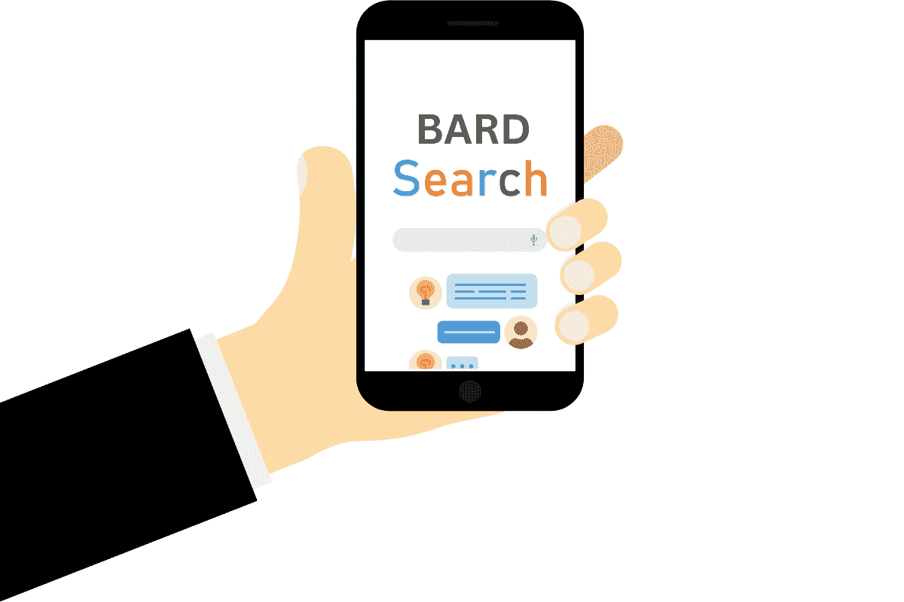

# 为什么数据科学家期望谷歌 Bard 提供有缺陷的建议

> 原文：[`www.kdnuggets.com/2023/02/data-scientists-expect-flawed-advice-google-bard.html`](https://www.kdnuggets.com/2023/02/data-scientists-expect-flawed-advice-google-bard.html)

图片由编辑提供

在最近的宣传活动中，谷歌向世界展示了 [Bard 的首次亮相](https://twitter.com/Google/status/1622710355775393793)，这是科技巨头试图取代极受欢迎的 AI 聊天机器人 ChatGPT 的尝试。尽管这次活动可能旨在为谷歌的 AI 聊天尝试制造轰动，但它很快成为了展示这些神秘 AI 聊天服务可能出错的公众示范。

根据路透社的首次报道，[Bard 给出了不准确的回应](https://www.reuters.com/technology/google-ai-chatbot-bard-offers-inaccurate-information-company-ad-2023-02-08/)，导致 Alphabet (GOOGL) 的股价在演示当天下跌了多达 9%。对于许多数据社区成员来说，这并不令人惊讶；原因如下。

## Bard 的广告有什么问题？

问题：当被问及如何向 9 岁的孩子介绍令人惊叹的詹姆斯·韦布太空望远镜 (JWST) 时，Bard 错误地将其描述为“……用于拍摄地球太阳系外第一张行星的照片”。这一回答很快被识别为错误，因为地球太阳系外第一张行星的照片是在 2004 年由欧洲南方天文台的大型望远镜 (VLT) 拍摄的。

## 什么是谷歌 Bard？

谷歌首席执行官 Sundar Pichai 称 [Bard](https://blog.google/technology/ai/bard-google-ai-search-updates/) 为“对话式 AI 服务”。如果这听起来很熟悉，你可能在过去几个月里遇到过谈论 ChatGPT 的众多在线影响者之一。

对这项 AI 突破的看法差异很大。赞成者讨论革命性计划或分享利用聊天机器人快速发展业务的兴奋点。ChatGPT 最受欢迎的用例之一是自动化重复性任务。另一方面，批评者对其能力提出了有缺陷的观点——认为聊天机器人的功能取代了人类的研究和批判性思维。谷歌 Bard 将引发类似的讨论。

## 什么是 LaMDA？

谷歌的 Bard 基于 [LaMDA](https://blog.google/technology/ai/lamda/)，这是公司在 2021 年推出的语言模型，LaMDA 本身建立在公司流行的开源神经网络架构 [Transformer](https://towardsdatascience.com/transformer-neural-network-step-by-step-breakdown-of-the-beast-b3e096dc857f) 上。

有趣的是，LaMDA 是通过对话进行训练的，使其比以前的语言模型更自然地回应人类对话。（如果 LaMDA 这个名字听起来很熟悉，也许你会记得有一个谷歌工程师认为[LaMDA 已经具有意识](https://www.scientificamerican.com/article/google-engineer-claims-ai-chatbot-is-sentient-why-that-matters/)。）

2021 年 5 月宣布的谷歌 LaMDA 首次亮相，是讨论其模型优势的机会，宣布特别关注其回应的真实性。两年后，在 Bard 宣布期间，记者很快发现了一个事实错误。这对谷歌的实施意味着什么？我们将拭目以待。

## 谷歌 Bard 有何不同于 LaMDA？

鉴于两者的相似之处，一些人问，这款新产品有什么不同？谷歌谦虚地声称，它的新服务将“世界知识的广度”添加到 LaMDA 已经令人印象深刻的对话技能中。它还承诺提升模型的能力，提供比普通聊天机器人更多的指导和研究。简而言之，Bard 依赖于 LaMDA，而 LaMDA 不依赖于 Bard。

同时请注意，谷歌计划通过 Bard API 链接向开发者开放服务，使其比普通聊天机器人更具吸引力。虽然用户已经可以与 LaMDA 进行自由流畅的对话，但谷歌 Bard 承诺通过包括公司提供的全方位谷歌搜索服务的相同信息来提升对话。

与直觉相反，Bard 的事实错误不应削弱这个新服务的承诺价值。谷歌的搜索结果从未承诺绝对准确。搜索者应始终考虑其来源。即使在发布了令人印象深刻的聊天机器人之后，这一事实仍然成立。

## 使用谷歌 Bard 的方法

数据科学家并不是唯一对使用谷歌 Bard 感到兴奋的人。皮查伊设想这项服务将帮助任何使用谷歌的人。他的承诺？Bard 简化复杂话题。考虑以下使用案例：

## 找到复杂问题的简单答案

想象一下你想去度假。谷歌现有的搜索可以轻松回答你知道要去哪里时的问题，并帮助你查找特定日期的价格。但皮查伊将这个新聊天机器人比作和朋友对话。

你应该能够开始一个关于工作的项目的对话，将复杂的研究文章分解成最重要的要点，然后在接下来的几周内请求应用这些要点的推荐。

Bard 还可以在销售团队培训中提供帮助，在你招待挑剔食客时提供晚餐推荐，以及讨论最新的漫威电影的精彩部分。谷歌已经在其产品中实施了 AI，但随着新聊天机器人的发展，这一过程将会扩展。所有这些，你无需离开你熟悉的搜索引擎。

## 自动化常规任务

谷歌已经与市场整合，使你可以直接从其界面购买商品和进行预订。谷歌 Bard 可能允许你通过对话实现这一点。Alexa 可能能启动你的 Spotify 播放列表，但想象一下与 AI 协作，为你的下一次公路旅行策划配乐，同时你开车上班。

## 参与社区对话

社交网络往往助长在线争论，奖励有争议的观点，并为网络喷子提供额外曝光。这导致许多人放弃了 2010 年代流行的平台。谷歌 Bard 可以为小众社区策划对话，连接好奇的头脑，同时过滤掉仇恨言论和虚假信息。

## 使用谷歌 Bard 的潜在陷阱

不足为奇的是，这个新聊天机器人引起了很多关注，至少部分原因是它广泛的应用潜力。对棋盘游戏爱好者和项目经理来说，它的吸引力是一样的。皮查伊在新闻稿中遗漏了一些重要点，这些点在最近的非凡太空摄影误归属事件中变得更加明显。这里还有一些需要考虑的点。

## 聊天机器人不必讲真话

像 ChatGPT 这样的流行对话代理内置了伦理指导。例如，它不应讲冷笑话或故意误导你。但这并不总是适用于 AI 聊天系统。

查看这项关于[人工智能在棋盘游戏外交中的应用](https://www.nature.com/articles/s41467-022-34473-5)的最新研究，重点关注谈判和形成联盟的能力。研究还强调了对任何违背承诺的方实施处罚。看到团队专注于构建促进可信沟通的 AI 策略令人鼓舞，但请考虑这对不慎的数据科学家意味着什么。

随着聊天机器人技术的发展，我们应当更多考虑提供服务者的动机。在进行谈判（金融服务、交易、薪资谈判）时，聊天机器人可能会故意误导用户。

## 机器学习并不能消除偏见

数据科学社区已经很清楚机器学习中的偏见。像他们的人类同行一样，对话聊天机器人经常表现出确认偏见和偏见偏见。谷歌 Bard 无疑会考虑到这些问题中的一些，但我们应当对新发布的第三方应用保持警惕。

虽然谷歌聘请了一些世界上最优秀的数据科学家，但这家科技巨头也并非没有缺陷。记得那位提出一些[令人不便的问题](https://www.technologyreview.com/2020/12/04/1013294/google-ai-ethics-research-paper-forced-out-timnit-gebru/)的伦理学研究者吗？她表达了对环境成本、难以理解的模型、错误导向的研究努力以及传播虚假信息潜在风险的担忧。

## 所有数据集都有缺陷

从本质上讲，聊天机器人依赖于自然语言处理（NLP）模型。但没有任何数据集能够代表完整的真相。深度学习可能有助于为对话伙伴提供更自然的回答，并在最佳情况下缓解一些数据集的局限性。但尽管你最喜欢的网红可能会说什么，没有任何聊天机器人是神。

[引用乔治·博克斯](https://en.wikipedia.org/wiki/All_models_are_wrong)的话：“. . . 没有必要问‘模型是否真实？’ 如果‘真实’是指‘全部真实’，答案必须是‘不’。唯一感兴趣的问题是‘模型是否具有启发性和实用性？’”

## 如何访问谷歌 Bard

谷歌已经向“受信任的测试者”提供了 Bard，但公司承诺在几周内进行更广泛的发布。这意味着开发者应该在密歇根州上半岛的雪融化之前获得谷歌的轻量级版本。

这对谷歌搜索的更新意味着什么？我们还得拭目以待。谷歌已经在使用人工智能来改进[视觉搜索结果](https://blog.google/products/search/visual-search-ai/)。我预计今年和明年会有很多变化。我期待着探索 Bard 作为商业工具的潜力。

## 如何开始使用 Bard 进行数据科学？

如果你想入门数据科学，我们列出了我们的一些[推荐课程](https://hackr.io/blog/data-science-courses)。这些课程在深度和范围上各不相同，所以一定要找到适合你技能水平的选项。那些考虑转行的人可以从头开始学习这个行业，虽然许多人选择学习像 Python 这样的编程语言作为进入该领域的起点。

## 从零开始学习数据科学

所有初学者都应熟悉数学，特别是[数据科学统计学](https://click.linksynergy.com/deeplink?id=jU79Zysihs4&mid=39197&murl=https%3A%2F%2Fwww.udemy.com%2Fcourse%2Fstatistics-for-data-science-data-analytics%2F%3Fsrc%3Dsac%26kw%3Dmathematics%2Bfor%2Bdata%2Bsc)。这些技能对编程、数据评估、数据讲述及大多数其他工作部分都很重要。确定数据趋势的相关性需要以理解统计显著性作为起点。

## 作为数据科学家学习编程

数据科学涵盖了企业的各种功能，因此数据科学家需要学习多种语言。常见技能包括 Python、R、Hadoop、SQL 和 Apache Spark。为了深入了解这个主题，我们还讨论了[如何学习数据科学](https://hackr.io/blog/how-to-learn-data-science)。

## 作为专业人士实施人工智能

对于那些希望在自己领域应用机器学习、自然语言处理和其他现代技术的专业人士，请查看[斯坦福大学人工智能专业项目](https://online.stanford.edu/programs/artificial-intelligence-professional-program)。

## 总结思考

如果你对 Google Bard 感到兴奋，你并不孤单。如果你对它感到紧张、害怕或困惑，你也并不孤单。数据爱好者们了解聊天机器人如何提供建议，我们可以预期未来任何基于大型语言模型的技术都会出现类似的错误。

**[Jim Markus](https://www.linkedin.com/in/jimmarkus/)** 管理 Hackr.io 及 VentureKite 旗下的网站组合。他主持了热门财经播客《节俭生活》，并共同创办了《墨与血决斗社》，这是一个在美国各大会议上出现的戏剧写作活动。他还是一位获奖的游戏设计师。

### 更多相关话题

+   [什么是 Google AI Bard？](https://www.kdnuggets.com/2023/03/google-ai-bard.html)

+   [ChatGPT 与 Google Bard：技术差异比较](https://www.kdnuggets.com/2023/03/chatgpt-google-bard-comparison-technical-differences.html)

+   [如何获得机器学习职位：来自 Meta、Google Brain 和 SAP 工程师的建议](https://www.kdnuggets.com/2022/08/corise-land-ml-job-advice-engineers-meta-google-brain-sap.html)

+   [数据科学家的职业路径展望](https://www.kdnuggets.com/2022/01/expect-career-path-data-scientist.html)

+   [Bard 数据科学备忘单](https://www.kdnuggets.com/2023/05/bard-data-science-cheat-sheet.html)

+   [2023 年 AI 质量趋势展望](https://www.kdnuggets.com/2022/11/expect-ai-quality-trends-2023.html)
