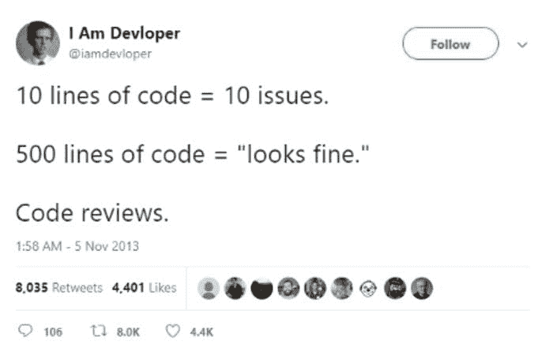

# 数据科学家，你需要知道如何编码

> 原文：[`www.kdnuggets.com/2021/06/data-scientists-need-know-code.html`](https://www.kdnuggets.com/2021/06/data-scientists-need-know-code.html)

评论

**由 [Tyler Folkman](https://learn.learningwithdata.com/)，Branded Entertainment Network 的 AI 负责人**


图片由 [Roman Synkevych](https://unsplash.com/@synkevych?utm_source=medium&utm_medium=referral) 提供，来源于 [Unsplash](https://unsplash.com/?utm_source=medium&utm_medium=referral)

* * *

## 我们的前三大课程推荐

 1\. [谷歌网络安全证书](https://www.kdnuggets.com/google-cybersecurity) - 快速进入网络安全职业生涯。

 2\. [谷歌数据分析专业证书](https://www.kdnuggets.com/google-data-analytics) - 提升你的数据分析技能

 3\. [谷歌 IT 支持专业证书](https://www.kdnuggets.com/google-itsupport) - 支持你的组织的 IT 工作

* * *

我知道你在想什么——“我当然知道如何编码，你疯了吗？”

你每天在 Jupyter 笔记本中编写大量代码，数百行。显然，你会编码。并不是说你是在手动或在 Excel 中训练机器学习模型（尽管这是可能的）。

那我可能是什么意思呢？

我不愿意打击你，但大多数数据科学家做的编码我不认为是真正的编程。你是使用编程语言作为探索数据和构建模型的工具。但你创建的程序并不是你真正考虑的，只要它能完成工作就好。

你的代码通常很混乱，可能甚至不能按顺序运行（这要归功于笔记本）。你可能从未编写过单元测试，也几乎不了解如何编写良好、可重用的函数。

但是，随着数据科学越来越多地嵌入到实际产品中，这种类型的代码将不够用。你不能信任糟糕的代码，把你不信任的代码放到产品中会导致大量的技术债务和糟糕的用户体验。

“好吧，好吧，但我是一名数据科学家，不是软件工程师，”你说。我构建模型，清理代码是其他人的问题。虽然这在一些公司可能有效，但我现在深信，更好的模式是数据科学家学习如何编写更好的代码。你可能永远不会成为顶级的软件工程师，但数据科学家可以通过一些努力编写值得信赖并投入生产的代码。

### 从你的函数开始

在学习如何提升你的代码时，从你如何编写函数开始。大多数代码只是函数（或可能是类）的系列，如果你能学会编写相当好的函数，这将大大改善你的代码质量。

你的函数至少应该：

1.  只做一件事

1.  拥有文档。

1.  使用良好的变量名。

虽然关于如何编写干净函数的书籍有很多，但这三个方面是一个很好的起点。

你不应该有一个函数看起来像是在尝试做超过一件事。一些迹象表明你的函数可能做得太多：

+   它的长度超过了一个屏幕，或者大约 30 行代码（根据我的经验）。

+   由于函数做的事情太多，清晰命名函数非常困难。

+   它包含了大量的 if/else 代码块，这些代码块实际上应该被拆分成独立的函数。

只做一件事的函数很重要，因为它使你的代码更容易理解、管理和测试（稍后会详细讲到测试）。

任何投入生产的函数都应该有文档字符串，该字符串应描述函数的功能，提供输入参数的信息，并可能提供一些简单的使用示例。未来你会感谢自己拥有良好的文档化函数，而其他人也会更容易理解你的代码。

最后，请使用易于理解和有用的变量名。太多的数据科学家习惯使用“a”、“a1”和“a2”这样的变量名。短小而无帮助的变量名在试验时更快输入，但在将代码投入生产时，确保你的变量名能帮助他人理解你的代码。

### 移除 Print 语句。

数据科学家常常使用 print 语句来显示发生的情况。然而，在生产环境中，这些 print 语句应当被移除（如果不再需要）或转换为日志语句。

日志记录应当是你与代码之间传达信息和错误的方式。一个值得查看的 Python 库是 Loguru，它使日志记录变得更简单。它自动处理了大多数麻烦的日志记录部分，感觉更像是使用 print 语句。

### 使用风格指南。

编程中的风格指南旨在使多人可以更轻松地在同一代码上工作，但使得这些代码看起来仿佛是由一个人编写的。

为什么这很重要？

当你拥有一致的风格时，代码的浏览和理解会变得更容易。使用风格指南时，发现 bug 会变得更轻松。遵循标准的代码编写方式会使你和他人更容易浏览代码。这意味着你不必花费太多时间去理解代码的格式，而可以专注于代码的功能及其是否正确有效。

PEP 8 可能是最广泛使用的 Python 风格指南。不过，还有很多其他风格指南。另一个受欢迎的风格指南来源是 Google，因为他们公开了内部风格指南。

重要的是你选择一种并尽量坚持。一个让这变得更容易的方法是使你的 IDE 检查样式错误，并设置样式检查，如果不遵循样式指南，阻止代码被推送。你还可以进一步提交，使用自动格式化工具，它会自动格式化你的代码以符合标准。Python 中一个流行的工具是 Black。

### 编写测试

我发现大多数数据科学家害怕测试，因为他们不太知道如何开始测试。

事实上，许多数据科学家已经在运行我所称之为临时测试。我发现数据科学家在笔记本中快速运行一些“健康检查”以验证新函数是很常见的。你通过一些简单的测试用例，确保函数按预期运行。

软件工程师称这个过程为单元测试。

不同的是，数据科学家通常会删除这些临时测试并继续前进。相反，你需要保存这些测试，并确保每次在代码推送之前都运行这些测试，以确保没有破坏。

要开始使用 Python，我建议使用 pytest。使用 pytest，你可以轻松创建测试，并一次性运行它们以确保它们通过。一个简单的开始方式是有一个名为“tests”的目录，在该目录内有以“test.”开头的 Python 文件。例如，你可以有“test_addition.py”。

```py
*# content of test_addition.py*
**def** add(x, y):
    **return** x + y
**def** test_add():
    **assert** add(3, 2) == 5
```

通常，你会将实际的函数放在另一个 Python 文件中，并将其导入到你的测试模块中。你通常不需要测试 Python 加法，但这只是一个非常简单的例子。

在这些测试模块中，你可以保存你函数的所有“健康检查”。通常的好做法是不仅测试常见情况，还要测试边界情况和潜在错误情况。

> 注意：测试有许多不同类型。我认为单元测试是数据科学家开始测试的最佳选择。

### 做代码审查

在我们列出的编写更好代码的顶级事项中，最后但同样重要的是代码审查。

代码审查是指在你将代码提交到主分支之前，另一位在你领域内擅长编写代码的人对你的代码进行审查。这一步骤确保最佳实践得到遵循，并希望能够发现任何不良代码或错误。

审查你代码的人最好至少和你一样擅长编写代码，但即使让一个更初级的人审查你的代码也仍然可以非常有益。

人们有时会懒惰，并且很容易让这种懒惰影响到我们的代码。知道有人会审查你的代码是一个很好的激励，使你花时间编写优质代码。这也是我发现的最有效的改进方法。让更有经验的同事审查你的代码并提供改进建议是无价的。

为了让审查你代码的人更容易理解，尽量保持新代码量的小规模。小而频繁的代码审查效果更好。不频繁的大规模代码审查效果很差。没有人愿意审查上千行代码。这些审查往往提供较差的反馈，因为审查者无法花足够的时间真正理解这么多代码。



### 提升你的编码技能

我希望这篇文章能激励你花时间学习如何编写更好的代码。这并不一定很难，但确实需要时间和努力来提升。

如果你遵循这 5 个建议，我相信你会注意到你的代码质量有显著提升。

你的未来自己和同事会感谢你。

查看我的 [免费课程](https://bit.ly/3ltZA4s)，了解如何部署机器学习模型。

**简介：[泰勒·福克曼](https://learn.learningwithdata.com/)** 是 Branded Entertainment Network 的 AI 主管。获取泰勒的免费 [创建惊人数据科学项目的 5 步流程](http://bit.ly/39FyHGl)。

[原文](https://towardsdatascience.com/data-scientists-you-need-to-know-how-to-code-9142b2dc74e8)。经许可转载。

**相关：**

+   顶级编程语言及其用途

+   未来 5 年会出现数据科学工作短缺吗？

+   这些软技能可能决定你的数据科学职业生涯的成败

### 更多相关主题

+   [KDnuggets 新闻，4 月 13 日：数据科学家应该关注的 Python 库…](https://www.kdnuggets.com/2022/n15.html)

+   [你可能不知道的 7 件低代码工具能做的事](https://www.kdnuggets.com/2022/09/7-things-didnt-know-could-low-code-tool.html)

+   [我们不需要数据科学家，我们需要数据工程师](https://www.kdnuggets.com/2021/02/dont-need-data-scientists-need-data-engineers.html)

+   [KDnuggets 新闻，4 月 27 日：简要介绍带代码的论文；…](https://www.kdnuggets.com/2022/n17.html)

+   [数据科学基础：你需要知道的 10 项必备技能](https://www.kdnuggets.com/2020/10/data-science-minimum-10-essential-skills.html)

+   [数据中心 AI：你需要了解的最新研究](https://www.kdnuggets.com/2022/02/datacentric-ai-latest-research-need-know.html)
