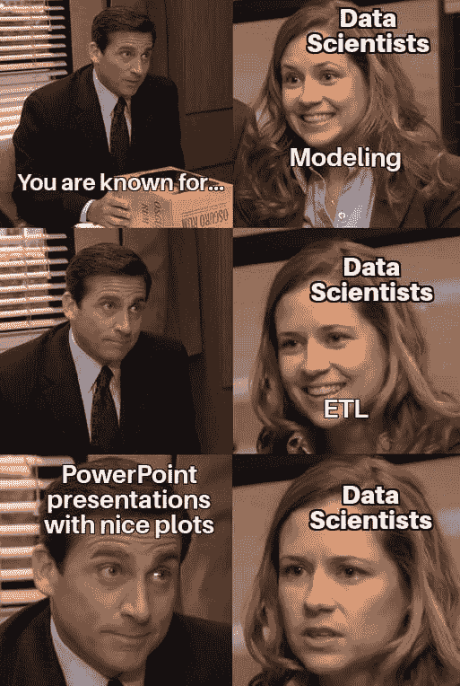
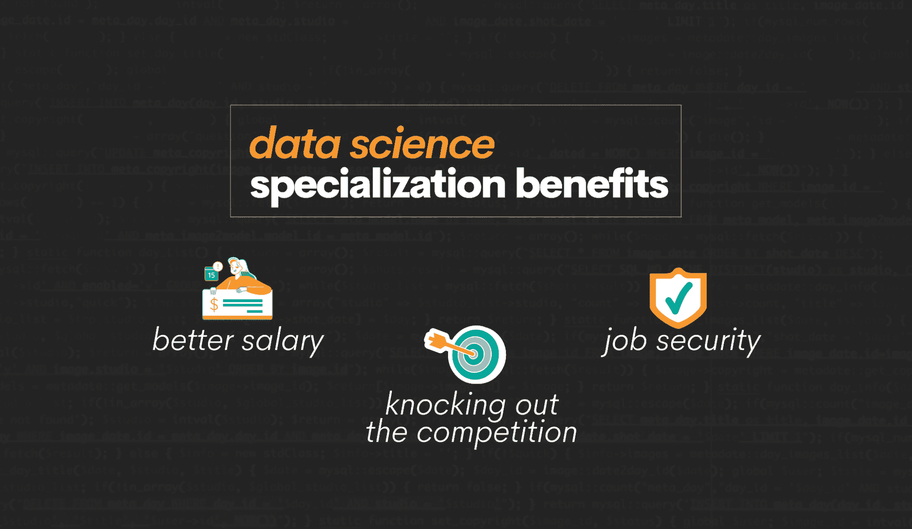
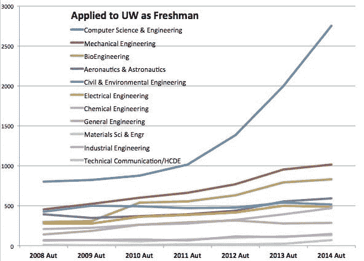
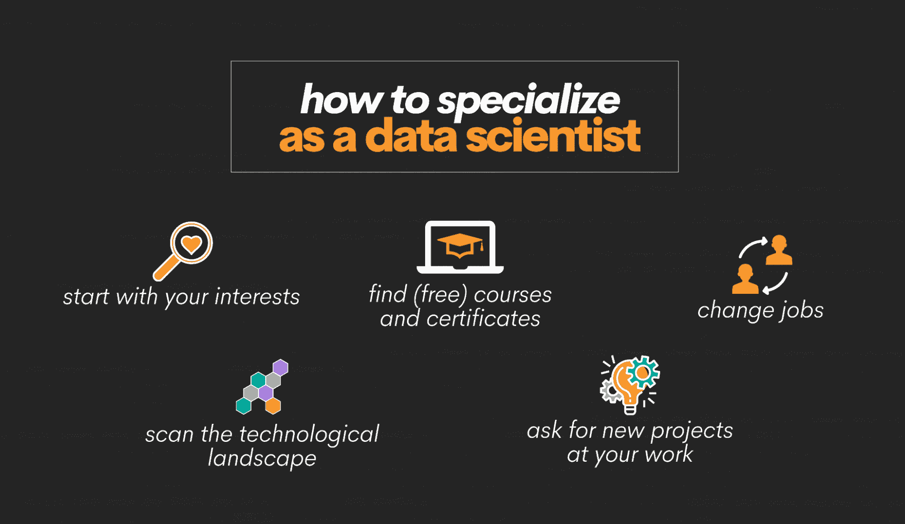

# 数据科学家需要专业化以在科技寒冬中生存

> 原文：[`www.kdnuggets.com/2023/08/data-scientists-need-specialize-survive-tech-winter.html`](https://www.kdnuggets.com/2023/08/data-scientists-need-specialize-survive-tech-winter.html)

照片由[Ingo Joseph](https://www.pexels.com/photo/person-wearing-black-hoodie-and-blue-denim-jeans-standing-over-frozen-arrow-signage-over-snow-ground-751812/)提供

硅谷的温度最近很凉。毫无疑问，我们正处于科技寒冬。风险投资资金已经[枯竭](https://news.crunchbase.com/venture/vc-funding-downturn-charts-q1-2023/#:~:text=Global%20VC%20funding%20fell%2053,record%20levels%20of%20dry%20powder.)，[数百家公司](https://layoffs.fyi/)正在通过裁员来行使它们的权力，人工智能正在逼近每个人，导致额外的失业和不确定性威胁。

* * *

## 我们的前三大课程推荐

 1\. [Google 网络安全证书](https://www.kdnuggets.com/google-cybersecurity) - 快速进入网络安全职业的快车道。

 2\. [Google 数据分析专业证书](https://www.kdnuggets.com/google-data-analytics) - 提升您的数据分析技能

 3\. [Google IT 支持专业证书](https://www.kdnuggets.com/google-itsupport) - 支持您的组织的信息技术

* * *

数据科学家们感到困惑：我的工作安全吗？这也不奇怪。曾经被誉为最性感职业的工作现在看起来已经不那么吸引人了。

从整体来看，数据科学的工作前景仍然乐观——劳动统计局仍然[预测](https://www.bls.gov/ooh/math/data-scientists.htm)未来十年将增长 36%，远高于美国平均行业增长率 5%。但正如成千上万的被裁数据科学家所告知的，统计数据并不能作为失业的盾牌。答案是什么？一些专家建议，专业化是脱颖而出并使自己不容易被解雇的最佳方式之一。“随着数据的影响力增长和技术的发展，数据团队中将需要特定的角色来最大化效率，”*财富*杂志的作者梅根·马拉斯[写道](https://fortune.com/education/articles/data-science-predictions-for-2023-according-to-the-ceo-of-simon-data/)。

我同意。任何数据科学家都会告诉你，这份工作会根据你老板当天需要什么而有所不同——电子表格、演示文稿、开发 ETL 管道或设计实验。

图片来自[Twitter](https://twitter.com/NicoloGiso/status/1571985211516133378/photo/1)

所有数据科学家共有的特点是随着数据量和重要性的增长，职责也在扩展。

数据科学家可以通过专业化来更好地区分自己，而不是继续尝试做所有事情。通过选择一个技能或领域，更容易明确他们的价值主张，在竞争激烈的就业市场中保持相关性和价值。

# 为什么专业化能帮助数据科学家保住工作

在我开始使用[StrataScratch](https://www.stratascratch.com/?utm_source=blog&utm_medium=click&utm_campaign=kdn+survive+the+tech+winter)之前，我是一个普通的通才数据科学家。我不断学习新技能和技术，以跟上快速发展的领域。但当然，有一天我意识到我需要与众不同。我决定专注于基础设施以及如何通过基础设施支持数据科学工作。我的基础设施工作改变了团队中数据科学家的工作方式，使他们能够比以前更快地交付模型和结果。

在专注于数据科学基础设施几年后，我在生物技术领域找到了数据战略的工作。我很快意识到我的专业化在就业市场上给了我显著的优势，因为拥有我这样特定技能和经验的人很少。这也意味着我能够获得更高的薪水和职位，因为我在一个焦点领域的深厚知识使我能够晋升到一个更高级别的位置，仅仅因为我拥有更多的知识和经验来影响团队中的其他数据科学家。

不过，这只是我的故事。专业化可以以几种不同的方式提供帮助，具体取决于你当前的情况和总体目标。

图片来源：作者

## 争取工作安全

在我最喜欢的《老爸老妈的浪漫史》一集中，马歇尔因朋友巴尼的帮助而在一家律师事务所找到了工作。巴尼告诉他必须成为“某种”人物。也许是零食人员、按摩人员或游戏人员。那是避免被变化无常的老板解雇的唯一办法。

有时候情景喜剧说得对。通才可以被其他通才替代。作为专家，你的价值要高得多。很容易说：“不，我们不能解雇马歇尔，因为他是我们的营销分析人员。他是帮助我们建立所有营销和销售管道的人。他对团队至关重要。”

## 击败竞争对手

对数据科学家的需求很大，但对数据科学学位的[需求也在增长](https://www.computerweekly.com/news/252513659/Computer-Science-degree-applications-up-by-13#:~:text=The%20past%20decade%20has%20seen,2011%20to%2030%2C090%20in%202020.)。再加上公司现在开始考虑非传统背景的人，你就有了竞争的配方。

图片来自[Geekwire](https://www.geekwire.com/2014/analysis-examining-computer-science-education-explosion/)

通过专注，你可以减少工作市场上的竞争。例如，如果你专注于自然语言处理（NLP），你确实会限制可以竞争的工作数量。但你将会更受欢迎，因为 NLP 专家远少于数据科学家。

## 追逐金钱

老实说，追求数据科学职业不能仅仅是为了金钱。专注也是如此。但如果你发现自己对工作中的某个特定部分感兴趣，值得知道的是，专家的薪资高于普通人，不论普通人掌握多少技能。

看看 Indeed 的数据，作为一个参考：数据科学家的[平均基本工资](https://www.indeed.com/career/data-scientist/salaries)是每年 127k 美元。相比之下，机器学习工程师的薪资为$[155k](https://www.indeed.com/career/machine-learning-engineer/salaries?from=career)，或者[后端开发者](https://blog.boot.dev/backend/how-much-do-backend-devs-make/#:~:text=Backend%20developers%20enjoy%20an%20average,not%20to%20mention%20comprehensive%20benefits.)的薪资为$[158k](https://www.indeed.com/career/back-end-developer/salaries?salaryType=YEARLY&from=careers_serp)。

# 如何成为专注的数据科学家

好的，你已经认识到专注的价值。那么，你该如何专注呢？让我们来分解步骤。

图片由作者提供

## 从你的兴趣开始

如果你要专注，你需要确保你对你将要专注的领域感兴趣。这不能只是为了钱；还必须是你喜欢做的事情。从你的兴趣开始。

你对什么充满热情？你发现自己在空闲时间里从事什么样的项目？通过确定你的兴趣，你可以开始看到自己可能专注的领域。了解你热衷的工作类型的一种方法是尝试理解你对哪些工作感到兴奋？例如，在一个项目中，你通常更兴奋于做基础设施工作？还是建模工作？或者数据清理工作？弄清楚你喜欢做什么，然后深入探索。

## 观察技术景观

技术景观不断变化，保持对最新趋势的了解非常重要。例如，看看 Meta。在花费了数年和巨额资金投入到元宇宙后，他们现在正在[转向人工智能](https://gizmodo.com/instagram-facebook-mark-zuckerberg-whatsapp-ai-1850232199)，以及其他所有主要科技公司。

一旦你列出了感兴趣的主题清单，寻找那些活动频繁和需求旺盛的领域。这将帮助你确定可以专攻的领域以及可能有机会让你脱颖而出的地方。

一个很好的地方是 Indeed。 [这篇文章](https://medium.com/analytics-vidhya/web-scrape-indeed-for-popular-programming-languages-of-data-scientist-jobs-93b95083becf)虽然有点旧，但我喜欢这个想法。作者从 Indeed 抓取了提到特定语言和城市的招聘信息。他们发现 R、SQL 和 Python 位居前列。你还可以查看[StackOverflow 的开发者调查](https://survey.stackoverflow.co/2022/)。他们对热门技术有相当准确的把握，因此值得一看。

## 寻找免费的课程和证书

一旦你确定了感兴趣的领域，寻找免费的课程和证书来帮助你提升技能。不要从昂贵的课程开始；先从免费的课程入手，看看这些知识是否能扎根。

目前有很多免费的资源，包括[在线课程](https://blog.boot.dev/misc/code-academy-alternatives/)、[书籍](https://blog.boot.dev/computer-science/computer-science-books/)和[练习平台](https://platform.stratascratch.com/coding?code_type=1&utm_source=blog&utm_medium=click&utm_campaign=kdn+survive+the+tech+winter)。利用它们来提升你的[数据科学技能](https://www.stratascratch.com/blog/what-skills-do-you-need-as-a-data-scientist/)和知识。一旦你感觉有了足够的信心，你可能会想做一些项目来建立你的作品集。

## 在工作中请求新项目

如果你已经在担任数据科学家的职位，寻找展示新技能的机会。与老板和同事讨论你的兴趣，看看是否有任何项目可以让你发展技能。通过接受工作中的新挑战，你可以在你选择的专业领域中积累经验和专业知识。

例如，如果你对自然语言处理感兴趣，你可以申请参与一个涉及分析客户反馈数据或开发客户服务聊天机器人的项目。如果你更倾向于计算机视觉，看看是否有与图像识别或视频分析相关的项目，你可以参与其中。

有时候，业务需求决定了你下一个项目的方向。例如，作为数据科学家，我的第一个项目之一是创建一个自然语言处理算法，用于通过 Twitter 推文跟踪食源性疾病爆发。我没有建立自然语言处理算法的培训，因此我不得不从头开始，并在项目期间尽可能多地学习。这是一个极好的学习经历，有助于提升我作为数据科学家的技能。

## 更换工作

最终，你可能会面临跳槽的时机。如果你的老板只把你看作是一个全能的数据科学家，你可能需要转到一家新公司，展示你新的职业方向。有时候，你可能会对雇主的业务需求（例如，总是相同的需求）、技术栈和团队结构感到厌倦。如果你每天上班没有激情学习，那么可能是时候探索让你成长和学习的新机会了。

寻找与你新技能匹配的职位，并申请这些职位。通过换工作，你可以重新开始，并向新雇主展示你的新专业技能。

# 沉没成本还是专业化——选择权在你

作为一名数据科学家，专注是明智的。但希望这不仅仅是一个好的职业选择——专注于我的领域给了我更多的角色清晰度，以及乐趣和目标。我的老板们对我应该做的事情有了更好的理解，并能够给我更多有用的 KPI。我更清楚如何创造价值。我也能够满足我的兴趣。

按照这些步骤，你可以开始专注于成为一名数据科学家，并在竞争激烈的就业市场中脱颖而出。记住，专注不仅仅是为了提升你的就业能力；它是关于追求你的兴趣，并建立一个你喜欢的职业生涯。祝好运！

**[Nate Rosidi](https://www.stratascratch.com)** 是一名数据科学家，专注于产品策略。他还是一名兼职教授，教授分析学，同时也是 [StrataScratch](https://www.stratascratch.com/) 的创始人，该平台帮助数据科学家通过顶级公司的真实面试问题来准备面试。可以通过 [Twitter: StrataScratch](https://twitter.com/StrataScratch) 或 [LinkedIn](https://www.linkedin.com/in/nathanrosidi/) 与他联系。

### 相关话题

+   [我们不需要数据科学家，我们需要数据工程师](https://www.kdnuggets.com/2021/02/dont-need-data-scientists-need-data-engineers.html)

+   [关于 MLOps 的一切你需要知道的：KDnuggets 技术简报](https://www.kdnuggets.com/tech-brief-everything-you-need-to-know-about-mlops)

+   [KDnuggets 新闻，4 月 13 日：数据科学家应该了解的 Python 库……](https://www.kdnuggets.com/2022/n15.html)

+   [全栈一切？数据科学、开发和技术之间的组织交叉](https://www.kdnuggets.com/2022/08/full-stack-everything-organizational-intersections-data-science-dev-tech.html)

+   [2022 年技术专家简单薪资指南](https://www.kdnuggets.com/2022/07/simple-salary-guide-tech-experts-2022.html)

+   [AI for Ukraine 是 AI HOUSE 推出的一个新的教育项目，以支持乌克兰科技社区……](https://www.kdnuggets.com/2022/08/ai-house-ai-ukraine-new-educational-project-support-ukrainian-tech-community.html)
