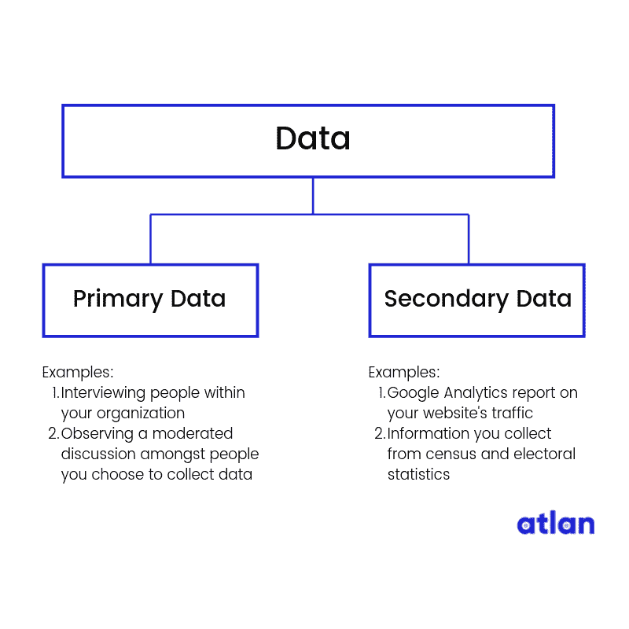
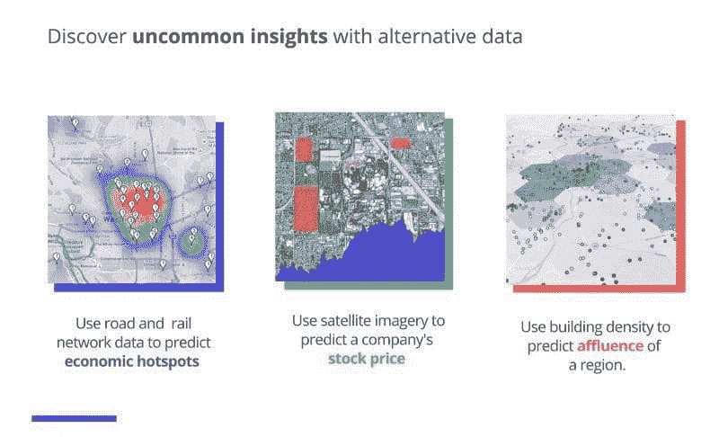
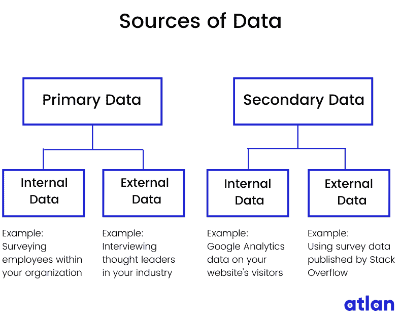

# 数据来源 101

> 原文：[`www.kdnuggets.com/2019/10/data-sources-101.html`](https://www.kdnuggets.com/2019/10/data-sources-101.html)

评论

**作者 [Ayswarrya G](https://www.linkedin.com/in/ayswarrya/)，内容策略师，Atlan**

开始接触数据世界可能会让人感到不知所措。大数据、替代数据、原始数据、内部数据——这份清单还在继续。一个常见的困惑是这些术语之间的区别，理解这些区别非常重要。

* * *

## 我们的前三大课程推荐

 1\. [谷歌网络安全证书](https://www.kdnuggets.com/google-cybersecurity) - 快速进入网络安全职业生涯。

 2\. [谷歌数据分析专业证书](https://www.kdnuggets.com/google-data-analytics) - 提升你的数据分析水平

 3\. [谷歌 IT 支持专业证书](https://www.kdnuggets.com/google-itsupport) - 支持你的组织的 IT 工作

* * *

这就是原因。

数据收集是数据生命周期的第一步之一——为了分析数据，你需要首先获取所有需要的数据（这不难理解，对吧？）。

为了收集正确的数据，你需要知道在哪里找到它，并确定收集它所涉及的努力。

这就是我写这篇文章的原因，为了回答最基本的问题：你需要的（或可能需要的）所有数据来自哪里？

### 数据来源

在查看数据来源之前，我们先了解一下原始数据和次级数据。

### 原始数据 — 你自己创建的数据

当你自己创建你想要的数据时，这被称为原始数据。如果你采访人们以收集对你产品的反馈，那么采访数据就是原始数据。

### 次级数据 — 从其他地方收集的数据

当你从其他人拥有的来源收集数据时，这被称为次级数据。如果你使用谷歌分析的数据来了解有多少人访问你的网站，那你就是在使用次级数据。这仍然是关于你组织的数据，但这是由一个次级组织（在我们的例子中是谷歌）为你收集的。

到目前为止，还不错，对吧？

现在让我们在这个基础上继续。数据来源可以是内部的，也可以是外部的。

### 内部数据 — 你创建、拥有或控制的数据

内部数据是你组织拥有、控制或收集的私人数据。你的组织的销售数据或财务数据就是内部数据的例子。

注意我说的是你创建、拥有或控制的数据？

这是有原因的。内部数据可以是原始的也可以是次级的。

当你通过调查你组织内的人员并利用这些洞察来展示影响工作场所生产力的因素时，这些数据就是内部数据和原始数据。

另一方面，当你使用 Google Analytics 的数据来显示大多数网站访问者搜索的是替代数据产品时，这些数据是内部和次级的。

### 外部数据 — 来自外部来源的数据

外部数据是从组织外部来源收集的数据。这些数据可能是：

1.  公开可用的数据，例如人口普查、选举统计、税务记录和互联网搜索

1.  来自第三方的私有数据，如亚马逊、Facebook、Google、沃尔玛以及像 Experian 这样的信用报告机构

外部数据也可以是主要数据或次级数据吗？如果你在考虑这些问题，你就走在正确的轨道上了！

当你与全球的数据科学领导者进行访谈时，你正在收集主要数据，但来源于外部。所以，这些数据是外部的和主要的。

当你使用像 Kaggle 或 Stack Overflow 这样的数字出版物进行的访谈数据时，你使用的是外部的和次级的数据。

### 但是等一下……难道不是还有一种叫做替代数据的吗？

等等！我正要提到这个。

替代数据是复杂、独特且大多数未被探索的次级数据。为了理解替代数据，让我们快速绕道 2 分钟，了解一下大数据。

**大数据**

大数据指的是海量的结构化、半结构化或非结构化数据，这些数据过于复杂，传统的数据系统（[关系数据库和数据仓库](https://www.google.com/url?q=https://wiki.atlan.com/data-repository&sa=D&ust=1569918282394000)）无法处理。

**数据的格式**

结构化什么？

数据有多种格式。以下是我对两种最主要格式的简要介绍：

1.  结构化数据：在关系数据库中以固定格式组织的数据（可以想象成你存储在计算机上的文件）

1.  非结构化数据：没有特定格式的数据（可以想象成监控数据）；[Gartner](https://www.google.com/url?q=https://www.forbes.com/sites/forbestechcouncil/2017/06/05/the-big-unstructured-data-problem/%2376fa13e4493a&sa=D&ust=1569918282395000)估计超过 80%的企业数据是非结构化的。

大数据的例子包括社交媒体数据📱、交易数据📈（股票价格、购买历史）、传感器数据（位置数据、天气数据）以及卫星数据📡。（这里有一篇关于今天世界上大数据的[有趣阅读](https://www.google.com/url?q=https://www.domo.com/solution/data-never-sleeps-6&sa=D&ust=1569918282396000)）

IBM 的大数据 4Vs。图片来源：[IBM Big Data & Analytics Hub](https://www.google.com/url?q=https://www.ibmbigdatahub.com/sites/default/files/infographic_file/4-Vs-of-big-data.jpg&sa=D&ust=1569918282396000)

[传统数据系统](https://www.google.com/url?q=http://www.pearsonitcertification.com/articles/article.aspx?p%3D2427073%26seqNum%3D2&sa=D&ust=1569918282397000) 无法完全处理如此大量的非结构化数据。

分析大数据需要复杂的大数据技术（这是另一个话题，但如果你很急，可以查看这个有用的 [wiki](https://www.google.com/url?q=https://wiki.atlan.com/big-data/big-data-technologies&sa=D&ust=1569918282397000) 了解大数据技术）。

我们的快速绕道到此结束。

因此，替代数据被认为是大数据。最初，对冲基金利用租金和水电费等非财务信息来估算个人的借贷风险。这些数据改变了金融行业（请参见 [这篇文章](https://www.google.com/url?q=https://edition.cnn.com/2019/07/10/investing/hedge-fund-drones-alternative-data/index.html&sa=D&ust=1569918282398000) 了解对冲基金如何使用替代数据）。

很快，其他行业也意识到了它的潜力以及如何帮助他们保持竞争优势。

替代数据当前使用的一些示例。图片来源： [Humans of Data](https://www.google.com/url?q=https://humansofdata.atlan.com/2018/07/what-is-alternative-data/&sa=D&ust=1569918282398000)

一些常见的替代数据集示例包括：

1.  卫星数据

1.  位置信息

1.  财务交易

1.  在线浏览活动

1.  社交媒体帖子

1.  产品评论

### 最终话语

这样你就对世界数据的来源有了大致了解。这里有一张图，快速总结了各种数据来源。

附言：在过去几个月里，我一直在参与一个名为 The Atlan Data Wiki 的社区项目——这是一个有趣、有帮助、无行话的百科全书，用于导航数据宇宙。如果你喜欢我的文章， [请查看这个 wiki](https://www.google.com/url?q=http://wiki.atlan.com&sa=D&ust=1569918282400000) ，我用类似的方法处理其他数据主题。我很想听听你的想法。

**个人简介：[Ayswarrya G](https://www.linkedin.com/in/ayswarrya/)** ([**@Ayswarrya**](https://twitter.com/Ayswarrya)) 认为优秀的写作可以改变世界。目前，她负责 Atlan 的 Humans of Data 出版物和 Data Wiki。在闲暇时间，她要么在旅行，要么在练习法语。

**相关：**

+   了解你的数据：第一部分

+   处理机器学习中数据缺乏的 5 种方法

+   了解你的数据：第二部分

### 更多相关主题

+   [高级数据科学项目的前 16 大技术数据来源](https://www.kdnuggets.com/top-16-technical-data-sources-for-advanced-data-science-projects)

+   [使用 Tableau 创建高效的组合数据源](https://www.kdnuggets.com/2022/05/create-efficient-combined-data-sources-tableau.html)

+   [数据科学家的线性规划基础](https://www.kdnuggets.com/2023/02/linear-programming-101-data-scientists.html)

+   [LangChain 基础：构建你自己的 GPT 驱动应用](https://www.kdnuggets.com/2023/04/langchain-101-build-gptpowered-applications.html)

+   [提示工程基础：掌握有效的 LLM 沟通](https://www.kdnuggets.com/prompt-engineering-101-mastering-effective-llm-communication)

+   [导航数据科学职位名称：数据分析师与数据科学家…](https://www.kdnuggets.com/navigating-data-science-job-titles-data-analyst-vs-data-scientist-vs-data-engineer)
