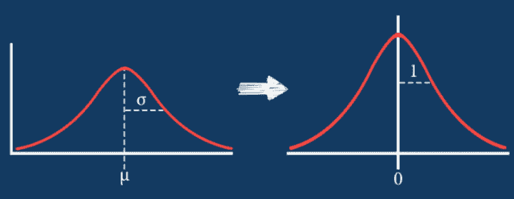
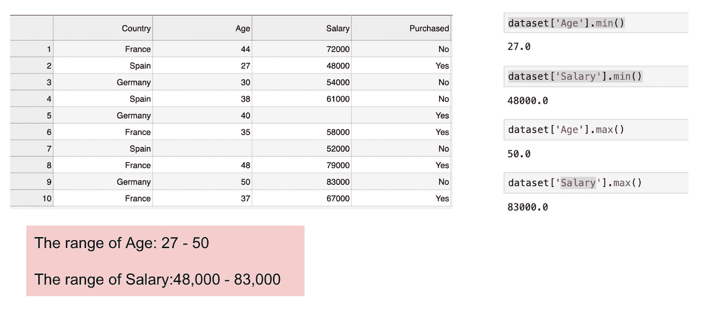
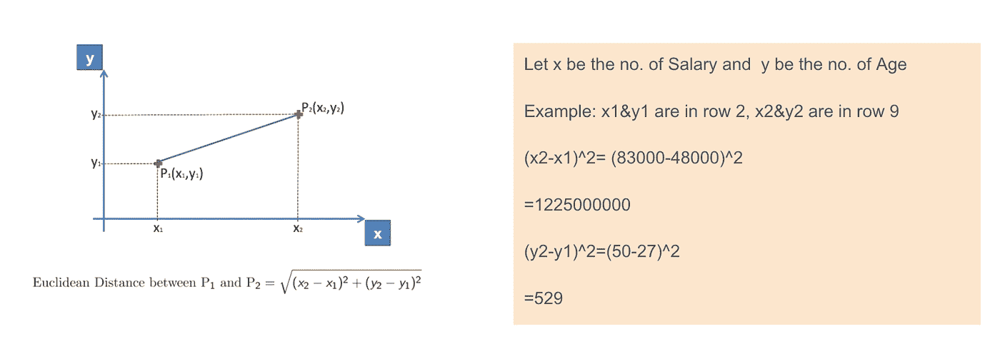
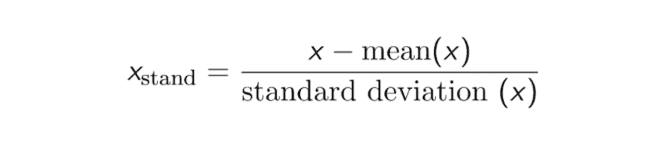
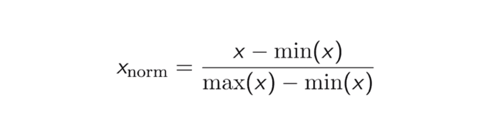
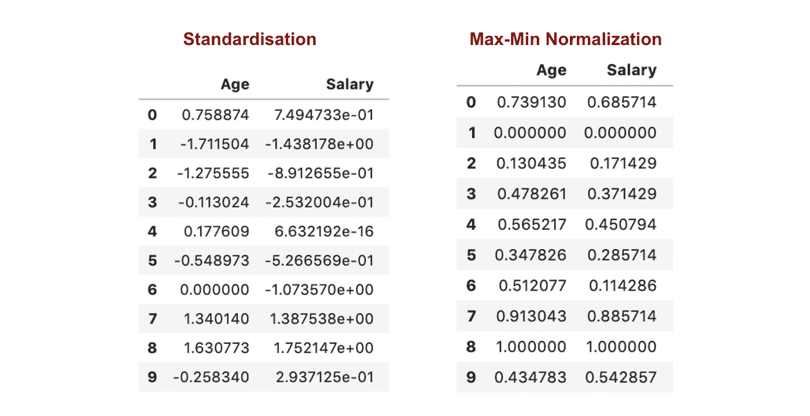
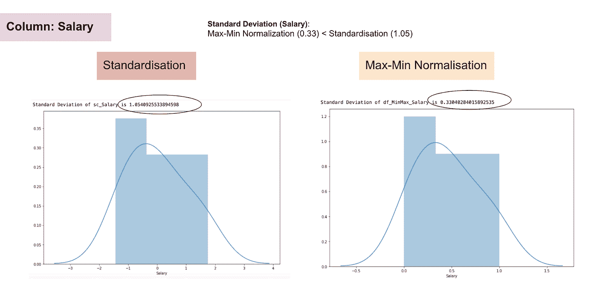
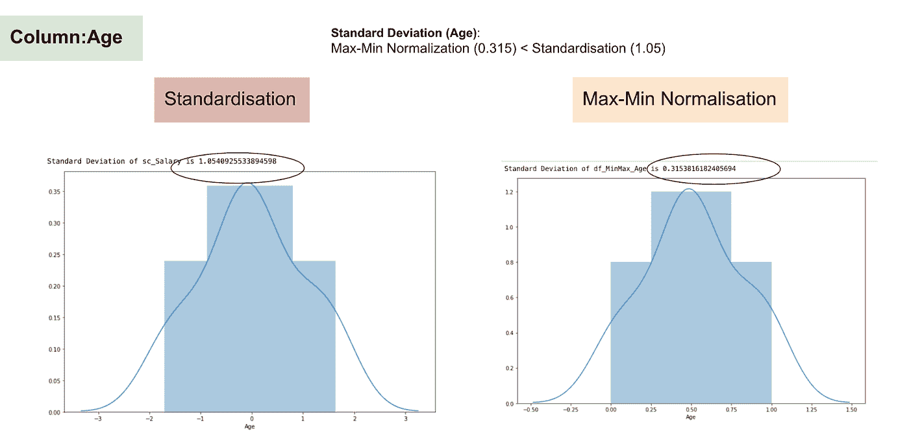
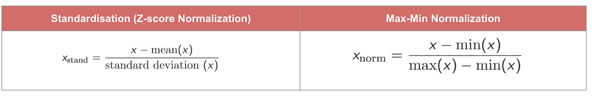
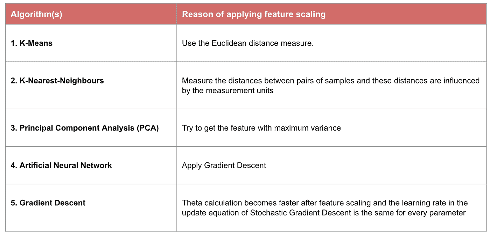

# 数据转换：标准化与归一化

> 原文：[`www.kdnuggets.com/2020/04/data-transformation-standardization-normalization.html`](https://www.kdnuggets.com/2020/04/data-transformation-standardization-normalization.html)



图片来源于 [365datascience](https://365datascience.com/standardization/)

数据转换是数据处理中的基本步骤之一。当我第一次学习特征缩放技术时，术语*scale*、*standardise*和*normalize*经常被使用。然而，找到关于何时使用这些术语的信息相当困难。因此，我将在本文中解释以下关键方面：

+   标准化和归一化之间的区别

+   何时使用标准化，何时使用归一化

+   如何在 Python 中应用特征缩放

* * *

## 我们的前三个课程推荐

 1\. [谷歌网络安全证书](https://www.kdnuggets.com/google-cybersecurity) - 快速进入网络安全职业轨道。

 2\. [谷歌数据分析专业证书](https://www.kdnuggets.com/google-data-analytics) - 提升你的数据分析技能

 3\. [谷歌 IT 支持专业证书](https://www.kdnuggets.com/google-itsupport) - 支持你的组织的 IT 工作

* * *

# 特征缩放是什么意思？

在实际操作中，我们经常在同一数据集中遇到不同类型的变量。一个重要的问题是这些变量的范围可能相差很大。使用原始尺度可能会对范围大的变量赋予更多权重。为了处理这个问题，我们需要在数据预处理的步骤中，对自变量或数据的特征应用特征重缩放技术。术语*normalisation*和*standardisation*有时可以互换使用，但它们通常指的是不同的概念。

> 应用特征缩放的目标是确保特征几乎在相同的尺度上，以便每个特征同样重要，并且让大多数机器学习算法更容易处理。

# 示例

这是一个包含一个自变量（Purchased）和 3 个因变量（Country、Age 和 Salary）的数据集。我们可以很容易地发现这些变量的尺度不同，因为*Age*的范围从 27 到 50，而*Salary*的范围从 48 K 到 83 K。*Salary*的范围远大于*Age*的范围。这会导致我们模型中的一些问题，因为许多机器学习模型，如 k-means 聚类和最近邻分类，是基于欧几里得距离的。



关注年龄和薪资

当我们计算欧几里得距离的公式时，(x2-x1)²的数量远大于(y2-y1)²的数量，这意味着如果不进行特征缩放，欧几里得距离将主要由薪资决定。年龄的差异对整体差异的贡献较小。因此，我们应该使用特征缩放将所有值调整到相同的量级，从而解决这个问题。为此，主要有两种方法：标准化和归一化。



欧几里得距离的应用。

# 标准化

**标准化**（或**Z-score 归一化**）的结果是特征将被重新缩放，以确保均值和标准差分别为 0 和 1。公式如下所示：



该技术是将特征值重新缩放到 0 和 1 之间，这对于优化算法（如梯度下降）非常有用，这些算法在机器学习中用于加权输入（例如回归和神经网络）。重新缩放也用于使用距离测量的算法，例如 K-最近邻（KNN）。

```py
#Import library
from sklearn.preprocessing import StandardScaler
sc_X = StandardScaler()
sc_X = sc_X.fit_transform(df)
#Convert to table format - StandardScaler 
sc_X = pd.DataFrame(data=sc_X, columns=["Age", "Salary","Purchased","Country_France","Country_Germany", "Country_spain"])
sc_X
```

# 最大-最小归一化

另一种常见的方法是所谓的**最大-最小归一化**（**Min-Max scaling**）。该技术将特征重新缩放到 0 和 1 之间。对于每个特征，该特征的最小值被转换为 0，最大值被转换为 1。一般公式如下所示：



最大-最小归一化的公式

```py
from sklearn.preprocessing import MinMaxScaler
scaler = MinMaxScaler()
scaler.fit(df)
scaled_features = scaler.transform(df)
#Convert to table format - MinMaxScaler
df_MinMax = pd.DataFrame(data=scaled_features, columns=["Age", "Salary","Purchased","Country_France","Country_Germany", "Country_spain"])
```

# 标准化与最大-最小归一化

与标准化相比，通过最大-最小归一化过程我们会获得较小的标准差。让我利用上面的数据集更详细地说明这一点。



特征缩放后



薪资的正态分布和标准差



年龄的正态分布和标准差

从上述图表中，我们可以明显看到，在数据集中应用最大-最小归一化生成的标准差（薪资和年龄）小于使用标准化方法。这表明如果使用最大-最小归一化缩放数据，数据将更集中在均值附近。

因此，如果你的特征（列）中有异常值，归一化你的数据将把大部分数据缩放到一个小区间，这意味着所有特征将具有相同的尺度，但对异常值的处理不好。标准化对异常值更为稳健，在许多情况下，它优于 Max-Min 归一化。

# 特征缩放的重要性



一些机器学习模型基本上是基于距离矩阵的，也称为基于距离的分类器，例如 K 最近邻、SVM 和神经网络。特征缩放对这些模型至关重要，特别是当特征的范围差异很大时。否则，范围较大的特征在计算距离时将有较大影响。

Max-Min 归一化通常允许我们对具有不同尺度的数据进行转换，以使得没有特定维度主导统计数据，并且不需要对数据的分布做出非常强的假设，例如 k 最近邻和人工神经网络。然而，[归一化](https://www.codecademy.com/articles/normalization) 对异常值的处理并不好。相反，标准化允许用户更好地处理异常值，并且有助于某些计算算法（如梯度下降）的收敛。因此，我们通常更倾向于使用标准化而不是 Min-Max 归一化。

**示例：哪些算法需要特征缩放**



> **注意**：如果一个算法不是基于距离的，则特征缩放不重要，包括朴素贝叶斯、线性判别分析和基于树的模型（梯度提升、随机森林等）。

# 总结：现在你应该知道

+   使用特征缩放的目的

+   标准化和归一化之间的区别

+   需要应用标准化或归一化的算法

+   在 Python 中应用特征缩放

> **请在此处找到代码和数据集**[**这里**](https://github.com/clareyan/feasturescaling)**。**

[原文](https://towardsdatascience.com/data-transformation-standardisation-vs-normalisation-a47b2f38cec2)。经许可转载。

**[Clare Liu](https://www.linkedin.com/in/clareliuchungyan/)** 是一名在香港金融科技（银行）行业工作的数据科学家。热衷于解决数据科学和机器学习中的谜团。加入我，开始自学之旅吧。

### 更多相关内容

+   [优化数据存储：探索 SQL 中的数据类型和归一化](https://www.kdnuggets.com/optimizing-data-storage-exploring-data-types-and-normalization-in-sql)

+   [随机森林算法需要归一化吗？](https://www.kdnuggets.com/2022/07/random-forest-algorithm-need-normalization.html)

+   [ETL 演变：跳过转换如何提升数据管理](https://www.kdnuggets.com/evolution-in-etl-how-skipping-transformation-enhances-data-management)

+   [聊天机器人转型：从失败到未来](https://www.kdnuggets.com/2021/12/chatbot-transformation-failure-future.html)

+   [GenAI 时代的 AI 转型战略](https://www.kdnuggets.com/the-ai-transformation-strategy-in-the-genai-era)

+   [现代企业的数字化转型指南](https://www.kdnuggets.com/digital-transformation-playbook-for-modern-businesses)
