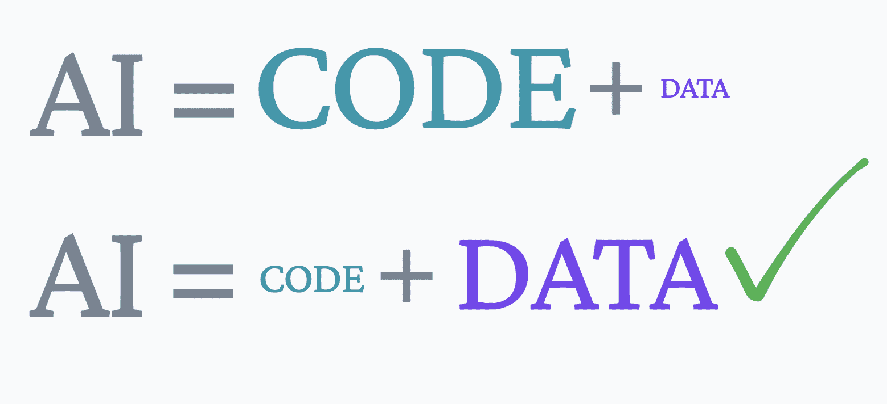

# 数据之信：数据中心的人工智能

> 原文：[`www.kdnuggets.com/2022/10/data-trust-data-centric-ai.html`](https://www.kdnuggets.com/2022/10/data-trust-data-centric-ai.html)

图片由作者提供

在 2012 年，作者比约恩·布洛辛（Björn Bloching）、拉尔斯·卢克（Lars Luck）和托马斯·拉姆格（Thomas Ramge）出版了《数据之信》（In Data We Trust）：[《客户数据如何革新我们的经济》](https://www.amazon.co.uk/Data-We-Trust-Customer-Revolutionising/dp/1408179512)。这本书详细讲述了许多公司如何将所有需要的信息掌握在手中。公司不再需要根据直觉和市场做出决策，而是可以使用数据流来更好地理解未来的趋势以及下一步的行动方案。

随着数据特别是人工智能领域的不断增长，越来越多的人持怀疑态度。一些人可能会说，数据的使用和自主功能改善了我们的日常生活，而另一些人则对他们的数据如何被使用以及人工智能的发展如何对人类产生严重影响感到担忧。

尽管人工智能已经证明能够产生一些令人印象深刻的结果，但它也曾失败过——甚至包括谷歌和亚马逊这样的巨头。例如，在 2019 年，亚马逊的 Rekognition 软件在由马萨诸塞州 ACLU 进行的面部识别测试中错误地将 27 名职业运动员与超级碗冠军的通缉照片匹配。

这些失败可能对人工智能的持续发展产生重大影响。人们自然会失去信任并希望远离它。失败并非来自人工智能本身，而是来自于输入和使用在这些模型中生成虚假输出的数据。

这就是我们需要信任数据并实施数据中心人工智能的地方。

# 什么是数据中心的人工智能？

如果你曾经在科技行业或从事机器学习模型工作，你会看到人们专注于软件、模型等的构建。然而，如果正确的输入产生了错误的输出，这可能会导致软件的失败。

例如，花费数年时间试图打造一辆外观美观、引擎强劲且配备所有新技术的汽车，如果你现在的燃料质量差到连车都启动不了，更别提到达目的地了，那有什么意义呢？

对吧？垃圾进，垃圾出。

人工智能也是一样。如果花费数小时构建一个模型，但一旦将数据输入其中，它就会产生错误，那有什么意义呢？

数据中心的人工智能（Data-Centric AI）是一个专注于数据的系统，而非代码。我并不是说它不使用代码，当然，它是使用的。它系统性地工程化用于构建人工智能系统的数据，并将这些数据与代码中的有价值元素相结合。

# 我们需要什么类型的数据？

为了使人工智能模型值得信赖并产生准确的输出，它需要干净和多样的数据。没有这两个数据元素，你可能无法在未来做出准确的决策。质量 > 数量。

如果你的数据不够干净或多样，它自然会降低性能并产生输出错误。不干净或不多样的数据会使模型感到困惑，因为它需要额外 10 倍的努力来理解数据。那么，我们可以使用什么工具来确保我们拥有干净、多样的数据呢？

## 数据标注

标注数据是将不干净的数据转变为干净数据的重要环节，为此你可以使用数据标注工具。标注工具可以快速注释图像和其他形式的数据，例如用于文档分类的命名实体识别（NER）。

数据标注工具帮助数据科学家、工程师和其他数据专家提高模型的整体准确性和性能。

标签工具可以且建议与下述本体论相关联使用。

## 本体论

拥有本体论。本体论是对信息系统中符号意义的规范说明。它是一个定义的虚拟目录，充当你的字典。本体论在数据标注过程中像一个参考点或丰富的资源库。

## 人类在环

如上所述，将人类引入你的过程可以帮助你获得干净的数据。人工智能整体上是在试图将人类智能模拟到计算机中，那么，什么比实际引入人类到这个过程中更好的方法来改善这个过程呢？

人类在环利用人类专业知识来训练良好的人工智能，通过让他们参与系统的构建、微调和模型测试。这将有助于确保数据标注工具有效工作，输出的准确性得到提升，并且整体决策更好。

## 数据质量管理

这是否是额外的费用？是的。它会在长远中对你有帮助吗？当然。如果你要做某件事，最好第一次就做好，而不是需要重复几次才能做对。虽然你可能一开始会把它视为额外的费用，但随着时间的推移，质量管理可以为你节省大量的时间和金钱。

通过数据质量管理，你将能够识别数据中的错误，并在过程早期解决这些问题，避免造成过多的损害。

## 数据增强

数据增强是一组技术，用于通过从现有数据生成新数据点来人工增加可用数据量。这是通过对现有数据点进行小的修改来创建新的数据点。

通过在现有数据中创建这些变化并生成新的数据点，模型变得更加稳健，能够学会做出符合现实世界的预测。数据点越多，数据越多样化——模型就能学会提升其整体准确性和性能。

# 结论

上述所有工具都能帮助我们应对当前世界在人工智能方面面临的挑战。这是一场范式转变，公司们每天都在加入这个行列。技术专家知道如何构建模型和人工智能能做什么，但现在的重点是如何改进它，我们已经理解这基于我们使用的数据。

**[尼莎·阿亚](https://www.linkedin.com/in/nisha-arya-ahmed/)** 是一名数据科学家和自由技术作家。她特别关注提供数据科学职业建议或教程及理论知识。她还希望探索人工智能如何有益于人类寿命的不同方式。作为一个热衷学习者，她寻求拓宽自己的技术知识和写作技能，同时帮助指导他人。

### 更多相关内容

+   [数据中心的人工智能与表格数据](https://www.kdnuggets.com/2022/09/datacentric-ai-tabular-data.html)

+   [数据中心人工智能：你需要了解的最新研究](https://www.kdnuggets.com/2022/02/datacentric-ai-latest-research-need-know.html)

+   [数据中心的人工智能：它真实吗？适合所有人吗？我们准备好了吗？](https://www.kdnuggets.com/2022/03/data-centric-ai-real-everyone-ready.html)

+   [如何通过数据中心人工智能让自己与其他申请者区分开来](https://www.kdnuggets.com/2022/12/set-apart-applicants-datacentric-ai.html)

+   [在实际环境中运行深度学习：数据中心课程](https://www.kdnuggets.com/2022/04/corise-deep-learning-wild-data-centric-course.html)

+   [在实际环境中运行深度学习：数据中心课程](https://www.kdnuggets.com/2022/11/corise-deep-learning-wild-data-centric-course.html)
