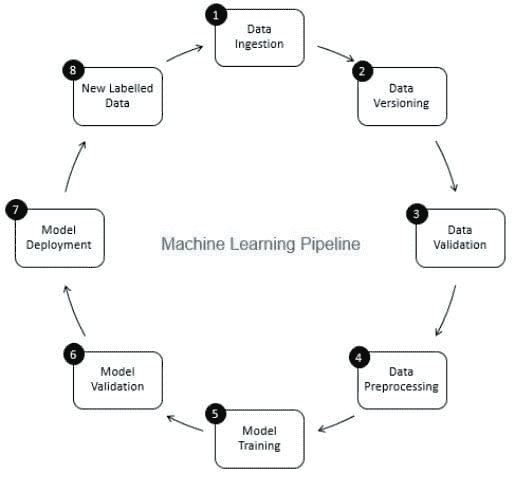
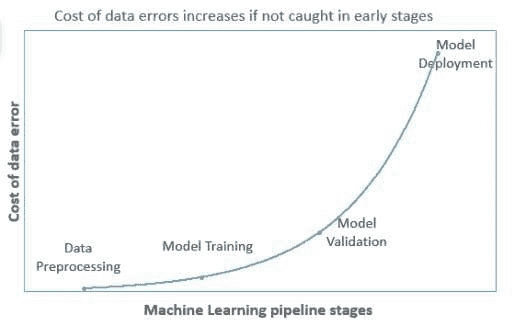
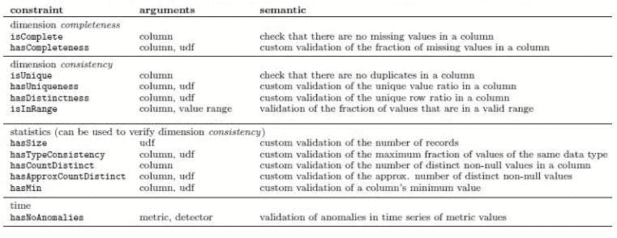
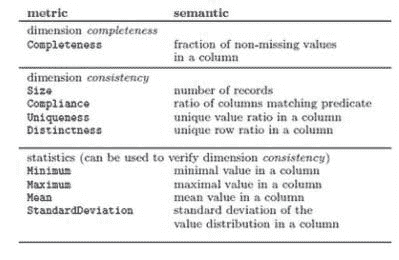
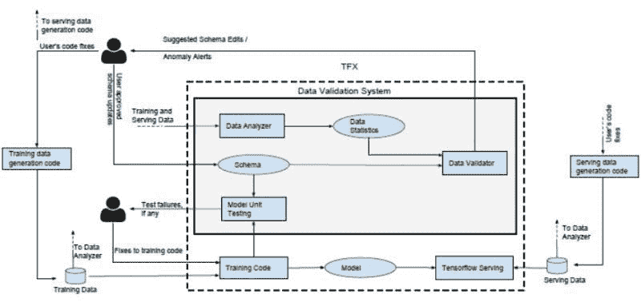

# 数据验证在机器学习中是至关重要的，而非可选的

> 原文：[`www.kdnuggets.com/2021/05/data-validation-machine-learning-imperative.html`](https://www.kdnuggets.com/2021/05/data-validation-machine-learning-imperative.html)

评论

**作者：[Aditya Aggarwal](https://www.linkedin.com/in/aditya-agarwal-2395076/)，数据科学实践负责人 & [Arnab Bose](https://www.linkedin.com/in/arnab-bose-phd-6369531/)，首席科学官，Abzooba**

在生产环境中运作一个机器学习（ML）模型需要远比在学术界或研究中创建和验证模型要复杂得多。生产中的 ML 应用程序可以是一个包含多个组件顺序运行的管道，如图 1 所示。在我们达到管道中的模型训练之前，需要执行多个组件，如数据摄取、数据版本控制、数据验证和数据预处理。在这里，我们将讨论数据验证，并将本文安排如下：

1.  什么是数据验证？

1.  为什么需要数据验证？

1.  数据验证面临哪些挑战？

1.  数据验证组件是如何工作的？

1.  市场上可用的数据验证组件示例。​​​​​​​​​​​​​​

**图 1：机器学习流程中的组件**

### **1) 什么是数据验证？**

数据验证意味着**检查源数据的准确性和质量**，在训练新模型版本之前进行。它确保**稀有或增量数据中出现的异常**不会**被默默忽略。** 它侧重于检查新数据的统计数据是否符合预期（例如特征分布、类别数量等）。根据目标和约束，可以执行不同类型的验证。机器学习流程中的一些目标示例如下 - ​​​​​​

1.  增量数据中是否有**异常或数据错误**？如果有，请向团队发出警报进行调查。

1.  在模型训练过程中是否有任何**数据假设**被**违反**？如果有，请向团队发出警报进行调查。

1.  **训练**数据和**服务**数据之间是否有**显著差异**？或者，是否有连续数据的差异被添加到训练数据中？如果有，请发出警报以调查训练和服务代码堆栈中的差异。​​​​​​​​​​​​​​

数据验证步骤的输出应该是**信息丰富的**，以便数据工程师可以对其采取**行动**。此外，它还需要具有**高精度**，因为过多的假警报会轻易失去可信度。

### **2) 为什么需要数据验证？**​​​​​​​

机器学习模型容易受到数据质量差的影响，正如古老的谚语所说“垃圾进垃圾出”。

在生产环境中，模型会周期性地使用新增的增量数据进行重新训练（频率可高达每日），并将更新的模型推送到服务层。模型在服务时使用新进入的数据进行预测，并且同样的数据会添加实际标签后用于重新训练。这确保了新生成的模型能够适应数据特征的变化。

然而，服务层中新进入的**数据可能会发生变化**，原因包括引入错误的代码更改或训练和服务堆栈之间的差异。随着时间的推移，**错误的摄取数据**将成为训练数据的一部分，这将开始**降低模型的准确性**。由于每次迭代中新添加的数据通常只是总体训练数据的一小部分，因此模型准确性的变化很容易被忽视，**错误会随着时间的推移不断增加**。

因此，**在早期阶段捕捉数据错误**非常重要，因为这将减少数据错误的成本，随着错误在管道中进一步传播，成本必然会增加（如图 2 所示）。

**图 2：机器学习管道中的数据错误成本**

### **3) 数据验证面临哪些挑战？**

数据科学家在开发数据验证组件时面临各种挑战，例如

1.  为具有少量列的数据集创建数据验证规则听起来很简单。然而，**当数据集中的列数增加时，这将变成一项庞大的任务**。

1.  追踪和比较历史数据集中的指标以找出**每列的历史趋势中的异常**需要数据科学家花费大量时间。

1.  现在的应用程序预计会全天候运行，在这种情况下，**数据验证需要自动化**。数据验证组件应该足够智能，能够刷新验证规则。

### **4) 数据验证组件如何工作？**

把数据验证组件想象成 ML 应用程序的一个哨岗，阻止低质量数据进入。它会检查每一条即将添加到训练数据中的新数据。如图 3 所示，数据验证框架可以总结为 5 个步骤：

1.  根据一组规则计算训练数据的统计信息

1.  计算需要验证的摄取数据的统计信息

1.  将验证数据的统计信息与训练数据的统计信息进行比较

1.  存储验证结果并采取自动化措施，如删除行、限制或调整值

1.  发送通知和警报以供审批

**图 3：数据验证工作流程（点击放大）**

### **5) 市场上可用的数据验证组件示例**

​​

​​​​​​​​​​​​亚马逊研究 [1] 和谷歌研究 [2] 提出了非常相似的数据验证组件构建方法。总体而言，这两种方法遵循了图 2 所示的相同工作流程。我们将在这里讨论这两种方法。

**5.1) 亚马逊研究（Deequ）的数据验证单元测试方法**

在软件工程中，工程师编写单元测试来测试他们的代码。同样，也应该定义单元测试来测试传入的数据。作者定义了一个框架来定义这个组件，该框架遵循以下原则 -

a) **声明约束**：用户定义数据应该是什么样的。通过在数据上声明检查，按不同列组合约束来实现。表 1 中显示了约束列表。

b) **计算度量**：根据声明的约束，将其转换为可测量的度量，如下表 2 所示。这些度量可以计算并在手头数据和增量数据之间进行比较。

c) **分析和报告：** 根据随时间收集的度量，预测增量数据中的度量是否异常。作为规则，如果新度量值比之前的均值多出三倍标准差，用户可以让系统发出“警告”；如果多出四倍标准差，则抛出“错误”。根据分析，报告失败的约束，包括导致约束失败的值(s)。​​​​​​

**表 1：用于编排用户定义数据质量检查的约束**

**表 2：基于约束的可计算度量**

**5.2) 谷歌研究（Tensorflow 数据验证）的数据模式方法**

​​​​​​谷歌研究提出了非常相似的技术，但采用了数据管理系统中“经过实战考验”的原则，并将其定制用于机器学习。该技术首先将对正确数据的期望进行编码，然后利用这些期望的统计数据和用户定义的验证模式进行数据验证。​​​​​​​ 该数据验证框架包含**3 个子组件**，如图 4 所示。

1.  **数据分析器** - 计算定义数据所需的一组预定义数据统计信息

1.  **数据验证器** - 根据通过模式指定的数据属性进行检查。此模式是数据验证器执行的前提。此模式列出了所有特征的基本检查和与机器学习相关的检查的约束。

1.  **模型单元测试器** - 使用通过模式生成的合成数据检查训练代码中的错误

该框架为用户提供了**能力**

1.  **通过检测数据中的异常来验证单批增量数据**

1.  **检测连续增量训练数据批次之间的显著变化**。一些异常在检查单个批次时不可见，但在查看连续批次时会显现。​​​​​​​

1.  **查找训练代码中未反映在数据中的假设**（例如，如果训练代码中的特征预期应有 log()，则不应有负值或字符串值）。目标是涵盖那些未被添加到模式中的约束。此过程分为两个步骤

    1.  生成符合模式约束的合成训练示例

    1.  生成的数据会通过训练代码进行迭代以检查错误

**图 4: 谷歌研究的机器学习数据验证**

亚马逊研究和谷歌研究的方法都为用户提供了建议，比如亚马逊框架中的约束和谷歌框架中更新模式的推荐。这两种方法都将数据视为机器学习管道中的一等公民，并在将数据输入系统之前进行数据验证。然而，仍有一些值得注意的区别。

**表格 3: 数据验证库的差异**

|  | **Deequ（亚马逊）** | **Tensorflow 数据验证（谷歌）** |
| --- | --- | --- |
| **1** | 无可用可视化 | 使用谷歌 Facets 提供可视化。总结了每个特征的统计数据，并比较训练数据和验证数据。 |
| **2** | 通过聚合之前保存的训练统计数据和新数据统计数据来重新计算训练统计数据。 | 每次运行时计算整个训练数据的统计数据，除非另有指定。这可能会变得计算开销较大。 |
| **3** | 除了基于阈值或相对/绝对差异进行异常检测，还提供基于运行平均值和标准差的异常检测能力。 | 提供基于阈值或相对/绝对差异的异常检测能力。 |
| **4** | 仅支持 SparkDataFrame 数据。 | 支持 pandas dataframe、csv，且与 TFRecord 配合最佳。 |

**参考文献**

1.  S. Schelter, D. Lange, P. Schmidt, M. Celikel, F. Biessmann 和 A. Grafberger，“大规模数据质量验证的自动化”，发表于 VLDB 基金会，卷 11，第 12 期：1781-1794，2018 年。可用： [`www.vldb.org/pvldb/vol11/p1781-schelter.pdf`](http://www.vldb.org/pvldb/vol11/p1781-schelter.pdf)​​​​​​​

1.  E. Breck, M. Zinkevich, N. Polyzotis, S. Whang 和 S. Roy，“机器学习的数据验证”，发表于第二届 SysML 会议，帕洛阿尔托，加州，美国，2019 年。可用： [`mlsys.org/Conferences/2019/doc/2019/167.pdf`](https://mlsys.org/Conferences/2019/doc/2019/167.pdf)

[**阿迪提亚·阿格尔瓦尔**](https://www.linkedin.com/in/aditya-agarwal-2395076/)担任 Abzooba Inc.的数据科学实践负责人。凭借超过 12 年的数据驱动解决方案推动业务目标的经验，阿迪提亚专注于预测分析、机器学习、商业智能和商业战略。他是 Abzooba 的高级分析实践负责人，领导着一个 50 多人的充满活力的数据科学团队，使用机器学习、深度学习、自然语言处理和计算机视觉解决有趣的商业问题。他为客户提供人工智能方面的思想领导，将其商业目标转化为分析问题和数据驱动解决方案。在他的领导下，多个组织实现了任务自动化、降低了运营成本、提高了团队生产力，并改善了收入和利润。他开发了如代位索赔引擎、价格推荐引擎、物联网传感器预测维护等解决方案。阿迪提亚拥有印度技术学院（IIT）德里的技术学士学位和商业管理辅修学位。

[**阿纳布·博斯博士**](https://www.linkedin.com/in/arnab-bose-phd-6369531/)是 Abzooba 的首席科学官，该公司是一家数据分析公司，并且是芝加哥大学的兼职教员，教授机器学习、预测分析、机器学习操作、时间序列分析与预测以及健康分析等课程。他是一位拥有 20 年预测分析行业经验的专家，喜欢使用结构化和非结构化数据来预测和影响医疗保健、零售、金融和交通领域的行为结果。他目前的研究重点包括使用机器学习进行健康风险分层和慢性病管理，以及机器学习模型的生产部署和监控。阿纳布在许多电气和电子工程师协会（IEEE）会议和期刊上发表了书籍章节和审稿论文。他曾获得美国控制会议最佳演讲奖，并在美国、澳大利亚和印度的大学和公司中发表过关于数据分析的讲座。阿纳布拥有南加州大学的电气工程硕士和博士学位，以及印度技术学院卡拉格普尔分校的电气工程学士学位。

**相关：**

+   MLOps——“为什么需要它？”和“它是什么”？

+   数据验证和数据核实——从字典到机器学习

+   如何开始使用 SQL 管理数据质量并进行扩展

* * *

## 我们的前三个课程推荐

 1\. [谷歌网络安全证书](https://www.kdnuggets.com/google-cybersecurity) - 快速进入网络安全职业轨道。

 2\. [谷歌数据分析专业证书](https://www.kdnuggets.com/google-data-analytics) - 提升你的数据分析技能

 3\. [谷歌 IT 支持专业证书](https://www.kdnuggets.com/google-itsupport) - 支持组织的 IT 部门

* * *

### 更多相关话题

+   [使用 Pandera 对 PySpark 应用进行数据验证](https://www.kdnuggets.com/2023/08/data-validation-pyspark-applications-pandera.html)

+   [Pydantic 教程：简化 Python 中的数据验证](https://www.kdnuggets.com/pydantic-tutorial-data-validation-in-python-made-simple)

+   [MarshMallow：最甜美的 Python 数据序列化和验证库](https://www.kdnuggets.com/marshmallow-the-sweetest-python-library-for-data-serialization-and-validation)

+   [为什么使用 k-fold 交叉验证？](https://www.kdnuggets.com/2022/07/kfold-cross-validation.html)

+   [机器学习未能为我的业务带来价值，为什么？](https://www.kdnuggets.com/2021/12/machine-learning-produce-value-business.html)

+   [机器学习与大脑的不同：神经元运行缓慢，……](https://www.kdnuggets.com/2022/04/machine-learning-like-brain-part-one-neurons-slow-slow-slow.html)
