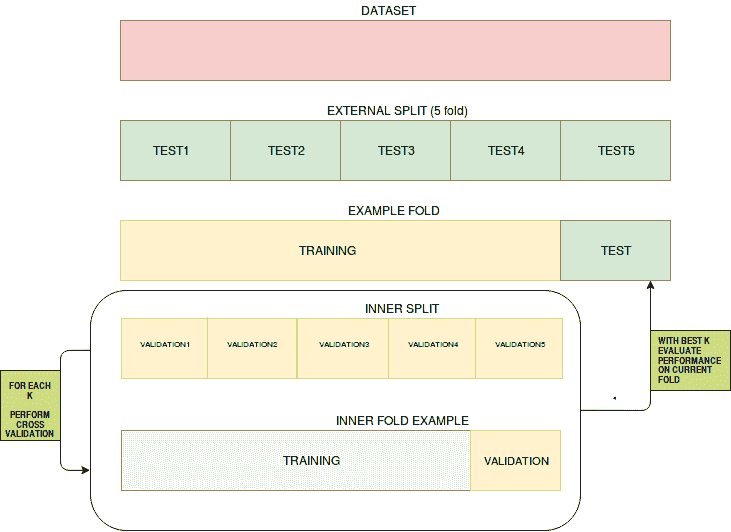
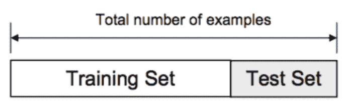
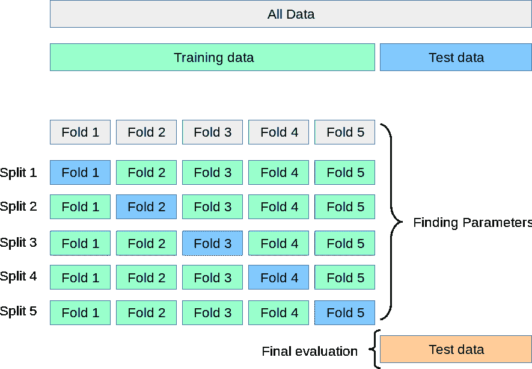
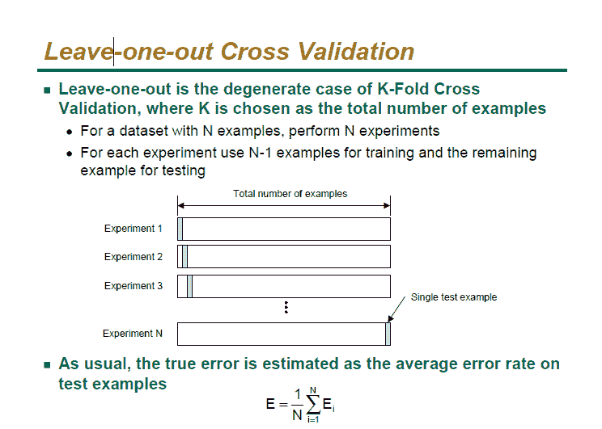

# 机器学习的数据验证

> 原文：[`www.kdnuggets.com/2020/01/data-validation-machine-learning.html`](https://www.kdnuggets.com/2020/01/data-validation-machine-learning.html)

评论  [来源](https://i.stack.imgur.com/nr41H.png)

数据是维持机器学习运行的基本保障。无论机器学习和/或深度学习模型有多强大，如果数据质量差，它永远无法达到预期效果。**随机噪声（即使模式难以识别的数据点）**、**某些类别变量的低频率**、**目标类别的低频率（如果目标变量是类别型的）**和**不正确的数值**等，都是数据可能干扰模型表现的方式。虽然验证过程无法直接发现问题，但有时可以显示模型的稳定性存在问题。

* * *

## 我们的前三个课程推荐

 1\. [谷歌网络安全证书](https://www.kdnuggets.com/google-cybersecurity) - 快速进入网络安全职业轨道

 2\. [谷歌数据分析专业证书](https://www.kdnuggets.com/google-data-analytics) - 提升你的数据分析技能

 3\. [谷歌 IT 支持专业证书](https://www.kdnuggets.com/google-itsupport) - 支持你的组织在 IT 领域

* * *

### 训练/验证/测试分割

验证数据的最基本方法（即在测试模型之前调整超参数）是对数据进行训练/验证/测试分割。典型的比例可能是 80/10/10，以确保你仍然有足够的训练数据。训练模型后，用户将进入验证结果并通过验证集调整超参数，直到达到满意的性能指标。一旦这一阶段完成，用户将使用测试集对模型进行测试，以预测和评估性能。

### 交叉验证

交叉验证是一种评估统计预测模型在独立数据集上表现的技术。其目的是确保模型和数据能够良好配合。交叉验证在训练阶段进行，用户将评估模型是否容易出现欠拟合或过拟合。用于交叉验证的数据必须来自目标变量的相同分布，否则我们可能会对模型在实际中的表现产生误导。

交叉验证有不同的类型，例如：

***   K 折交叉验证**

+   在我们希望尽可能多地保留数据用于训练阶段，而不冒将宝贵数据丢失到验证集的风险时，k 折交叉验证可以提供帮助。这种技术不要求训练数据放弃一部分作为验证集。在这种情况下，数据集被分成*k*个折叠，其中一个折叠将用作测试集，其余的将用作训练数据集，这个过程会重复*n*次，具体由用户指定。在回归中，结果的平均值（如 RMSE、R-Squared 等）将作为最终结果。在分类设置中，结果的平均值（即准确率、真正率、F1 等）将作为最终结果。

.

1.  留一验证（LOOCV）

+   留一验证与 k 折交叉验证类似。该迭代过程将进行*n*次，具体次数由用户指定。

数据集将被分为 n-1 个数据集，被移除的数据集将是测试数据。性能的测量方式与 k 折交叉验证相同。

验证数据集让用户对模型的稳定性有信心。随着机器学习渗透社会的各个方面并被应用于我们的日常生活，确保模型能够代表我们的社会变得更加重要。过拟合和欠拟合是数据科学家在模型构建过程中面临的两大常见陷阱。验证是你的模型在性能优化和在长时间内稳定的关键步骤，之后才需要重新训练。

**相关**

+   常见的机器学习障碍

+   入门机器学习的书籍

+   你应该在数据科学项目中使用交叉验证的 5 个理由

### 更多关于此主题

+   [停止学习数据科学以寻找目标，并通过寻找目标来…](https://www.kdnuggets.com/2021/12/stop-learning-data-science-find-purpose.html)

+   [学习数据科学统计的顶级资源](https://www.kdnuggets.com/2021/12/springboard-top-resources-learn-data-science-statistics.html)

+   [成功数据科学家的 5 个特征](https://www.kdnuggets.com/2021/12/5-characteristics-successful-data-scientist.html)

+   [每个数据科学家都应该知道的三个 R 库（即使你使用 Python）](https://www.kdnuggets.com/2021/12/three-r-libraries-every-data-scientist-know-even-python.html)

+   [一项 90 亿美元的 AI 失败，经过审查](https://www.kdnuggets.com/2021/12/9b-ai-failure-examined.html)

+   [是什么让 Python 成为初创公司理想的编程语言](https://www.kdnuggets.com/2021/12/makes-python-ideal-programming-language-startups.html)
