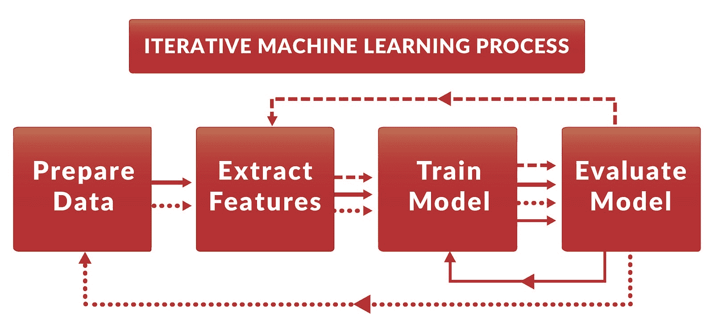
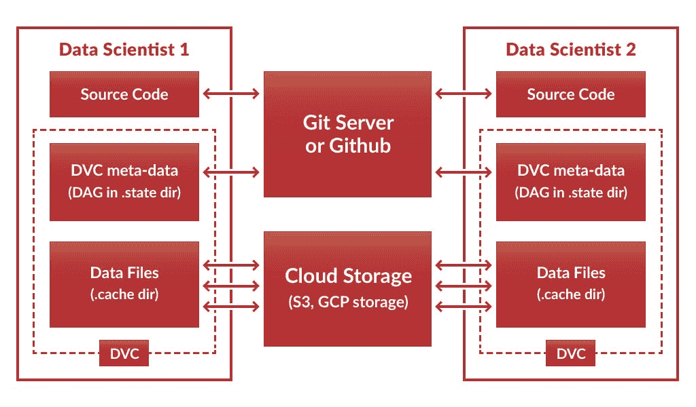
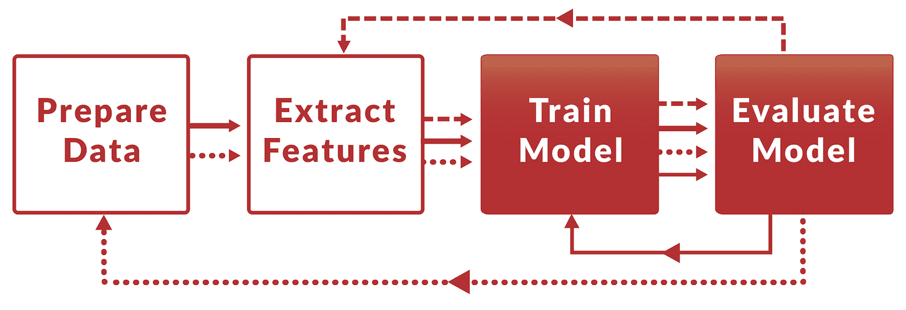

# 数据版本控制：迭代机器学习

> 原文：[`www.kdnuggets.com/2017/05/data-version-control-iterative-machine-learning.html`](https://www.kdnuggets.com/2017/05/data-version-control-iterative-machine-learning.html)

评论

**作者：Dmitry Petrov，[Twitter](https://twitter.com/fullstackml)**

在现实生活中，几乎不可能一次性开发出一个好的机器学习模型。ML 建模是一个迭代过程，跟踪你的步骤、步骤之间的依赖关系、代码和数据文件之间的依赖关系以及所有代码运行参数极为重要。在团队环境中，这变得更加重要和复杂，因为数据科学家的协作占据了团队的大部分精力。

今天，我们很高兴地宣布新开源工具[data version control](https://dataversioncontrol.com/)或 DVC 的 beta 版本发布。DVC 旨在帮助数据科学家跟踪他们的 ML 过程和文件依赖，形式类似于 git 命令：“**dvc run python train_model.py data/train_matrix.p data/model.p**”。无论使用哪种编程语言或工具，你现有的 ML 过程都可以轻松转化为可重现的 DVC 管道。

这篇博客文章引导你通过一个迭代过程，使用 DVC 构建机器学习模型，数据集为[stackoverflow posts dataset](https://archive.org/details/stackexchange)。首先，你需要初始化一个 Git 仓库，并下载我们将用来展示 DVC 的建模源代码：

*$ mkdir myrepo*

*$ cd myrepo*

*$ mkdir code*

*$ wget -nv -P code/ https://s3-us-west-2.amazonaws.com/dvc-share/so/code/featurization.py \*

*https://s3-us-west-2.amazonaws.com/dvc-share/so/code/evaluate.py \*

*https://s3-us-west-2.amazonaws.com/dvc-share/so/code/train_model.py \*

*https://s3-us-west-2.amazonaws.com/dvc-share/so/code/split_train_test.py \*

*https://s3-us-west-2.amazonaws.com/dvc-share/so/code/xml_to_tsv.py \*

*https://s3-us-west-2.amazonaws.com/dvc-share/so/code/requirements.txt*

*$ pip install -r code/requirements.txt*

*$ git init*

*$ git add code/*

*$ git commit -m ‘下载代码’*

可以通过运行下面的 bash 代码来构建完整的管道。如果你使用的是 Python 3，请将 python 替换为 python3，将 pip 替换为 pip3。

*# 安装 DVC*

*$ pip install dvc*

*# 初始化 DVC 仓库*

*$ dvc init*

*# 下载文件并放入 data/目录中。*

*$ dvc import https://s3-us-west-2.amazonaws.com/dvc-share/so/25K/Posts.xml.tgz data/*

*# 从归档中提取 XML 文件。*

*$ dvc run tar zxf data/Posts.xml.tgz -C data/*

*# 准备数据。*

*$ dvc run python code/xml_to_tsv.py data/Posts.xml data/Posts.tsv python*

*# 切分训练和测试数据集。两个输出文件。*

*# 0.33 是测试数据集分割比例。20170426 是随机化的种子。*

*$ dvc run python code/split_train_test.py data/Posts.tsv 0.33 20170426 data/Posts-train.tsv data/Posts-test.tsv*

*# 从文本数据中提取特征。两个 TSV 输入和两个 pickle 矩阵输出。*

*$ dvc run python code/featurization.py data/Posts-train.tsv data/Posts-test.tsv data/matrix-train.p data/matrix-test.p*

*# 从训练数据集中训练 ML 模型。20170426 是另一个种子值。*

*$ dvc run python code/train_model.py data/matrix-train.p 20170426 data/model.p*

*# 通过测试数据集评估模型。*

*$ dvc run python code/evaluate.py data/model.p data/matrix-test.p data/evaluation.txt*

*# 结果。*

*$ cat data/evaluation.txt*

*AUC: 0.596182*

你需要理解的一点是，DVC 会自动推导步骤之间的依赖关系，并透明地构建依赖图（[DAG](https://en.wikipedia.org/wiki/Directed_acyclic_graph)）。这个图用于重现受到近期更改影响的流水线部分。在下一个代码示例中，我们将更改流水线中的特征提取步骤，并重现最终结果。DVC 推导出七个步骤中只有三个需要重新构建，并运行这些步骤：

*# 改进特征提取步骤。*

*$ vi code/featurization.py*

*# 提交所有更改。*

*$ git commit -am “添加二元特征”*

*[master 50b5a2a] 添加二元特征*

*1 个文件更改，5 行插入（+），2 行删除（-）*

*# 生成所有必需的步骤以获得我们的目标指标文件。*

*$ dvc repro data/evaluation.txt*

*为数据项 data/matrix-train.p 生成重现运行命令。参数：python code/featurization.py data/Posts-train.tsv data/Posts-test.tsv data/matrix-train.p data/matrix-test.p*

*为数据项 data/model.p 生成重现运行命令。参数：python code/train_model.py data/matrix-train.p 20170426 data/model.p*

*为数据项 data/evaluation.txt 生成重现运行命令。参数：python code/evaluate.py data/model.p data/matrix-test.p data/evaluation.txt*

*数据项“data/evaluation.txt”已被重新生成。*

*# 查看目标指标的改进。*

*$ cat data/evaluation.txt*

*AUC: 0.627196*

如果你替换了影响所有步骤的输入文件，那么整个流水线将被重新生成。

*# 将小型输入数据集（25K 项）替换为较大的数据集（100K）。*

*$ dvc remove data/Posts.xml.tgz*

*$ dvc import https://s3-us-west-2.amazonaws.com/dvc-share/so/100K/Posts.xml.tgz data/*

*# 生成指标文件。*

*$ dvc repro data/evaluation.txt*

*为数据项 data/Posts.xml 生成重现运行命令。参数：tar zxf data/Posts.xml.tgz -C data*

*为数据项 data/Posts.tsv 生成重现运行命令。参数：python code/xml_to_tsv.py data/Posts.xml data/Posts.tsv python*

*为数据项 data/Posts-train.tsv 生成重现运行命令。参数：python code/split_train_test.py data/Posts.tsv 0.33 20170426 data/Posts-train.tsv data/Posts-test.tsv*

*重现数据项 data/matrix-train.p 的运行命令。参数：python code/featurization.py data/Posts-train.tsv data/Posts-test.tsv data/matrix-train.p data/matrix-test.p*

*重现数据项 data/model.p 的运行命令。参数：python code/train_model.py data/matrix-train.p 20170426 data/model.p*

*重现数据项 data/evaluation.txt 的运行命令。参数：python code/evaluate.py data/model.p data/matrix-test.p data/evaluation.txt*

*数据项“data/evaluation.txt”已重现。*

*$ cat data/evaluation.txt*

*AUC: 0.633541*

DVC 不仅可以将你的工作简化为一个可重复的环境，还可以通过 Git 包含依赖项（DAG）轻松共享该环境——这是一个令人兴奋的协作功能，能够在不同的计算机上重现研究结果。此外，你可以通过像 AWS S3 或 GCP Storage 这样的云存储服务共享数据文件，因为 DVC 不会将数据文件推送到 Git 仓库中。

以下代码展示了如何通过 Git 分享你的代码和 DAG，以及通过 S3 分享数据文件：

*# 设置云设置。例如：Cloud = AWS, StoragePath=/dvc-share/projects/tag_classifier*

*$ vi dvc.conf*

*$ git commit -am “设置 AWS 路径”*

*[master ec994b6] 设置 AWS 路径*

*1 个文件已更改，1 次插入(+)，1 次删除(-)*

*# 与管道和云设置一起分享仓库。*

*$ git remote add origin https://github.com/dmpetrov/tag_classifier.git*

*$ git push -u origin master*

*# 分享最重要的数据文件。*

*$ dvc sync data/matrix-train.p data/matrix-test.p*

*上传缓存文件“.cache/matrix-train.p_1fa3a9b”到 S3“projects/tag_classifier/.cache/matrix-train.p_1fa3a9b”*

*上传完成*

*上传缓存文件“.cache/matrix-test.p_1fa3a9b”到 S3“projects/tag_classifier/.cache/matrix-test.p_1fa3a9b”*

*上传完成*

现在，另一个数据科学家可以使用这个仓库，并以你刚刚使用的方法重现数据文件。如果她不想（或没有足够的计算资源）重现所有内容，她可以同步并锁定共享的数据文件。之后，只会重现机器学习过程的最后几个步骤。

*# 获取仓库。*

*$ git clone https://github.com/dmpetrov/tag_classifier.git*

*# 从 S3 同步数据文件。*

*$ dvc sync data/*

*上传缓存文件“.cache/empty_0000000”到 S3“projects/tag_classifier/.cache/empty_0000000”*

*上传完成*

*从 S3 “dvc-share/projects/tag_classifier/.cache/matrix-test.p_1fa3a9b” 下载缓存文件*

*下载完成*

*从 S3 “dvc-share/projects/tag_classifier/.cache/matrix-train.p_1fa3a9b” 下载缓存文件*

*下载完成*

*# 锁定特征提取步骤中的重现过程*

*# 因为这些数据文件已同步。*

*$ dvc lock data/matrix-t**

*数据项 data/matrix-test.p 已锁定*

*数据项 data/matrix-train.p 已锁定*

*# 改进模型。*

*$ vi code/train_model.py*

*$ git commit -am “调整模型”*

*[master 77e2943] 调整模型*

*1 个文件更改，1 次插入（+），1 次删除（-）*

*# 重现管道所需的步骤。*

*$ dvc repro data/evaluation.txt*

*重现数据项 data/model.p 的运行命令。参数： python code/train_model.py data/matrix-train.p 20170426 data/model.p*

*重现数据项 data/evaluation.txt 的运行命令。参数： python code/evaluate.py data/model.p data/matrix-test.p data/evaluation.txt*

*数据项“data/evaluation.txt”已被重现。*

*$ cat data/evaluation.txt*

*AUC: 0.670531*

已重现的步骤（红色）：

### 结论

因此，模型可以迭代改进，而 DVC 简化了迭代机器学习过程，并有助于数据科学家的协作。

我们非常感兴趣您的意见和反馈。请在这里发表评论或通过 Twitter 联系我们 — [FullStackML](https://twitter.com/FullStackML)。

如果您觉得这个工具有用，**请“加星”** [**DVC Github 仓库**](https://github.com/dataversioncontrol/dvc)。

[原文](https://blog.dataversioncontrol.com/data-version-control-beta-release-iterative-machine-learning-a7faf7c8be67)。经许可转载。

**简介： [德米特里·佩特罗夫](https://blog.dataversioncontrol.com/@fullstackml)** 正在构建数据科学工具的未来 DataVersionControl。前微软数据科学家。前研究员。计算机科学博士。

**相关：**

+   修复 CRISP-DM 中的部署和迭代问题

+   数据科学自动化：揭穿误解

+   RCloud – 数据科学的 DevOps

* * *

## 我们的前 3 个课程推荐

 1\. [Google 网络安全证书](https://www.kdnuggets.com/google-cybersecurity) - 快速进入网络安全职业生涯。

 2\. [Google 数据分析专业证书](https://www.kdnuggets.com/google-data-analytics) - 提升您的数据分析技能

 3\. [Google IT 支持专业证书](https://www.kdnuggets.com/google-itsupport) - 支持您的组织的 IT

* * *

### 更多相关话题

+   [Python 基础知识：语法、数据类型和控制结构](https://www.kdnuggets.com/python-basics-syntax-data-types-and-control-structures)

+   [Python 控制流备忘单](https://www.kdnuggets.com/2022/11/python-control-flow-cheatsheet.html)

+   [Nota AI 发布了 NetPresso 模型搜索的测试版，…](https://www.kdnuggets.com/2022/04/nota-ai-releases-beta-version-netpresso-model-search-hardwareaware-automl-tool.html)

+   [每个机器学习工程师都应该掌握的 5 种机器学习技能](https://www.kdnuggets.com/2023/03/5-machine-learning-skills-every-machine-learning-engineer-know-2023.html)

+   [KDnuggets 新闻，12 月 14 日：3 门免费机器学习课程](https://www.kdnuggets.com/2022/n48.html)

+   [学习数据科学、机器学习和深度学习的稳固计划](https://www.kdnuggets.com/2023/01/mwiti-solid-plan-learning-data-science-machine-learning-deep-learning.html)
