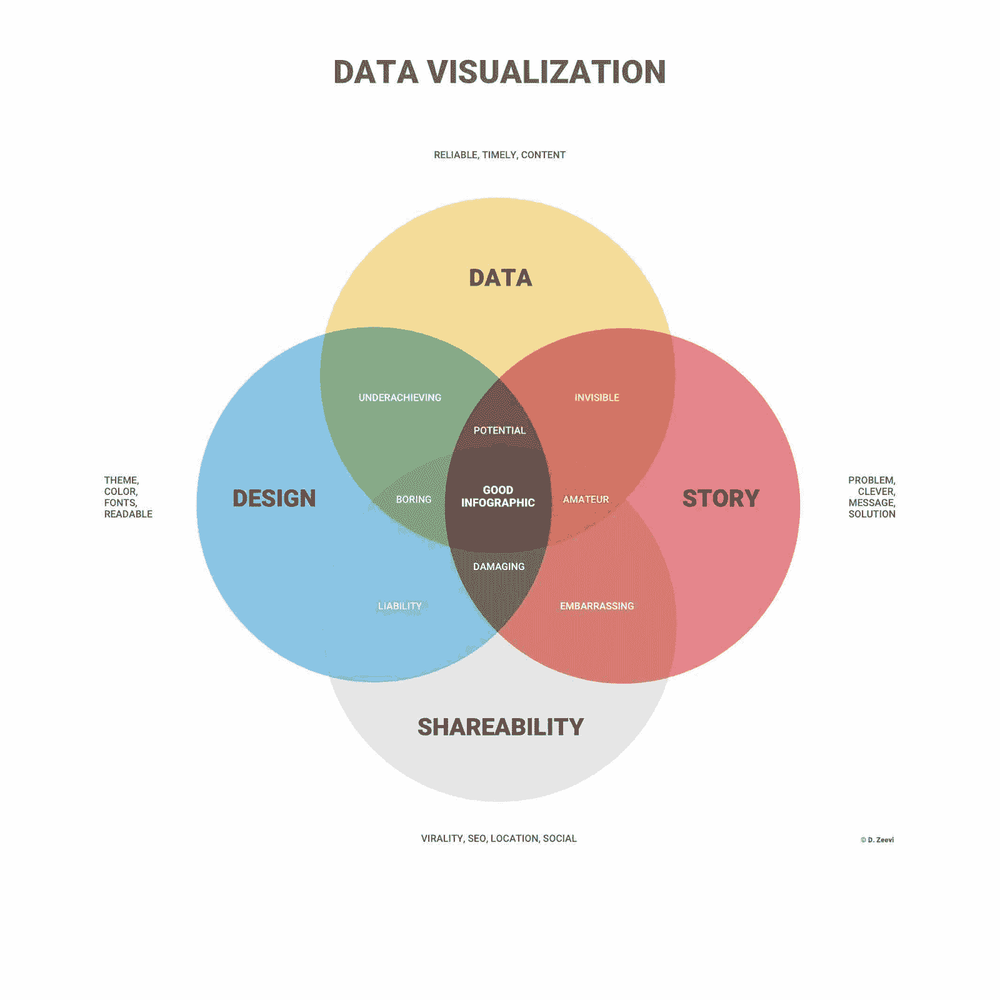
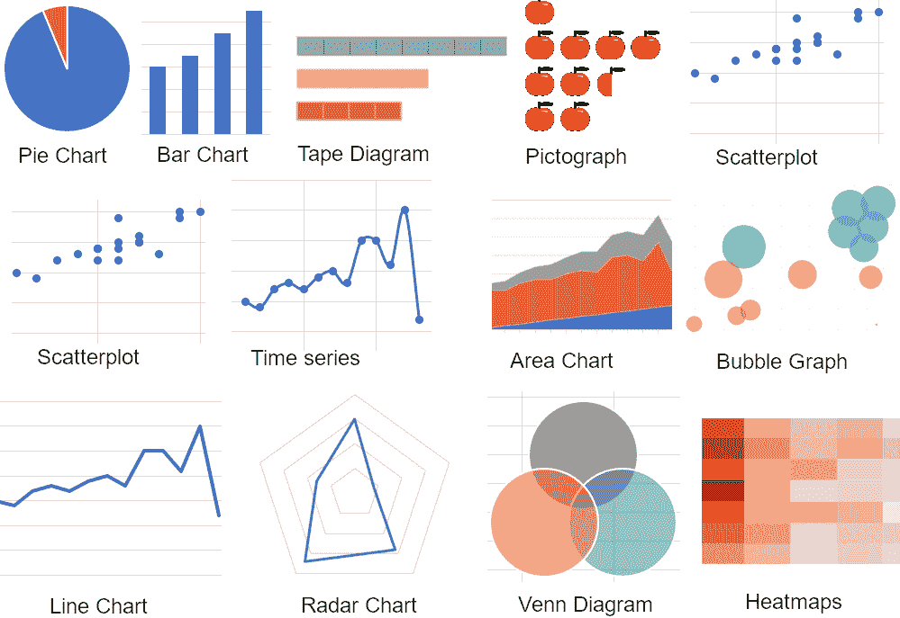

# 数据可视化：有效展示复杂信息

> 原文：[`www.kdnuggets.com/data-visualization-presenting-complex-information-effectively`](https://www.kdnuggets.com/data-visualization-presenting-complex-information-effectively)

数据可视化的目的是以一种清晰易懂的方式展示复杂数据，并吸引观众。可视化使传达整体信息变得简单，突出关键洞察，并且在引导观众得出结论方面非常具有说服力。

在本文中，我们将探讨如何通过数据可视化有效地展示复杂信息，我们将提供一个简单的五步指南，并讨论其好处，还会提供一些应用案例。

* * *

## 我们的三大课程推荐

 1\. [Google 网络安全证书](https://www.kdnuggets.com/google-cybersecurity) - 快速入门网络安全职业。

 2\. [Google 数据分析专业证书](https://www.kdnuggets.com/google-data-analytics) - 提升你的数据分析能力

 3\. [Google IT 支持专业证书](https://www.kdnuggets.com/google-itsupport) - 支持你的组织 IT

* * *

# 什么是数据可视化？

数据可视化以[图形方式](https://www.kdnuggets.com/data-visualization-presenting-complex-information-effectively)表示数据和信息，使其易于理解。可视化可以包括图表、地图、图形、信息图表和其他帮助简化数据的元素。这使得识别模式和趋势、发现不一致性和异常值变得简单，并帮助观众得出所展示的数据结论。

图片来源：[infogram](https://infogram.com/page/data-visualization)

数据可视化在向公司内的非技术人员展示复杂且可能令人困惑的数据时也非常有效。这可以帮助关键决策者在批准新项目或将预算分配给某个部门时，例如。

# 数据可视化的优势是什么？

作为人类，我们的眼睛会立即被模式、颜色和形状吸引，我们可以瞬间区分某些元素。大企业的品牌和标志[就是这种现象的典型例子](https://blog.hubspot.com/marketing/branding)，几乎全世界的人都能识别出那大大的黄色‘M’或那著名苹果的轮廓。

数据可视化基于这些人类感知，能够吸引观众的兴趣，并保持人们对信息的关注。有效使用数据可视化可以成为一个令人惊叹的讲故事工具，以一种引人入胜和有说服力的方式引导观众。

正如之前讨论的那样，数据可视化在将复杂和混乱的数据转化为更易于理解的内容方面非常有效，尤其是当它呈现给非技术人员或不熟悉该主题的观众时。

可视化还使得[分析大数据](https://www.oracle.com/big-data/what-is-big-data/)成为可能，这些数据非常庞大、复杂，

这种快速变化的环境使得通过传统手段无法处理。这为企业提供了新的机会，能够发现新的见解和趋势，并提供竞争优势。

数据可视化的其他关键用途包括可视化两个元素之间的关系和模式、快速分享关键信息，以及以互动方式探索新的商业机会。

# 数据可视化的挑战

要完全理解数据可视化，我们不能只关注其优点，还需要了解其局限性，以确定何时以及何地可以使用。

一个缺点是用户错误多于技术故障，即在数据点数量众多时可能会做出不准确的假设。没有经验的用户也可能选择不良或不正确的设计，以一种混淆观众或实现过多偏见的方式可视化数据。

另一个需要避免的问题是自动认为任何相关性都可以与某种原因关联。当然，在许多情况下，相关性确实代表了有价值的见解或趋势，但并非总是如此，巧合也会发生。

最后，有时很容易被华丽的图形和互动图表所吸引，忽视了关键的信息和可视化的整体目标。像任何类型的报告和演示技巧一样，重点是关键的，以有效地传达关键信息。

# 数据可视化：使用案例

现在我们了解了数据可视化是什么、它的好处以及在设计和呈现报告时需要避免的事项，我们来考虑一下它在一些常见使用案例中的应用。

+   数据可视化可以提供先进的营销分析[以帮助推动决策](https://improvado.io/blog/advanced-marketing-analytics-an-overview-of-the-top-techniques)，发现新趋势和市场细分，同时改善当前的营销活动。数据可能包括网站流量和页面表现，帮助优化网站内容以提高转化率。

+   风险管理还可以依赖数据可视化来迅速突出业务运营或网络安全中的任何问题。例如，通过分析历史数据并以引人入胜的方式呈现，可以轻松识别和缓解风险，避免它们造成任何干扰。

+   在销售中，CRM 工具使企业能够以视觉吸引人的方式展示数据，从而简化内部团队和客户的理解。此外，还有针对非常特定行业的专业 CRM 工具。例如，屋顶承包商可以使用[屋顶 CRM 软件](https://www.jobnimbus.com/)而不是通用选项。这种定制的方法确保数据可视化变得易于访问并适用于各种业务。

# 5 步实现有效的数据可视化

如果遵循最佳实践并明确数据分析的目的和受众，那么有效地使用数据可视化可能相对简单。

以下是五个步骤，说明如何通过数据可视化有效展示复杂数据。

## 1\. 确定受众是谁

创建数据可视化的第一步是充分了解受众的身份、他们的知识水平和技术专长。如果你对这些人有很好的了解，那么你可能也会知道他们的注意力跨度和对主题的兴趣。

为了使数据可视化有效，你必须完全理解受众的期望和目标，并以适合他们需求的格式和设计呈现数据。

## 2\. 去除不必要的复杂性

设计数据可视化时，简洁至关重要，需要去除任何可能分散或混淆受众的多余元素。整体信息应该非常清晰，没有任何杂乱。为此，可以采用引人注目且一致的配色方案、清晰且合适大小的字体，并利用空白、网格和边距来组织页面布局。大型标题、图例和标签也有助于更清楚地解释内容。

## 3\. 使用相关图表

图片来源于[polymersearch](https://www.polymersearch.com/blog/data-visualization)

相关性对高效的数据可视化至关重要，因此建议[使用正确的图表](https://chartio.com/learn/charts/essential-chart-types-for-data-visualization/)和图形来展示数据。例如，折线图是展示趋势的推荐方式，而散点图展示关系和相关性，饼图或甜甜圈图则可以显示百分比。

## 4\. 创建故事

数据可视化应该不仅仅是冰冷的硬数据，它应该有一个清晰的故事，能够吸引受众并逐步得出结论。在深入数据之前，确保包括任何相关的背景信息，并突出关键点以确保受众理解。

## 5\. 测试你的数据可视化

最后的步骤是测试数据可视化，以便在向观众展示之前进行优化。确保关键点清晰，数据准确，图表和图形易于理解。让同事对可视化进行交叉检查是发现任何错误、打字错误或不一致之处的最佳方法之一，他们还可以提供关于设计和内容是否吸引人的诚实反馈。

# 总结：有效展示复杂信息

数据可视化已成为展示大数据和发现新见解及趋势的关键，特别是在销售和营销领域。通过这种方式展示数据，可以吸引观众，并以易于理解的方式呈现复杂的信息。

这可以帮助更好地理解组织内的大数据和分析，从而改善决策制定并提升运营效率。

**[Nahla Davies](http://nahlawrites.com/)** 是一名软件开发人员和技术作家。在全职从事技术写作之前，她曾担任过 — 除了其他有趣的职位 — 一家《Inc. 5000》体验品牌组织的首席程序员，该组织的客户包括三星、时代华纳、Netflix 和索尼。

### 了解更多主题

+   [数据分析：四种有效分析数据的方法](https://www.kdnuggets.com/2023/04/data-analytics-four-approaches-analyzing-data-effectively.html)

+   [如何有效使用 Pandas 的 GroupBy](https://www.kdnuggets.com/2023/01/effectively-pandas-groupby.html)

+   [如何有效使用 Docker 标签管理镜像版本](https://www.kdnuggets.com/how-to-use-docker-tags-to-manage-image-versions-effectively)

+   [解决 5 个复杂 SQL 问题：棘手查询解析](https://www.kdnuggets.com/2022/07/5-hardest-things-sql.html)

+   [Python 字符串匹配，无需复杂的 RegEx 语法](https://www.kdnuggets.com/2023/02/python-string-matching-without-complex-regex-syntax.html)

+   [HuggingGPT：解决复杂 AI 任务的秘密武器](https://www.kdnuggets.com/2023/05/hugginggpt-secret-weapon-solve-complex-ai-tasks.html)
