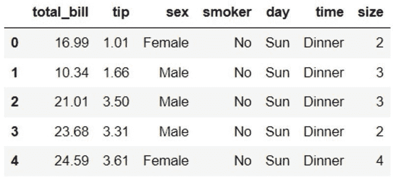
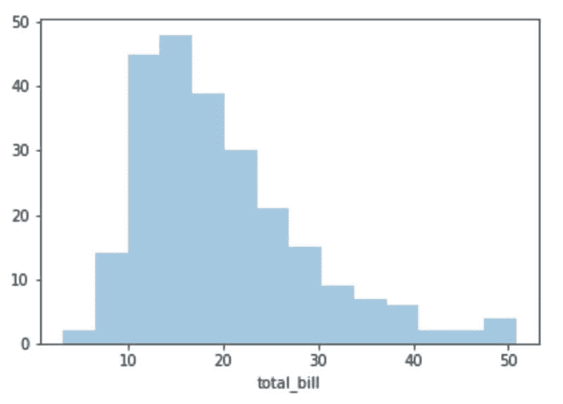
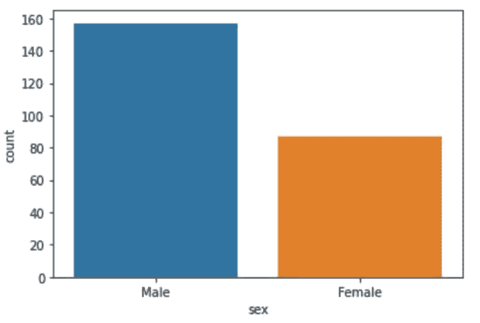
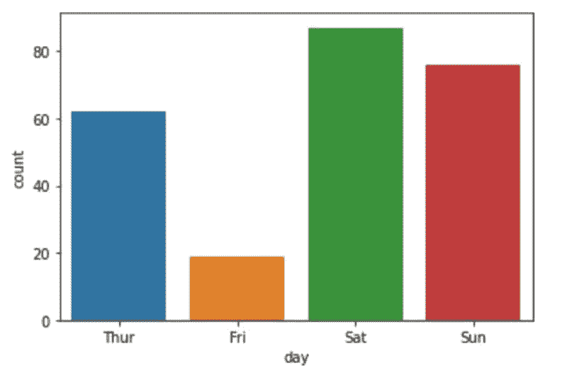
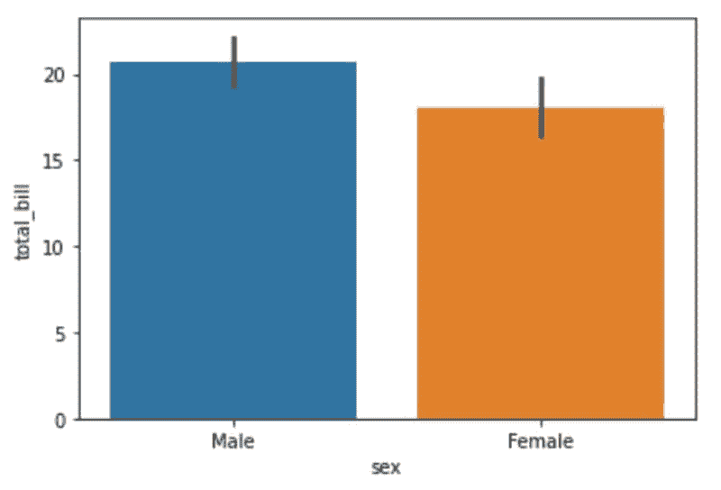
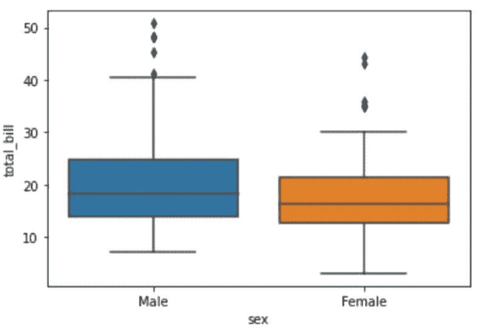
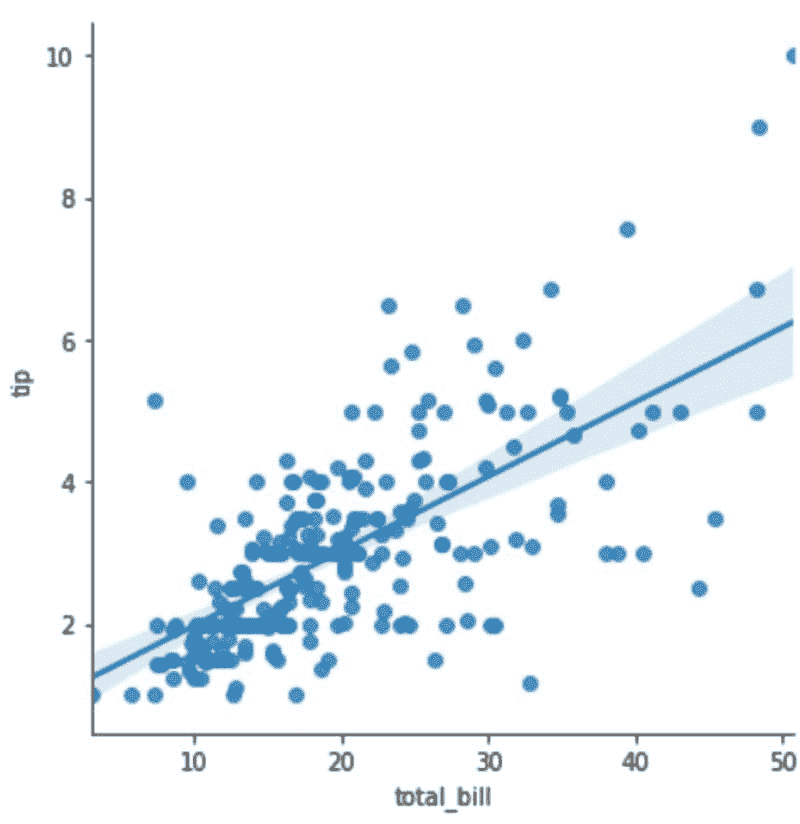
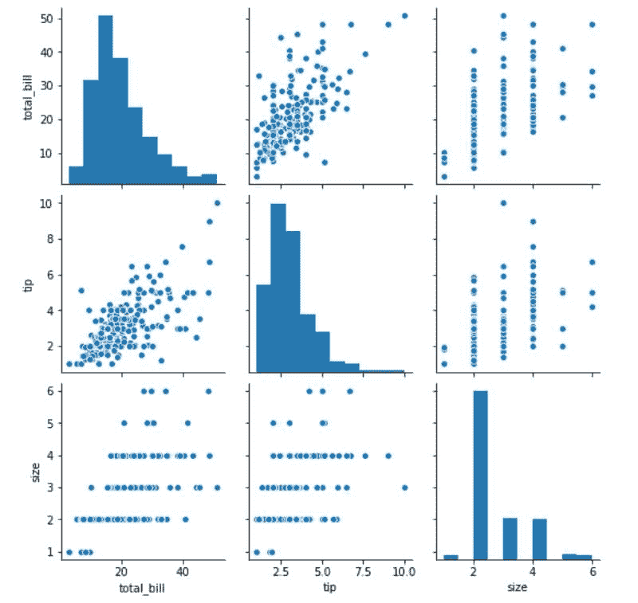

# 使用 Seaborn 进行 Python 数据可视化

> 原文：[`www.kdnuggets.com/2022/04/data-visualization-python-seaborn.html`](https://www.kdnuggets.com/2022/04/data-visualization-python-seaborn.html)

在我的数据科学工作中，我构建了不少预测算法，并编写了复杂的 SQL 查询来分析数据趋势。

所有这些分析需要转化为洞察，并向利益相关者解释，以便他们能够决定接下来的业务决策。

* * *

## 我们的前三大课程推荐

 1\. [谷歌网络安全证书](https://www.kdnuggets.com/google-cybersecurity) - 快速进入网络安全职业生涯。

 2\. [谷歌数据分析专业证书](https://www.kdnuggets.com/google-data-analytics) - 提升你的数据分析技能

 3\. [谷歌 IT 支持专业证书](https://www.kdnuggets.com/google-itsupport) - 支持你所在组织的 IT

* * *

将复杂信息拆解给非技术人员的最佳方式是创建易于消化的可视化。这可以是 PowerPoint 演示文稿中的独立图表，一系列 Jupyter Notebook 中的可视化，或者 Tableau 上的交互式仪表板。

数据可视化也可以为你对数据的理解和解读提供帮助。你可以构建图表来帮助你一眼看出不同变量之间的关系。

在这篇文章中，我将教你如何使用 Seaborn 库在 Python 中进行数据可视化。在本教程结束时，你将对以下概念熟悉：

+   可视化数值数据和分类数据的技术

+   单变量、双变量和多变量分析之间的区别

+   使用 Seaborn 创建回归图和配对图

+   可视化变量的分布。

# 先决条件

要跟随本教程，你需要在设备上安装 Jupyter Notebook。如果你还没有，可以通过简单的 ‘pip’ 安装 [Seaborn](https://seaborn.pydata.org/) 库。

# 加载数据集

在本教程中，我们将使用内置于 Seaborn 库的数据集，因此无需从外部数据源下载。

```py
import seaborn as sns
df = sns.load_dataset('tips')
df.head()
```



上述数据框包含与餐厅顾客相关的 7 个变量：收到的小费（以美元计）、账单金额（以美元计）、付款人的性别、是否有吸烟者、日期、时间和聚会规模。

借助数据可视化，我们将尝试揭示上述数据集中的潜在模式。

# 单变量分析

单变量分析为我们提供了数据集中一个变量的洞察，并允许我们更好地探索和理解它。这是最简单的统计分析形式。

在本教程中，我们将探讨两种用于进行单变量分析的图表——直方图和计数图。

## 直方图

首先，让我们查看“total_bill”变量的分布。这将使我们了解餐馆单次用餐的价格范围。

```py
sns.distplot(df['total_bill'],kde=False)
```



上图是“total_bill”变量的简单直方图。一眼就能看出，这家餐馆的一顿饭通常花费在$10 到$25 之间，由于有些顾客点了价格超过$50 的更贵的食物，导致了正偏态。

## 计数图

现在，让我们查看餐馆中男性和女性顾客的数量，以确定哪个性别更频繁地光顾这家餐馆。

```py
sns.countplot(x='sex',data=df)
```



餐馆的男性顾客几乎是女性顾客的两倍。

让我们重复这个分析，以确定一周中最繁忙的日子——餐馆交易量最高的日子：

```py
sns.countplot(x='day',data=df)
```



在所有记录的四天中，餐馆在周六的顾客人数最多，其次是周日。令人惊讶的是，周五的交易量最低。

# 双变量分析

双变量分析涉及查找两个变量之间的关系。为此，我们将创建条形图、箱型图和回归图。

## 条形图

现在，让我们尝试可视化两个变量之间的关系——“性别”和“total_bill”，以查看男性和女性在外出就餐时花费是否存在差异。

```py
sns.barplot(x='sex',y='total_bill',data=df)
```



看起来男性在这家餐馆的单次账单花费略高于女性，尽管差异不显著。

## 箱型图

让我们创建一个箱型图，以进一步了解男性和女性顾客花费之间的差异。

箱型图是一种了解变量分布的有用方式，并为我们提供了数据点的五数概括——最小值、第一个四分位数、中位数、第三个四分位数、最大值。

要在 Seaborn 中创建箱型图，请运行以下代码行：

```py
sns.boxplot(data=df, x='sex', y='total_bill')
```



一眼看去，我们可以看出，男性和女性顾客的中位花费几乎相同——大约在$15-$19 之间。然而，最低和最高花费之间存在很大的差异。

有些女性顾客的用餐花费低至$5，而最高花费约为$30。这可能是因为女性通常比男性吃得少，或者更倾向于小团体就餐。

此外，由于社会习惯，男性更有可能在约会或与较大群体的人外出时支付餐费，这可能是为什么最昂贵的账单都在他们名字下。

## 回归图

回归图是可视化两个数值变量之间关系的最佳方式。使用 Seaborn 的 lmplot() 函数，可以创建回归线以演示 X 和 Y 之间的相关性。

在这种情况下，让我们看看“total_bill”和“tip”之间的关系。创建图表之前的初步假设是更高的账单价格意味着小费的增加。

```py
sns.lmplot(x='total_bill',y='tip',data=df)
```



上面的图表验证了我们的假设。更高的账单与更高的小费相关联，并且观察到两个变量之间有正线性关系。

# 多变量分析

最后，我们将通过一个多变量分析的例子——对许多不同变量的统计分析。

```py
sns.pairplot(df)
```



在 Seaborn 中创建一个 pairplot 允许我们一次性可视化数据集中每个数值变量之间的关系。

变量与自身的关系以直方图形式显示，而与其他变量的相关性则以散点图形式显示。

Seaborn 的 pairplot() 方法在分析具有多个数值特征的数据集时非常有用。在这种情况下，例如，有 3 个数值变量，将它们的关系在一个图表中查看比创建 9 个单独的可视化要容易得多。

# 使用 Python 进行数据可视化——下一步

在本教程中，我们了解了使用 Seaborn 库的数据可视化基础知识。我们学习了如何创建图表，以帮助我们进行单变量、双变量和多变量分析——所有这些都使我们能够更好地理解手头的数据。

正如你在本文中看到的，数据可视化并不难实现，也不需要你编写大量复杂的代码。

你只需知道为不同类型的分析创建合适的图表。例如——回归图用于可视化两个数值变量，或者条形图用于一个数值变量和一个类别变量。

此外，在创建任何类型的可视化之前，务必确保你有一个明确的问题。可视化的目的是告诉你（或其他人）关于数据的一些你尚未知道的东西。

在我们上面创建的可视化中，例如，我们着手了解男性是否在餐馆花费比女性更多的餐费。然后，我们决定通过条形图来探讨性别与总账单金额之间的关系。

这篇文章是入门级的，仅仅触及了你可以使用 Seaborn 库做的事情的表面。如果你想深入了解可以用 Seaborn 构建的不同类型的图表（总共有 14 种），我建议你观看[这个](https://www.youtube.com/watch?v=6GUZXDef2U0)小时的 YouTube 教程。

**[Natassha Selvaraj](https://www.natasshaselvaraj.com/)** 是一位自学成才的数据科学家，热衷于写作。你可以通过[LinkedIn](https://www.linkedin.com/in/natassha-selvaraj-33430717a/)与她联系。

### 更多相关话题

+   [KDnuggets 新闻 22:n16, 2022 年 4 月 20 日: 学习的顶级 YouTube 频道…](https://www.kdnuggets.com/2022/n16.html)

+   [使用 Seaborn 创建美丽的直方图](https://www.kdnuggets.com/2023/01/creating-beautiful-histograms-seaborn.html)

+   [使用 Matplotlib 和 Seaborn 创建可视化](https://www.kdnuggets.com/creating-visuals-with-matplotlib-and-seaborn)

+   [数据科学、数据可视化和…的顶级 38 个 Python 库](https://www.kdnuggets.com/2020/11/top-python-libraries-data-science-data-visualization-machine-learning.html)

+   [Python 如何用于数据可视化？](https://www.kdnuggets.com/2022/12/python-used-data-visualization.html)

+   [数据科学的绘图和数据可视化](https://www.kdnuggets.com/2022/06/plotting-data-visualization-data-science.html)
