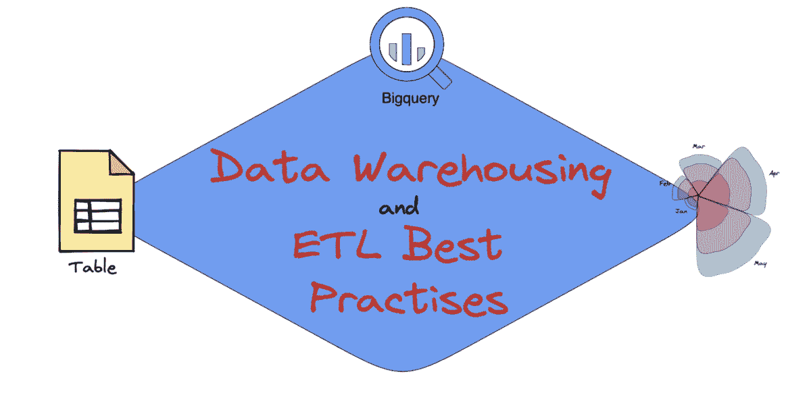

# 数据仓库和 ETL 最佳实践

> 原文：[`www.kdnuggets.com/2023/02/data-warehousing-etl-best-practices.html`](https://www.kdnuggets.com/2023/02/data-warehousing-etl-best-practices.html)

图片来源：作者

# 什么是数据仓库？

* * *

## 我们的三大课程推荐

 1\. [谷歌网络安全证书](https://www.kdnuggets.com/google-cybersecurity) - 快速进入网络安全职业生涯。

 2\. [谷歌数据分析专业证书](https://www.kdnuggets.com/google-data-analytics) - 提升你的数据分析技能

 3\. [谷歌 IT 支持专业证书](https://www.kdnuggets.com/google-itsupport) - 支持你的组织 IT

* * *

数据仓库是一个集中存储数据、信息和其他变量的中央库，可以进行分析以帮助企业做出明智决策。例如，它可以用于衡量性能或获取验证。

它涉及历史数据的维护，从而使组织中的知识工作者及其他人能够在决策过程中受益。数据仓库为公司提供：

+   单一的数据来源

+   一致性

+   有效的决策过程

# 什么是 ETL？

ETL 代表 **提取**、**转换** 和 **加载**。它是将数据从多个来源移动到一个集中式单一数据库的过程。它以从源头 *提取* 原始数据开始，然后在单独的处理服务器上 *转换*，最后 *加载* 到目标数据库中。

# 数据仓库和 ETL 常见错误

以下是人们在数据仓库和 ETL 过程中常遇到的错误：

+   对所有源数据缺乏理解

+   缺乏历史数据

+   花费太多时间在源数据的分析上

+   花费太多时间在测试提取过程上

+   同意一组规则

+   未记录 ETL 过程

+   不愿意接受新技术

# ETL 最佳实践

## 1\. 为你的 ETL 过程创建一个路线图

无论你在生活中做什么，最好还是先制定一个计划，而不是直接跳入深渊。你可能需要将其写下来，或者创建一个可视化的过程。但是，路线图是必不可少的，因为它让你可以回过头来进行调整，并通过反复试验来学习。

## 2\. 早期填充测试数据

在创建你的路线图时，你将考虑最终目标。在你的 ETL 过程中，你需要理解“你想填充什么数据模型？” 将与你的最终目标相关的样本数据填充到数据仓库中，将使你的过程更加有效。这有助于你保持任务的方向并制定规则。

## 3\. 审查源数据和系统

源系统包含传送到数据仓库的数据。你可以使用分析工具来帮助你识别 NULL 值或了解列的用途。与其花时间在分析查询上，不如审查你的源系统，以改善你的 ETL 过程。

你需要识别每个源表中的主键定义以及任何相关的信息/数据。将此实践作为一个验证阶段，以确保你对输入到数据仓库中的数据有信心。

## 4\. 数据类型问题

在查询数据时，你不希望遇到由于数据类型问题而产生的各种错误。这是一个应该在早期处理的问题，以防止在后续过程中引发问题。

## 5\. 提取数据

从源系统中提取数据是一个重要阶段，如果操作不当，可能会引发许多问题。以下是一些建议：

+   在源系统中拥有时间戳列将使你能够依赖于该交易日期，并确保所有必要的数据都已被提取。

+   以增量步骤提取数据将有助于处理非常大的源表。

+   记录提取过程所需的时间，因为可能存在改进的方法。

所有数据提取过程应经过彻底审查和验证。

## 6\. 汇总 ETL 日志中的所有活动

最佳实践之一，不仅适用于数据仓库，也适用于生活中的其他方面，就是记录一切。回到一个曾经写满不同想法和过程的白板，总比回到一个空白的白板要好。

通过 ETL 日志，你可以找到有价值的信息，如提取时间、行的变化、错误等。

## 7\. 警报

观察 ETL 过程可能会让人感到不知所措。你希望保持关注，但有时它可能会比你想象的更长时间，你可能会发现自己在不合时宜的时间还在忙碌。一些公司创建了消息和警报程序，通知他们任何需要注意的致命错误。

# 结论

尽管有人可能会说这些是每个人在处理数据仓库和 ETL 时应该做的实践，但你会惊讶于这些实际上是许多公司/团队面临的主要挑战。

如果你想了解更多关于数据仓库和 ETL 的内容，请阅读：

+   为什么组织需要数据仓库

+   SQL 和数据集成：ETL 与 ELT

+   ETL 与 ELT：数据集成对决

**[Nisha Arya](https://www.linkedin.com/in/nisha-arya-ahmed/)** 是一位数据科学家和自由技术写作员。她特别关注提供数据科学职业建议或教程以及围绕数据科学的理论知识。她还希望探索人工智能如何或能在延长人类寿命方面发挥作用。作为一名热衷学习者，她寻求拓宽自己的技术知识和写作技能，同时帮助指导他人。

### 更多相关内容

+   [初学者的数据仓库与 Snowflake](https://www.kdnuggets.com/2022/02/data-warehousing-snowflake-beginners.html)

+   [2021 年最佳 ETL 工具](https://www.kdnuggets.com/2021/12/mozart-best-etl-tools-2021.html)

+   [SQL 与数据集成：ETL 和 ELT](https://www.kdnuggets.com/2023/01/sql-data-integration-etl-elt.html)

+   [11 种云计算和数据迁移到 AWS 云的最佳实践](https://www.kdnuggets.com/2023/04/11-best-practices-cloud-data-migration-aws-cloud.html)

+   [将 ChatGPT 融入数据科学工作流程：技巧与最佳实践](https://www.kdnuggets.com/2023/05/integrating-chatgpt-data-science-workflows-tips-best-practices.html)

+   [MLOps：最佳实践及其应用方法](https://www.kdnuggets.com/2022/04/mlops-best-practices-apply.html)
