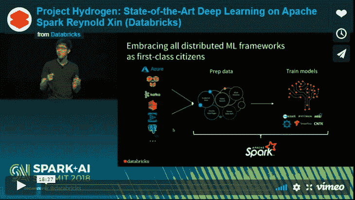

# 氢项目是基于 Apache Spark 的新倡议，旨在支持 AI 和数据科学

> 原文：[`www.kdnuggets.com/2018/08/databricks-project-hydrogen-apache-spark.html`](https://www.kdnuggets.com/2018/08/databricks-project-hydrogen-apache-spark.html)

 评论

**由 [Reynold Xin](https://www.linkedin.com/in/reynoldxin/)，[Databricks](https://databricks.com/) 的联合创始人**

### **问题 #1 - 什么是氢项目？**

[氢项目](https://databricks.com/session/databricks-keynote-2) 旨在通过显著提高分布式深度学习和机器学习框架在 Spark 上的性能和故障恢复，来支持 Apache Spark^(TM) 上所有分布式机器学习框架的一流支持。

### **问题 #2 - 氢项目与其他机器学习和 AI 开源项目有什么不同？**

* * *

## 我们的前 3 名课程推荐

 1\. [谷歌网络安全证书](https://www.kdnuggets.com/google-cybersecurity) - 快速入门网络安全职业。

 2\. [谷歌数据分析专业证书](https://www.kdnuggets.com/google-data-analytics) - 提升您的数据分析水平

 3\. [谷歌 IT 支持专业证书](https://www.kdnuggets.com/google-itsupport) - 支持组织的 IT

* * *

大多数关于机器学习和 AI 的开源项目都专注于算法和分布式训练框架。

氢项目是一个新的 SPIP（Spark 项目改进提案），引入了自项目开始以来 Spark 调度的最大变化之一，自最初的 600 行代码以来。

大数据和 AI 密不可分：最佳的 AI 应用需要大量不断更新的训练数据来构建最先进的模型。 AI 一直是大数据和 Apache Spark 最令人兴奋的应用之一。部分由深度学习驱动，我们看到越来越多的 Spark 用户希望将 Spark 与用于最先进训练的分布式机器学习框架集成。

问题在于，大数据框架如 Spark 和分布式深度学习框架由于大数据任务执行方式与深度学习任务执行方式之间的差异，难以协同工作。例如，在 Spark 中，每个任务被分为多个相互独立的子任务。这被称为“极其并行”，这是一个大规模的数据处理方式，可以扩展到 PB 级别的数据。

然而，深度学习框架使用不同的执行方案。它们假设任务之间有完全的协调和依赖。这意味着这种模式优化了常量通信，而不是大规模数据处理，以扩展到 PB 级数据。

氢项目被定位为解决这个困境的潜在方案。

### **问题 #3 - 这个项目将为贡献者和用户提供什么？**

氢项目引入了 Spark 的新调度原语——群组调度。

在这种模式下，任务调度器采用“全或无”的方式。这意味着要么一次性调度所有任务，要么一个任务也不调度。这实际上解决了 Spark 与分布式 ML 框架需求之间的根本不兼容性。

现在用户可以使用一个简单的 API 来引入一个障碍函数。障碍函数指示 Spark 是否在机器学习管道的每个阶段使用令人尴尬的并行模式或群组调度器模式。

例如，新的群组调度器模式可以用于使用分布式训练框架的模型训练，而令人尴尬的并行可以在数据准备之前使用，也可以在模型训练后用于模型推理。

### **问题 #4 - 你认为氢项目如何支持对分析和机器学习的广泛需求？**

氢项目的目标是将所有分布式机器学习框架作为 Spark 上的一等公民。它真正将数据处理与机器学习统一，特别是 Spark 上的分布式训练。

我们希望使其他框架在 Spark 上运行得像 MLlib 一样简单，无论是 TensorFlow 还是 Horovod，或未来流行的 ML 框架。这大大扩展了可以在 Spark 上有效用于深度学习应用的 ML 框架生态系统。

新的 API 还不是最终版本，但预计将很快被添加到核心 Apache Spark 项目中。

### **问题 #5 - 你认为开发者在整合不同的数据集和开源项目方面做得如何？我们是否更接近于统一的分析理论，还是在使 AI 适应实际应用方面还有很多工作要做？**

人工智能（AI）具有推动颠覆性创新的巨大潜力，这些创新将影响地球上大多数企业。然而，大多数企业在 AI 方面的成功面临困难。为什么会这样？简单来说，AI 和数据被孤立在不同的系统和组织中。

Apache Spark 是第一个统一的分析引擎——它激发了这场革命，因为它是唯一一个真正将数据处理和机器学习结合在一起的引擎。通过氢项目，我们正在将 Spark 的内置优化扩展到 MLlib 之外，使开发者能够利用统一的数据处理和机器学习方法，使用 Spark 上的任何 ML 框架。

机器学习框架的多样化在生产 AI 应用时带来了其他下游影响，例如实验共享和跟踪以及模型推向生产。因此，我们刚刚推出了 [MLflow](https://dbricks.co/2M0rzGD)，这是一个新的跨云开源框架，旨在简化端到端的机器学习生命周期。

### **问题 #6 - 你认为 AI 需要多长时间才能成为“日常业务”？**

正如威廉·吉布森所说：“未来已经到来——只是分布得不太均匀。”

很少有公司在大规模和公司范围内成功实施 AI。这就是我们所说的 1% 问题。大多数公司——99%——由于拥有不一致的系统和技术，以及数据工程与数据科学家之间的组织隔阂，继续挣扎。要实现 AI，组织需要统一数据和 AI。

Apache Spark 是统一数据和 AI 的第一步，但仅此还不够——组织仍需管理大量基础设施。为了消除 AI 的障碍，公司必须利用统一分析。统一分析将数据处理与 AI 技术结合起来，使 AI 对企业组织而言变得更易实现，并使他们能够加速 AI 计划。统一分析使企业更容易在各种孤立的数据存储系统之间建立数据管道，并准备标记数据集以进行模型构建，从而允许组织在现有数据上进行 AI，并在海量数据集上迭代进行 AI。

统一分析平台为数据科学家和数据工程师提供了在整个开发到生产生命周期中有效协作的能力。成功将领域数据大规模统一 **并且** 将这些数据与最佳 AI 技术统一的组织将是 AI 成功的组织。

欲了解更多信息，请观看 Reynold Xin 关于 Hydroge 项目的演讲：

https://databricks.com/session/databricks-keynote-2

**简介**: [Reynold Xin](https://www.linkedin.com/in/reynoldxin/) 是一位计算机科学家和工程师，专注于大数据、分布式系统和云计算。他是 [Databricks](https://databricks.com/) 的联合创始人和首席架构师。

**相关内容:**

+   [使用 MLflow 管理机器学习生命周期——第一部分](https://www.kdnuggets.com/2018/07/manage-machine-learning-lifecycle-mlflow.html)

+   [Apache Spark 介绍](https://www.kdnuggets.com/2018/07/introduction-apache-spark.html)

+   [AI 和数据科学中的十大角色](https://www.kdnuggets.com/2018/08/top-10-roles-ai-data-science.html)

### 更多相关主题

+   [RedPajama 项目：一个开放源代码的 LLMs 民主化倡议](https://www.kdnuggets.com/2023/06/redpajama-project-opensource-initiative-democratizing-llms.html)

+   [AI for Ukraine 是 AI HOUSE 为支持乌克兰科技社区而推出的新教育项目……](https://www.kdnuggets.com/2022/08/ai-house-ai-ukraine-new-educational-project-support-ukrainian-tech-community.html)

+   [Mercury 概述：创建数据科学投资组合和……](https://www.kdnuggets.com/2022/05/overview-mercury-creating-data-science-portfolio-notebook-based-webapps.html)

+   [支持向量机：一种直观的方法](https://www.kdnuggets.com/2022/08/support-vector-machines-intuitive-approach.html)

+   [支持向量机的温和介绍](https://www.kdnuggets.com/2023/07/gentle-introduction-support-vector-machines.html)

+   [语义向量搜索如何改变客户支持互动](https://www.kdnuggets.com/how-semantic-vector-search-transforms-customer-support-interactions)
