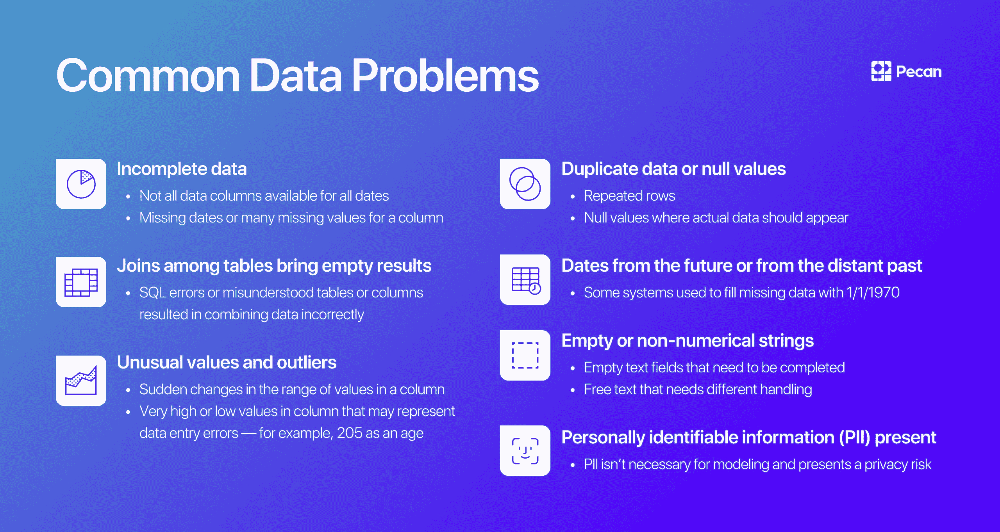
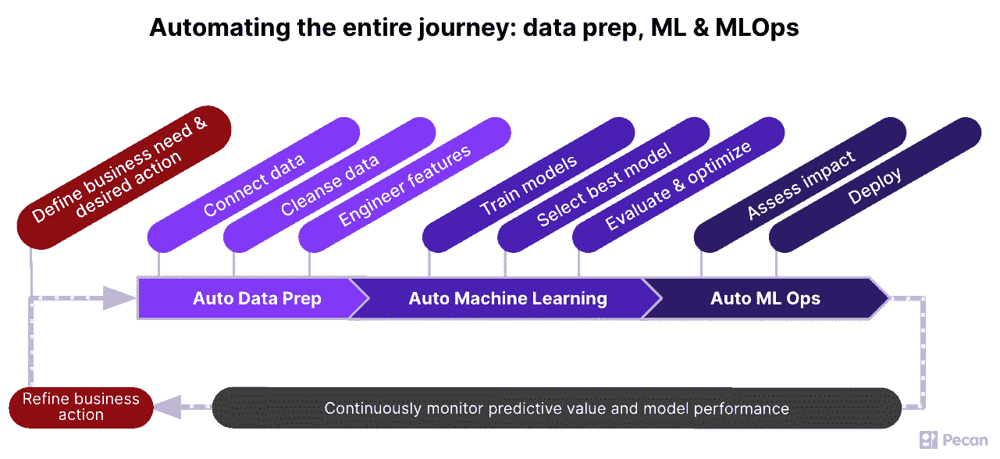

# 数据中心人工智能与表格数据

> 原文：[`www.kdnuggets.com/2022/09/datacentric-ai-tabular-data.html`](https://www.kdnuggets.com/2022/09/datacentric-ai-tabular-data.html)

图片由编辑提供

人工智能模型开始成为家喻户晓的名字真是太棒了。DALL-E、LaMDA 和 GPT-3 最近都曾风光一时。

* * *

## 我们的前三个课程推荐

 1\. [Google 网络安全证书](https://www.kdnuggets.com/google-cybersecurity) - 快速进入网络安全职业轨道

 2\. [Google 数据分析专业证书](https://www.kdnuggets.com/google-data-analytics) - 提升你的数据分析水平

 3\. [Google IT 支持专业证书](https://www.kdnuggets.com/google-itsupport) - 支持你的组织的信息技术

* * *

那么，掌握了表格数据的炫目、高性能模型在哪里？

尽管全球企业主要依赖表格数据，但计算机视觉和自然语言处理模型却抢尽了风头。学术研究和行业创新都集中在计算机视觉和自然语言处理上。这些工作带来了跨行业的惊人、改变世界的应用，如自动驾驶汽车、增强现实和接近人类水平的文本生成及对话工具。

同时，尽管表格数据对企业至关重要，但只有极少数的人工智能研究集中在改进处理这种数据格式的方法上。例如，在[计算机科学 arXiv](https://arxiv.org/search/cs)学术研究库中，提到“表格”的论文约有 900 篇，而“自然语言处理”的论文有超过 5,000 篇，“计算机视觉”的论文更是超过 81,000 篇。

你所知道的每一个电子表格都包含了表格数据。表格数据的捕捉和分析是我们拥有成千上万的数据库管理、商业智能、客户关系管理、企业资源计划、计算机科学以及其他商业工具的原因，这些工具创造了数万亿美元的市场价值。然而，表格数据的分析可以从更先进的方法中受益，包括数据准备、建模和部署过程的所有阶段。那么，为什么我们——广大的数据科学社区——不花更多时间和资源开发处理表格数据的技术呢？

我将探讨今天表格数据被忽视的三个主要原因，并建议一种趋势的变革——特别是数据中心人工智能——这是数据领域需要更广泛采纳的，包括人工智能在商业中的应用。

# 表格数据看起来不够吸引人，但却至关重要

对大多数人来说，电子表格并不完全激发灵感。更常见的，你会听到关于那些数据行列的枯燥乏味的抱怨。然而，即使对于那些稀有的电子表格爱好者，计算机视觉和自然语言处理项目也一直充满吸引力。让计算机理解图像或自然语言可能会让人感觉是在帮助推动数字化进程。相比之下，表格数据更像是用计算机的母语进行简单的对话。

然而，为了在企业中更广泛地推广人工智能并推动创新以提升收入驱动的 AI 举措，现在是时候了解一下表格数据的诱人之处了。

# 表格数据在研究中更难获取

计算机视觉和自然语言处理研究之所以能超越表格数据研究，另一个原因是这些项目的原材料更容易获得。互联网上有 [数十亿张照片](https://photutorial.com/photos-statistics/) 和 [数十亿](https://www.statista.com/chart/19058/number-of-websites-online/) 的网页包含文本，这为构建图像和语言项目的训练语料库提供了无限的可能性，这些项目为像 DALL-E 和 LaMDA 这样的强大模型提供了信息。

相比之下，公开可用的表格数据——特别是来自企业的数据——则显得相对稀缺。数据科学学生在同样的表格数据集上反复练习（比如鸢尾花数据集）。研究人员可能很难找到那些超出著名 [数据集库](https://archive.ics.uci.edu/ml/index.php) 的多样化表格数据集。可以理解的是，企业不愿意发布反映客户活动或影响其业务策略的内部数据，这些数据很可能是表格形式的。而且，别忘了，还有许多法规限制了在其指定用途之外共享这些数据。没有访问许多多样化、大规模且面向业务的数据集，表格数据方法的发展就停滞不前。

来自 [Pecan AI](https://www.pecan.ai/) 的图像

# 表格数据是不同的

一个像素代表了一个大而有限的可能性领域。无论是狗的照片还是孩子的蜡笔画，一篇短篇小说还是一首史诗诗歌：无论图像或文本的内容是什么，数字化和预处理将其重塑为机器学习算法可以使用的一致格式。

表格数据中缺乏这种基本的一致性是高效机器学习的一个主要挑战。图像和文本可能*看起来*更复杂——但找到大多数表格数据集中潜在的共同结构同样具有挑战性，甚至更具挑战性。表格中的每一列都是不同的，可能没有明确标识。数据类型可能没有提供或配置准确。例如，某列中的五位数字是代表家庭收入还是邮政编码？另一列中的 0 和 1 是表示“否”和“是”，还是代表另一种二进制变量？而且——永恒的问题——这个日期格式*是什么*？

这些不一致性和不确定性通常使得准备表格数据成为一项艰巨的任务，尤其是当数据表需要从组织中不同来源合并时。将来自不同来源的类似信息匹配并标准化为单一的建模流程可能很困难。难怪一些数据科学家 [仍然报告](https://www.datanami.com/2020/07/06/data-prep-still-dominates-data-scientists-time-survey-finds/#:~:text=In%20some%20surveys%20in%20the,equivalent%20of%20digital%20janitorial%20work.) 他们在数据准备任务上花费了超过 70%的时间，将其视为数字清洁工工作的等同物。

# 手工艺方法在数据准备和特征工程中的失败

由于表格数据可以采取多种形式，数据分析师和数据科学家采用了针对具体情况的方式来准备数据以供分析和建模。每个数据集都经历了独特的清理、合并、预处理和特征工程的组合，每个新项目都要重新发明这个过程。

表面上看，对每一个数据项目采用高度具体的“手工艺”方法似乎是个好主意。但实际上，这种极其耗时和繁琐的工作很少会有回报。它使数据项目的投资回报延迟数周甚至数月。数据科学家试图根据直觉和经验决定创建哪些新特征，但他们在特征工程和选择过程中无意中引入了自己的偏见。这种数据科学的特有成分减少了对机器学习独特价值的贡献的客观性。

尽管有其缺点，但即兴的数据准备方法仍然存在，因为普遍存在的观念认为每个表格数据集都是独特的。实际上，表格数据的不可预测元素在一定范围的情况下可能是相当可预测的。

图片来源于 [Pecan AI](https://www.pecan.ai/)

# 为特定的机器学习应用推导出可重复的数据准备和特征工程框架

当企业使用其数据进行与频繁业务问题相关的建模时——如客户流失或终身价值——他们通常依赖于类似的数据集。这些数据集通常共享共同的元素。如果你检查足够多的这些数据集，就有可能识别出一组数据准备和特征工程任务，这些任务在这些数据集上始终需要执行。认识到这些共同点是开发可重复过程的第一步。

通过相对狭窄的预测建模应用关注，数据准备和特征工程不必是一个情境性的、*临时*的过程，每个新的数据集和项目都要重新发明。相反，这些任务可以通过精心编写的代码进行自动化，并在大量数据和多个项目中高效执行。这种自动化的方法比数据科学中普遍存在的即兴过程要快得多，更高效。

有些人可能会犹豫是否自动化特征工程与数据清洗，但这个过程也应该被自动化。在深度学习中，我们允许模型构建合适的特征。但由于某些原因，我们仍然坚持为表格数据手动创建特征。对表格数据进行自动化特征工程可以消除偏差，而自动化允许从人类能够手动创建和检查的特征中创建、评估和选择最真正有用的特征。

最重要的是，一个经过深思熟虑、严格应用的方法也能最大限度地提高结果数据集的质量。因为最终，高质量的数据对机器学习的成功至关重要——这是人工智能专家今天更广泛承认的事实。

# 数据中心化必须包括表格数据

在人工智能领域的讨论中，越来越多地引用“数据中心化人工智能”的概念。正如[一个在线中心](https://datacentricai.org/)所说，数据中心化人工智能是“系统地工程化构建人工智能系统所用数据的学科”。像 Andrew Ng 这样的数据科学领袖普及了这个想法。然而，这些讨论再次集中在计算机视觉和自然语言处理应用上。

数据中心化人工智能的概念是对我们领域长期以来强调“海量数据”和不断完善和调整机器学习模型的平衡。数据中心化的观点认为，我们应该专注于*优质*数据，这些数据能够有效地训练即使是更简单的模型，以获得良好的性能。

这种观点还认为，算法创新和耗时的超参数调整只能在模型性能上带来有限的提升。然而，更加关注训练数据的质量可以在不重新发明每个新项目的算法轮子的情况下，为模型性能提供更显著的提升。

如果采用数据中心的方法处理表格数据、图像和文本数据会意味着什么？如上所述，表格数据可能难以解释，与图像或文本相比，数据集之间的关联性不那么明显。行和列可以包含多种数据，并意味着许多不同的事物。这种灵活性意味着*更*需要关注表格数据的质量。不幸的是，各种类型的数据错误在建模过程中可能会持续存在，数据专业人员可能在主观且不系统的特征工程过程中忽视潜在的有价值的特征。

假设我们花更多时间优化输入模型的表格数据质量。我们可以获得显著的性能提升——而无需使用最新的前沿算法或为每个项目手工构建工艺模型。

正如上述所述，通过精心设计的自动化，可以使数据清洗和特征工程过程变得更加可管理和可重复，这建立在在频繁的业务情境中常用的表格数据的重复框架之上。这种方法正是我共同创办的公司 [Pecan AI](https://www.pecan.ai/) 在处理与预测客户行为相关的高影响力业务用例时所采用的。我们已经自动化了大部分数据准备和特征工程过程，使预测分析变得更快、更易于访问，并且仍然异常准确。

尽管表格数据在商业中的重要性以及用这种数据形式进行创新的巨大潜力，但“表格”一词现在在数据中心人工智能的讨论中几乎消失了。现在是时候将更多的创新和自动化引入我们处理这种关键业务数据格式的方式了——特别是因为在商业应用中更好的模型表现可以显著影响企业的结果。我很高兴看到我们在技术和商业领域通过数据中心方法处理表格数据能取得什么成就。

[**诺姆·布雷泽斯**](https://www.linkedin.com/in/brezisnoam/?originalSubdomain=il) 是 Pecan AI 的联合创始人兼首席技术官，Pecan AI 是全球唯一将数据科学的力量直接交到商业智能、运营和收入团队手中的低代码预测分析公司。Pecan 使公司能够充分利用 AI 和预测建模的力量，而无需在员工中配备数据科学家或数据工程师。诺姆拥有特拉维夫大学的计算神经科学博士学位、认知心理学硕士学位以及经济学和心理学学士学位。

### 更多相关话题

+   [如何生成合成表格数据集](https://www.kdnuggets.com/2022/03/generate-tabular-synthetic-dataset.html)

+   [2022 年及以后顶级 AI 和数据科学工具和技术](https://www.kdnuggets.com/2022/03/nvidia-0317-top-ai-data-science-tools-techniques-2022-beyond.html)

+   [SQL Group By 和 Partition By 场景：何时及如何结合数据](https://www.kdnuggets.com/sql-group-by-and-partition-by-scenarios-when-and-how-to-combine-data-in-data-science)

+   [天高任翔：了解 JetBlue 如何利用 Monte Carlo 和 Snowflake…](https://www.kdnuggets.com/2022/12/monte-carlo-jetblue-snowflake-build-trust-improve-model-accuracy.html)

+   [IMPACT：数据可观测性峰会将于 11 月 8 日回归](https://www.kdnuggets.com/2023/10/monte-carlo-impact-the-data-observability-summit-is-back)

+   [SQL 和数据集成：ETL 和 ELT](https://www.kdnuggets.com/2023/01/sql-data-integration-etl-elt.html)
