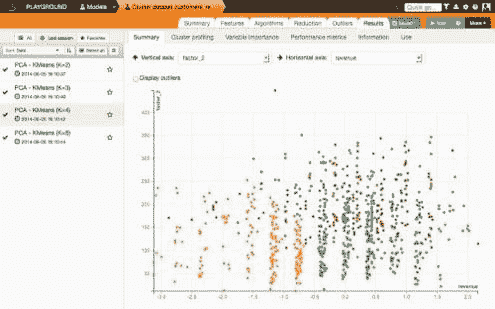

# Dataiku 数据科学工作室

> 原文：[`www.kdnuggets.com/2014/08/dataiku-data-science-studio.html`](https://www.kdnuggets.com/2014/08/dataiku-data-science-studio.html)

，一个完整的数据科学软件工具，为开发人员和分析师显著缩短了在构建预测应用时耗时的加载、清理、训练、测试和部署周期。我们 Dataiku 通过尝试捕捉数据科学家日常工作的方式构建了这款软件。我们认为统计软件需要适应大数据时代，在这个时代，数据集成和数据管道能力比以往任何时候都更为重要。

**加载和准备**

首先，DSS 能够直接快速连接到当前最常见的数据源（Hadoop、SQL、Cassandra、MongoDB、S3 等）和格式（CSV、Excel、SAS、JSON、Avro 等）。连接到数据源后，任何严肃的建模工作中的第一步是清理数据。如你所知，这一过程通常占据数据科学家多达 80% 的时间。为了加快这一进程，我们的工作室配备了强大的数据集成功能。首先，DSS 会自动推断数据的智能数据类型（如性别、国家、IP 地址、URL、日期等）。分析师可以利用这些智能数据类型以自动化的方式验证和转换数据（如从 IP 中提取国家、从日期中提取星期几等）。他们还可以在 DSS 的界面上执行更平凡的任务，如替换、分组、拆分、计算等，该界面会即时显示任何操作的可视化反馈。

**建模：从列到预测**

一旦数据清理完毕且丰富，用户可以训练监督式或非监督式模型。它会自动创建一个可调的特征工程管道，包括缺失值填补、虚拟变量编码、影响编码、特征生成和降维。

然后，它使用流行的 Scikit-Learn 和 H2O 框架中的算法训练不同的模型。用户可以比较模型、分析其性能，并通过 Web UI 调整所有参数。致力于白盒方法，DSS 允许高级用户为整个管道生成完整的 Python 源代码（用 Python 编写），以便他们可以随意修改。

**从模型到预测应用**

一旦模型建立，用户可以创建强大且可重复的工作流，支持重新训练或评分。这些工作流包括从原始数据到预测的完整数据流程。工作流引擎是增量的（例如，它可以在每小时更新的数据上增量工作）且稳健的（它可以智能地从部分数据暂时不可用的情况中恢复）。这些工作流可以通过 Python、R、SQL 或 Pig 中的自定义代码扩展，支持完全的 Hadoop 基础负载。预测值可以通过 REST API 访问或由 DSS 直接发布到各种目标（例如 ElasticSearch、FTP 服务器、内部数据仓库）。

我们构建了数据科学工作室，以缩短负载-清理-训练-测试周期，而不降低其复杂度；这是一个面向合格数据科学家的工具，同时对技术水平较低的商业智能或营销人员也保持可访问性。

免费社区版可用（限制为 100,000 行和一个用户）。工具的免费试用版也可在 [`www.dataiku.com/products/trynow/`](http://www.dataiku.com/products/trynow/) 获取。

**简要作者简介：**

 *Florian 是 Dataiku 的首席执行官。他在巴黎的一家搜索引擎技术公司 Exalead 开始了他的技术职业生涯。在那里，他领导了由 50 位才华横溢的数据极客组成的研发团队，直到公司在 2010 年的 1.5 亿美元退出。Florian 随后成为了社交游戏领域的欧洲领军企业 IsCool 的首席技术官。Florian 还曾作为自由职业首席数据科学家在多家公司工作，例如欧洲广告领军者 Criteo。Florian 定期在技术论坛如 Open World Forum 或巴黎 Java 用户组上发表演讲。*

**相关：**

+   GraphLab 会议，图分析和机器学习，旧金山 7 月 21 日

+   KDnuggets 分析、数据挖掘、数据科学软件调查 – 已分析

+   使用 H2O 深度学习，5 月 21 日网络讲座

### 相关主题

+   [在本地使用 LM Studio 运行 LLM](https://www.kdnuggets.com/run-an-llm-locally-with-lm-studio)

+   [免费使用 Lightning AI Studio](https://www.kdnuggets.com/using-lightning-ai-studio-for-free)

+   [停止学习数据科学以寻找目标，并寻找目标来…](https://www.kdnuggets.com/2021/12/stop-learning-data-science-find-purpose.html)

+   [数据科学最小需求：你需要了解的 10 项核心技能…](https://www.kdnuggets.com/2020/10/data-science-minimum-10-essential-skills.html)

+   [数据科学定义幽默：奇特的名言合集…](https://www.kdnuggets.com/2022/02/data-science-definition-humor.html)

+   [KDnuggets™ 新闻 22:n06，2 月 9 日：数据科学编程…](https://www.kdnuggets.com/2022/n06.html)
