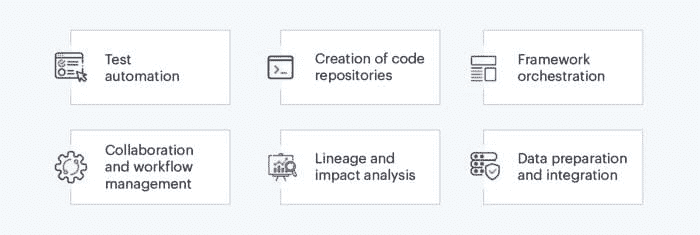

# DataOps：5 个你需要了解的关键点

> 原文：[`www.kdnuggets.com/2021/05/dataops-5-things-need-know.html`](https://www.kdnuggets.com/2021/05/dataops-5-things-need-know.html)

comments

**由 [Sigmoid](https://www.sigmoid.com/) 提供**

### **1\. 什么是 DataOps？**

* * *

## 我们的 Top 3 课程推荐

 1\. [谷歌网络安全证书](https://www.kdnuggets.com/google-cybersecurity) - 快速进入网络安全职业生涯。

 2\. [谷歌数据分析专业证书](https://www.kdnuggets.com/google-data-analytics) - 提升你的数据分析技能

 3\. [谷歌 IT 支持专业证书](https://www.kdnuggets.com/google-itsupport) - 支持你的组织 IT 工作

* * *

简而言之，DataOps 可以定义为一种方法论，它为数据管道提供了速度和敏捷性，从而提升数据质量和交付实践。**[DataOps 促成](https://www.sigmoid.com/data-devops/)** 了组织内部的更大协作，并在大规模推动数据项目。借助 **[自动化](https://www.sigmoid.com/case-studies/property-claim-estimation/)**，DataOps 改善了数据的可用性、可访问性和集成性。它将人员、流程和技术结合起来，为所有利益相关者提供可靠且高质量的数据。根植于敏捷方法论，DataOps 旨在通过持续交付分析洞察来提供最佳的消费者体验。

### **2\. DataOps 和 DevOps 有何不同？**

DataOps 通常被视为应用于数据分析的 DevOps。然而，DataOps 不仅仅是这样。它还结合了数据工程师和数据科学家的关键能力，为数据驱动的企业提供了一个强大的、过程驱动的结构。DevOps 结合了软件开发和 IT 运维，以确保系统开发生命周期中的持续交付。而 DataOps 还带来了数据链中关键参与者——数据开发者、数据分析师、数据科学家和数据工程师的专业能力——以确保数据流开发中的更大协作。此外，在比较 DataOps 和 DevOps 时，值得注意的是，DevOps 关注于转变软件开发团队的交付能力，而 DataOps 则通过数据工程师的帮助，强调分析模型和智能系统的转型。

### **3\. 为什么 DataOps 对数据工程至关重要？**

数据工程师在确保数据在整个分析流程中得到妥善管理方面发挥着重要作用。此外，他们还负责数据的最佳使用和安全。DataOps 通过提供工具、数据、代码和组织数据环境的端到端编排，帮助数据工程师促进关键功能领域。它可以促进团队之间的协作和沟通，以适应不断变化的客户需求。简单来说，DataOps 通过提供各数据利益相关者之间更大的协作，帮助数据工程师实现可靠性、可扩展性和灵活性，从而增强他们的能力。

### **4\. DataOps 工程师在实现先进企业分析中扮演什么角色？**

现在，DataOps 工程师的角色与数据工程师略有不同。DataOps 工程师仔细定义和管理数据开发的环境。这个角色还包括为数据工程师提供关于工作流的指导和设计支持。至于**[先进企业分析](https://www.sigmoid.com/ebooks-whitepapers/data-engineering-overcome-challenges-in-enterprise-analytics/)**，DataOps 工程师在自动化数据开发和集成方面发挥着重要作用。凭借对软件开发和敏捷方法论的深入了解，DataOps 工程师通过元数据目录跟踪文档来源，并建立指标平台以标准化计算，从而为企业分析做出贡献。DataOps 工程师的一些关键角色包括：

+   测试自动化

+   代码库创建

+   框架编排

+   协作和工作流管理

+   数据溯源和影响分析

+   数据准备和集成

### **5\. DataOps 团队常用的流行技术平台有哪些？**

可以公平地说，DataOps 仍然是一个不断发展的学科，数据驱动的组织每天都在不断学习。然而，随着技术创新，许多平台已经在行业中留下了印记，并在不断扩大其影响力。以下是一些 DataOps 团队常用的流行平台。

+   **Kubernetes**

    Kubernetes 是一个开源编排平台，允许公司将多个 docker 容器组合成一个单一的单位。这使得开发过程变得更加快捷和简单。**[Kubernetes](https://www.sigmoid.com/blogs/containerization-of-pyspark-using-kubernetes/)**可以帮助团队在单个集群中的节点上管理数据调度，简化工作负载，并将容器分类为逻辑单元，以便于发现和管理。

+   **ELK（Elasticsearch、Logstash、Kibana）**

    Elastic 的 ELK Stack 是一个广泛使用的日志管理平台，包含三个不同的开源软件包——Elasticsearch、Logstash 和 Kibana。Elasticsearch 是一个运行在 Lucene 搜索引擎上的 NoSQL 数据库，而 Logstash 是一个接受来自多个来源的数据输入并进行数据转换的日志管道解决方案。Kibana 则本质上是一个在 Elasticsearch 之上操作的可视化层。

+   **Docker**

    Docker 平台通常被认为是最简单明了的工具，可以帮助公司使用容器扩展高端应用，并安全地在云上运行它们。安全性是区别该平台的关键方面之一，因为它提供了一个用于测试和执行的安全环境。

+   **Git **

    Git 是一款领先的版本控制应用程序，允许公司有效地管理和存储数据文件中的版本更新。它可以控制和定义特定的数据分析管道，如源代码、算法、HTML、参数文件、配置文件、容器和日志。由于这些数据工件只是源代码，Git 使它们容易被发现和管理。

+   **Jenkins **

    Jenkins 是一个开源的基于服务器的应用程序，帮助公司无缝地协调一系列活动，以实现持续自动化集成。该平台支持从开发到部署的应用程序端到端开发生命周期，同时通过自动化测试加速过程。

+   **Datadog**

    Datadog 是一个开源的云监控平台，通过统一的仪表板，帮助公司全面监控应用堆栈中的指标、追踪和日志。该平台提供了约 400 个内置集成和一个预定义的仪表板，简化了流程。

### **汇总**

随着时间的推移，企业 AI 和 ML 应用的复杂性和规模只会增加，从而推动数据管理实践的融合需求。为了满足客户需求并更快地部署应用程序，组织需要调和数据目录和访问功能，同时确保完整性。而这正是 DataOps 实践能够帮助公司创造差异的地方。

**简介：Jagan** 是一位 Dev Ops 宣导者，领导 Sigmoid 的 Dev Ops 实践。他在维护和支持客户在消费品、零售、广告科技、金融、快餐和高科技垂直行业中的关键数据系统方面发挥了重要作用。

[原文](https://www.sigmoid.com/blogs/dataops-things-you-need-to-know/)。转载已获许可。

**相关：**

+   在 Databricks 上使用 MLflow 进行模型实验、跟踪和注册

+   数据科学家、数据工程师及其他数据职业解读

+   为什么你应该考虑成为数据工程师而不是数据科学家

### 了解更多相关话题

+   [通过 DataOps.live 解锁 DataOps 成功 - 在 Gartner…中的亮相](https://www.kdnuggets.com/2023/07/dataopslive-unlock-dataops-success-featured-gartner-market-guide.html)

+   [通过 DataOps.live 解锁 DataOps 成功：在 Gartner 市场指南中亮相！](https://www.kdnuggets.com/2023/07/dataopslive-unlock-dataops-success-featured-gartner-market-guide-2.html)

+   [你是否应该考虑数据 Ops 职业？](https://www.kdnuggets.com/2023/05/consider-dataops-career.html)

+   [关于数据管理和其重要性的 6 件事](https://www.kdnuggets.com/2022/05/6-things-need-know-data-management-matters-computer-vision.html)

+   [构建 LLM 应用程序时需要知道的 5 件事](https://www.kdnuggets.com/2023/08/5-things-need-know-building-llm-applications.html)

+   [你不知道的低代码工具可以做的 7 件事](https://www.kdnuggets.com/2022/09/7-things-didnt-know-could-low-code-tool.html)
