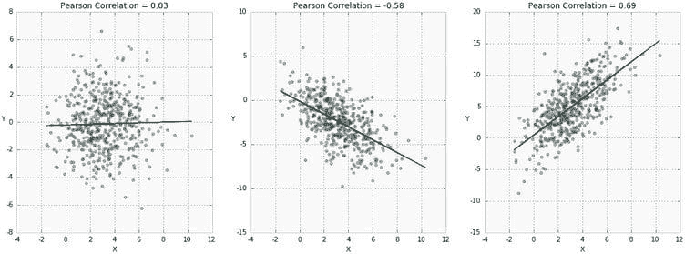

# 相关性简介

> 原文：[`www.kdnuggets.com/2017/02/datascience-introduction-correlation.html`](https://www.kdnuggets.com/2017/02/datascience-introduction-correlation.html)

**由 [DataScience.com](https://www.datascience.com/blog/introduction-to-correlation-learn-data-science-tutorials) 赞助。**

### 介绍：什么是相关性，为什么它有用？

相关性是最广泛使用——也最被误解——的统计概念之一。在本概述中，我们提供了几种类型的相关性的定义和直觉，并展示了如何使用 Python `pandas` 库计算相关性。

* * *

## 我们的三大课程推荐

 1\. [谷歌网络安全证书](https://www.kdnuggets.com/google-cybersecurity) - 快速进入网络安全职业生涯。

 2\. [谷歌数据分析专业证书](https://www.kdnuggets.com/google-data-analytics) - 提升你的数据分析技能

 3\. [谷歌 IT 支持专业证书](https://www.kdnuggets.com/google-itsupport) - 为你的组织提供 IT 支持

* * *

“相关性”一词指的是数量之间的相互关系或关联。在几乎任何业务中，以其与其他因素的关系来表达某一数量是有用的。例如，当[营销部门增加](https://www.datascience.com/blog/data-science-and-predictive-modeling-for-marketers)电视广告支出时，销售可能会增加，或者[客户在电子商务网站上的平均购买金额](https://www.datascience.com/blog/capturing-better-customers-with-lifetime-value-modeling)可能取决于与该客户相关的多个因素。通常，相关性是理解这些关系的第一步，随后可以建立更好的业务和统计模型。

那么，为什么相关性是一个有用的指标？

+   相关性可以帮助从一个数量预测另一个数量

+   相关性可以（但通常不会，如下面的一些例子所示）指示因果关系的存在

+   相关性作为许多其他建模技术的基本量和基础

更正式地说，相关性是描述随机变量之间关联的统计度量。计算相关系数的方法有多种，每种方法测量不同类型的关联强度。下面我们总结了三种最常用的方法。

### 相关性的类型

在深入了解相关性如何计算之前，介绍*协方差*的概念非常重要。协方差是两个变量*X*和*Y*之间关联的统计测量。首先，通过减去均值来中心化每个变量。这些中心化的分数被相乘，以测量一个变量的增加是否与另一个变量的增加有关。最后，计算这些中心化分数乘积的期望值（*E*）作为关联的总结。直观地，中心化分数的乘积可以被看作是一个矩形的面积，其中每个点与均值的距离描述了矩形的一边：

如果两个变量倾向于朝相同的方向移动，我们期望连接每个点（`X_i`, `Y_i`）到均值（`X_bar`, `Y_bar`）的“平均”矩形具有一个较大且正向的对角线向量，对应于上面方程中的较大正产品。如果两个变量倾向于朝相反的方向移动，我们期望平均矩形具有一个较大且负向的对角线向量，对应于上面方程中的较大负产品。如果变量之间无关，则这些向量在平均值上应相互抵消——总体对角线向量的大小应接近 0，对应于上面方程中的产品接近 0。

如果你在想“期望值”是什么，它是随机变量的平均值或均值*μ*的另一种说法。它也被称为“期望”。换句话说，我们可以写出以下方程来用不同的方式表达相同的量：

协方差的问题在于它保持变量*X*和*Y*的尺度，因此可以取任何值。这使得解释变得困难，也使得比较协方差变得不可能。例如，*Cov*（*X*，*Y*）= 5.2 和*Cov*（*Z*，*Q*）= 3.1 告诉我们这些对是正相关的，但在没有查看这些变量的均值和分布的情况下，很难判断*X*和*Y*之间的关系是否强于*Z*和*Q*之间的关系。这就是相关性变得有用的地方——通过用数据的某种变异度标准化协方差，它产生了具有直观解释和一致尺度的量。

### Pearson 相关系数

Pearson 是最广泛使用的相关系数。Pearson 相关性测量连续变量之间的线性关联。换句话说，这个系数量化了两个变量之间的关系可以用一条线来描述的程度。值得注意的是，虽然相关性可以有多种解释，但 Karl Pearson 在 120 多年前开发的相同公式今天仍然是最广泛使用的。

在这一部分，我们将介绍几种流行的皮尔逊相关系数的表述及其直观解释（简称*ρ*）。

皮尔逊本人开发的相关系数原始公式使用了原始数据和两个变量*X*和*Y*的均值：

在这种表述中，原始观察数据通过减去其均值进行中心化，并通过标准差的度量进行重新缩放。

表达相同数量的另一种方式是使用期望值、均值*μ[X]*、*μ[Y]*和标准差*σ**[X]*、*σ**[Y]*：

![$$ \rho_{X,Y} = \frac{E[(X-\mu_{X})(Y-\mu_{Y})] }{\sigma_{X}\sigma_{Y}}$$](../Images/05c9de55054695689e263cf82293bb76.png)

请注意，这个分数的分子与上述协方差的定义相同，因为均值和期望可以互换使用。将两个变量之间的协方差除以标准差的乘积，确保了相关系数总是落在-1 和 1 之间。这使得解释相关系数变得更加容易。

下图显示了皮尔逊相关系数的三个例子。*ρ* 越接近 1，表示一个变量的增加与另一个变量的增加关联越大。另一方面，*ρ* 越接近-1，表示一个变量的增加会导致另一个变量的减少。请注意，如果*X*和*Y*是独立的，则*ρ*接近 0，但反之则不成立！换句话说，即使两个变量之间存在强关系，皮尔逊相关系数也可能很小。我们将很快看到这种情况如何发生。

那么，我们如何解释皮尔逊相关系数呢？

在 DataScience.com 上阅读其余内容：[相关性介绍](https://www.datascience.com/blog/introduction-to-correlation-learn-data-science-tutorials)

### 更多相关主题

+   [相关性介绍](https://www.kdnuggets.com/2023/05/introduction-correlation.html)

+   [使用 PyCaret 进行二分类介绍](https://www.kdnuggets.com/2021/12/introduction-binary-classification-pycaret.html)

+   [使用 PyCaret 进行 Python 中的聚类介绍](https://www.kdnuggets.com/2021/12/introduction-clustering-python-pycaret.html)

+   [数据科学的基本数学：奇异值分解的可视化介绍…](https://www.kdnuggets.com/2022/06/essential-math-data-science-visual-introduction-singular-value-decomposition.html)

+   [数据科学中 Pandas 的介绍](https://www.kdnuggets.com/2020/06/introduction-pandas-data-science.html)

+   [带代码的论文简要介绍](https://www.kdnuggets.com/2022/04/brief-introduction-papers-code.html)
