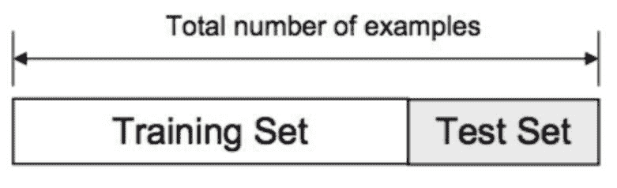
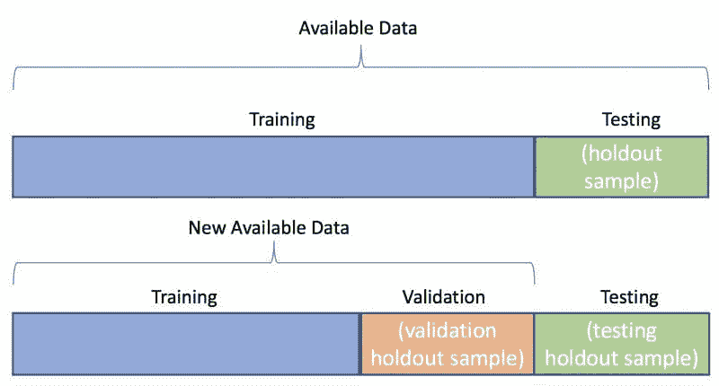

# Python 中的数据集拆分最佳实践

> 原文：[`www.kdnuggets.com/2020/05/dataset-splitting-best-practices-python.html`](https://www.kdnuggets.com/2020/05/dataset-splitting-best-practices-python.html)

评论

因此，你有一个整体数据集，需要将其拆分为训练数据和测试数据。也许你是为了监督学习而这样做，也许你使用 Python 来实现。

这是讨论在拆分数据集时需要考虑的三个具体因素，处理这些因素的方法，以及如何使用 Python 实际实现这些考虑事项。



来源: [Adi Bronshtein](https://towardsdatascience.com/train-test-split-and-cross-validation-in-python-80b61beca4b6)

* * *

## 我们的前 3 个课程推荐

 1\. [谷歌网络安全证书](https://www.kdnuggets.com/google-cybersecurity) - 快速进入网络安全职业生涯。

 2\. [谷歌数据分析专业证书](https://www.kdnuggets.com/google-data-analytics) - 提升你的数据分析技能

 3\. [谷歌 IT 支持专业证书](https://www.kdnuggets.com/google-itsupport) - 支持你的组织 IT

* * *

对于我们的示例，我们将使用 Scikit-learn 的[`train_test_split`](https://scikit-learn.org/stable/modules/generated/sklearn.model_selection.train_test_split.html)模块，该模块对拆分数据集很有用，无论你是否使用 Scikit-learn 来执行机器学习任务。你可以用其他方式手动进行这些拆分（例如，仅使用 Numpy），但 Scikit-learn 模块包含一些有用的功能，使得这一过程更简单。但请注意；也许你过去使用过这个模块进行数据拆分，但在进行时没有考虑到某些因素。

### 1\. 随机打乱实例

第一个考虑因素是：你的实例是否被打乱？只要没有理由*不*打乱数据（例如，你的数据是时间序列），我们希望确保我们的实例不会仅仅按顺序分割，因为我们的实例可能以某种方式被添加，从而将一些不必要的偏差引入模型中。

例如，查看 Scikit-learn 中包含的 iris 数据集版本在加载时如何排列实例：

```py
from sklearn.datasets import load_iris

iris = load_iris()
X, y = iris.data, iris.target

print(f"Dataset labels: {iris.target}")
```

```py
Dataset labels:
[0 0 0 0 0 0 0 0 0 0 0 0 0 0 0 0 0 0 0 0 0 0 0 0 0 0 0 0 0 0 0 0 0 0 0 0 0
 0 0 0 0 0 0 0 0 0 0 0 0 0 1 1 1 1 1 1 1 1 1 1 1 1 1 1 1 1 1 1 1 1 1 1 1 1
 1 1 1 1 1 1 1 1 1 1 1 1 1 1 1 1 1 1 1 1 1 1 1 1 1 1 2 2 2 2 2 2 2 2 2 2 2
 2 2 2 2 2 2 2 2 2 2 2 2 2 2 2 2 2 2 2 2 2 2 2 2 2 2 2 2 2 2 2 2 2 2 2 2 2
 2 2]
```

如果你将数据集按照 3 个类别的实例数量相等的比例分为 2/3 用于训练和 1/3 用于测试，你的新分离数据集将没有标签交叉。这在学习特征以预测类别标签时显然是个问题。幸运的是，`train_test_split`模块默认会先对数据进行洗牌（你可以通过将`shuffle`参数设置为`False`来覆盖此设置）。

为此，必须将`feature`和`target`向量（`X`和`y`）传递给模块。你应该设置一个`random_state`以确保可重复性。需要设置`train_size`或`test_size`中的一个，但两个都不是必需的。如果你明确设置了两个，它们的总和必须等于 1。

```py
from sklearn.model_selection import train_test_split

X_train, X_test, y_train, y_test = train_test_split(X, y, 
                                                    train_size=0.67, 
                                                    random_state=42)

print(f"Train labels:\n{y_train}")
print(f"Test labels:\n{y_test}")
```

```py
Train labels:
[1 2 1 0 2 1 0 0 0 1 2 0 0 0 1 0 1 2 0 1 2 0 2 2 1 1 2 1 0 1 2 0 0 1 1 0 2
 0 0 1 1 2 1 2 2 1 0 0 2 2 0 0 0 1 2 0 2 2 0 1 1 2 1 2 0 2 1 2 1 1 1 0 1 1
 0 1 2 2 0 1 2 2 0 2 0 1 2 2 1 2 1 1 2 2 0 1 2 0 1 2]
Test labels:
[1 0 2 1 1 0 1 2 1 1 2 0 0 0 0 1 2 1 1 2 0 2 0 2 2 2 2 2 0 0 0 0 1 0 0 2 1
 0 0 0 2 1 1 0 0 1 2 2 1 2]
```

你可以看到我们现在已经将实例打乱了。

### 2. 类别分层

下一步需要考虑的是：我们新分离的训练集和测试集的类别计数是否均匀分布？

```py
import numpy as np

print(f"Numbers of train instances by class: {np.bincount(y_train)}")
print(f"Numbers of test instances by class: {np.bincount(y_test)}")
```

```py
Numbers of train instances by class: [31 35 34]
Numbers of test instances by class: [19 15 16]
```

这不是一个均匀的划分。这涉及到算法是否有平等的机会学习数据集中每个类别的特征，并随后在每个类别的相同数量的实例上测试其学习成果。在较小的数据集中特别重要，但应始终关注。

我们可以使用`train_test_split`的`stratify`选项强制训练集和测试集中的类别比例保持一致，注意我们将根据`y`中的类别分布进行分层。

```py
X_train, X_test, y_train, y_test = train_test_split(X, y, 
                                                    train_size=0.67, 
                                                    random_state=42,
                                                    stratify=y)

print(f"Train labels:\n{y_train}")
print(f"Test labels:\n{y_test}")
```

```py
Train labels:
[2 0 2 1 0 0 0 2 0 0 1 0 1 1 2 2 0 0 2 0 2 0 0 2 0 1 2 1 0 1 0 2 1 2 1 0 2
 0 2 0 1 1 0 2 1 1 0 2 1 2 0 1 0 2 1 1 1 1 1 1 2 1 2 2 0 2 1 1 2 0 2 2 2 0
 2 0 0 2 2 2 0 1 2 2 0 1 1 1 1 1 0 2 1 2 0 0 1 0 1 0]
Test labels:
[2 1 0 1 2 1 1 0 1 1 0 0 0 0 0 2 2 1 2 1 2 1 0 2 0 2 2 0 0 2 2 2 0 1 0 0 2
 1 1 1 1 1 0 0 2 1 2 2 1 2]
```

```py
print(f"Numbers of train instances by class: {np.bincount(y_train)}")
print(f"Numbers of test instances by class: {np.bincount(y_test)}")
```

```py
Numbers of train instances by class: [34 33 33]
Numbers of test instances by class: [16 17 17]
```

现在看起来更好了，原始数据告诉我们这是最优的分层划分。

### 3. 划分分割

第三个考虑因素与我们的测试数据有关：我们的建模任务内容是否只有一个由之前未见数据组成的测试数据集，还是应该使用两个这样的数据集——一个用于在微调过程中验证我们的模型，可能还有多个模型，另一个作为最终的保留集用于模型比较和选择。



来源: [Stack Exchange](https://datascience.stackexchange.com/questions/61467/clarification-on-train-test-and-val-and-how-to-use-implement-it)

如果我们选择两个这样的集合，这意味着会有一个数据集在所有假设测试、所有超参数调优以及所有模型训练到最佳性能之后才会被使用，作为实验的最后一步，这个数据集只会被模型看到一次。关于测试集与验证集的工作有很多，你可以查阅相关资料；我在这里不会进一步探讨其理由和论点。

然而，假设你得出结论你*确实*想要使用测试集和验证集（你应该得出这个结论），使用`train_test_split`来构建它们很简单；我们将整个数据集分一次，分离出训练数据，然后再分一次，将剩余的数据划分为测试集和验证集。

在下面，使用数字数据集，我们将 70%用于训练数据集，并暂时将剩余部分分配给测试集。我们继续执行上述最佳实践。

```py
from sklearn.datasets import load_digits

digits = load_digits()
X, y = digits.data, digits.target

X_train, X_test, y_train, y_test = train_test_split(X, y, 
                                                    train_size=0.7, 
                                                    random_state=42,
                                                    stratify=y)

print(f"Numbers of train instances by class: {np.bincount(y_train)}")
print(f"Numbers of test instances by class: {np.bincount(y_test)}")

```

```py
Numbers of train instances by class: [124 127 124 128 127 127 127 125 122 126]
Numbers of test instances by class: [54 55 53 55 54 55 54 54 52 54]
```

注意训练集和临时测试集中的分层类别。

然后我们以相同的方式重新拆分测试集——这次修改输出变量名称、输入变量名称，并小心更改`stratify`类向量引用——使用 50/50 的拆分比例用于测试和验证集。

```py
X_test, X_val, y_test, y_val = train_test_split(X_test, y_test, 
                                                    train_size=0.5, 
                                                    random_state=42,
                                                    stratify=y_test)

print(f"Numbers of test instances by class: {np.bincount(y_test)}")
print(f"Numbers of validation instances by class: {np.bincount(y_val)}")

```

```py
Numbers of test instances by class: [27 27 27 27 27 28 27 27 26 27]
Numbers of validation instances by class: [27 28 26 28 27 27 27 27 26 27]
```

再次注意所有数据集中的类别分层，这样是最优和理想的。

现在你可以根据数据的需要训练、验证和测试尽可能多的机器学习模型。

另一个考虑因素：你可能想要考虑使用交叉验证，而不是简单的训练/测试或训练/验证/测试策略。我们将下一次讨论交叉分层的考虑因素。

**相关**：

+   Python 中的稀疏矩阵表示

+   Scikit-learn 0.23 中的 5 个伟大新特性

+   处理不平衡数据集的 5 个最有用技巧

### 更多相关主题

+   [数据科学中的 5 个 Python 最佳实践](https://www.kdnuggets.com/5-python-best-practices-for-data-science)

+   [MLOps：最佳实践及其应用](https://www.kdnuggets.com/2022/04/mlops-best-practices-apply.html)

+   [创建领域特定 AI 模型的最佳实践](https://www.kdnuggets.com/2022/07/best-practices-creating-domainspecific-ai-models.html)

+   [将 ChatGPT 集成到数据科学工作流程中：提示和最佳实践](https://www.kdnuggets.com/2023/05/integrating-chatgpt-data-science-workflows-tips-best-practices.html)

+   [数据仓库和 ETL 最佳实践](https://www.kdnuggets.com/2023/02/data-warehousing-etl-best-practices.html)

+   [迁移到 AWS 云的 11 个最佳实践](https://www.kdnuggets.com/2023/04/11-best-practices-cloud-data-migration-aws-cloud.html)
