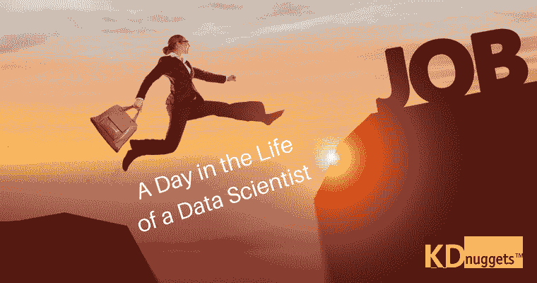

# 一位数据科学家的一天

> 原文：[`www.kdnuggets.com/2017/11/day-life-data-scientist.html`](https://www.kdnuggets.com/2017/11/day-life-data-scientist.html)

评论

几周前，我[向我的 LinkedIn 联系人征求反馈意见](https://www.linkedin.com/feed/update/urn:li:activity:6317746569756110848/)关于数据科学家典型工作日的内容。反应真的非常大！当然，没有两个数据科学家的角色是相同的，这就是为什么要进行调查的原因。很多潜在的数据科学家都对那些在这个领域忙碌的人都做些什么感兴趣，所以我想让一些联系人提供他们的见解可能会是一项有用的事业。

* * *

## 我们的前三个课程推荐

 1\. [Google Cybersecurity Certificate](https://www.kdnuggets.com/google-cybersecurity) - 加速职业生涯发展，从事网络安全工作。

 2\. [Google Data Analytics Professional Certificate](https://www.kdnuggets.com/google-data-analytics) - 提升你的数据分析能力

 3\. [Google IT Support Professional Certificate](https://www.kdnuggets.com/google-itsupport) - 支持你的 IT 组织

* * *

下面是一些来自对我的日常专业任务感兴趣的人通过电子邮件和 LinkedIn 消息提供的很好的反馈。这些简短的日常摘要以完整的形式呈现，没有编辑，让引语本身说话。

[**Andriy Burkov**](https://www.linkedin.com/in/andriyburkov/) 是加特纳的全球机器学习团队负责人，位于魁北克市。

> 我的典型工作日从早上 9 点开始，与我的团队进行为期 15-30 分钟的 Webex 会议：我的团队分布在印度（班加罗尔和钦奈）和加拿大（魁北克市）两地。我们讨论项目的进展并决定如何克服困难。
> 
> 然后我阅读昨晚收到的电子邮件，必要时做出回应。然后我将工作投入到当前的项目中，目前这个项目是从职位公告提取工资。我需要为我们支持的每个国家语言对创建一个单独的模型对，大约有 30 个国家语言对。该过程包括转储某部分国家-语言的职位公告，对其进行聚类，然后获取训练示例的子集。然后我手动注释这些示例并构建模型。我进行构建/测试/添加数据/重新构建迭代，直到测试误差足够低（～98%）。
> 
> 下午，我帮助我的团队成员通过在真实数据上测试当前模型，识别假阳性/阴性并创建新的训练示例来改正问题。何时停止改善模型并投入生产取决于项目。对于一些情况，特别是用户端，我们希望假阳性的水平非常低（低于 1%）：用户始终会看到从其文本中提取某些元素出错，但并不总是注意到提取的缺失。
> 
> 一天在下午 5:30 左右结束，我用 30 分钟的时间跟上科技新闻/博客。

[**Colleen Farrelly**](https://www.linkedin.com/in/colleenmfarrelly/) 是位于迈阿密的卡普兰公司的一名数据科学家。

> 这是关于我和我一天的生活的一点背景信息：
> 
> 在攻读医学博士/博士学位项目后，我转入了数据科学和机器学习，此前我有一门文理交融的本科学位，我的日常项目通常高度跨学科。一些项目包括模拟流行病传播，利用工业心理学创建更好的人力资源模型，并解剖数据以获取低社会经济地位学生的风险群体。我的工作最好的部分是项目的多样性和每天都有新的挑战。
> 
> 我的一个典型工作日大约在早上 8:00 开始，那时我会浏览与机器学习和数据科学相关的社交媒体帐户。我会在早上 8:30 左右转入工作项目，中午休息后，工作在下午 4:30 至 5:00 左右结束。我的时间中大约有 40%用于研究和开发，主要集中在数学上（尤其是拓扑学），包括从开发和测试新算法到撰写数学证明以简化数据问题。有时，结果是保密的并且仅在公司内部分享（通过公司内部每月的午餐与学习演示）；另一些情况下，我被允许在外部会议上发布或展示。
> 
> 我大约还有 30%的时间用于在我公司的各个部门建立关系并寻找新项目，这些项目通常与运营程序相关的问题、数据捕捉相关的问题，或先前项目之间的连接有关，从而为运营提供更全面的视图。这可能是工作中最关键的一个方面。我遇到的人经常提出他们看到的问题或提到有一个预测模型对销售/学生结果/运营产生了兴趣，我发现这为以后的对话和最佳实践建议敞开了大门。作为一名数据科学家，与一系列利益相关者进行沟通非常重要，这帮助我将我对机器学习算法的解释简化成了一个外行能理解的水平。
> 
> 我剩下的 30%的时间通常用于数据分析和结果撰写。其中包括预测模型、关键指标的预测模型以及对给定数据集中子群体和趋势的数据挖掘。每个项目都是独特的，我试图让项目及其初步发现引导我下一步的行动。我主要使用 R 和 Tableau 进行项目工作，虽然 Python、Matlab 和 SAS 偶尔在特定的软件包或研发需求中也很有帮助。我通常可以重复使用代码，但是对于数学方面的问题，每个问题都有自己的假设和数据限制。项目通常可以使用拓扑学、实分析和图论中的工具进行简化，从而加快项目进展，并允许使用现有的软件包，而不需要从头开始编码。作为一家大公司唯一的数据科学家，这使我能够处理更多项目，并为我们的内部客户揭示更多的见解。

[**Marco Michelangeli**](https://www.linkedin.com/in/marco-michelangeli/)是 Hopenly 公司的数据科学家，居住在意大利的雷焦艾米利亚。

> 当马修要求我写几段关于数据科学家“典型”一天的工作的文章时，我开始思考我的日常工作和例行公事，但后来我停下来意识到：“我真的没有一个固定的日常！”这就是作为数据科学家的最好之处！每一天都不同，都会出现新的挑战，一个新的问题悬在那里等待解决。我不仅仅在谈论编码、数学和统计学，还包括业务世界的复杂性：我经常与业务人员和客户讨论，了解他们的真实需求，我帮助营销部门制作产品内容，在会议上讨论新的 ETL 工作流和新产品的架构设计；我甚至发现自己在筛选数据科学家的简历。
> 
> 成为一名数据科学家意味着要灵活、开放思维、准备解决问题和接受复杂性，但是请别误会：我 80%以上的时间都在清理数据！如果你刚开始从事数据科学的职业，你可能已经看过“10 个掌握 R 和 Python 在数据科学中的技巧”的帖子，或者“最好的深度学习库”，所以我不会给你任何更多的技术建议，我唯一能说的是来自于[专业数据科学宣言](http://www.datasciencemanifesto.org/)的内容：“数据科学是关于解决问题，而不是构建模型。”这意味着如果你可以通过一条 SQL 查询来解决客户需求，就这样做！不要因复杂的机器学习模型而感到沮丧：要简单，要有帮助。

[**Ajay Ohri**](https://www.linkedin.com/in/ajayohri/)是位于新德里的 Kogentix Inc.的数据科学家。他还写过两本关于 R 语言的书和一本关于 Python 的书。

> 我典型的一天从上午 9 点的[团队会议](https://www.mountaingoatsoftware.com/agile/scrum/meetings/daily-scrum)开始。我们的项目工作方法是将任务分成两周的目标或者[迭代周期](https://en.wikipedia.org/wiki/Agile_software_development)。这基本上是敏捷软件开发方法，与 CRISP-DM 或 KDD 方法不同。
> 
> 需要一点背景知识来解释我们这样做的原因。我目前的角色是东南亚一家银行的数据科学家，负责实施大数据分析。我们的团队中有数据工程师、行政/基础架构人员、数据科学家和当然还有客户经理，满足项目的每个具体需求。我的当前组织是一家名为[**Kogentix**](http://kogentix.com/)的 AI 初创公司，不仅提供大数据服务，还有一个名为**AMP**的大数据产品，类似于 PySpark 的 GUI，试图实现大数据的自动化。AMP 相当酷，我很快就会谈到它。这导致我们的初创公司专注于尽可能多地吸引客户，并测试和实施我们的大数据产品。这意味着在客户合作中展示成功-我们的一个客户上个月入围了一个奖项。我听起来是不是太市场导向了-当然是的。数据科学家的工作通常对客户具有战略意义。
> 
> 我每天都在做什么？可能有很多事情-包括不仅仅是电子邮件和会议。我可能用 Hive 提取数据，用它合并数据（或使用 Impala），我可能用 PySpark（Mllib）制作流失模型或进行 K 均值聚类。我可以用 Excel 文件提取数据来制作摘要，也可以制作数据可视化。有些天我用 R 来制作一些机器学习模型。我还协助测试我们的大数据分析产品 AMP，并与该团队合作增强产品的功能（如果您原谅这个双关语，因为该产品用于功能增强）。当我编写大数据时，我可能使用 Hadoop HUE 的 GUI，也可能使用命令行编程，包括批量提交代码。
> 
> 在这之前，当我为印度第三大软件公司 **Wipro** 工作时，我的角色正好相反。我们的客户是印度的财政部（负责税收的部门）。初级数据科学家使用 SQL 从关系数据库管理系统中提取数据（由于历史问题），而我则验证这些结果。报告随后发送给各个客户。我们还在临时基础上使用 SAS Enterprise Miner 来展示印度进出口的时间序列预测作为一个概念测试。在为联邦政府工作与为私营部门工作时，时间表相当缓慢和官僚。我记得一次演示时，负责的官僚对我们执行机器学习感到惊讶，以及为什么政府之前没有使用它。但 SAS/VA（用于仪表盘）、SAS Fraud Analytics（我接受过培训并正在实施中）和 Base SAS（分析工具）都是令人惊叹的软件，我怀疑是否能很快制作出任何类似 SAS 领域专业托包的东西。
> 
> 在此之前，我经营了十年的 Decisionstats.com。我写博客，销售广告（效果不好），为 Programmable Web、StatisticsViews 写了 3 本数据科学书籍，撰写了大量文章，并进行了一些数据咨询。我甚至为 KDnuggets 写了几篇文章。您可以在这里查看我的个人资料 [`en.m.wikipedia.org/wiki/Ajay_Ohri`](https://en.m.wikipedia.org/wiki/Ajay_Ohri)

[**Eric Weber**](https://www.linkedin.com/in/eric-weber-060397b7/) 是位于加利福尼亚州阳光城的 LinkedIn 高级数据科学家。

> 在 LinkedIn 的一天。好吧，我想说没有“典型”的一天。在阅读时，请记住这一点！
> 
> 首先，让我简要介绍一下我和我的主要职责。我很幸运能够在 LinkedIn Learning 团队工作，这是组织中最新的数据科学团队。具体而言，我支持 LinkedIn Learning 的企业级销售。这意味着什么呢？想象一下：我们使用数据、模型和分析来决策如何有效销售。当然，我们是如何做到的细节是内部的，但您可以想象我们想要回答的问题，比如：我们要销售给哪些账户？我们努力理解哪些账户与其他账户有所不同。
> 
> 其次，每天的一个关键方面是沟通。我在 LinkedIn 上详细介绍了这个问题，但我相信与团队成员和业务伙伴进行有效沟通是杰出的数据科学家的一个定义特征。在典型的一天里，这涉及向直属团队成员、经理和高级领导提供关键项目的更新，适时地。我发现工作中这个方面非常有趣的一点是对简洁性的要求。像 LinkedIn 这样的公司内部有大量的沟通正在进行，所以所有发出去的东西必须被淬取成清晰而简洁的结果/对话要点。
> 
> 最后，每一天都有失败的重要部分。我非常相信，如果你不失败，就不会学到东西。当然，这并不意味着灾难性的失败。这意味着每天我都在努力拓展自己在分析、数据科学和组织本身方面的理解。我从错误中学习，并观察别人是如何比我更高效地做事，或者用不同的方式做事的。每天早晨醒来时，我把失败视为工作的一部分，因为这能让我第二天变得更好。分析和数据科学的快速扩张确实提供了大量这样的机会！

希望这些描述能让你更深入地了解数据科学家日常工作。我收到了很多人的兴趣和回应，所以我会在不久的将来发布更多相关内容。

**相关内容**：

+   大数据和数据科学的 5 条职业路径，解析

+   7 种数据科学家工作档案

+   必备的 10 个数据科学技能，已更新

### 关于这个话题的更多信息

+   [成功的数据科学家的 5 个特征](https://www.kdnuggets.com/2021/12/5-characteristics-successful-data-scientist.html)

+   [每个数据科学家都应该了解的三个 R 语言库（即使你使用 Python）](https://www.kdnuggets.com/2021/12/three-r-libraries-every-data-scientist-know-even-python.html)

+   [停止学习数据科学来寻找目的，而是找到目的来…](https://www.kdnuggets.com/2021/12/stop-learning-data-science-find-purpose.html)

+   [学习数据科学统计学的顶级资源](https://www.kdnuggets.com/2021/12/springboard-top-resources-learn-data-science-statistics.html)

+   [一次价值 90 亿美元的 AI 失败，剖析](https://www.kdnuggets.com/2021/12/9b-ai-failure-examined.html)

+   [什么使 Python 成为初创企业的理想编程语言](https://www.kdnuggets.com/2021/12/makes-python-ideal-programming-language-startups.html)
