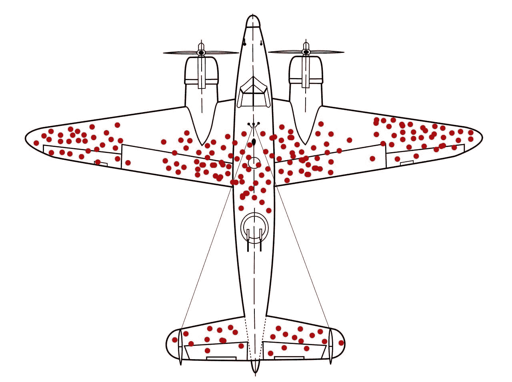

# 机器学习工程师的一天

> 原文：[`www.kdnuggets.com/2022/10/day-life-machine-learning-engineer.html`](https://www.kdnuggets.com/2022/10/day-life-machine-learning-engineer.html)

图片由 [Sigmund](https://unsplash.com/@sigmund?utm_source=unsplash&utm_medium=referral&utm_content=creditCopyText) 提供，来自 [Unsplash](https://unsplash.com/s/photos/data-scientist?utm_source=unsplash&utm_medium=referral&utm_content=creditCopyText)

了解其他人的日常生活是很有帮助的。许多学生更加关注他们需要掌握的技能、课程和知识水平，以确保自己能尽可能优秀。

有时候，你只需要听到第一手资料。如果你从未听说过这个成语，它的意思是如果你直接从知情者那里听到某事，你将获得最真实的信息。

让我们向 [易卜拉欣·穆赫吉](https://www.linkedin.com/in/ibrahim-mukherjee-7b544b242/) 学习

# 介绍

[易卜拉欣·穆赫吉](https://www.linkedin.com/in/ibrahim-mukherjee-7b544b242/) 是一名伦敦政治经济学院（LSE）管理学（荣誉）学士毕业生以及数据科学家。在 2008 年毕业后，易卜拉欣加入了石油和天然气行业，担任金融分析师，工作地点包括特立尼达、新加坡、英国（阿伯丁、雷丁、伦敦）、挪威、马来西亚、突尼斯和罗马尼亚。

易卜拉欣·穆赫吉

在此期间，易卜拉欣对行为经济学和神经科学的潜在兴趣，通过阅读丹尼尔·卡尼曼（《思考，快与慢》）和丹·阿里里（《预测性非理性》）的著作，促使他进入了机器学习和人工智能的第二职业生涯。

易卜拉欣对大脑如何从事件中抽象出意义以及人类认知如何与一般的机器学习和模式识别有所不同感兴趣。工作之外，易卜拉欣喜欢阅读科学哲学、宗教心理学、认知神经科学、人类对压力的反应、贝叶斯方法以及编写软件的书籍。

## 作为机器学习工程师的一天是什么样的？

作为一名机器学习工程师，我将大量时间用于三个主要任务：

1.  理解业务需求

1.  收集数据

1.  基于 1 和 2 提供切实可行的商业问题解决方案

虽然这些任务听起来相对简单，但随着你所在组织的规模扩大，收集的数据复杂性以及生成的结果也会增加。

让我们逐一看看这些任务：

## 理解业务需求

**塞萨尔·希达尔戈**在他的书《信息如何增长》中提出了一个非常有趣的观察——当你从上方俯瞰一个城市时，当飞机即将降落时，它看起来与计算机内部的电路板（CPU）非常相似。一个城市是一个计算单元，任何企业也是如此。它可以被抽象为一个算法——有输入，有一些计算来处理这些输入，还有输出。

对于一个企业而言，计算就是企业生产的产品或服务。对于理发师而言，原材料或投入可能是剪刀、理发店的租赁空间、镜子、椅子、隔离栏等，而产品则是一次理发。在这种情况下，金钱是该输出的价值储存。通常情况下，输出的质量和/或数量越高，输出的价值也越高。然而，也有例外，比如内燃机的负外部性（可能会被政府逐渐征税），以及那些产生有效善意的慈善机构。但这仍然是一个普遍的结果。

数据科学家的工作，作为一个专家数据科学家，而不是普通数据科学家，是理解商业提案。输入是什么，输出是什么？

然后，数据科学家将系统地分类工作，以了解业务中的问题。什么可以改善公司的产品，提升公司获得的价格，改善原材料的采购，或改进从输入到公司输出的任何物流方面？

## 第二点是收集数据

在我*深入探讨*这一点之前，需要对那些没有经验的数据科学家提个醒，这可以通过二战时期的一个著名警示例子来解释。当盟军在寻求加强轰炸机的装甲时，他们查看了返回的飞机上的子弹孔频率。大多数当时的数据科学家或运筹学专家认为需要加强那些子弹孔较多的飞机区域。

一位出生于匈牙利的数学家**亚伯拉罕·瓦尔德**有不同的看法。他建议加强那些没有子弹孔的飞机部位。原因是，受损这些部位的飞机往往无法返回，它们已经被击落。

来自[维基百科](https://en.wikipedia.org/wiki/Survivorship_bias#/media/File:Survivorship-bias.svg)的生存偏差文章中的飞机

因此，数据只是故事的一部分。没有对业务机制的良好理解，数据作用有限。在大企业中，解决方案的规模可能很小，但改进或效率的量可能也不大。在这种情况下，对业务的深刻理解至关重要。

数据收集的形式包括与大量业务利益相关者交谈，了解业务中的数据。数据可能会在业务中的孤岛中隐匿得非常好，而数据科学家的工作是找到一个单一的真实来源，查阅提供的不同数据点，以理解数据并选择最相关和适合的部分进行分析。并非所有数据都是必需的，技能的一部分在于能够辨别重要数据和不重要的数据。将信号与噪音分开。将数据逐步添加到现有分析中总是可能的，删除数据集也是如此。然而，关键是找到数量较少但对解决业务需求至关重要的变量。

## 这使我们回到了主要的黄金法则。一切都必须增加价值。

企业最终是资本主义框架下的赚钱提案。如果分析不能提供节省钱或赚钱的途径——那就没有价值。那是不被允许的。这一点对数据科学的整个提案至关重要。它应该为管理层和/或利益相关者提供关键行动点或方向，以创造货币价值增值——无论是直接节省成本或赚取更多利润，还是以“软性”方式如市场营销或企业社会责任。

数据科学家还必须是讲故事者。正如 Steve Jobs 所说——“世界上最强大的人是讲故事者”。能够沟通对业务创造的价值是至关重要的。除非利益相关者“看到”价值，否则分析所创造的价值几乎没有意义，因为他们可能无法或不愿付诸实践。

因此，讲述价值主张与创造价值同样重要。数据科学家必须非常擅长传达这些见解。

# 总结

我想感谢 Ibrahim Mukherjee 花时间向我们解释作为机器学习工程师的一天。了解人们对职业的不同方法及其与自己或其他人的不同，是提升和改善职业生涯的重要因素。

希望这对你有帮助！再次感谢，Ibrahim Mukherjee！

**[Nisha Arya](https://www.linkedin.com/in/nisha-arya-ahmed/)** 是一位数据科学家和自由技术写作人。她特别关注提供数据科学职业建议或教程，以及围绕数据科学的理论知识。她还希望探索人工智能在延长人类寿命方面的不同方式。作为一个热衷学习者，她寻求拓宽自己的技术知识和写作技能，同时帮助指导他人。

* * *

## 我们的前三大课程推荐

 1\. [谷歌网络安全证书](https://www.kdnuggets.com/google-cybersecurity) - 快速进入网络安全职业生涯的捷径。

 2\. [Google 数据分析专业证书](https://www.kdnuggets.com/google-data-analytics) - 提升您的数据分析技能

 3\. [Google IT 支持专业证书](https://www.kdnuggets.com/google-itsupport) - 支持您的组织在 IT 方面

* * *

### 了解更多相关主题

+   [数据科学家的日常生活：专家与初学者](https://www.kdnuggets.com/2022/09/day-life-data-scientist-expert-beginner.html)

+   [KDnuggets 新闻，10 月 5 日：初学者最佳免费 Git GUI 客户端•…](https://www.kdnuggets.com/2022/n39.html)

+   [我每天使用 ChatGPT 五个月。这些是一些隐藏的宝藏…](https://www.kdnuggets.com/2023/07/used-chatgpt-every-day-5-months-hidden-gems-change-life.html)

+   [从工程师到机器学习工程师：使用声明式机器学习](https://www.kdnuggets.com/2023/05/predibase-go-engineer-ml-engineer-declarative-ml.html)

+   [每个机器学习工程师应掌握的 5 项机器学习技能…](https://www.kdnuggets.com/2023/03/5-machine-learning-skills-every-machine-learning-engineer-know-2023.html)

+   [如何处理每天 150 亿条日志并将大查询保持在 1 秒内](https://www.kdnuggets.com/how-to-digest-15-billion-logs-per-day-and-keep-big-queries-within-1-second)
