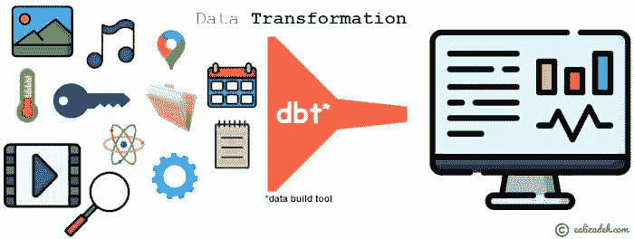

# dbt 数据转换 – 实操教程

> 原文：[`www.kdnuggets.com/2021/07/dbt-data-transformation-tutorial.html`](https://www.kdnuggets.com/2021/07/dbt-data-transformation-tutorial.html)

评论

**[Essi Alizadeh](https://www.linkedin.com/in/alizadehesmaeil/) 是一名工程师和高级数据科学家，处于永久测试状态**。



* * *

## 我们的前三大课程推荐

 1\. [Google 网络安全证书](https://www.kdnuggets.com/google-cybersecurity) - 快速开启网络安全职业生涯。

 2\. [Google 数据分析专业证书](https://www.kdnuggets.com/google-data-analytics) - 提升你的数据分析技能

 3\. [Google IT 支持专业证书](https://www.kdnuggets.com/google-itsupport) - 支持你的组织的 IT

* * *

dbt（数据构建工具）是一个数据转换工具，使用 SQL 选择语句。它允许你创建复杂的模型，使用变量和宏（即函数），运行测试，生成文档等。

dbt 不提取或加载数据，但它在转换已存在于数据库中的数据方面非常强大——dbt 执行 ELT（提取、加载、转换）过程中的**T**。

在本文章中，你将学习如何：

+   配置 dbt 项目。

+   创建 dbt 模型（SELECT 语句）。

+   使用全局变量和宏构建复杂的 dbt 模型。

+   通过引用其他 dbt 模型来构建复杂的模型。

+   运行测试。

+   生成文档。

## 先决条件

### 注册

你可以在[getdbt.com](https://cloud.getdbt.com/)注册。免费计划对于小型项目和测试来说是一个很好的选择。

### 具有填充数据的数据库

你可以查看我关于[如何在 Heroku 上部署一个 *免费的* PostgreSQL 数据库](https://ealizadeh.com/blog/deploy-postgresql-db-heroku)的文章。该文章提供了逐步的操作说明。你也可以查看[数据摄取脚本](https://github.com/e-alizadeh/sample_dbt_project/blob/master/data/data_ingestion.py)以及附带的[GitHub 仓库](https://github.com/e-alizadeh/sample_dbt_project)。

根据上述内容，我们在 PostgreSQL 数据库中生成了两个表，这些表将在本文章中使用。数据库中有两个表，分别命名为 covid_latest 和 population_prosperity。你可以在本文章的 GitHub 仓库中找到摄取脚本。

### dbt CLI 安装

你可以按照以下[dbt 文档页面](https://docs.getdbt.com/dbt-cli/installation/)上的说明安装 dbt 命令行界面 (CLI)。

## dbt 项目的基础知识

使用 dbt 工具时需要了解三件主要的事情：

+   dbt 项目

+   数据库连接

+   dbt 命令

### 如何使用 dbt？

一个 dbt 项目是一个包含 *.sql* 和 *.yml* 文件的目录。所需的最低文件包括：

+   一个名为*dbt_project.yml*的项目文件：该文件包含 dbt 项目的配置。

+   模型（*.sql*文件）：dbt 中的模型只是一个包含**单个** ***select*** **语句**的*.sql*文件。

每个 dbt 项目都需要一个*dbt_project.yml*文件——这是 dbt 识别目录是否为 dbt 项目的方式。它还包含重要的信息，告诉 dbt 如何操作你的项目。

你可以在[这里](https://docs.getdbt.com/docs/introduction#dbt-projects)找到更多关于 dbt 项目的信息。

> 一个**dbt 模型**基本上是一个*.sql*文件，包含一个**SELECT**语句。

### dbt 命令

dbt 命令以*dbt*开头，可以通过以下方式之一执行：

+   dbt Cloud（在 dbt Cloud 仪表板底部的命令部分），

+   dbt CLI

一些命令只能在 dbt CLI 中使用，如*dbt init*。在这篇文章中我们将使用的一些 dbt 命令包括

+   *dbt init*（仅在 dbt CLI 中）

+   *dbt run*

+   *dbt test*

+   *dbt docs generate*

## dbt 项目设置

### 第一步：使用 dbt CLI 初始化一个 dbt 项目（示例文件）

你可以使用[dbt init](https://docs.getdbt.com/reference/commands/init)来生成示例文件/文件夹。特别是，*dbt init project_name*将创建以下内容：

+   如果还不存在的话，创建一个*~/.dbt/profiles.yml*文件

+   一个名为*[project_name]*的新文件夹

+   必要的目录和示例文件，以便开始使用 dbt

> **注意**：由于*dbt init*生成一个名为*project_name*的目录，为避免任何冲突，你应该*没有任何具有相同名称的现有文件夹*。


*dbt init <project_name>*

结果是一个包含以下示例文件的目录。

```py
sample_dbt_project
├── README.md
├── analysis
├── data
├── dbt_project.yml
├── macros
├── models
│   └── example
│       ├── my_first_dbt_model.sql
│       ├── my_second_dbt_model.sql
│       └── schema.yml
├── snapshots
└── tests

```

对于这篇文章，我们只考虑最小文件并去除多余内容。

```py
sample_dbt_project
├── README.md
├── dbt_project.yml
└── models
    ├── my_first_dbt_model.sql
    ├── my_second_dbt_model.sql
    └── schema.yml

```

### 第二步：设置 Git 代码库

你可以使用现有的代码库，如设置过程中所述。你可以通过查看 dbt 文档[这里](https://docs.getdbt.com/docs/dbt-cloud/cloud-configuring-dbt-cloud/cloud-configuring-repositories)来配置代码库。

**或者，如果你想创建一个新的代码库...**

你可以在创建的目录内创建一个新的代码库。可以按如下方式进行：

```py
git init
git add .
git commit -m "first commit"
git remote add origing 
git push -u origin master

```

### 第三步：在 dbt Cloud 仪表板上设置新项目

在前一步中，我们创建了一个包含示例模型和配置的示例 dbt 项目。现在，我们想创建一个新项目，并在 dbt Cloud 仪表板上连接我们的数据库和代码库。

在继续之前，你应该已经拥有

+   数据库中已存在的一些数据，

+   一个包含前一步生成的文件的代码库

你可以按照下面的步骤在 dbt Cloud 中设置一个新项目（请记住，这一步与前一步不同，因为我们仅生成了一些示例文件）。

我们项目的*dbt_project.yml*文件如下所示（你可以在[GitHub repo](https://github.com/e-alizadeh/sample_dbt_project.git)中找到完整版本）。

```py
name: 'my_new_project'
version: '1.0.0'
config-version: 2

vars:
  selected_country: USA
	selected_year: 2019

# This setting configures which "profile" dbt uses for this project.
profile: 'default'

# There are other stuff that are generated automatically when you run `dbt init`

```

*dbt_project.yml*

## dbt 模型和功能

### dbt 模型

让我们创建一些简单的 dbt 模型来检索表中的几个列。

```py
select "iso_code", "total_cases", "new_cases" from covid_latest

```

***covid19_latest_stats** dbt 模型（models/covid19_latest_stats.sql）*

```py
select "code", "year", "continent", "total_population" from population_prosperity

```

***population** dbt 模型（models/population.sql）*

> **注意：** dbt 模型名称是*models*目录下 sql 文件的文件名。模型名称可能与数据库中的表名不同。例如，在上述示例中，dbt 模型*population*是对数据库中*population_prosperity*表的*SELECT*语句的结果。

### 运行模型

你可以通过执行*dbt run*来运行 dbt 项目中的所有模型。下面显示了一个示例 dbt 运行输出。你可以查看运行所有 dbt 模型的摘要或详细日志。这对于调试查询中的任何问题非常有帮助。例如，你可以看到一个抛出 Postgres 错误的失败模型。


*详细记录失败的**jinja_and_variable_usage** dbt 模型。*

### Jinja & 宏

dbt 使用了[Jinja](https://jinja.palletsprojects.com/)模板语言，这使得 dbt 项目成为一个理想的 SQL 编程环境。通过 Jinja，你可以进行 SQL 中通常不可能的转换，例如使用环境变量或宏——抽象的 SQL 片段，类似于大多数编程语言中的函数。每当你看到*{{ ... }}*时，你实际上是在使用 Jinja。有关 Jinja 及额外定义的 Jinja 风格函数的更多信息，请查看[dbt 文档](https://docs.getdbt.com/docs/building-a-dbt-project/jinja-macros/)。

在这篇文章的后面，我们将介绍由 dbt 定义的自定义宏。

### 使用变量

**定义变量**

你可以在*dbt_project.yml*中的*vars*部分定义变量。例如，让我们定义一个名为*selected_country*的变量，其默认值为*USA*，以及另一个名为*selected_year*的变量，其默认值为*2019*。

```py
name: 'my_new_project'
version: '1.0.0'
config-version: 2

vars:
  selected_country: USA
	selected_year: 2019

```

*dbt_project.yml*

**使用变量**

你可以通过[*var()*](https://docs.getdbt.com/reference/dbt-jinja-functions/var) Jinja 函数（*{{ var("var_key_name") }}*）在 dbt 模型中使用变量。

### 宏

在*dbt_utils*中有许多有用的转换和宏可以在你的项目中使用。有关所有可用宏的列表，你可以查看它们的[GitHub 仓库](https://hub.getdbt.com/dbt-labs/dbt_utils/latest/)。

现在，让我们按照以下步骤将 dbt_utils 添加到我们的项目中并安装：

1.  将 dbt_utils 宏添加到你的*packages.yml*文件中，如下所示：

```py
packages:
  - package: dbt-labs/dbt_utils
    version: 0.6.6

```

*将**dbt_utils**包添加到 packages.yml 中。*

1.  运行*dbt deps*以安装包。


*使用**dbt deps**安装包。*

### 复杂的 dbt 模型

模型（选择）通常是相互堆叠的。为了构建更复杂的模型，你需要使用 [ref()](https://docs.getdbt.com/reference/dbt-jinja-functions/ref) 宏。*ref()* 是 dbt 中最重要的函数，因为它允许你引用其他模型。例如，你可能有一个模型（即 SELECT 查询），它执行多个操作，但你不希望在其他模型中使用它。如果不使用之前介绍的宏，将很难构建复杂模型。

**dbt 模型使用 *ref()* 和全局变量**

我们可以使用前面定义的两个 dbt 模型来构建更复杂的模型。例如，我们可以创建一个新的 dbt 模型，将上述两个表按国家代码连接起来，然后根据选定的国家和年份进行筛选。

```py
select *
from {{ref('population')}} 
inner join {{ref('covid19_latest_stats')}} 
on {{ref('population')}}.code = {{ref('covid19_latest_stats')}}.iso_code 
where code='{{ var("selected_country") }}' AND year='{{ var("selected_year") }}'

```

***jinja_and_variable_usage** dbt 模型 (models/jinja_and_variable_usage.sql)。*

关于上述查询的几点说明：

+   *{{ref('dbt_model_name')}}* 用于引用项目中可用的 dbt 模型。

+   你可以从模型中获取一个列，例如*{{ref('dbt_model_name')}}.column_name*。

+   你可以通过*{{var("variable_name")}}* 使用在 *dbt_project.yml* 文件中定义的变量。

上述代码片段将人口和 covid19_latest_stats 模型的数据按国家代码连接起来，并根据 selected_country=USA 和 selected_year=2019 进行筛选。模型的输出如下所示。


* **jinja_and_variable_usage** dbt 模型的输出。*

你也可以通过点击**compile sql**按钮查看编译后的 SQL 代码片段。这非常有用，特别是如果你想在 dbt 工具之外运行查询时。


*编译后的 SQL 代码用于 **jinja_and_variable_usage** dbt 模型。*

**dbt 模型使用 dbt_utils 包和宏**

*dbt_utils* 包含可以在 dbt 项目中使用的宏（即函数）。所有宏的列表可以在 [dbt_utils 的 GitHub 页面](https://github.com/dbt-labs/dbt-utils/) 上找到。

让我们在 dbt 模型中使用 dbt_utils 的 [pivot()](https://github.com/dbt-labs/dbt-utils/#pivot-source) 和 [get_column_values()](https://github.com/dbt-labs/dbt-utils/#get_column_values-source) 宏，如下所示：

```py
select
  continent,
  {{ dbt_utils.pivot(
      "population.year",
      dbt_utils.get_column_values(ref('population'), "year")
  ) }}
from {{ ref('population') }}
group by continent

```

***using_dbt_utils_macros** dbt 模型 (models/using_dbt_utils_macros.sql)。*

上述 dbt 模型将在 dbt 中编译为以下 SQL 查询。

```py
select
  continent,
    sum(case when population.year = '2015' then 1 else 0 end) as "2015",
		sum(case when population.year = '2017' then 1 else 0 end) as "2017",
		sum(case when population.year = '2017' then 1 else 0 end) as "2016",
		sum(case when population.year = '2017' then 1 else 0 end) as "2018",
		sum(case when population.year = '2017' then 1 else 0 end) as "2019"
from "d15em1n30ihttu"."dbt_ealizadeh"."population"
group by continent
limit 500
/* limit added automatically by dbt cloud */

```

*编译后的 SQL 查询来自 **using_dbt_utils_macros** dbt 模型。*

## 在 dbt 中运行测试

使用 dbt 的另一个好处是能够测试你的数据。开箱即用，dbt 提供了以下通用测试：*unique*，*not_null*，*accepted_values* 和 *relationships*。下方展示了这些测试在模型上的示例：

```py
version: 2

models:
    - name: covid19_latest_stats
      description: "A model of latest stats for covid19"
      columns:
          - name: iso_code
            description: "The country code"
            tests:
                - unique
                - not_null

```

*schema.yml（dbt 测试）。*

你可以通过 *dbt test* 运行测试。你可以看到下面的输出。


*在 dbt Cloud 仪表板上运行 dbt 测试的结果。*

了解有关 dbt 测试的更多信息，可以访问 [dbt 文档](https://docs.getdbt.com/docs/building-a-dbt-project/tests)。

## 在 dbt 中生成文档

你可以通过在命令部分简单地运行 *dbt docs generate* 来生成你的 dbt 项目的文档，如下所示。


*为 dbt 项目生成文档。*

你可以通过点击 **查看文档** 来浏览生成的文档。你可以在下面看到生成的文档概述。

除了 dbt docs generate，dbt docs 还可以提供一个 web 服务器来展示生成的文档。为此，你只需运行 dbt docs serve。有关为你的 dbt 项目生成文档的更多信息，请点击 [这里](https://docs.getdbt.com/docs/building-a-dbt-project/documentation)。

## 其他功能

### 使用钩子和操作进行数据库管理

有些数据库管理任务需要运行额外的 SQL 查询，例如：

+   创建用户定义的函数

+   授予表的权限

+   以及更多

dbt 有两个接口（钩子和操作）来执行这些任务，并且重要的是对它们进行版本控制。这里简要介绍了钩子和操作。有关更多信息，你可以查看 [dbt 文档](https://docs.getdbt.com/docs/building-a-dbt-project/hooks-operations)。

### 钩子

钩子只是会在不同时间执行的 SQL 片段。钩子在 *dbt_project.yml* 文件中定义。不同的钩子有：

+   *pre-hook*: 在模型构建之前执行

+   *post-hook*: 在模型构建后执行

+   *on-run-start*: 在 dbt 运行开始时执行

+   *on-run-end*: 在 dbt 运行结束时执行

### 操作

操作是一种方便的方式，可以在不运行模型的情况下调用宏。操作是通过 [dbt run-operation](https://docs.getdbt.com/reference/commands/run-operation) 命令触发的。请注意，与钩子不同，你需要显式执行 [dbt 操作](https://docs.getdbt.com/docs/building-a-dbt-project/hooks-operations#operations) 中的 SQL。

## 结论

dbt 是一个非常值得尝试的好工具，因为它可能简化你的数据 ELT（或 ETL）管道。在这篇文章中，我们学习了如何设置和使用 dbt 进行数据转换。我向你介绍了这个工具的不同功能。特别是，我提供了一个逐步指南：

+   配置 dbt 项目

+   创建 dbt 模型（SELECT 语句）

+   使用全局变量和宏构建复杂的 dbt 模型

+   通过引用其他 dbt 模型构建复杂模型

+   运行测试

+   生成文档

你可以在下面找到包含所有脚本（包括数据摄取脚本）的 [GitHub 仓库](https://github.com/e-alizadeh/sample_dbt_project)。*随意克隆本文的源代码。*

**简介：** [Essi Alizadeh](https://ealizadeh.com/) ([@es_alizadeh](https://twitter.com/es_alizadeh)) 是一名工程师和高级数据科学家，始终保持不断进步。他喜欢写作关于不同的技术、统计学、时间序列和机器学习的文章。

**相关内容：**

+   [介绍 dbt，ETL 和 ELT 的颠覆者](https://www.kdnuggets.com/2021/03/dbt-etl-elt-disrupter.html)

+   [前 4 名数据提取工具](https://www.kdnuggets.com/2021/05/top-4-data-extraction-tools.html)

+   [SQL 中的数据准备，附备忘单！](https://www.kdnuggets.com/2021/05/data-preparation-sql-cheat-sheet.html)

### 更多相关话题

+   [动手强化学习课程第三部分：SARSA](https://www.kdnuggets.com/2022/01/handson-reinforcement-learning-course-part-3-sarsa.html)

+   [动手强化学习课程，第一部分](https://www.kdnuggets.com/2021/12/hands-on-reinforcement-learning-course-part-1.html)

+   [动手强化学习课程，第二部分](https://www.kdnuggets.com/2021/12/hands-on-reinforcement-learning-part-2.html)

+   [大型语言模型生成式 AI：动手培训](https://www.kdnuggets.com/2023/07/generative-ai-large-language-models-handson-training.html)

+   [动手实践监督学习：线性回归](https://www.kdnuggets.com/handson-with-supervised-learning-linear-regression)

+   [动手实践无监督学习：K-Means 聚类](https://www.kdnuggets.com/handson-with-unsupervised-learning-kmeans-clustering)
