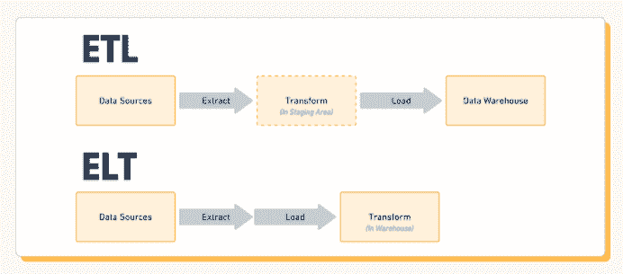
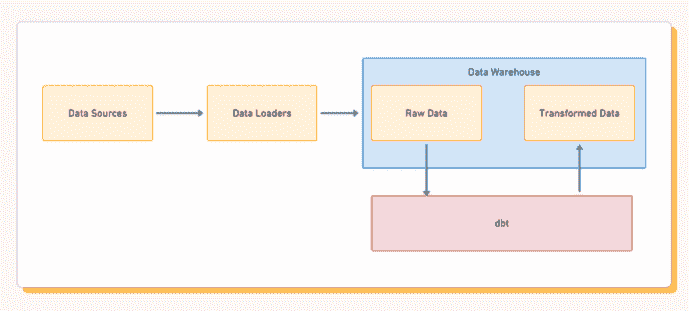

# 介绍 dbt，这一 ETL 和 ELT 的颠覆者

> 原文：[`www.kdnuggets.com/2021/03/dbt-etl-elt-disrupter.html`](https://www.kdnuggets.com/2021/03/dbt-etl-elt-disrupter.html)

评论

*图像来自 Pixabay 的 Peter H。*

* * *

## 我们的前三大课程推荐

 1\. [Google 网络安全证书](https://www.kdnuggets.com/google-cybersecurity) - 快速进入网络安全职业生涯。

 2\. [Google 数据分析专业证书](https://www.kdnuggets.com/google-data-analytics) - 提升您的数据分析能力

 3\. [Google IT 支持专业证书](https://www.kdnuggets.com/google-itsupport) - 支持您组织的 IT

* * *

每天，世界各地都会收集、处理和存储海量的数据，以用于各种分析目的。如果没有管道来获取和正确使用这些数据，大规模的数据科学将根本无法实现。传统上，使用 ETL 和 ELT 这两种过程中的一种来获取大量数据，挑选出重要的部分，然后将这些数据加载到数据湖或数据存储中。然而，这两种管道都有其缺点，并且在 2020 年——随着世界对分析和实时数据的依赖越来越大——ETL 和 ELT 已经不再是最锋利的工具了。

在这篇文章中，我将比较 ETL 和 ELT，总结它们的工作原理，它们在过去和今天的传统用法，以及为什么大多数数据科学领导者认为它们已经过时。

### ELT 和 ETL，有什么区别？

*[来自 Census 的图像，已获得许可](https://blog.getcensus.com/a-complete-guide-to-revenue-cohort-analysis/)。*

**ELT** 代表提取、加载、转换，而它的伙伴 ETL 同样代表提取、转换、加载。这三个步骤是任何重要数据转换中的关键过程。无论您是否意识到，它们在全球数百万个应用程序中被使用。每次您从附近的杂货店购买物品时，无论您的交易是匿名的还是识别的，都会经过这些管道进行财务和市场分析。让我们看看 ELT 与 ETL 的比较情况。

如果我们从不同来源收集数据，例如来自全国多个商店，或者举例来说，来自水坝上不同点的多种仪器，为了科学研究，我们需要将所有这些数据汇总在一起，然后仅提取与我们想要创建的分析相关的部分。这可能是来自每个商店的净销售额，在这种情况下，你需要对所有交易进行规范化并汇总。或者在水坝的例子中，可能需要列出所有水压读数。这就是转换过程，它对于创建分析至关重要。具体来说，它使我们能够使用像 Tableau 或 Periscope 这样的商业智能工具。

当我们使用 ELT——即提取、加载、转换（Extract, Load, Transform）时，我们的目的是通过在数据服务器上执行所有这些计算密集型操作来减轻主机器的负担。我们不是使用超市的计算机来汇总交易数据，而是将原始数据发送到数据湖或其他存储机器，然后再进行转换阶段以获取总体利润——例如，汇总交易并扣除成本。

ELT 非常适合大量数据的情况，其中我们只进行简单的计算，例如超市的例子。我们可以从所有来源提取数据，例如卡读卡器，将其加载到我们的数据存储中，然后进行转换，以便我们可以轻松地进行分析。

另一方面，你有**ETL**。在水坝的例子中，ETL 更为适用。总的来说，我们不一定收集大量数据，但有许多不同种类的读数，且很可能需要对其进行大量计算以获得有价值的分析。最好我们还希望这些数据能够实时处理，以便能够防止任何洪水！在这种情况下，提取、传输、加载（Extract, Transfer, Load）更为合适。我们不是将原始数据发送到数据存储中再进行操作，而是在数据传送到数据存储时进行操作，这被称为“转换阶段”。这样，我们可以建立一个在数据加载之前就已处理的连续数据流！

这两个类比很好地突出了 ETL 与 ELT 的优缺点。使用 ELT，当你有大量数据时，例如数百笔交易，但你只需要执行一些相对简单的操作，如计算利润或将销售数据映射到一天中的时间，这种方式非常有效。

与此同时，ETL 更适用于实时场景，其中我们没有大量数据，但有大量需要正确排序的专门数据，因此需要更多计算。

### ETL 和 ELT 的工具

对于现代世界来说，我们不再需要进行大量编程来创建一个精简的数据管道了！现在有许多 ETL 和 ELT 工具可以帮助我们完成这些功能，从各种数据源到广泛的数据仓库或机器。

例如，Hevo 无代码数据管道在零售商和其他希望收集销售数据或店铺活动信息的实体业务中非常受欢迎。但它也非常适用于实时数据，因此如果你想测量店铺前的客流量并随着时间绘制数据图，你也可以使用 Hevo！

还有 Fivetran，它围绕预构建的连接器和功能构建，提供“即插即用”的体验。

### dbt——一种更好的方法！

ELT 和 ETL 可能听起来是将数据从 A 传输到 B 进行分析的合理方法，但它们实际上各自都非常不方便。使用 ELT 和 ETL，你必须在加载数据之前确切知道你要创建的分析内容。幸运的是，现代工具如 [Fivetran](https://blog.getcensus.com/dbt-the-etl-elt-disrupter/fivetran.com)、Airflow、Stitch 等，以及 BigQuery、[Snowflake](https://www.snowflake.com/) 和 Redshift 等云仓库使得这些工具变得非常简单。

即使如此，困难的部分仍然存在于转换层。转换层是数据管道中的关键元素，但如果它阻碍了你获取最相关的洞察，那么一定有更好的方法。

然而，通过一些更先进的管道技术，我们可以增加选项，允许我们创建多种不同类型的分析，而无需通过管道重新发送数据并进行不同的转换！

*[图片来自 Census，经许可使用](https://blog.getcensus.com/a-complete-guide-to-revenue-cohort-analysis/)。*

它被称为**dbt**，或 [数据构建工具](https://getdbt.com/)，这是一个超级灵活的命令行数据管道工具，允许我们非常快速和轻松地收集和转换数据以进行分析！使用 dbt 不需要完全重新编程你的管道。

dbt 仍然基于 SQL 像传统数据库一样构建，但它在其基础上使用像 jinja 这样的模板引擎构建了额外的功能。这有效地允许你将更多逻辑（即循环、函数等）引入你的 SQL，以访问、重新排列和组织数据——有点像编程你的数据集，但具有更多的灵活性和选项。

有了这段代码，你可以使用 dbt 的运行命令来编译代码并在 SQL 数据上运行，以获取你在转换中所需的确切部分。它也可以快速编程、测试和修改，而无需等待很长时间让其遍历所有数据，这意味着你可以在紧张的时间表上创建新的、更好的程序版本。

dbt 并不能完全取代 ELT，但它确实提供了显著更多的灵活性——它极大地提升了你的“转换”层/阶段。**通过 dbt，你可以反复聚合、标准化和排序数据，而无需不断更新管道和重新发送。**

dbt 并不是 ETL 和 ELT 的替代品，但随着现代技术的出现，这些管道方法单独使用正变得过时。无论你选择 ETL 还是 ELT，有一点可以肯定的是，dbt 在你能想到的每一个方面都对 T（转换）层有着如此巨大的改进。

我鼓励你去了解 dbt。你可以从 [这里的快速入门指南](https://docs.getdbt.com/tutorial/setting-up) 开始，并加入他们超级 [有帮助的社区](https://community.getdbt.com/)。当你开始使用 dbt 时，你会感到惊讶自己以前是如何进行数据建模工作的。

[原文](https://towardsdatascience.com/introducing-dbt-the-etl-elt-disrupter-4351adc34123)。已获得转载许可。

**相关：**

+   [ETL 与 ELT：考虑数据仓库的进步](https://www.kdnuggets.com/2018/05/etl-vs-elt-considering-advancement-data-warehouses.html)

+   [为什么 ETL 的未来不是 ELT，而是 EL(T)](https://www.kdnuggets.com/2020/12/future-etl-is-elt.html)

+   [数据工程 — 数据科学的“堂兄”，麻烦多多](https://www.kdnuggets.com/2021/01/data-engineering-troublesome.html)

### 更多相关话题

+   [SQL 和数据集成：ETL 和 ELT](https://www.kdnuggets.com/2023/01/sql-data-integration-etl-elt.html)

+   [ETL 与 ELT：数据集成对决](https://www.kdnuggets.com/2022/08/etl-elt-data-integration-showdown.html)

+   [ETL 与 ELT：哪个更适合你的数据管道？](https://www.kdnuggets.com/2023/03/etl-elt-one-right-data-pipeline.html)

+   [数据仓库和 ETL 最佳实践](https://www.kdnuggets.com/2023/02/data-warehousing-etl-best-practices.html)

+   [使用 SQL + Python 构建可扩展的 ETL](https://www.kdnuggets.com/2022/04/building-scalable-etl-sql-python.html)

+   [ETL 与机器学习有何关联？](https://www.kdnuggets.com/2022/08/etl-machine-learning.html)
