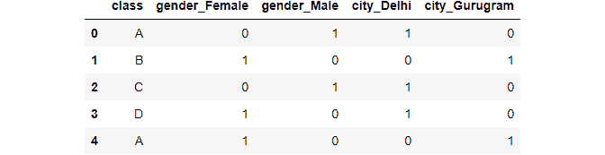
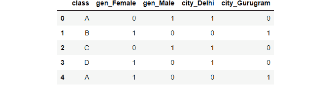
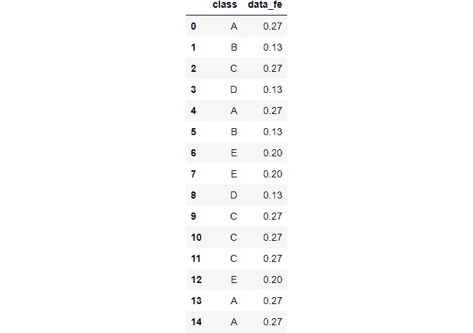
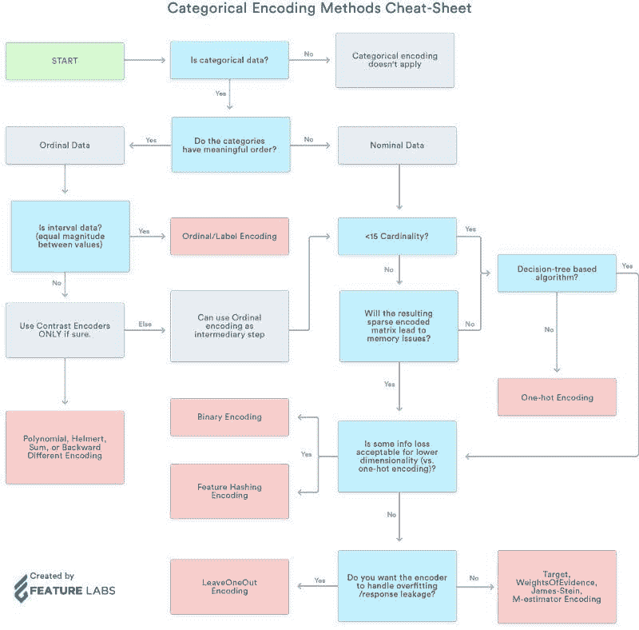

# 如何处理机器学习中的分类数据

> 原文：[`www.kdnuggets.com/2021/05/deal-with-categorical-data-machine-learning.html`](https://www.kdnuggets.com/2021/05/deal-with-categorical-data-machine-learning.html)


**在这篇博客中，我们将探索并实现：**

+   使用独热编码：

    +   Python 的 category_encoding 库

    +   Scikit-learn 预处理

    +   Pandas 的 get_dummies

+   二进制编码

+   频率编码

+   标签编码

+   顺序编码

* * *

## 我们的前三个课程推荐

 1\. [Google 网络安全证书](https://www.kdnuggets.com/google-cybersecurity) - 快速进入网络安全职业道路。

 2\. [Google 数据分析专业证书](https://www.kdnuggets.com/google-data-analytics) - 提升您的数据分析技能

 3\. [Google IT 支持专业证书](https://www.kdnuggets.com/google-itsupport) - 支持您的组织在 IT 方面

* * *

# 什么是分类数据？

分类数据是一种用于将信息按类似特征分组的数据类型，而数值数据则是以数字形式表达信息的数据类型。

分类数据的例子：**性别**

**为什么我们需要编码？**

+   大多数机器学习算法无法处理分类变量，除非我们将它们转换为数值。

+   许多算法的表现甚至会因分类变量的编码方式而有所不同

**分类变量可以分为两类：**

+   名义型：没有特定顺序

+   顺序型：值之间有一定顺序

我们还会参考一张速查表，显示何时使用哪种类型的编码。

# 方法 1：使用 Python 的 Category Encoder 库

category_encoders 是一个很棒的 Python 库，提供了 15 种不同的编码方案。

**这是库支持的 15 种编码类型的列表：**

+   独热编码

+   标签编码

+   顺序编码

+   赫尔梅特编码

+   二进制编码

+   频率编码

+   平均编码

+   证据权重编码

+   概率比编码

+   哈希编码

+   向后差分编码

+   留一法编码

+   詹姆斯-斯坦编码

+   M 估计量编码

+   温度计编码器

导入库：

```py
import pandas as pd
import sklearn

pip install category_encoders

import category_encoders as ce
```

创建一个数据框：

```py
data = pd.DataFrame({ 'gender' : ['Male', 'Female', 'Male', 'Female', 'Female'],
                       'class' : ['A','B','C','D','A'],
                        'city' : ['Delhi','Gurugram','Delhi','Delhi','Gurugram'] })
data.head()
```


图片由作者提供

**通过 category_encoder 实现独热编码**

在这种方法中，每个类别映射到一个包含 1 和 0 的向量，以表示特征的存在或不存在。向量的数量取决于特征的类别数量。

创建一个独热编码对象：

```py
ce_OHE = ce.OneHotEncoder(cols=['gender','city'])

data1 = ce_OHE.fit_transform(data)
data1.head()
```


图片由作者提供

**二进制编码**

二进制编码将一个类别转换为二进制数字。每个二进制数字创建一个特征列。


[图像参考](https://towardsdatascience.com/all-about-categorical-variable-encoding-305f3361fd02)

```py
ce_be = ce.BinaryEncoder(cols=['class']);

# transform the data
data_binary = ce_be.fit_transform(data["class"]);
data_binary
```


作者提供的图像

类似地，该库提供了另外 14 种编码方式。

# 方法 2：使用 Pandas 的 Get Dummies

```py
pd.get_dummies(data,columns=["gender","city"])
```



作者提供的图像

如果我们不希望编码使用默认值，可以分配前缀。

```py
pd.get_dummies(data,prefix=["gen","city"],columns=["gender","city"])
```



作者提供的图像

# 方法 3：使用 Scikit-learn

Scikit-learn 还提供了 15 种不同类型的内置编码器，可以从 sklearn.preprocessing 访问。

## Scikit-learn 独热编码

首先获取数据中的类别变量列表：

```py
s = (data.dtypes == 'object')
cols = list(s[s].index)

from sklearn.preprocessing import OneHotEncoder

ohe = OneHotEncoder(handle_unknown='ignore',sparse=False)
```

应用于性别列：

```py
data_gender = pd.DataFrame(ohe.fit_transform(data[["gender"]]))

data_gender
```


作者提供的图像

应用于城市列：

```py
data_city = pd.DataFrame(ohe.fit_transform(data[["city"]]))

data_city
```


作者提供的图像

应用于类别列：

```py
data_class = pd.DataFrame(ohe.fit_transform(data[["class"]]))

data_class
```


作者提供的图像

这是因为类别列有 4 个唯一值。

应用于类别变量列表：

```py
data_cols = pd.DataFrame(ohe.fit_transform(data[cols]))

data_cols
```


作者提供的图像

这里前两列代表性别，接下来的四列代表类别，剩下的两列代表城市。

## Scikit-learn 标签编码

在标签编码中，每个类别被分配一个从 1 到 N 的值，其中 N 是该特征的类别数量。这些分配之间没有关系或顺序。

```py
from sklearn.preprocessing import LabelEncoder

le = LabelEncoder()
Label encoder takes no arguments
le_class = le.fit_transform(data[["class"]])
```

**与独热编码比较**

```py
data_class
```


作者提供的图像

## 序数编码

序数编码的编码变量保留了变量的序数（有序）特性。它看起来类似于标签编码，唯一的区别在于标签编码不考虑变量是否有序；它将分配一系列整数。

**示例：序数编码将分配值为 非常好（1）< 好（2）< 差（3）< 更差（4）**

首先，我们需要通过字典分配变量的原始顺序。

```py
temp = {'temperature' :['very cold', 'cold', 'warm', 'hot', 'very hot']}
df=pd.DataFrame(temp,columns=["temperature"])
temp_dict = {'very cold': 1,'cold': 2,'warm': 3,'hot': 4,"very hot":5}
df
```


作者提供的图像

然后我们可以根据字典映射每一行的变量。

```py
df["temp_ordinal"] = df.temperature.map(temp_dict)
df
```


作者提供的图像

## 频率编码

类别是根据其总数量中值的频率分配的。

```py
data_freq = pd.DataFrame({'class' : ['A','B','C','D','A',"B","E","E","D","C","C","C","E","A","A"]})
```

按类别列分组：

```py
fe = data_freq.groupby("class").size()
```

按长度划分：

```py
fe_ = fe/len(data_freq)
```

映射和舍入：

```py
data_freq["data_fe"] = data_freq["class"].map(fe_).round(2)
data_freq
```



作者提供的图像

在本文中，我们看到了 5 种编码方案。类似地，还有其他 10 种编码方式我们尚未探讨：

+   赫尔梅特编码

+   平均编码

+   证据权重编码

+   概率比编码

+   哈希编码

+   向后差分编码

+   留一法编码

+   詹姆斯-斯坦编码

+   M-估计量编码

+   温度计编码器

# 哪种编码方法最佳？

没有一种方法适用于所有问题或数据集。我个人认为 get_dummies 方法在其易于实现的优势上具有优势。

如果你想了解所有 15 种编码方式，[这里有一篇很好的文章可供参考](https://towardsdatascience.com/all-about-categorical-variable-encoding-305f3361fd02)。

这是一个有关何时使用何种编码类型的备忘单：



[图片参考](https://towardsdatascience.com/all-about-categorical-variable-encoding-305f3361fd02)

## 参考资料：

1.  [`towardsdatascience.com/all-about-categorical-variable-encoding-305f3361fd02`](https://towardsdatascience.com/all-about-categorical-variable-encoding-305f3361fd02)

1.  [`pypi.org/project/category-encoders/`](https://pypi.org/project/category-encoders/)

1.  [`pandas.pydata.org/docs/reference/api/pandas.get_dummies.html`](https://pandas.pydata.org/docs/reference/api/pandas.get_dummies.html)

**[Shelvi Garg](https://www.linkedin.com/in/shelvi-garg-3a7421108/)** 是 Spinny 的数据科学家

### 更多相关内容

+   [处理机器学习中数据不足的 5 种方法](https://www.kdnuggets.com/2019/06/5-ways-lack-data-machine-learning.html)

+   [黑色星期五优惠 - 以更少的费用掌握 DataCamp 机器学习](https://www.kdnuggets.com/2022/11/datacamp-black-friday-deal-master-machine-learning-less-datacamp.html)

+   [使用 MultiLabelBinarizer 编码分类特征](https://www.kdnuggets.com/2023/01/encoding-categorical-features-multilabelbinarizer.html)

+   [如何使用 Pandas 中的插值技术处理缺失数据](https://www.kdnuggets.com/how-to-deal-with-missing-data-using-interpolation-techniques-in-pandas)

+   [每位机器学习工程师都应该掌握的 5 种机器学习技能](https://www.kdnuggets.com/2023/03/5-machine-learning-skills-every-machine-learning-engineer-know-2023.html)

+   [KDnuggets 新闻，12 月 14 日：3 个免费的机器学习课程](https://www.kdnuggets.com/2022/n48.html)
