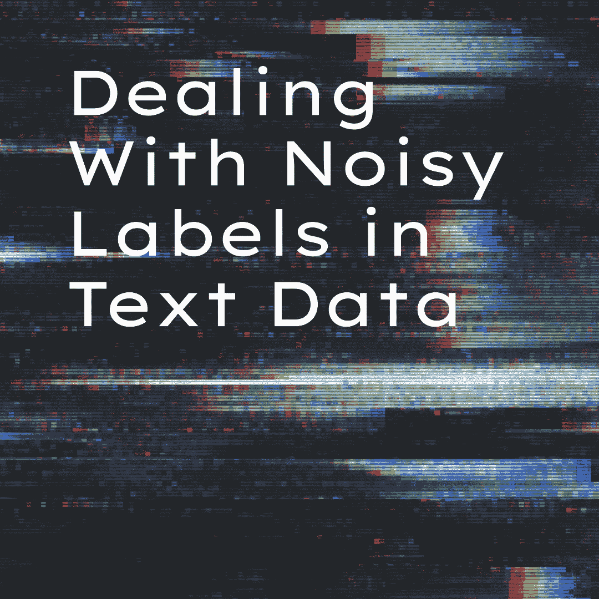
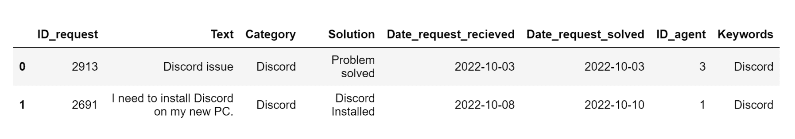

# 处理文本数据中的噪声标签

> 原文：[`www.kdnuggets.com/2023/04/dealing-noisy-labels-text-data.html`](https://www.kdnuggets.com/2023/04/dealing-noisy-labels-text-data.html)



编辑器提供的图像

随着自然语言处理的兴趣上升，越来越多的从业者遇到了瓶颈，这不是因为他们不能构建或微调 LLM，而是因为他们的数据很混乱！

我们将展示简单但非常有效的编码程序，以修复文本数据中的噪声标签。我们将处理现实世界文本数据中的两个常见场景：

1.  拥有一个包含来自其他几个类别的混合示例的类别。我喜欢将这种类别称为元类别。

1.  拥有两个或更多应该合并成一个类别的类别，因为它们的文本指向相同的话题。

我们将使用为本教程创建的 ITSM（IT 服务管理）数据集（CCO 许可）。它可以在下面的 Kaggle 链接中找到：

[`www.kaggle.com/datasets/nikolagreb/small-itsm-dataset`](https://www.kaggle.com/datasets/nikolagreb/small-itsm-dataset)

是时候开始导入所有需要的库和基本数据检查了。做好准备，代码来了！

# 导入和数据检查

```py
import pandas as pd
import numpy as np
import string

from sklearn.feature_extraction.text import TfidfVectorizer
from sklearn.naive_bayes import ComplementNB
from sklearn.pipeline import make_pipeline
from sklearn.model_selection import train_test_split
from sklearn import metrics

df = pd.read_excel("ITSM_data.xlsx")
df.info() 
```

```py
 <class>RangeIndex: 118 entries, 0 to 117
Data columns (total 7 columns):
 #   Column                 Non-Null Count  Dtype         
---  ------                 --------------  -----         
 0   ID_request             118 non-null    int64         
 1   Text                   117 non-null    object        
 2   Category               115 non-null    object        
 3   Solution               115 non-null    object        
 4   Date_request_recieved  118 non-null    datetime64[ns]
 5   Date_request_solved    118 non-null    datetime64[ns]
 6   ID_agent               118 non-null    int64         
dtypes: datetime64ns, int64(2), object(3)
memory usage: 6.6+ KB</class> 
```

每一行代表 ITSM 数据库中的一个条目。我们将尝试根据用户编写的工单文本来预测工单的类别。让我们更深入地探讨描述的业务用例中最重要的字段。

```py
for text, category in zip(df.Text.sample(3, random_state=2), df.Category.sample(3, random_state=2)):
    print("TEXT:")
    print(text)
    print("CATEGORY:")
    print(category)
    print("-"*100) 
```

```py
TEXT:
I just want to talk to an agent, there are too many problems on my pc to be explained in one ticket. Please call me when you see this, whoever you are. (talk to agent)
CATEGORY:
Asana
----------------------------------------------------------------------------------------------------
TEXT:
Asana funktionierte nicht mehr, nachdem ich meinen Laptop neu gestartet hatte. Bitte helfen Sie.
CATEGORY:
Help Needed
----------------------------------------------------------------------------------------------------
TEXT:
My mail stopped to work after I updated Windows.
CATEGORY:
Outlook
---------------------------------------------------------------------------------------------------- 
```

如果我们查看前两个工单，虽然一个工单是德文的，但我们可以看到描述的问题指的是相同的软件？—？Asana，但它们带有不同的标签。这是我们类别的初步分布：

```py
df.Category.value_counts(normalize=True, dropna=False).mul(100).round(1).astype(str) + "%"
```

```py
Outlook             19.1%
Discord             13.9%
CRM                 12.2%
Internet Browser    10.4%
Mail                 9.6%
Keyboard             9.6%
Asana                8.7%
Mouse                8.7%
Help Needed          7.8%
Name: Category, dtype: object 
```

需要帮助的类别看起来可疑，像是一个可以包含来自多个其他类别的工单的类别。此外，Outlook 和 Mail 听起来相似，也许它们应该合并为一个类别。在深入研究这些类别之前，我们将清理我们关注列中的缺失值。

```py
important_columns = ["Text", "Category"]
for cat in important_columns:   
   df.drop(df[df[cat].isna()].index, inplace=True)
df.reset_index(inplace=True, drop=True) 
```

# 将工单分配到正确的类别

对数据进行目视检查没有有效的替代方法。在 pandas 中执行此操作的高级函数是 .sample()，因此我们将再次执行此操作，这次针对可疑类别：

```py
meta = df[df.Category == "Help Needed"]

for text in meta.Text.sample(5, random_state=2):
    print(text)
    print("-"*100) 
```

```py
Discord emojis aren't available to me, I would like to have this option enabled like other team members have.
---------------------------------------------------------------------------
Bitte reparieren Sie mein Hubspot CRM. Seit gestern funktioniert es nicht mehr
---------------------------------------------------------------------------
My headphones aren't working. I would like to order new.
---------------------------------------------------------------------------

Bundled problems with Office since restart:

Messages not sent

Outlook does not connect, mails do not arrive

Error 0x8004deb0 appears when Connection attempt, see attachment

The company account is affected: AB123

Access via Office.com seems to be possible.

---------------------------------------------------------------------------
Asana funktionierte nicht mehr, nachdem ich meinen Laptop neu gestartet hatte. Bitte helfen Sie.
--------------------------------------------------------------------------- 
```

显然，我们有关于 Discord、Asana 和 CRM 的工单。因此，类别名称应该从“Help Needed”更改为现有的、更具体的类别。在重新分配过程的第一步，我们将创建一个新的列“Keywords”，该列提供工单是否包含“Text”列中类别列表中的单词的信息。

```py
words_categories = np.unique([word.strip().lower() for word in df.Category])  # list of categories

def keywords(row): 
    list_w = []
    for word in row.translate(str.maketrans("", "", string.punctuation)).lower().split():
        if word in words_categories:
            list_w.append(word)
    return list_w

df["Keywords"] = df.Text.apply(keywords)    

# since our output is in the list, this function will give us better looking final output. 
def clean_row(row):
    row = str(row)
    row = row.replace("[", "")
    row = row.replace("]", "")
    row = row.replace("'", "")
    row = string.capwords(row)
    return row

df["Keywords"] = df.Keywords.apply(clean_row) 
```

此外，请注意，使用“if word in str(words_categories)”而不是“if word in words_categories”将捕捉到来自多词类别（在我们的例子中是 Internet Browser）的词，但也需要更多的数据预处理。为了保持简单和直接，我们将使用仅包含一个词的类别的代码。这是我们数据集现在的样子：

```py
df.head(2)
```

以图像输出：



提取关键词列后，我们将评估票据的质量。我们的假设是：

1.  在文本字段中只有一个与票据所属类别相同的关键词的票据将容易分类。

1.  在文本字段中有多个关键词的票据，其中至少一个关键词与票据所属类别相同，大多数情况下将容易分类。

1.  含有关键词的票据，但其中没有一个与票据所属类别的名称相同的，可能是噪声标签的情况。

1.  其他票据基于关键词是中性的。

```py
cl_list = []

for category, keywords in zip(df.Category, df.Keywords):
    if category.lower() == keywords.lower() and keywords != "":
        cl_list.append("easy_classification")
    elif category.lower() in keywords.lower():  # to deal with multiple keywords in the ticket
        cl_list.append("probably_easy_classification")
    elif category.lower() != keywords.lower() and keywords != "":
        cl_list.append("potential_problem")
    else:      
        cl_list.append("neutral")

df["Ease_classification"] = cl_list
df.Ease_classification.value_counts(normalize=True, dropna=False).mul(100).round(1).astype(str) + "%" 
```

```py
neutral                         45.6%
easy_classification             37.7%
potential_problem                9.6%
probably_easy_classification     7.0%
Name: Ease_classification, dtype: object 
```

我们创建了新的分布，现在是时候检查分类为潜在问题的票据了。在实际操作中，下一步将需要更多的采样并用肉眼查看更大块的数据，但基本原理是一样的。你需要找出有问题的票据，并决定是否可以提高其质量或是否应将其从数据集中剔除。当你面对一个大数据集时，保持冷静，别忘了数据检查和数据准备通常比构建机器学习算法需要更多的时间！

```py
pp = df[df.Ease_classification == "potential_problem"]

for text, category in zip(pp.Text.sample(5, random_state=2), pp.Category.sample(3, random_state=2)):
    print("TEXT:")
    print(text)
    print("CATEGORY:")
    print(category)
    print("-"*100) 
```

```py
TEXT:

outlook issue , I did an update Windows and I have no more outlook on my notebook ? Please help !

 Outlook
CATEGORY:
Mail
--------------------------------------------------------------------

TEXT:
Please relase blocked attachements from the mail I got from name.surname@company.com. These are data needed for social media marketing campaing.
CATEGORY:
Outlook
--------------------------------------------------------------------
TEXT:
Asana funktionierte nicht mehr, nachdem ich meinen Laptop neu gestartet hatte. Bitte helfen Sie.
CATEGORY:
Help Needed
-------------------------------------------------------------------- 
```

我们了解到来自 Outlook 和 Mail 类别的票据与相同的问题相关，因此我们将合并这两个类别并改进我们未来机器学习分类算法的结果。

# 合并到集群

```py
mail_categories_to_merge = ["Outlook", "Mail"]

sum_mail_cluster = 0
for x in mail_categories_to_merge:
    sum_mail_cluster += len(df[df["Category"] == x]) 

print("Number of categories to be merged into new cluster: ", len(mail_categories_to_merge))
print("Expected number of tickets in the new cluster: ", sum_mail_cluster)

def rename_to_mail_cluster(category):
    if category in mail_categories_to_merge:
        category = "Mail_CLUSTER"
    else:
        category = category
    return category

df["Category"] = df["Category"].apply(rename_to_mail_cluster)

df.Category.value_counts() 
```

```py
Number of categories to be merged into new cluster:  2
Expected number of tickets in the new cluster:  33
Mail_CLUSTER        33
Discord             15
CRM                 14
Internet Browser    12
Keyboard            11
Asana               10
Mouse               10
Help Needed          9
Name: Category, dtype: int64 
```

最后但同样重要的是，我们希望将一些来自“需要帮助”元类别的票据重新标记为适当的类别。

```py
df.loc[(df["Category"] == "Help Needed") & ([set(x).intersection(words_categories) for x in df["Text"].str.lower().str.replace("[^\w\s]", "", regex=True).str.split()]), "Category"] = "Change"

def cat_name_change(cat, keywords):
    if cat == "Change":
        cat = keywords
    else:
        cat = cat
    return cat

df["Category"] = df.apply(lambda x: cat_name_change(x.Category, x.Keywords), axis=1)
df["Category"] = df["Category"].replace({"Crm":"CRM"})

df.Category.value_counts(dropna=False) 
```

```py
Mail_CLUSTER        33
Discord             16
CRM                 15
Internet Browser    12
Asana               11
Keyboard            11
Mouse               10
Help Needed          6
Name: Category, dtype: int64 
```

我们进行了数据重新标记和清理，但如果我们不做至少一个科学实验来测试我们工作的最终分类影响，我们不应自称为数据科学家。我们将通过在 sklearn 中实现互补朴素贝叶斯分类器来完成这一点。你可以尝试其他更复杂的算法。此外，还要注意，进一步的数据清理可能会进行，例如，我们还可以删除所有仍留在“需要帮助”类别中的票据。

# 测试数据处理的影响

```py
model = make_pipeline(TfidfVectorizer(), ComplementNB())

# old df
df_o = pd.read_excel("ITSM_data.xlsx")

important_categories = ["Text", "Category"]
for cat in important_categories:    
    df_o.drop(df_o[df_o[cat].isna()].index, inplace=True)

df_o.name = "dataset just without missing"
df.name = "dataset after deeper cleaning"

for dataframe in [df_o, df]:
    # Split dataset into training set and test set
    X_train, X_test, y_train, y_test = train_test_split(dataframe.Text, dataframe.Category, test_size=0.2, random_state=1) 

    # Training the model with train data
    model.fit(X_train, y_train)

    # Predict the response for test dataset
    y_pred = model.predict(X_test)

    print(f"Accuracy of  Complement Naive Bayes classifier model on {dataframe.name} is: {round(metrics.accuracy_score(y_test, y_pred),2)}") 
```

```py
Accuracy of  Complement Naive Bayes classifier model on dataset just without missing is: 0.48
Accuracy of  Complement Naive Bayes classifier model on dataset after deeper cleaning is: 0.65 
```

相当令人印象深刻，对吧？我们使用的数据集很小（故意如此，以便你可以轻松看到每一步的结果），因此不同的随机种子可能会产生不同的结果，但在绝大多数情况下，模型在清理后的数据集上表现会显著优于原始数据集。我们做得很好！

**[尼古拉·格雷布](https://www.linkedin.com/in/ngreb/)** 编程已有四年多，在过去的两年里，他专注于自然语言处理。在转向数据科学之前，他在销售、人力资源、写作和国际象棋方面取得了成功。

* * *

## 我们的前三大课程推荐

 1\. [谷歌网络安全证书](https://www.kdnuggets.com/google-cybersecurity) - 快速进入网络安全职业生涯。

 2\. [谷歌数据分析专业证书](https://www.kdnuggets.com/google-data-analytics) - 提升你的数据分析技能

 3\. [谷歌 IT 支持专业证书](https://www.kdnuggets.com/google-itsupport) - 支持你的组织 IT

* * *

### 更多相关话题

+   [处理推荐系统和搜索中的位置偏差](https://www.kdnuggets.com/2023/03/dealing-position-bias-recommendations-search.html)

+   [利用 LangChain 转变 AI：文本数据的游戏规则改变者](https://www.kdnuggets.com/2023/08/transforming-ai-langchain-text-data-game-changer.html)

+   [如何使用 Hugging Face Tokenizers 库来预处理文本数据](https://www.kdnuggets.com/how-to-use-the-hugging-face-tokenizers-library-to-preprocess-text-data)

+   [在 Pandas 中清洗和预处理文本数据以用于 NLP 任务](https://www.kdnuggets.com/cleaning-and-preprocessing-text-data-in-pandas-for-nlp-tasks)

+   [使用 BERT 对长文本文档进行分类](https://www.kdnuggets.com/2022/02/classifying-long-text-documents-bert.html)

+   [如何使用 ChatGPT 将文本转换为 PowerPoint 演示文稿](https://www.kdnuggets.com/2023/08/chatgpt-convert-text-powerpoint-presentation.html)
