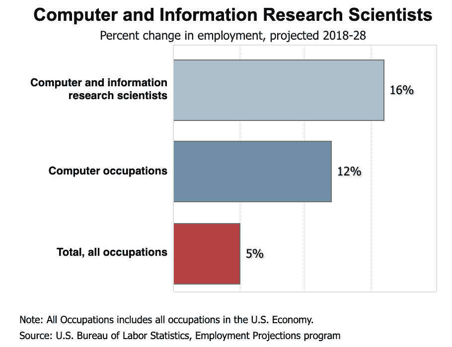
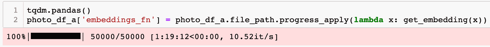
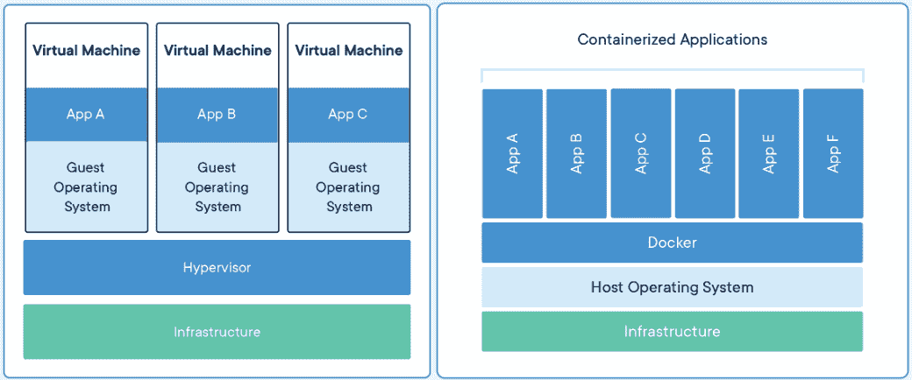
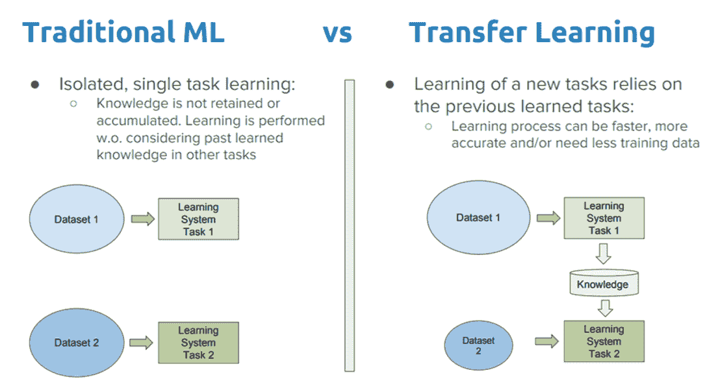

# 数据科学的十年

> 原文：[`www.kdnuggets.com/2020/01/decade-data-science.html`](https://www.kdnuggets.com/2020/01/decade-data-science.html)

评论

**作者 [Alex Mitrani](https://www.linkedin.com/in/alex-mitrani/)，数据科学家**。

自从《哈佛商业评论》发布了一篇[文章](https://hbr.org/2012/10/data-scientist-the-sexiest-job-of-the-21st-century)宣称数据科学家是“21 世纪最性感的职业”以来，已经过去了七年多。此后，全国各地涌现出许多培训营，大学也开发了数据科学的本科、硕士和博士课程；我自己的母校也计划建立一个专门针对这一主题的[中心](http://www.bu.edu/articles/2018/data-sciences-center/)。这些课程的费用因是否在线完成、课程时长以及学校的就业统计和声誉而有很大差异。

* * *

## 我们的前 3 名课程推荐

 1\. [Google 网络安全证书](https://www.kdnuggets.com/google-cybersecurity) - 快速进入网络安全职业生涯。

 2\. [Google 数据分析专业证书](https://www.kdnuggets.com/google-data-analytics) - 提升你的数据分析技能

 3\. [Google IT 支持专业证书](https://www.kdnuggets.com/google-itsupport) - 支持你的组织 IT

* * *

数据科学家到底*是什么*？最广泛接受的定义可能是通过应用编码和统计学从数据中提取可操作的见解的人。在完成我的数据科学课程后，我涉及了市场趋势分析、时间序列、推荐系统、A/B 测试、卷积神经网络、计算机视觉、自然语言处理、分类和连续建模、非结构化聚类等内容。我主要使用 Python 编程和 SQL 完成这些项目。这些技能几乎可以应用于任何主题，这也是为什么各行各业的公司都在招聘需要领域知识的数据科学家的原因。

随着十年的结束，我想借此机会讨论行业趋势、流行框架、我有机会使用的一些有用工具，以及我期待在未来更多使用的工具。

### 就业前景

我决定进入数据科学领域有几个原因。我拥有商业学位以及金融和房地产背景。自从大学毕业以来，我注意到目标职位的首选资格部分越来越多地出现了 Python、SQL 和机器学习的知识。我也在处理 Excel 无法再处理的大数据集。我希望变得尽可能具有竞争力和相关性，因此我开始寻找涵盖这些技能的项目。在经过大量研究后，我决定探索数据科学。

数据科学家在 LinkedIn 的 [2020 美国新兴职位报告](https://business.linkedin.com/content/dam/me/business/en-us/talent-solutions/emerging-jobs-report/Emerging_Jobs_Report_U.S._FINAL.pdf)中排名第三，该领域年增长率为 37%。根据 [Glassdoor 调查](https://www.glassdoor.com/Salaries/entry-level-data-scientist-salary-SRCH_KO0,26.htm) 的 4,354 名受访者数据，入门级数据科学家的起薪为每年 $101,087。这些就业统计数据对从业和有志于成为数据科学家的人员来说应该很有吸引力。

*“计算机和信息研究科学家”中的第 2 页包括数据科学。来源： [**美国劳工统计局**](https://www.bls.gov/ooh/computer-and-information-technology/computer-and-information-research-scientists.htm#tab-6)。*

### 框架

数据科学是统计学与计算机科学等学科的结合。Python 编程语言拥有越来越多的包，这些包使数据科学家能够处理数据并创建模型。我使用最频繁的库有（按无特定顺序）：

1.  [Pandas](https://pandas.pydata.org/)— 将原始数据结构化为数据框，并执行汇总统计

1.  [NumPy](https://numpy.org/)— 许多计算可以在 n 维数组上高效执行

1.  [Scikit-learn](https://scikit-learn.org/stable/)— 许多机器学习模型和评估指标

1.  [Matplotlib](https://matplotlib.org/)— 标准且高度可定制的统计可视化

1.  [Seaborn](https://seaborn.pydata.org/)— 统计可视化，比 Matplotlib 更容易实现

1.  [Plotly](https://plot.ly/) 和 [Plotly Express](https://plot.ly/python/plotly-express/)— 互动和统计可视化，比 Matplotlib 更容易实现

1.  [Folium](https://python-visualization.github.io/folium/)— 地理空间可视化，即一个 [分层地图](https://python-visualization.github.io/folium/quickstart.html)

1.  [TensorFlow](https://www.tensorflow.org/) 及其 [Keras](https://www.tensorflow.org/guide/keras) 实现— 深度学习库，支持模型开发和迁移学习。可应用于多种类型的数据，即文本、图像、音频等

**基于云的工具**

[Google Colab](https://colab.research.google.com/notebooks/basic_features_overview.ipynb)、[Amazon EMR](https://docs.aws.amazon.com/emr/latest/ManagementGuide/emr-managed-notebooks.html) 和 [IBM Watson Studio](https://www.ibm.com/cloud/watson-studio) 都允许你远程运行 Jupyter Notebook 样式的文件。这些平台还使你能够在云中存储和访问数据来构建模型，并利用强大的 GPU 比在本地机器的 CPU 上更快地训练模型。这些 GPU 可以按小时租用。[Postman](https://www.getpostman.com/) 是另一个可以租用 GPU 的服务。

### 有用的工具

**AST Literal Evaluation**

在许多项目中，我会在 pandas 数据框中创建一个数组列。然后，我需要保存数据框并稍后检索数据。无论使用什么文件类型，每当我读取保存的文件时，数组列都会加载为具有字面空格 (*\n*) 的字符串类型。当你花了几个小时进行网页抓取或从模型中获取嵌入，并且有截止日期临近时，这特别令人沮丧。幸运的是，Python 的[抽象语法树](https://docs.python.org/3/library/ast.html)（ast）模块的 *literal_eval()* 方法可以解决这个问题。我对格式错误的数组使用了一系列 *replace()* 语句，将 *\n* 和其他异常字符替换为空格。然后我为字符串添加了括号，使其看起来像一个数组。一旦字符串表现得像一个数组，我应用了 ast 方法来将字符串转换为实际的数组。返回数组的语句如下：

*asarray(ast.literal_eval(embedding_as_string)).astype(‘float32’)*

解析上述语句：

1.  *embedding_as_string* — 应该是一个数组的检索字符串，其中所有不规则字符（即，*\n*）已被删除。通常出现在将文件读入 pandas 数据框时，原始数据类型为数组。

1.  *literal_eval()* — 用于读取字符串语法的方法

1.  *asarray()* — 一个用于将字符串语法转换为数组的[NumPy 方法](https://docs.scipy.org/doc/numpy/reference/generated/numpy.asarray.html)

1.  *.astype(‘float32’)* — 在这种情况下，数组包含浮点小数元素，这将把各个元素转换为*float32* 类型。

总之，这个语句接受一个格式错误的数组字符串表示，并返回一个实际的数组。

**TQDM**

速度很重要，尤其是在实时演示中。我完成了一个面部相似度程序，将用户的面部嵌入与名人和政治家的嵌入数据库进行比较。我在实时演示中使用了余弦相似度度量来比较用户与数据库。我最初使用了 [Scikit-learn 的方法](https://scikit-learn.org/stable/modules/generated/sklearn.metrics.pairwise.cosine_similarity.html)，但实时演示速度实在太慢了。我通过在每个函数后面添加文本打印语句来寻找瓶颈。我很快发现计算余弦相似度花费的时间太长。我读到 NumPy 计算的速度很快，于是决定在阅读 Danushka Bollegala 的 [文章](http://danushka.net/lect/dm/Numpy-basics.html) 后切换到纯 NumPy 实现。出于好奇，我寻找了一种方法来测量这两个函数之间的时间差，我的同事建议了 [TQDM 项目](https://tqdm.github.io/)。

我使用 [Jupyter Notebooks](https://jupyter.org/) 来构建函数，因为我喜欢在编写 Python 脚本之前测试输出。TQDM 创建了一个可见的状态栏，使我们能够查看循环的进度。

*一个在 lambda 函数上迭代 Pandas 数据框的 TQDM 状态栏的示例。*

TQDM 状态栏告诉你函数正在完成哪个迭代、预期的总迭代次数（如果函数中断，这有助于定位问题）、总花费时间、预计剩余时间以及每秒的迭代次数。TQDM 与 Jupyter Notebooks 配合良好。我的数据集上，NumPy 实现的余弦相似度比 Scikit-learn 实现的快了 75%。

### 我期待使用的东西

**容器化**

共享代码和项目的能力在数据科学领域正变得越来越必要。容器化是将软件打包成在所有机器上都能一致和高效运行的方式。[Docker](https://www.docker.com/) 是一个流行的容器化平台。它本质上创建了一个软件包，包含所使用的每个库的版本，以便可以在不同机器上一致地加载和运行。当你在机器上运行 Docker 容器时，你不需要下载原始计算机的操作系统或常见的依赖库，这就是容器化更高效的原因。

*虚拟机（VM）与容器。虚拟机需要操作系统，然后下载相关的库，而容器不需要操作系统，只下载机器上未安装的库。来源： [docker.com](https://www.docker.com/resources/what-container)。*

将容器化应用于数据科学项目可能会很棘手，因为容器的抽象性和可定制性。最常见的容器是包含 SQL 数据库和运行查询的 python 脚本的容器。Docker 的[快速入门指南](https://docs.docker.com/get-started/)涵盖了容器及相关术语的基础知识。我发现，对专门为我设想的目的而设计的容器进行逆向工程，是实践构建不同类型容器的最佳方式。一旦我拥有了类似的容器，我可以利用 Docker 文档将其调整到我的目的上。

**Keras 的迁移学习**

我期待着利用迁移学习构建更多深度学习项目。[迁移学习](https://machinelearningmastery.com/transfer-learning-for-deep-learning/)是将为一个目的构建的模型知识应用于另一个目的的实践。

*“传统学习与迁移学习” 来源：“[深度学习中迁移学习的全面实践指南](https://towardsdatascience.com/a-comprehensive-hands-on-guide-to-transfer-learning-with-real-world-applications-in-deep-learning-212bf3b2f27a)” 作者：Dipanjan (DJ) Sarkar。*

例如，你可以将一个预训练的面部识别模型整合到另一组图片数据集中，而无需从头开始训练模型。Keras 使我们能够加载预训练模型并将其调整到其他数据集上。

**OpenScale**

最近，我与 IBM 的一位首席发明家讨论了[Watson OpenScale](https://www.ibm.com/cloud/watson-openscale)。该项目以一种有趣的方式向我展示。我们一致认为，大多数数据科学家的时间都花在获取和清理数据上，然后提出正确的问题。实际构建模型所需的时间相对较少，也不像项目的前期那么困难。如果你在处理一个分类项目，你将建立多个模型，并使用像[GridSearch](https://scikit-learn.org/stable/modules/grid_search.html)这样的工具来调整模型到最有效的超参数。接着，你会选择一个度量标准来比较这些模型，并选择最适合你目的的模型。这种模型构建依赖于你选择每个参数的最佳范围的能力以及等待 GridSearch 定位最佳超参数值的耐心。OpenScale 通过基本上作为云端的 GridSearch 来处理分类模型*和*每个模型的参数，将这一过程提升到一个新的水平。这使得数据科学项目中最短的部分变得更短，使数据科学家可以专注于项目中更重要的部分：EDA、提出正确的问题、提取可操作的见解，并将发现清晰地传达给所有利益相关者。

### 摘要

数据科学领域的前景强劲。总有新的工具发布，我期待使用这些工具。该领域涵盖的主题不断增长，这意味着总有新的东西可以学习。数据科学可以应用于任何行业，用于多种目的，并且如果你提出正确的问题，可以为任何组织创造价值。

[最初发表于 Analytics Vidhya 和 Medium](https://medium.com/analytics-vidhya/the-decade-of-data-science-4ee6f7c10e9e)。经授权转载。

**个人简介：** [亚历克斯·米特拉尼](https://www.linkedin.com/in/alex-mitrani/) 是一位数据科学家，热衷于利用技术做出明智决策。亚历克斯的经验包括房地产和金融领域，他分析了投资并管理了客户关系。亚历克斯完成了 Flatiron School 的数据科学项目，并从波士顿大学金融专业毕业。

**相关：**

+   [2020 年前 5 大人工智能趋势](https://www.kdnuggets.com/2020/01/top-5-ai-trends-2020.html)

+   [2020 年数据科学的四大热门趋势](https://www.kdnuggets.com/2019/12/4-hottest-trends-data-science-2020.html)

+   [分析与数据科学的未来](https://www.kdnuggets.com/2019/09/future-analytics-data-science.html)

### 更多相关话题

+   [与未来对话：对下一个十年人工智能的预测](https://www.kdnuggets.com/2023/04/chatting-future-predictions-ai-next-decade.html)

+   [停止学习数据科学，寻找目标并找到目标…](https://www.kdnuggets.com/2021/12/stop-learning-data-science-find-purpose.html)

+   [数据科学基础：你需要知道的 10 项必备技能…](https://www.kdnuggets.com/2020/10/data-science-minimum-10-essential-skills.html)

+   [KDnuggets™ 新闻 22:n06, 2 月 9 日：数据科学编程…](https://www.kdnuggets.com/2022/n06.html)

+   [数据科学定义幽默：奇特引言合集…](https://www.kdnuggets.com/2022/02/data-science-definition-humor.html)

+   [5 个数据科学项目，学习 5 项关键数据科学技能](https://www.kdnuggets.com/2022/03/5-data-science-projects-learn-5-critical-data-science-skills.html)
