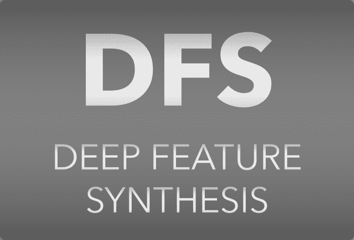
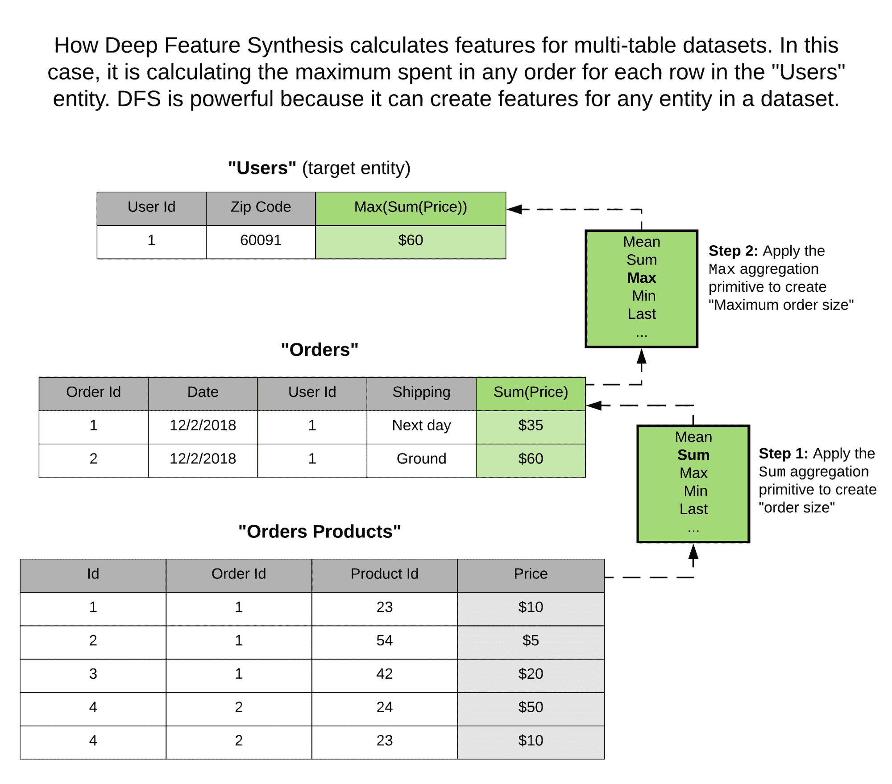
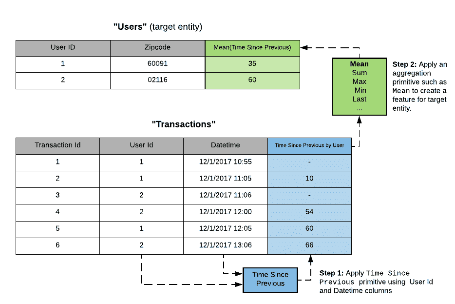
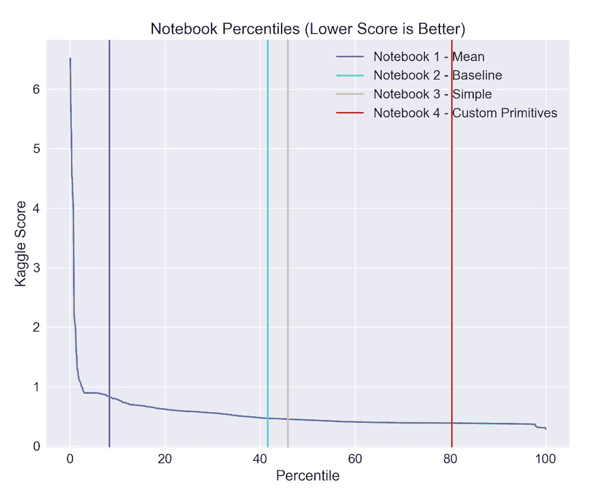

# 深度特征合成：自动化特征工程如何工作

> 原文：[`www.kdnuggets.com/2018/02/deep-feature-synthesis-automated-feature-engineering.html`](https://www.kdnuggets.com/2018/02/deep-feature-synthesis-automated-feature-engineering.html)

 评论

**作者：Max Kanter，[Feature Labs](https://www.featurelabs.com/)首席执行官**

人工智能市场受到利用数据改变世界的潜力的驱动。虽然许多组织已经成功适应了这一范式，但将机器学习应用于新问题仍然具有挑战性。

* * *

## 我们的前三大课程推荐

 1\. [谷歌网络安全证书](https://www.kdnuggets.com/google-cybersecurity) - 快速进入网络安全职业。

 2\. [谷歌数据分析专业证书](https://www.kdnuggets.com/google-data-analytics) - 提升你的数据分析技能

 3\. [谷歌 IT 支持专业证书](https://www.kdnuggets.com/google-itsupport) - 支持组织的信息技术

* * *

机器学习算法必须克服的最大技术障碍是它们需要处理过的数据才能工作——它们只能从数值数据中做出预测。这些数据由相关变量组成，被称为“特征”。如果计算出的特征没有明确暴露出预测信号，那么再多的调整也无法将模型提升到下一个水平。提取这些数值特征的过程称为“[特征工程](https://www.kdnuggets.com/2018/12/feature-engineering-explained.html)。”

自动化特征工程通过处理必要但繁琐的任务，优化了构建和部署准确的机器学习模型的过程，使数据科学家可以将更多精力集中在其他重要步骤上。以下是一个名为深度特征合成（DFS）的自动化特征工程方法的基本概念，它生成许多与人工数据科学家所创建的特征相同的特征。

### 发明于 MIT CSAIL

我在 2014 年与 Kalyan Veeramachaneni 一起在 MIT 计算机科学与人工智能实验室开始开发 DFS。我们利用它创建了“数据科学机器”，以自动构建复杂的多表数据集的预测模型，并在在线数据科学竞赛中[击败了 906 支人类团队中的 615 支](http://news.mit.edu/2015/automating-big-data-analysis-1016)。

我们首次在 IEEE 的数据科学与高级分析国际会议上，以[同行评审的论文](http://featurelabs1.wpengine.com/wp-content/uploads/2017/12/DSAA_DSM_2015-1.pdf)分享了这项工作。自那时起，它不仅为[Feature Labs](https://www.featurelabs.com/)的产品提供了动力，还激励并使全球的研究人员能够开展研究，包括[伯克利](https://people.eecs.berkeley.edu/~dawnsong/papers/icdm-2016.pdf)和[IBM](https://arxiv.org/pdf/1706.00327.pdf)的研究人员。

### 理解深度特征合成

理解深度特征合成有三个关键概念：

***1\. 特征源于数据集中数据点之间的关系。***

DFS 对数据库或日志文件中常见的多表和事务数据集进行特征工程。它专注于这种类型的数据，因为这是当今最常用的企业数据类型：一项对 16,000 名 Kaggle 数据科学家的[调查](https://www.kaggle.com/surveys/2017)发现，他们花费了 65% 的时间使用关系数据集。

***2\. 跨数据集，许多特征是通过使用相似的数学操作派生的。***

要理解这一点，让我们考虑一个客户及其所有购买的数据库。对于每个客户，我们可能想计算一个表示其最昂贵购买的特征。为此，我们会收集与客户相关的所有交易，并找出购买金额字段的最大值。然而，假设一个用户想从飞机航班的数据集中提取“最长的航班延误”来预测未来的延误。她将使用相同的最大值函数。

尽管自然语言描述完全不同，但底层数学保持不变。在这两种情况下，我们对一组数值应用相同的操作，以生成特定于数据集的新数值特征。这些与数据集无关的操作称为“原语”。

***3\. 新特征通常由利用先前派生的特征组成。***

原语是 DFS 的构建块。由于原语定义了它们的输入和输出类型，我们可以堆叠它们以构建复杂的特征，这些特征模仿了人类今天创建的特征。

DFS 可以跨实体之间的关系应用原语，因此可以从包含多个表的数据集中创建特征。我们可以通过设置搜索的最大深度来控制我们创建的特征的复杂性。

考虑一个数据科学家常常为事务或事件日志数据计算的特征：“事件之间的平均时间。” 这个特征在预测欺诈行为或未来客户参与度时非常有价值。DFS 通过堆叠两个原语，**Time Since** 和 **Mean**，来实现相同的特征。

这个例子突显了原始元素的第二个优势，即它们可以用于快速枚举许多有趣的特征，采用参数化的方式。因此，我们可以使用**最大值**、**最小值**、**标准差**或**中位数**来自动生成几种不同的总结时间的方法。如果我们向 DFS 添加一个新原始元素——比如两个位置之间的距离——它将自动与现有的原始元素结合，无需用户任何额外操作。

### 不断改进

在九月份，Feature Labs [宣布](https://www.featurelabs.com/blog/open-sourcing-featuretools/)我们将开源 DFS 的实现，供经验丰富和有志于数据科学的人员尝试。自那时以来的三个月，[Featuretools](https://github.com/featuretools/featuretools/) 已经在麻省理工学院的在线数据科学和大数据分析课程中教授给了近 [1000 人](https://www.featurelabs.com/blog/learn-feature-eng-mit/)，并且已经成为 [Github](https://github.com/search?q=feature+engineering) 上最受欢迎的特征工程库。

这意味着一个社区的人们可以聚集在一起贡献原始元素，大家都能从中受益。由于原始元素是独立于特定数据集定义的，任何添加到 Featuretools 的新原始元素都可以融入包含相同变量数据类型的任何其他数据集中。在某些情况下，这可能是相同领域的数据集，但也可能是完全不同的用例。例如，这里是 [一个贡献](https://github.com/Featuretools/featuretools/pull/51) 处理自由文本字段的 2 个原始元素。

### 处理时间

很容易不小心将你试图预测的信息泄漏到模型中。我们以前的一个零售企业客户的应用程序就是一个很好的例子：生产模型与公司开发结果不匹配。他们试图预测谁会成为客户，而模型中最重要的特征是潜在客户打开的电子邮件数量。它在训练期间表现出高准确率，但不幸的是在部署到生产环境时没有效果。

回顾起来，这一点很明显——这些前景只有在成为客户之后才开始阅读邮件。公司**手动特征工程**的步骤没有正确过滤掉在预测结果已经实现后收到的数据。

Featuretools 中的 DFS 可以通过使用“[截止时间](https://docs.featuretools.com/automated_feature_engineering/handling_time.html?__hstc=204809999.c69edb3ec9a2475f3b57eaf04def8d5a.1516118145596.1516118145596.1516118145596.1&__hssc=204809999.15.1516118145597&__hsfp=4010712198)”自动计算每个训练样本在与样本相关的特定时间的特征。它通过模拟原始数据在过去某个时间点的样子来对有效数据进行特征工程。这减少了标签泄露问题，这帮助数据科学家对他们部署到生产中的结果更有信心。

### 用自动化增强人类触感

DFS 可以在几乎没有人工干预的情况下开发基准模型。我们在[公开演示](https://www.featuretools.com/demos?__hstc=204809999.c69edb3ec9a2475f3b57eaf04def8d5a.1516118145596.1516118145596.1516118145596.1&__hssc=204809999.15.1516118145597&__hsfp=4010712198)中展示了如何使用 Featuretools 实现这一点。然而，特征工程的自动化应该被视为对关键人类专业知识的补充——它使数据科学家能够更精确和高效。

对于许多问题，基准得分足以让人类决定某种方法是否有效。在一个案例中，我们在 Kaggle 上与 1,257 名人类竞争者进行了实验。我们使用 DFS 生成了特征矩阵，然后利用回归器创建了机器学习模型。

*机器学习得分（RSME）与排行榜上的百分位数。得分下降时，排行榜上的位置上升。彩色垂直线表示不同实验在使用 Featuretools 时的排行榜位置。* 我们发现几乎不需要人工干预，DFS 在这个预测问题上超越了两个基准模型。在实际应用中，这为在此用例中利用机器学习提供了有价值的支持证据。接下来，我们展示了如何通过添加自定义原语来超越超过 80%的竞争对手，并接近最佳总体得分。

### 应用深度特征合成

Feature Labs 的首席数据科学家 Ben Schreck 最近写了关于如何使用自动化特征工程来增加全球银行[欺诈检测模型](https://www.featurelabs.com/blog/predicting-credit-card-fraud/)收入的文章。在那个案例中，我们预测了一个单独交易是否存在欺诈行为，但我们基于进行交易的客户的历史行为创建了特征。DFS 创建了诸如“上次交易以来的时间”，“交易之间的平均时间”和“这张卡上次使用的国家”等特征。所有这些特征都依赖于各种数据点之间的关系，并需要使用截止时间来确保只使用欺诈事件之前的行为。

结果显示，与银行现有的软件解决方案相比，误报率下降了 54%，从而减少了由于错误阻止交易而影响的客户数量。新模型的财务影响估计为每 200 万笔交易 19 万欧元。

### 深度特征合成与深度学习

深度学习自动化特征工程用于图像、文本和音频，这通常需要大量的训练集，而 DFS 则针对**公司所处理的结构化事务和关系数据集**。

DFS 生成的特征更易于人类解释，因为它们基于易于用自然语言描述的原始组合。深度学习中的变换必须通过矩阵乘法实现，而 DFS 中的原始数据可以映射到领域专家能够描述的任何函数。这增加了技术的可及性，并为那些没有经验的机器学习专业人士提供了更多贡献自己专长的机会。

此外，虽然深度学习通常需要许多训练样本来训练其复杂的架构，但 DFS 可以仅基于数据集的模式开始创建潜在特征。对于许多企业用例而言，深度学习所需的足够训练样本并不可用。DFS 提供了一种为较小的数据集创建可解释特征的方式，人们可以手动验证这些特征。

### 更美好的未来与特征工程

自动化特征工程有可能加速将机器学习应用于数据科学团队今天收集的宝贵数据集的过程。这将帮助数据科学家快速解决新出现的问题，更重要的是，使那些新进入数据科学领域的人更容易培养应用自己领域专业知识的技能。

著名的机器学习教授 [Pedros Domingos](https://homes.cs.washington.edu/~pedrod/papers/cacm12.pdf) 曾说过：“机器学习的一个圣杯是自动化更多的特征工程过程。” 我完全同意这一点，我对能在这一领域的前沿工作感到无比激动！

**简历: [Max Kanter](https://www.linkedin.com/in/jmaxkanter)** ([**@maxk**](https://twitter.com/maxk)) 是 [Feature Labs](https://www.featurelabs.com/) 的首席执行官和联合创始人，该公司构建用于数据科学自动化的工具和 API。Max 是一位工程师，热衷于为数据科学创造新技术。在创办 Feature Labs 之前，他曾是 MIT 的机器学习研究员，在那里创建了数据科学机器，并且之前曾是 Twitter、Fitbit 和纽约时报的软件工程师。

[原文](https://www.linkedin.com/pulse/deep-feature-synthesis-how-engineering-automation-works-max-kanter/)。经许可转载。

**相关：**

+   数据科学机器，或‘如何进行特征工程’

+   自动化机器学习的现状

+   使用 AutoML 和 TPOT 生成机器学习管道

### 了解更多相关话题

+   [提交您的数据合成创新以改革警务，赢取现金](https://www.kdnuggets.com/2023/06/nij-enter-data-synthesis-innovations-reform-policing-win-cash.html)

+   [2022 年特征存储峰会：关于特征工程的免费会议](https://www.kdnuggets.com/2022/10/hopsworks-feature-store-summit-2022-free-conference-feature-engineering.html)

+   [ChatGPT 的工作原理：聊天机器人背后的模型](https://www.kdnuggets.com/2023/04/chatgpt-works-model-behind-bot.html)

+   [Burtch Works 2023 数据科学与人工智能专业人员薪资报告](https://www.kdnuggets.com/2023/08/burtch-works-2023-data-science-ai-professionals-salary-report.html)

+   [构建一个可处理的、多变量时间序列特征工程管道](https://www.kdnuggets.com/2022/03/building-tractable-feature-engineering-pipeline-multivariate-time-series.html)

+   [使用 RAPIDS cuDF 利用 GPU 进行特征工程](https://www.kdnuggets.com/2023/06/rapids-cudf-leverage-gpu-feature-engineering.html)
