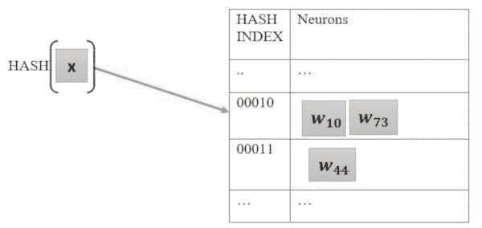
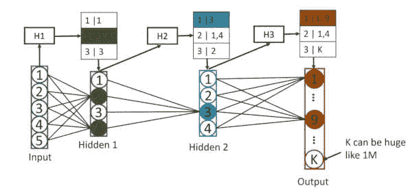
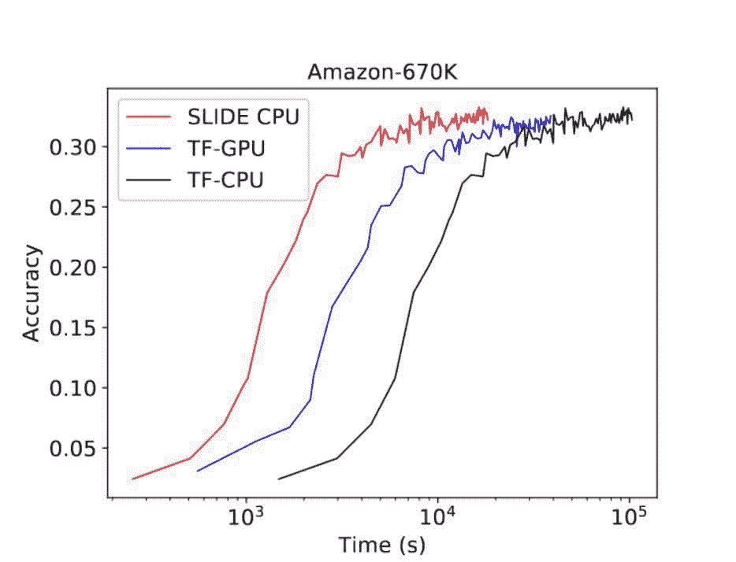

# 深度学习突破：一种不需要 GPU 的次线性深度学习算法？

> 原文：[`www.kdnuggets.com/2020/03/deep-learning-breakthrough-sub-linear-algorithm-no-gpu.html`](https://www.kdnuggets.com/2020/03/deep-learning-breakthrough-sub-linear-algorithm-no-gpu.html)

评论

**由[Anshumali Shrivastava](https://www.cs.rice.edu/~as143/)，莱斯大学**。

我们都知道 [深度神经网络](https://www.kdnuggets.com/2020/02/deep-neural-networks.html) (DNNs) 正在引领当前的 AI 革命。 [反向传播算法](https://www.kdnuggets.com/2019/01/backpropagation-algorithm-demystified.html) 是一种常用的训练 DNNs 的方法。反向传播包括对网络的前向和反向传递，可以写作一系列矩阵乘法。 [GPU (图形处理单元)](https://en.wikipedia.org/wiki/Graphics_processing_unit) 在这里具有独特的优势，因为它们有成千上万的处理核心，优化用于矩阵乘法。它们可以执行[数量级更快的矩阵乘法](https://graphics.stanford.edu/papers/gpumatrixmult/gpumatrixmult.pdf)。

### Backpropagation 中的浪费计算

反向传播不是一种高效的算法。反向传播的先驱之一 Geoffrey Hinton 教授在一次[采访](https://www.i-programmer.info/news/105-artificial-intelligence/11135--geoffrey-hinton-says-ai-needs-to-start-over.html)中指出了它的几个重要缺陷。SLIDE 算法的核心思想是最小化*浪费计算*。想象一个具有数亿参数的庞大神经网络。随着训练的进行，不同的神经元专注于数据的非常不同特征（具有大激活值）。结果是一个网络，其中仅有少数几个神经元对任何给定的输入重要，如著名的[猫神经元文章](https://www.nytimes.com/2012/06/26/technology/in-a-big-network-of-computers-evidence-of-machine-learning.html?auth=login-email&login=email)所示。我们称这种特性为*自适应稀疏性*。

反向传播对自适应稀疏性视而不见。相反，反向传播使用完整的矩阵乘法更新数百万个参数。这些更新中的大多数是不必要的。

自 2013 年以来，自适应稀疏性以几种方式被利用来改善泛化。例如， [一篇 NeurIPS 2013 论文](https://papers.nips.cc/paper/5032-adaptive-dropout-for-training-deep-neural-networks.pdf) 显示我们可以将权重更新限制到每层中的一个极小子集神经元。该子集是通过自适应采样选择的。采样是自适应的，意味着它在采样期间偏爱具有大激活值的神经元。作者认为，稀疏自适应更新支持更好的 [泛化](https://www.kdnuggets.com/2017/06/understanding-deep-learning-rethinking-generalization.html)，从而提高准确性。

不幸的是，这些稀疏更新远未实现计算上的高效。我们需要计算每个输入的所有激活值以确定要更新哪些神经元。由于每个神经元都必须被访问，操作的数量在参数的数量上是*线性的*。因此，如果我们有一百万个参数，每个输入必须执行一百万次算术操作。

### 绕道：内积抽样的基本谜题

高效稀疏更新的算法被锁在一个算法谜题后面。谜题是：“我们如何在不计算所有激活的情况下抽样具有大激活的神经元？一个关键观察是激活值是神经元权重和输入之间内积的单调函数。因此，我们可以将问题简化为：“我们如何高效地抽样那些与输入有大内积的权重向量？”

这个问题看起来有点荒谬，因为我们需要知道内积的值才能判断哪些是大的。这个问题类似于伪装的相似性搜索问题，其中内积是相似性度量，输入是查询。在网页搜索中，[我们知道](https://en.wikipedia.org/wiki/Search_engine_indexing)可以在不进行线性计算的情况下找到与查询相似（或相关）的文档，使用的是[indexing](https://en.wikipedia.org/wiki/Web_indexing)。

### 自适应抽样的哈希表

哈希函数 h(x)将输入 x 映射到一个整数，称为哈希值或指纹。假设 h(x)具有一个特殊属性：对于两个向量，两个向量的哈希值相同的概率为 Pr⁡(h(x)=h(y))=g(⟨x,y⟩)，其中 g 是一个单调函数。这个属性描述了[局部敏感哈希（LSH）](https://en.wikipedia.org/wiki/Locality-sensitive_hashing)函数。简单来说，如果两个向量 x 和 y 的内积很大，那么它们对应的哈希值 h(x)和 h(y)很可能是相同的。如果向量的内积很小，那么 h(x)和 h(y)很可能不同。我们在[这篇论文](https://papers.nips.cc/paper/5329-asymmetric-lsh-alsh-for-sublinear-time-maximum-inner-product-search-mips.pdf)**中**展示了如何构造具有这种属性的哈希函数，该论文获得了 NIPS 2014（现 NeurIPS）的杰出论文奖。

在 2016 年初，我们展示了 ([论文](https://dl.acm.org/doi/10.1145/3097983.3098035)) 我们的函数可以实现高效的神经元采样算法。这个想法是将所有神经元索引到一个哈希表中，使用 h，如图 2 所示。我们在由指纹指向的内存位置存储神经元哈希的引用。在对神经元进行预处理后，我们可以高效地对任何输入 x 进行神经元采样。我们只需访问内存位置 h(x) 并从中选择神经元。这个过程确保了哈希碰撞，因此我们只选择可能具有大内积的神经元。我们的采样过程可以证明适应激活值，而不需要显式计算所有激活值。

***图 1:** 哈希表用于采样神经元的示意图。HASH 函数满足 LSH 属性。*

后续工作表明，概率哈希表可以实现 O(1) 的重要性采样，以高效估计 [分区函数](https://arxiv.org/abs/1703.05160)**、** [核函数](https://arxiv.org/abs/1912.02283) 和 [随机梯度](http://papers.nips.cc/paper/9401-fast-and-accurate-stochastic-gradient-estimation.pdf)。

***图 2:** SLIDE 算法示意图。每一层都有哈希表用于高效识别激活值高的神经元。对于每个输入，我们只需要进行哈希计算和几个内存探测，就能获得网络的一个非常稀疏的快照。*

### SLIDE 算法：使用哈希表的稀疏反向传播

SLIDE 算法（图 2）在训练过程中使用哈希表来选择神经元。完整的实现细节可以在我们的 [论文](https://arxiv.org/abs/1903.03129) 中找到。

SLIDE 从初始化神经网络参数和将所有神经元预索引到 LSH 哈希表开始。

为了用给定输入训练网络，我们首先计算输入的 LSH 哈希值 (H1)。然后，我们查找以 H1 为地址（内存位置）的神经元，并从相应的桶中采样神经元。我们只计算这些神经元的激活值，并将其他神经元的激活值设置为 0。在下一层中，我们将上一层的稀疏激活输出作为输入。输入是稀疏的，因为只有所选神经元的激活值是非零的。我们为新的输入获得一个新的哈希值 H2，并重复下一层的采样过程。对于每个输入，我们只需几个哈希值和内存查找即可选择网络中的一组稀疏的重要节点。我们只在所选神经元上进行前向传播和反向传播。最后，我们使用更新后的权重更新哈希表中所选神经元的位置。

在训练过程中，所有操作的数量级是活跃神经元的数量（子线性），而不是神经元的总数量（线性）。在我们的实验中，我们展示了仅需 0.5% 的神经元即可获得与全反向传播相同的准确度。虽然 SLIDE 引入了少量的开销来维护哈希表，但与标准反向传播相比，我们的操作成本约低 200 倍。

### 并行梯度更新

由于对给定输入仅有 0.5%的节点处于激活状态，因此两个无关的输入 x 和 y 共享许多选择的神经元的可能性较小。因此，我们可以并行执行异步梯度更新。[HOGWILD 论文](https://papers.nips.cc/paper/4390-hogwild-a-lock-free-approach-to-parallelizing-stochastic-gradient-descent.pdf)表明，这个想法在理论上是合理的，并且对梯度下降是实用的。

总结来说，SLIDE 算法在每个输入上需要的算术操作数量减少了几个数量级。当结合异步数据并行梯度更新时，我们有了一个高效的训练过程。相比之下，标准的 GPU 反向传播需要昂贵的算术操作。GPU 并行化局限于扩展矩阵乘法，而不是数据并行处理。

** **

***图 3：** SLIDE（红色）与 TF-GPU（蓝色）和 TF-CPU（黑色）的训练时间比较。x 轴为对数刻度。SLIDE 实现于 C++，实验在与 TF-CPU 相同的 CPU 上进行。TF-CPU 使用了最优化的英特尔版本（MKL-DNN）。*

### 与 TensorFlow 在 CPU 和 V100 GPU 上的反向传播比较

SLIDE 在大型、完全连接的神经网络上进行了比较，这些网络通常具有超过 1 亿个参数，广泛应用于商业推荐引擎。我们突出了来自[论文](https://arxiv.org/abs/1903.03129)的一个训练图表。代码及基准测试脚本已公开发布在[Github](https://github.com/keroro824/HashingDeepLearning)上。数据可以从 Kaggle 上的[Amazon-670k 数据集](https://www.kaggle.com/c/extreme-classification-amazon/overview)公开获取。

图 3\. 说明了在 44 核 Intel Xeon CPU（2 个 22 核的插槽）上运行 SLIDE（红色曲线）的完整训练进展。SLIDE 与通过[TensorFlow](https://www.tensorflow.org/) 在 V100 GPU 上的最优化反向传播实现（蓝色曲线）以及在相同的 44 核 CPU 上的[Intel 优化 TensorFlow](https://github.com/intel/mkl-dnn)（黑色曲线）进行比较。运行时间为对数刻度。与 TF-GPU 相比，TF-CPU 较慢，表明 GPU 在处理这一大型工作负载上的反向传播具有优势。令人兴奋的是，SLIDE 算法的 C++ 实现，在相同的 CPU 上，显著超越了 GPU 加速。SLIDE 的收敛速度比 TensorFlow 在 V100 GPU 上快 3.5 倍（1 小时对比 3.5 小时）。

**简介：** [Anshumali Shrivastava](https://www.linkedin.com/in/shrivastava-anshumali-58098b6/) ([@Anshumali_](https://twitter.com/Anshumali_)) 是莱斯大学计算机科学系的助理教授。他的广泛研究兴趣包括大规模机器学习的随机算法。2018 年，《科学新闻》将他评选为值得关注的 40 岁以下十大科学家之一。他获得了国家科学基金会 CAREER 奖、美国空军科学研究办公室的年轻研究员奖以及亚马逊的机器学习研究奖。他赢得了许多论文奖项，包括 2014 年 NIPS 最佳论文奖和 2019 年 SIGMOD 最具可重复性论文奖。他的工作曾在包括《纽约时报》、IEEE Spectrum、《科学新闻》、Engadget 和 ArsTechnica 等多个媒体上报道。

**相关内容：**

+   [如何加速您的 GPU 数据科学](https://www.kdnuggets.com/2019/07/accelerate-data-science-on-gpu.html)

+   [深度神经网络](https://www.kdnuggets.com/2020/02/deep-neural-networks.html)

+   [数据科学家的 GPU 计算基础](https://www.kdnuggets.com/2016/04/basics-gpu-computing-data-scientists.html)

* * *

## 我们的前三个课程推荐

 1\. [谷歌网络安全证书](https://www.kdnuggets.com/google-cybersecurity) - 快速进入网络安全职业道路。

 2\. [谷歌数据分析专业证书](https://www.kdnuggets.com/google-data-analytics) - 提升您的数据分析技能

 3\. [谷歌 IT 支持专业证书](https://www.kdnuggets.com/google-itsupport) - 支持您组织中的 IT 工作

* * *

### 更多相关话题

+   [建立 GPU 机器与使用 GPU 云](https://www.kdnuggets.com/building-a-gpu-machine-vs-using-the-gpu-cloud)

+   [随机森林算法需要标准化吗？](https://www.kdnuggets.com/2022/07/random-forest-algorithm-need-normalization.html)

+   [K 均值聚类是什么，它的算法是如何工作的？](https://www.kdnuggets.com/2023/05/kmeans-clustering-algorithm-work.html)

+   [机器学习未能为我的业务创造价值。为什么？](https://www.kdnuggets.com/2021/12/machine-learning-produce-value-business.html)

+   [朴素贝叶斯算法：你需要知道的一切](https://www.kdnuggets.com/2020/06/naive-bayes-algorithm-everything.html)

+   [KDnuggets 新闻，4 月 13 日：数据科学家应该了解的 Python 库…](https://www.kdnuggets.com/2022/n15.html)
