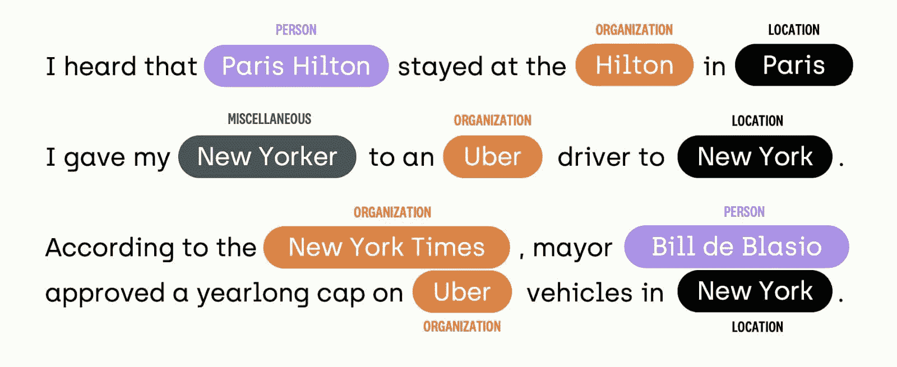
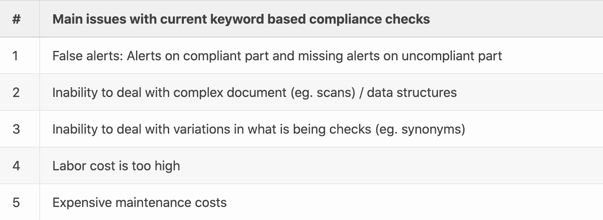
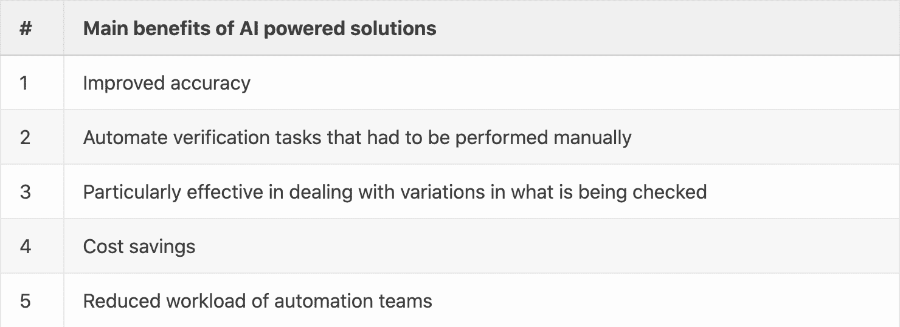
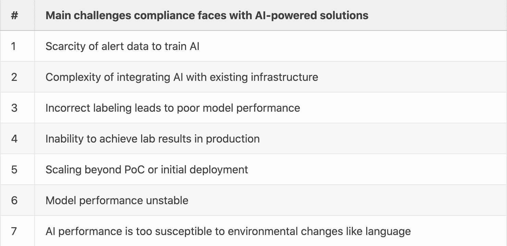

# 深度学习用于合规检查：有什么新变化？

> 原文：[`www.kdnuggets.com/2022/05/deep-learning-compliance-checks-new.html`](https://www.kdnuggets.com/2022/05/deep-learning-compliance-checks-new.html)

自然语言处理（NLP）长期以来在全球主要银行的合规流程中发挥了重要作用。通过将不同的 NLP 技术应用于生产过程中，合规部门可以维持详细的检查，并跟上监管要求。

银行后办公室的几乎每个方面——无论是贸易融资、信用、全球市场、零售等领域。所有这些领域都可以通过文档处理和使用 NLP 技术更有效地完成流程。

* * *

## 我们的前 3 名课程推荐

 1\. [谷歌网络安全证书](https://www.kdnuggets.com/google-cybersecurity) - 快速进入网络安全职业生涯。

 2\. [谷歌数据分析专业证书](https://www.kdnuggets.com/google-data-analytics) - 提升您的数据分析水平

 3\. [谷歌 IT 支持专业证书](https://www.kdnuggets.com/google-itsupport) - 支持您的组织在 IT 方面

* * *

某些验证任务超出了传统基于规则的自然语言处理系统的范围。这时，深度学习可以填补这些空白，提供更流畅和高效的合规检查。

# 使用基于规则的系统进行合规检查的挑战

有几个挑战使得基于规则的系统在进行检查时变得更加复杂。

可变性是这些挑战之一。例如，合规文档筛选包括大量不同类型的文档，如身份证、提单、税务通知、发票等。这需要实际的管理和控制方法以维持这种可变性。

命名实体识别也存在问题。命名实体识别是一种提取信息以定位和分类实体（如人、地点等）的方法。实体在不同的情况下可能表现不同，使得正确区分变得困难。例如，Teheran 街道位于巴黎，但 Teheran 是伊朗的首都。

仅仅通过查看关键词来区分文档中的每个实体是一项漫长的任务。原始文档的结构和格式可能使这一过程更加困难；页数、数据以表格结构呈现或格式为 PDF 等。

传统的自然语言处理可能无法捕捉同义词或模糊实体，如 Orange 可以被识别为城市、颜色、水果等。因此，我们需要考虑上下文以正确识别并生成正确的输出。

从下图可以看出，有各种句子。机器学习模型使用命名实体识别（NER）来识别和分类句子的部分。你可以看到，有 4 种不同的类别可以用来分类实体。它们是地点（LOC）、杂项（MISC）、组织（ORG）和人（PER）。

例如，如果我们取第一个句子“我听说帕里斯·希尔顿住在巴黎的希尔顿酒店”。机器学习模型会面临一些困难，因为它很难区分‘Hilton’被分类为组织（Organisation）还是‘Paris’作为一个地点（location），因为它已学会‘Paris Hilton’是一个人（Person）。另一个困难是模型要区分‘Paris’是被认为是名字还是城市。

基于模型的知识库，它将通过训练数据学习到什么实体是什么。然而，如果模型没有学会区分这些实体，它将无法产生正确的输出。例如，如果它之前从未将‘Paris’分类为地点，但将其分类为人，它的过去知识会告诉它将其分类为人。

因此，在各种数据上训练模型并更改训练数据将改善其产生正确实体类别的整体性能。

使用传统 NLP 文档筛选时的另一个挑战是**提高质量标准和不断变化的法规**。基于规则的系统无法定义模式，因此在文本文档中识别复杂的违规模式对传统 NLP 来说是一个重大挑战。

# 深度学习的美丽及其所能提供的东西

面对使用手动或传统的自然语言处理（NLP）基于关键词筛选的挑战，深度学习可以解决大部分这些问题。深度学习是机器学习的一个子领域，模拟了人类获取某些类型知识的方式。由于其先进的准确性，深度学习技术已经变得非常流行，最近已超越了人类水平的表现。

如果你参考下面的图表，它显示了 2003 年至 2020 年 CoNLL 上的命名实体识别（NER）的表现。[CoNLL 2003 NER 任务](http://www.aclweb.org/anthology/W03-0419.pdf)使用一个模型，该模型输入来自路透社 RCV1 的新闻文本，旨在识别四种不同的实体类型（PER, LOC, ORG, MISC）。

该模型基于跨度 F1 分数进行评估。跨度 QA 是一个任务，包含两段文本，其中一段称为上下文，另一段称为问题。最终目标是通过从文本中使用问题来提取答案，无论是否存在。F1 分数由以下公式确定：F1= 2*precision*recall/(precision+recall)。低 F1 分数表明精度和召回率都很差。

自 2017 年以来，F1 分数持续增长，从 91.26 的 F1 分数开始，到 2019 年达到 93.5，使用的是[CNN Large + fine-tune](https://arxiv.org/pdf/1903.07785.pdf)。2020 年，F1 分数大幅增长，Primer NLX NER 模型在 CoNLL 上取得了 95.6%的 F1 准确率。这比 Facebook AI Research 之前发布的[CNN Large and Fine-Tune](https://arxiv.org/pdf/1903.07785.pdf)提高了两个数字的 F1 分数。更重要的是，Primer NLX NER 模型现在与人类水平的表现相当。

深度学习可以可靠地处理具有高度变异性的文档，尤其是在 KYC（了解你的客户）实施方面，以及交易监控和筛查任务。

它还可以提供复杂数据结构、混合文档类型（例如图像和文本）以及混合模型的准确分析。它具备适应和学习文档、流程以及洗钱/欺诈方案变化的能力。

此外，深度学习的另一个有效元素是它允许最终用户提前定义实体，以便软件可以轻松识别它们。

尽管深度学习软件无法替代传统的 NLP，但它仍然提供并作为第二道防线。深度学习不仅可以识别、定位和提取实体，还具有分类和归类的能力。

银行拥有大量从过去筛查中存储的数据和文档。这些可以通过用作输入数据来训练深度学习模型，从而受益。随着时间的推移，神经网络可以迭代改进和调整，以不断提升合规分析过程。

# DCAI 在准确性和定制化方面有所不同

尽管使用深度学习和人工智能（AI）有许多好处，但它们仍然面临挑战。这包括数据稀缺、在现有基础设施中集成 AI 的复杂性，以及在生产阶段无法实现实验室结果。

有各种深度学习技术可以用来解决合规文档分析中的问题。然而，一个端到端的平台简化了这一过程，并提供了一种高效、简单的方法，以持续改进你的模型，实现长期成功。

端到端平台应提供数据驱动的 AI 方法，其中包括用干净、高质量的数据（例如文档）喂养模型。

为了做到这一点，它必须具备：

+   本体论管理和指令，使得高效定义实体并准确分类变得容易。

+   一套质量 KPI，如共识和审查工作流，以了解本体论及其指令的整体能力以及如何随着时间的推移改进它。

+   智能标记工具在通过人机协作实现准确标记方面非常重要。

+   数字接口允许跨职能的业务/AI 协作，而不受数据泄漏问题的影响，无论位置如何。

+   用于测试、评估模型和预标记的训练工具。

+   错误分析报告，如 Human/Model IOU，将评估现有模型。

大多数企业更倾向于完全拥有 AI 项目，无论是通过内部开发项目还是与供应商合作。我的经验是，数据驱动的 AI 平台提供了一种混合方法，结合了：

+   第一个方面是出于知识产权和安全原因，在内部开发和管理解决方案。

+   另一个方面是建立自己的 AI NLP 合规检查系统，不管 AI 人才短缺的问题。

**[Edouard d'Archimbaud](https://www.linkedin.com/in/edouard-d-archimbaud/)** ([**@edarchimbaud**](https://twitter.com/edarchimbaud)) 是 ML 工程师、CTO 和 [Kili](https://kili-technology.com/) 的联合创始人，该公司是企业 AI 的领先训练数据平台。他对 **数据驱动的 AI** 充满热情，这是一种成功 AI 的新范式。

### 更多相关主题

+   [数据掩码：确保 GDPR 和其他法规合规的核心](https://www.kdnuggets.com/2023/05/data-masking-core-ensuring-gdpr-regulatory-compliance-strategies.html)

+   [使用 Pandas 进行的 7 个关键数据质量检查](https://www.kdnuggets.com/7-essential-data-quality-checks-with-pandas)

+   [深入了解 DeepMind 在使用深度学习推动数学进步方面的新努力](https://www.kdnuggets.com/2021/12/inside-deepmind-new-efforts-deep-learning-advance-mathematics.html)

+   [管理深度学习数据集的新方法](https://www.kdnuggets.com/2022/03/new-way-managing-deep-learning-datasets.html)

+   [学习数据科学、机器学习和深度学习的坚实计划](https://www.kdnuggets.com/2023/01/mwiti-solid-plan-learning-data-science-machine-learning-deep-learning.html)

+   [AI、分析、机器学习、数据科学、深度学习…](https://www.kdnuggets.com/2021/12/developments-predictions-ai-machine-learning-data-science-research.html)
