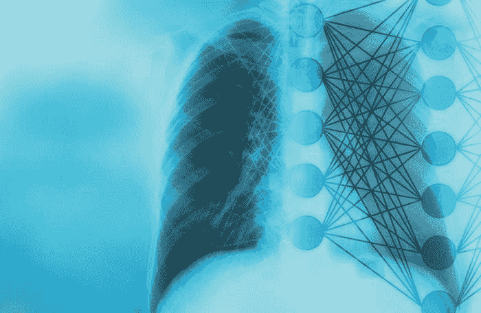
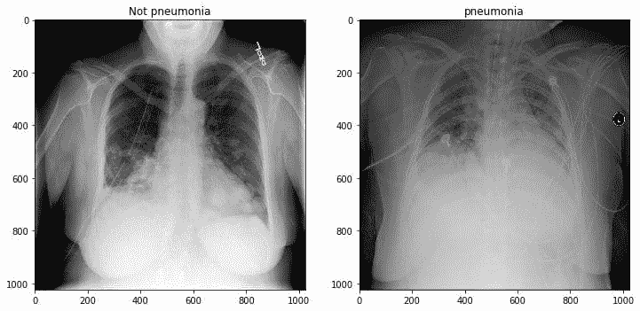
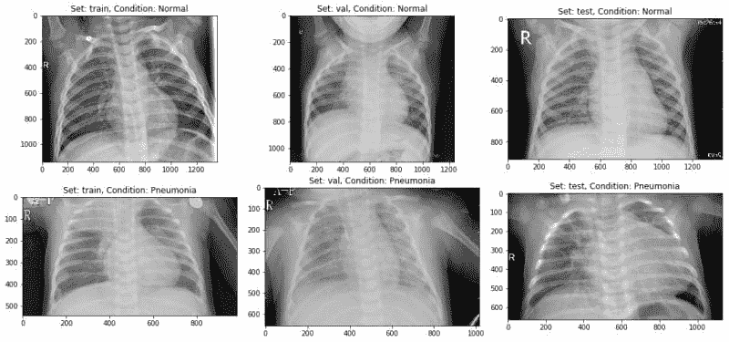
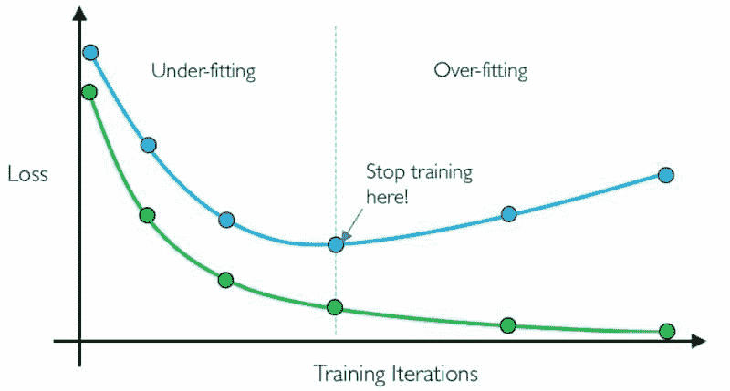
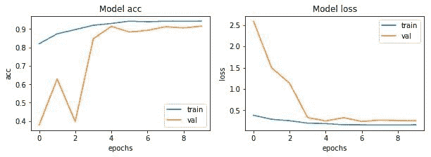

# 深度学习用于从 X 光图像中检测肺炎

> 原文：[`www.kdnuggets.com/2020/06/deep-learning-detecting-pneumonia-x-ray-images.html`](https://www.kdnuggets.com/2020/06/deep-learning-detecting-pneumonia-x-ray-images.html)

评论



肺炎的风险对许多人来说非常巨大，尤其是在发展中国家，数十亿人面临能源贫困，依赖污染的能源形式。世卫组织估计，每年因家庭空气污染相关疾病（包括肺炎）导致超过 400 万人过早死亡。每年有超过 1.5 亿人感染肺炎，尤其是 5 岁以下的儿童。在这些地区，由于医疗资源和人员的匮乏，问题可能会进一步加剧。例如，在非洲的 57 个国家中，医生和护士的缺口达到 230 万。对这些人群而言，准确和快速的诊断至关重要。它可以保证及时获得治疗，并为那些已经陷入贫困的人节省宝贵的时间和金钱。

* * *

## 我们的前三名课程推荐

 1\. [谷歌网络安全证书](https://www.kdnuggets.com/google-cybersecurity) - 快速进入网络安全职业生涯。

 2\. [谷歌数据分析专业证书](https://www.kdnuggets.com/google-data-analytics) - 提升你的数据分析技能

 3\. [谷歌 IT 支持专业证书](https://www.kdnuggets.com/google-itsupport) - 支持组织的 IT 工作

* * *

这个项目是 [胸部 X 光图像（肺炎）](https://www.kaggle.com/paultimothymooney/chest-xray-pneumonia) 在 Kaggle 上的一部分。

### 挑战

建立一个算法，通过查看胸部 X 光图像自动识别患者是否患有肺炎。这个算法必须非常准确，因为人的生命攸关。



### 环境和工具

1.  [scikit-learn](https://scikit-learn.org/stable/)

1.  [keras](https://keras.io/)

1.  [numpy](https://www.numpy.org/)

1.  [pandas](https://pandas.pydata.org/)

1.  [matplotlib](https://matplotlib.org/)

### 数据

数据集可以从 kaggle 网站下载，网址在 [这里](https://www.kaggle.com/paultimothymooney/chest-xray-pneumonia)。

### 代码在哪里？

不多说，让我们开始代码部分。完整项目可以在 [这里](https://github.com/abhinavsagar/Kaggle-tutorial)找到。

首先加载所有库和依赖项。

接下来，我展示了一些正常和肺炎的图像，以观察它们在肉眼下的差异。其实差别不大！



示例图像

然后，我将数据集分为训练集、验证集和测试集。

接下来我写了一个函数，在其中进行了数据增强，并将训练集和测试集图像输入到网络中。同时，我还为图像创建了标签。

数据增强的做法是一种有效的方法，可以增加训练集的大小。通过增强训练样本，网络可以在训练过程中“看到”更多多样化但仍具有代表性的数据点。

然后我定义了一对数据生成器：一个用于训练数据，另一个用于验证数据。数据生成器能够从源文件夹直接加载所需数量的数据（一个小批量的图像），将它们转换为*训练数据*（提供给模型）和*训练目标*（一个属性向量——监督信号）。

> *在我的实验中，我通常设置*`*batch_size = 64*`*。一般来说，32 到 128 之间的值应该效果不错。通常你应该根据计算资源和模型性能来增加/减少批量大小。*

之后我定义了一些常量以备后续使用。

下一步是构建模型。可以通过以下 5 个步骤来描述。

1.  我使用了五个卷积块，包括卷积层、最大池化层和批量归一化层。

1.  在此基础上，我使用了一个扁平化层，并紧接着用了四个全连接层。

1.  同时，我还使用了 dropout 来减少过拟合。

1.  除了最后一层使用 Sigmoid 之外，整个过程中激活函数都是 Relu，因为这是一个二分类问题。

1.  我使用了 Adam 作为优化器，并用交叉熵作为损失函数。

在训练模型之前，定义一个或多个回调函数是很有用的。其中比较实用的有：`ModelCheckpoint`和`EarlyStopping`。

+   **ModelCheckpoint**：当训练需要很长时间才能获得良好结果时，通常需要多次迭代。在这种情况下，最好只在改进指标的轮次结束时保存表现最好的模型的副本。

+   **EarlyStopping**：有时，在训练过程中我们会注意到泛化误差（即训练误差和验证误差之间的差异）开始增加，而不是减少。这是过拟合的一个症状，可以通过多种方式解决（*减少模型容量*、*增加训练数据*、*数据增强*、*正则化*、*dropout*等）。通常，一个实用且有效的解决方案是当泛化误差变得更糟时停止训练。



提前停止

接下来，我用 32 的批量大小训练了模型 10 个轮次。请注意，通常更高的批量大小会带来更好的结果，但代价是更高的计算负担。有研究还表明，最佳结果的批量大小是一个最佳值，可以通过投入一些时间进行超参数调优来找到。

```py
Epoch 1/10
163/163 [==============================] - 90s 551ms/step - loss: 0.3855 - acc: 0.8196 - val_loss: 2.5884 - val_acc: 0.3783
Epoch 2/10
163/163 [==============================] - 82s 506ms/step - loss: 0.2928 - acc: 0.8735 - val_loss: 1.4988 - val_acc: 0.6284
Epoch 3/10
163/163 [==============================] - 81s 498ms/step - loss: 0.2581 - acc: 0.8963 - val_loss: 1.1351 - val_acc: 0.3970

Epoch 00003: ReduceLROnPlateau reducing learning rate to 0.0003000000142492354.
Epoch 4/10
163/163 [==============================] - 81s 495ms/step - loss: 0.2027 - acc: 0.9197 - val_loss: 0.3323 - val_acc: 0.8463
Epoch 5/10
163/163 [==============================] - 81s 500ms/step - loss: 0.1909 - acc: 0.9294 - val_loss: 0.2530 - val_acc: 0.9139

Epoch 00005: ReduceLROnPlateau reducing learning rate to 9.000000427477062e-05.
Epoch 6/10
163/163 [==============================] - 81s 495ms/step - loss: 0.1639 - acc: 0.9423 - val_loss: 0.3316 - val_acc: 0.8834
Epoch 7/10
163/163 [==============================] - 80s 492ms/step - loss: 0.1625 - acc: 0.9387 - val_loss: 0.2403 - val_acc: 0.8919

Epoch 00007: ReduceLROnPlateau reducing learning rate to 2.700000040931627e-05.
Epoch 8/10
163/163 [==============================] - 80s 490ms/step - loss: 0.1587 - acc: 0.9423 - val_loss: 0.2732 - val_acc: 0.9122
Epoch 9/10
163/163 [==============================] - 81s 496ms/step - loss: 0.1575 - acc: 0.9419 - val_loss: 0.2605 - val_acc: 0.9054

Epoch 00009: ReduceLROnPlateau reducing learning rate to 8.100000013655517e-06.
Epoch 10/10
163/163 [==============================] - 80s 490ms/step - loss: 0.1633 - acc: 0.9423 - val_loss: 0.2589 - val_acc: 0.9155
```

让我们可视化损失和准确率的图表。



**准确率与轮次 | 损失与轮次**

到目前为止一切顺利。模型正在收敛，从损失和验证损失随着训练周期的减少可以观察到。此外，它能够在仅 10 个训练周期内达到 90% 的验证准确率。

让我们绘制混淆矩阵，并获取一些其他结果，如精准度、召回率、F1 分数和准确率。

```py
CONFUSION MATRIX ------------------
[[191  43]
 [ 13 377]]

TEST METRICS ----------------------
Accuracy: 91.02564102564102%
Precision: 89.76190476190476%
Recall: 96.66666666666667%
F1-score: 93.08641975308642

TRAIN METRIC ----------------------
Train acc: 94.23
```

该模型能够实现 91.02% 的准确率，考虑到使用的数据量，这是相当不错的。

### 结论

尽管这个项目还远未完成，但看到深度学习在如此多样的现实世界问题中的成功仍然很令人惊讶。我展示了如何从 X 光图像集合中分类阳性和阴性肺炎数据。该模型是从零开始构建的，这使其不同于其他高度依赖迁移学习的方法。未来，这项工作可以扩展到检测和分类包含肺癌和肺炎的 X 光图像。区分包含肺癌和肺炎的 X 光图像在近期已成为一个大问题，我们的下一个方向应该是解决这个问题。

### 参考资料/进一步阅读

[**训练 CNN 以检测肺炎**](https://medium.com/datadriveninvestor/training-a-cnn-to-detect-pneumonia-c42a44101deb)

我记得那天非常清楚。我的祖父开始出现随机咳嗽，并开始呼吸困难。他...

[**用深度学习检测肺炎**](https://becominghuman.ai/detecting-pneumonia-with-deep-learning-3cf49b640c14)

肺炎是由于感染病毒、细菌、真菌或其他病原体引起的肺部炎症。根据...

[**CheXNet：用深度学习在胸部 X 光片上进行放射科医师级的肺炎检测**](https://stanfordmlgroup.github.io/projects/chexnet/)

该数据集由 NIH 发布，包含 112,120 张 30,805 名独特患者的正面 X 光图像，已标注...

### 在你离开之前

相应的源代码可以在这里找到。

[**abhinavsagar/Kaggle-tutorial**](https://github.com/abhinavsagar/Kaggle-tutorial)

Kaggle 竞赛的示例笔记本。显微镜图像的自动分割在医学领域是一个重要任务...

祝阅读愉快，学习愉快，编码愉快！

### 联系方式

如果你想了解我最新的文章和项目，请[在 Medium 上关注我](https://medium.com/@abhinav.sagar)。这些是我的一些联系方式：

+   [个人网站](https://abhinavsagar.github.io/)

+   [Linkedin](https://in.linkedin.com/in/abhinavsagar4)

+   [Medium 个人资料](https://medium.com/@abhinav.sagar)

+   [GitHub](https://github.com/abhinavsagar)

+   [Kaggle](https://www.kaggle.com/abhinavsagar)

**个人简介：[Abhinav Sagar](https://www.linkedin.com/in/abhinavsagar4)** 是 VIT Vellore 的一名大四本科生。他对数据科学、机器学习及其在现实世界问题中的应用感兴趣。

[原始内容](https://towardsdatascience.com/deep-learning-for-detecting-pneumonia-from-x-ray-images-fc9a3d9fdba8)。经许可转载。

**相关：**

+   用于乳腺癌分类的卷积神经网络

+   医疗保健中的 AI 和机器学习

+   AI 如何帮助管理传染病

### 更多相关主题

+   [停止学习数据科学以寻找目标，并通过找到目标来…](https://www.kdnuggets.com/2021/12/stop-learning-data-science-find-purpose.html)

+   [学习数据科学统计的最佳资源](https://www.kdnuggets.com/2021/12/springboard-top-resources-learn-data-science-statistics.html)

+   [分析一个 90 亿美元的 AI 失败](https://www.kdnuggets.com/2021/12/9b-ai-failure-examined.html)

+   [成功数据科学家的 5 个特征](https://www.kdnuggets.com/2021/12/5-characteristics-successful-data-scientist.html)

+   [是什么让 Python 成为初创企业理想的编程语言](https://www.kdnuggets.com/2021/12/makes-python-ideal-programming-language-startups.html)

+   [每个数据科学家都应该知道的三种 R 语言库（即使你使用 Python）](https://www.kdnuggets.com/2021/12/three-r-libraries-every-data-scientist-know-even-python.html)
