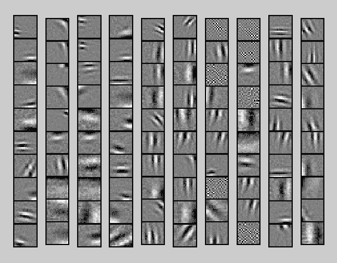

# (深度学习的深层缺陷)的深层缺陷

> 原文：[`www.kdnuggets.com/2015/01/deep-learning-flaws-universal-machine-learning.html`](https://www.kdnuggets.com/2015/01/deep-learning-flaws-universal-machine-learning.html)

 评论

一些近期广泛报道的论文已经缓解了围绕深度学习的炒作。这些论文指出，图像可以被微妙地修改以引起错误分类，并且可以轻易生成看似随机的垃圾图像，这些图像会得到高度的信心分类。新闻界对这一消息进行了 sensationalized 的报道。几个博客帖子、一个 YouTube 视频以及其他媒体都放大并偶尔扭曲了结果，宣称深度网络的轻信性。

鉴于这些炒作，审视这些发现是合适的。虽然一些发现很吸引人，但其他的却不那么令人惊讶。有些是机器学习在对抗性环境中的几乎普遍存在的问题。此外，经过审视这些发现后，似乎很清楚，它们之所以令人震惊，完全是因为对深度网络实际做什么的非现实预期，即对现代前馈神经网络具有类似人类认知的非现实期望。

这些批评有两个方面，源于两篇独立的论文。第一篇，[“神经网络的有趣特性”](http://cs.nyu.edu/~zaremba/docs/understanding.pdf)，是由谷歌的 Christian Szegedy 等人去年发表的论文。在其中，他们揭示了可以以对人类不可察觉的方式微妙地改变图像，从而导致经过训练的卷积神经网络 (CNN) 的错误分类。

需要明确的是，这篇论文写得很好，构思周密，提出了适度但有洞察力的主张。作者展示了两个结果。主要结果显示，神经网络最后一层的隐藏单元的随机线性组合在语义上与单元本身不可区分。他们建议这些隐藏单元所跨越的空间才是重要的，而不是哪个特定的基底跨越了这个空间。

第二个、更广泛报道的主张涉及图像的修改。作者非随机地改变了一组像素，以引起错误分类。结果是一个看似相同但被错误分类的图像。这个发现引发了关于深度学习在对抗性情境中的应用的有趣问题。作者还指出，这挑战了平滑假设，即相互非常接近的示例应有很高概率得到相同分类。

对抗案例确实值得深思。然而，优化图像以实现错误分类需要访问模型。这种情况可能并不总是现实的。例如，垃圾邮件发送者可能能够发送电子邮件并查看哪些电子邮件被谷歌的过滤器分类为垃圾邮件，但他们不太可能获得访问谷歌垃圾邮件过滤算法的机会，以便最大限度地优化垃圾邮件类型的电子邮件，这些电子邮件却未被过滤。同样，要欺骗深度学习面部检测软件，需要访问底层的卷积神经网络，以便准确地伪造图像。

值得注意的是，几乎所有的机器学习算法都容易受到对抗性选择示例的影响。考虑一个具有数千个特征的逻辑回归分类器，其中许多特征具有非零权重。如果其中一个特征是数值型的，可以将该特征的值设置得非常高或非常低，以诱导错误分类，而不改变其他数千个特征。对于只能感知特征子集的人类而言，这种改变可能不会被察觉。或者，如果模型中任何特征的权重非常高，则可能只需要将其值稍微调整一下，就能诱导错误分类。类似地，对于决策树，一个二进制特征可能被切换，以将示例引导到最终层的错误分区中。

对于神经网络而言，这种病态案例在某些方面是不同的。其中一个关键区别是像素的取值是受到约束的。然而，鉴于几乎任何具有许多特征和自由度的机器学习模型，都容易工程化病态的对抗示例。这对于那些更简单、理解更透彻并且有理论保证的模型也是真的。也许，我们不应该对深度学习也易受对抗性选择示例的影响感到惊讶。

第二篇论文，来自怀俄明大学的 Anh Nguyen 所著的《["深度网络容易被欺骗"](http://arxiv.org/pdf/1412.1897v2.pdf)》，似乎做出了更大胆的声明。引用了 Szegedy 等人的工作，他们着手研究反向问题，即如何制造一个看似无意义的例子，尽管它明显缺乏内容，但仍然获得了高置信度的分类。作者使用梯度上升法来训练一些无法被人眼识别的胡言乱语图像，这些图像被强烈分类到一些明显错误的对象类别中。

从数学直觉的角度来看，这正是我们应该预期的。在之前的情况中，修改后的图像被限制为与某个源图像不可区分。在这里，图像的限制只是不能看起来像任何东西！在所有可能的图像空间中，实际可识别的图像只是一个微小的子集，几乎整个向量空间都是开放的。此外，在几乎所有其他机器学习方法中，都很容易找到相应的问题。给定任何线性分类器，都可以找到一个既远离决策边界又远离任何曾见过的数据点的位置。给定一个主题模型，可以创建一个毫无意义的随机词序列，它似乎获得了与某个选定的真实文档相同的推断主题分布。

这个结果可能令人惊讶的主要原因是卷积神经网络在物体检测任务中的表现已经能够与人类能力相媲美。在这种意义上，区分 CNN 的能力和人类能力可能是重要的。作者从一开始就提出了这一点，这个论点是合理的。

正如 Michael I. Jordan 和 Geoff Hinton 最近讨论的那样，深度学习的巨大成功吸引了一波炒作。最近的负面宣传表明这种炒作有两面性。深度学习的成功确实使许多人愿意审视其缺陷。然而，值得记住的是，许多问题在大多数机器学习环境中都是普遍存在的。或许对对抗性示例鲁棒的算法的更广泛兴趣可以使整个机器学习社区受益。

**[Zachary Chase Lipton](http://zacklipton.com)** 是加州大学圣地亚哥分校计算机科学工程系的博士生。在[生物医学信息学部门](http://healthsciences.ucsd.edu/som/medicine/divisions/dbmi/pages/default.aspx)资助下，他对机器学习的理论基础和应用都感兴趣。除了在 UCSD 的工作，他还曾在微软研究院实习。

**相关：**

+   Geoff Hinton AMA：神经网络、大脑和机器学习

+   深度学习是否存在深层缺陷？

+   深度学习可以轻易被愚弄

+   差分隐私：如何使隐私与数据挖掘兼容

* * *

## 我们的前三大课程推荐

 1\. [谷歌网络安全证书](https://www.kdnuggets.com/google-cybersecurity) - 快速进入网络安全职业的捷径。

 2\. [Google 数据分析专业证书](https://www.kdnuggets.com/google-data-analytics) - 提升你的数据分析技能

 3\. [Google IT 支持专业证书](https://www.kdnuggets.com/google-itsupport) - 支持你的组织在 IT 方面

* * *

### 了解更多主题

+   [学习数据科学、机器学习和深度学习的扎实计划](https://www.kdnuggets.com/2023/01/mwiti-solid-plan-learning-data-science-machine-learning-deep-learning.html)

+   [AI、分析、机器学习、数据科学、深度学习…](https://www.kdnuggets.com/2021/12/developments-predictions-ai-machine-learning-data-science-research.html)

+   [15 本免费的机器学习和深度学习书籍](https://www.kdnuggets.com/2022/10/15-free-machine-learning-deep-learning-books.html)

+   [KDnuggets 新闻，11 月 2 日：数据科学的现状…](https://www.kdnuggets.com/2022/n43.html)

+   [15 本免费的机器学习和深度学习书籍](https://www.kdnuggets.com/2022/11/15-free-machine-learning-deep-learning-books.html)

+   [使用 Datawig，AWS 的深度学习库进行缺失值插补](https://www.kdnuggets.com/2021/12/datawig-aws-deep-learning-library-missing-value-imputation.html)
