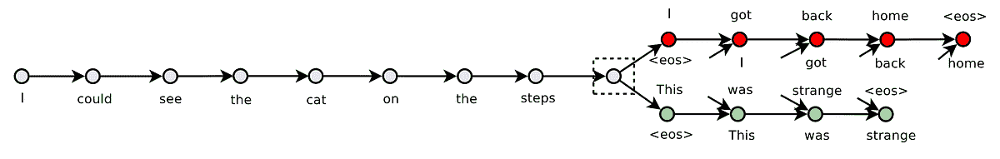
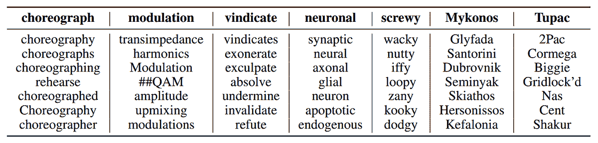

# 深度学习阅读组：Skip-Thought 向量

> 原文：[`www.kdnuggets.com/2016/11/deep-learning-group-skip-thought-vectors.html`](https://www.kdnuggets.com/2016/11/deep-learning-group-skip-thought-vectors.html)

继续我们从[ResNet 博客文章](https://gab41.lab41.org/lab41-reading-group-deep-residual-learning-for-image-recognition-ffeb94745a1f#.bc3hiquop)开始的旧论文巡展，我们现在探讨[Kiros](http://www.cs.toronto.edu/~rkiros/)的[Skip-Thought 向量](https://arxiv.org/abs/1506.06726)*等*。他们的目标是提出一种有用的句子嵌入，该嵌入未针对单一任务进行调整，并且不需要标记数据进行训练。他们从 Word2Vec skip-gram 获取灵感（你可以在[这里找到我对该算法的解释](https://gab41.lab41.org/python2vec-word-embeddings-for-source-code-3d14d030fe8f#.e301tsg77)），并试图将其扩展到句子。

Skip-thought 向量是使用编码器-解码器模型创建的。编码器接收训练句子并输出一个向量。解码器有两个，都以向量作为输入。第一个尝试预测前一句话，第二个尝试预测下一句话。编码器和解码器都由递归神经网络（RNN）构建。尝试了多种编码器类型，包括 uni-skip、bi-skip 和 combine-skip。Uni-skip 以正向阅读句子。Bi-skip 既正向又反向阅读句子，并将结果连接起来。Combined-skip 将 uni-skip 和 bi-skip 的向量连接起来。对输入句子只进行了最小限度的标记化。下图显示了输入句子和两个预测句子。

*给定一个句子（灰点），skip-thought 尝试预测前一句话（红点）和下一句话（绿点）。图示来自论文。*

他们的模型需要句子组进行训练，因此在 BookCorpus 数据集上进行训练。该数据集由未出版作者的小说组成，(不足为奇) 被浪漫和奇幻小说主导。这种数据集中的“偏见”将在后面讨论一些用于测试 skip-thought 模型的句子时变得明显；一些检索到的句子非常令人兴奋！

构建考虑整个句子意义的模型很困难，因为语言非常灵活。改变一个词语可能会完全改变句子的意义，也可能不会改变句子。移动词语也是如此。举个例子：

> 构建处理句子的模型的一个难点在于单个词语的改变可能不会改变句子的意义。

换句话说：

> 构建处理句子的模型的一个挑战在于单个词语的改变可能不会改变句子的意义。

改变一个单词几乎没有对句子的意义产生影响。为了处理这些单词层级的变化，skip-thought 模型需要能够处理大量词汇，其中一些在训练句子中并不存在。作者通过使用预训练的连续词袋（CBOW）Word2Vec 模型，并学习从 Word2Vec 向量到他们句子中的词向量的翻译来解决这个问题。以下展示了在词汇扩展后，使用未出现在训练词汇中的查询词的最近邻词：

*未包含在训练词汇中的各种单词的最近邻词。表格来自论文。*

那么模型的效果如何呢？一种探测方法是检索与查询句子最接近的句子；以下是一些例子：

> 查询：“我相信你今晚会有一个辉煌的夜晚，”她说，夸张地眨了眨眼。
> 
> 检索结果：“我真的很高兴你今晚来参加聚会，”他说，转向她。

还有：

> 查询：虽然她可以告诉他对他们其他的闲聊不太感兴趣，但他似乎对这个话题真的很感兴趣。
> 
> 检索结果：虽然他并没有用显微镜跟踪她的职业生涯，但他肯定注意到了她的外貌。

这些句子在结构和意义上实际上非常相似（如我之前警告的那样，有点猥亵），因此模型似乎表现良好。

为了进行更严格的实验，并测试 skip-thought 向量作为通用句子特征提取器的价值，作者通过一系列任务运行模型，使用编码向量和在其上训练的简单线性分类器。

他们发现，通用的 skip-thought 表示在检测两个句子的语义相关性和检测句子是否在释义另一个句子方面表现非常好。Skip-thought 向量在图像检索和标注中表现相对良好（在这些任务中，他们使用了[VGG](https://arxiv.org/pdf/1409.1556.pdf)来提取图像特征向量）。Skip-thought 在情感分析中的表现较差，产生的结果与各种词袋模型相当，但计算成本高得多。

我们在实验室中使用了 skip-thought 向量，最近用于[Pythia 挑战赛](https://gab41.lab41.org/tell-me-something-i-dont-know-detecting-novelty-and-redundancy-with-natural-language-processing-818124e4013c#.6xf8nejr9)。我们发现它们在新颖性检测中很有用，但速度极慢。在约 20,000 份文档的语料库上运行 skip-thought 向量需要很多小时，而更简单（且同样有效）的方法只需几秒钟或几分钟。当他们的博客文章上线时，我会更新链接。

**[亚历山大·古德](https://twitter.com/alex_gude)** 目前是 Lab41 的数据科学家，专注于研究推荐系统算法。他拥有加州大学伯克利分校的物理学学士学位和明尼苏达大学双城分校的基本粒子物理学博士学位。

**[Lab41](http://www.lab41.org)** 是一个“挑战实验室”，美国情报界与学术界、工业界和 In-Q-Tel 的同行们汇聚一堂，共同应对大数据挑战。它允许来自不同背景的参与者接触到创意、人才和技术，探索数据分析中的有效方法和无效方法。Lab41 提供了一个开放、协作的环境，促进参与者之间宝贵的关系。

[原文](https://gab41.lab41.org/lab41-reading-group-skip-thought-vectors-fec68c05aa92)。已获许可转载。

**相关：**

+   深度学习中，架构工程是新的特征工程

+   深度学习最新进展：7 月更新

+   深度学习网络为何能够扩展？

* * *

## 我们的前三大课程推荐

 1\. [Google 网络安全证书](https://www.kdnuggets.com/google-cybersecurity) - 快速开启网络安全职业生涯。

 2\. [Google 数据分析专业证书](https://www.kdnuggets.com/google-data-analytics) - 提升你的数据分析技能

 3\. [Google IT 支持专业证书](https://www.kdnuggets.com/google-itsupport) - 支持你的组织的 IT 需求

* * *

### 更多相关话题

+   [用 AI 读取脑波：研究人员将脑波转化为图像](https://www.kdnuggets.com/2023/03/reading-minds-ai-researchers-translate-brain-waves-images.html)

+   [逐步阅读和理解 SQL 查询的指南](https://www.kdnuggets.com/a-step-by-step-guide-to-reading-and-understanding-sql-queries)

+   [2024 年阅读清单：5 本关于人工智能的必读书籍](https://www.kdnuggets.com/2024-reading-list-5-essential-reads-on-artificial-intelligence)

+   [SQL 的 Group By 和 Partition By 场景：何时及如何组合…](https://www.kdnuggets.com/sql-group-by-and-partition-by-scenarios-when-and-how-to-combine-data-in-data-science)

+   [KDnuggets 新闻，6 月 8 日：21 份数据科学备忘单…](https://www.kdnuggets.com/2022/n23.html)

+   [学习数据科学、机器学习和深度学习的实用计划](https://www.kdnuggets.com/2023/01/mwiti-solid-plan-learning-data-science-machine-learning-deep-learning.html)
