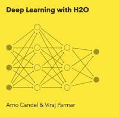
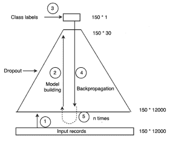

# 使用 R 进行 H2O 中的深度学习

> 原文：[`www.kdnuggets.com/2018/01/deep-learning-h2o-using-r.html`](https://www.kdnuggets.com/2018/01/deep-learning-h2o-using-r.html)

 评论

这篇文章介绍了如何在 R 中使用 H2O 包进行深度学习。

H2O 是一个开源的人工智能平台，允许我们使用机器学习技术，如朴素贝叶斯、K 均值、PCA、深度学习、使用深度学习的自编码器等。使用 H2O，我们可以在 R、Python、Scala 等编程环境中构建预测模型，还可以通过一个称为 Flow 的基于 Web 的 UI 进行操作。

### I. 深度学习：背景

[(来源)](http://qspace.library.queensu.ca/handle/1974/792/browse?value=Muthalaly%2C+Reena+Shaw&type=author)

深度学习是受人脑和神经系统功能启发的机器学习算法的一个分支。输入数据被固定到深度网络的输入层。网络随后使用层次化的隐藏层，逐步生成输入数据的紧凑、更高级的抽象（表示）。因此，它生成输入特征的伪特征。具有[3 层](https://www.cs.toronto.edu/~hinton/absps/fastnc.pdf)或更多层的神经网络被认为是“深度”的。

作为一个例子，对于面部检测任务，原始输入通常是一个像素值向量。第一次抽象可能识别光影像素；第二次抽象可能识别边缘和形状；第三次抽象可能将这些边缘和形状组合成眼睛、鼻子等部分；下一个抽象可能将这些部分组合成一个面孔。因此，通过简单表示的组合来学习复杂的表示。

在输出层，计算网络误差（成本）。这个成本通过一种称为随机梯度下降的方法逐步最小化，并通过一种称为反向传播的算法向后传播到输入层。这会导致网络中权重和偏置的重新校准。使用新的权重，新的表示被向前传播到输出层，并再次检查网络误差。前向和后向传播的过程会持续进行，直到权重被调整到准确预测输出为止。

图 1：示意深度学习的金字塔 [(来源)](http://qspace.library.queensu.ca/handle/1974/792/browse?value=Muthalaly%2C+Reena+Shaw&type=author)

对于图 1，我们考虑一个 150 * 12000 维的输入数据集（150 行，12000 列）。我们创建一个具有 4 个隐藏层的深度网络，包含 4000、750、200、30 个神经元。输入层中的所有 12000 个数据点都用于构建第一个隐藏层的 4000 个伪特征。由于这里网络的规模逐渐减小到最后一个隐藏层，它形成了一个金字塔。图中显示的 5 个步骤如下所述。

**步骤 1：** 将输入记录（150* 12000）输入到网络中。

**步骤 2：** 深度学习算法开始学习数据集中的固有模式。它通过将权重和偏置关联到从输入层和隐藏层形成的每个特征来实现。这是模型构建阶段。随着它通过每个连续的隐藏层，它形成了数据的更窄的抽象。每个抽象将前一层的抽象作为输入。

Dropout 是在模型构建阶段指定的超参数。

**步骤 3：** 经过最后一个隐藏层后，形成了 150* 30 特征的抽象。类别标签（150* 1）暴露于此抽象中。到目前为止，它仍然是一个前馈神经网络。

**步骤 4：** 类别标签帮助模型将结果与为每个输入记录创建的模式相关联。因此，现在可以调整权重和偏置，以更好地匹配标签并最小化成本（记录的预测输出与实际输出之间的差异）。

随机梯度下降使用随机训练集样本迭代以最小化成本。这是通过从输出层向输入层反向传播来实现的，称为反向传播。反向传播训练深度网络，使用随机梯度下降算法。

**步骤 5：** 反向传播发生了 n 次，其中 n = 纪元数，或者直到权重没有变化为止。

### II. H2O 中的深度学习：

H2O 中的深度学习本地实现为多层感知器（MLP）。但是，H2O 还允许我们构建自编码器（自编码器是一个神经网络，它接受一组输入，对其进行压缩和编码，然后尝试尽可能准确地重建输入）。可以通过 H2O 的 Deep Water 项目 通过其他深度学习库（如 Caffe 和 TensorFlow）的第三方集成来构建递归神经网络和卷积神经网络。

用户需要指定深度学习模型的超参数值。参数指的是深度学习模型的权重和偏置。超参数是设计神经网络所需的选项，如层数、每层的节点数、激活函数、正则化器的选择等。

全局模型参数的计算可以在单个节点或多节点集群上运行。对于多节点集群，全局模型参数的副本在计算节点的本地数据上进行训练，通过多线程和分布式并行计算。模型在网络中进行平均，每个计算节点定期对全局模型做出贡献。

H2O 深度学习模型的一些特性包括：

**1) 自动 ‘adaptive learning rate:**

ADADELTA 算法（‘adaptive_rate’ 超参数）用于加快收敛速度和减少在峡谷周围的振荡，提供一个名为 ‘rate_annealing’ 的可选值，以在模型接近优化空间中的最小值时减慢学习率。

**2) 模型正则化：**

为了避免过拟合，H2O 的深度学习使用 l1 和 l2 正则化，并且使用 ‘dropouts’ 的概念。

+   *l1:* l1 约束权重的绝对值。它使许多权重变为 0。

+   *l2:* l2 约束权重的平方和。它使许多权重变得很小。

+   *input_dropout_ratio:* input_dropout_ratio 指每个训练记录中要丢弃/省略的特征的比例，以提高泛化能力。例如，‘ input_dropout_ratio = 0.1’ 表示 10% 的输入特征被丢弃。

+   *hidden_dropout_ratios:* hidden_dropout_ratios 指每个隐藏层中要丢弃/省略的特征的比例，以提高模型的泛化能力。例如，‘ hidden_dropout_ratios = c( 0.1, 0.1)’ 表示在一个有两个隐藏层的深度学习模型中，每个隐藏层中有 10% 的隐藏特征被丢弃。

**3) 模型检查点：**

检查点（使用其键 = ‘model_id’）用于在更多数据、更改超参数等情况下恢复先前保存模型的训练。

**4) 网格搜索：**

为了比较模型的性能并调整超参数值，网格搜索模型训练了通过组合超参数集合获得的所有可能模型。

下面的示例 [(source)](http://docs.h2o.ai/h2o/latest-stable/h2o-docs/booklets/DeepLearningBooklet.pdf) 显示了 3 种不同的隐藏层拓扑结构和神经元数量，2 种不同的 l1 正则化值。因此，模型 Model_Grid1 训练了 6 种不同的模型。

5) H2O 还允许对 training_frame 执行交叉验证，并且还可以实现 GBM 方法（梯度提升机）。

### III. 深度学习的常见 R 命令：

从 [这个来源](http://docs.h2o.ai/h2o/latest-stable/h2o-docs/booklets/DeepLearningBooklet.pdf)：

+   library(h2o): 导入 H2O R 包。

+   h2o.init(): 连接到（或启动）H2O 集群。

+   h2o.shutdown(): 关闭 H2O 集群。

+   h2o.importFile(path): 将文件导入 H2O。

+   h2o.deeplearning(x,y,training frame,hidden,epochs): 创建一个深度学习模型。

+   h2o.grid(algorithm,grid id,...,hyper params = list()): 启动 H2O 网格支持并给出结果。

+   h2o.predict(model, newdata): 从 H2O 模型生成对测试集的预测。

### IV. R 脚本：

我使用了 UCI 机器学习的['Pima Indians'数据集](https://archive.ics.uci.edu/ml/datasets/pima+indians+diabetes)。

**相关：**

+   基于 H2O 的物联网深度学习

+   深度学习和其他机器学习分类器的决策边界

+   访谈：Arno Candel，H20.ai 谈如何快速启动 H2O 深度学习

* * *

## 我们的前三个课程推荐

 1\. [谷歌网络安全证书](https://www.kdnuggets.com/google-cybersecurity) - 快速进入网络安全职业生涯。

 2\. [谷歌数据分析专业证书](https://www.kdnuggets.com/google-data-analytics) - 提升你的数据分析水平

 3\. [谷歌 IT 支持专业证书](https://www.kdnuggets.com/google-itsupport) - 支持组织的 IT 需求

* * *

### 更多相关话题

+   [使用 Datawig，一个 AWS 深度学习库进行缺失值插补](https://www.kdnuggets.com/2021/12/datawig-aws-deep-learning-library-missing-value-imputation.html)

+   [学习数据科学、机器学习和深度学习的稳固计划](https://www.kdnuggets.com/2023/01/mwiti-solid-plan-learning-data-science-machine-learning-deep-learning.html)

+   [人工智能、分析、机器学习、数据科学、深度学习…](https://www.kdnuggets.com/2021/12/developments-predictions-ai-machine-learning-data-science-research.html)

+   [15 本免费的机器学习和深度学习书籍](https://www.kdnuggets.com/2022/10/15-free-machine-learning-deep-learning-books.html)

+   [KDnuggets 新闻，11 月 2 日：数据科学的现状…](https://www.kdnuggets.com/2022/n43.html)

+   [15 本更多免费的机器学习和深度学习书籍](https://www.kdnuggets.com/2022/11/15-free-machine-learning-deep-learning-books.html)
