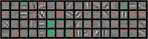

# 深度学习 – 学习和理解的重要资源

> 原文：[`www.kdnuggets.com/2014/08/deep-learning-important-resources-learning-understanding.html`](https://www.kdnuggets.com/2014/08/deep-learning-important-resources-learning-understanding.html)

作者：Gregory Piatetsky，[**@kdnuggets**](https://twitter.com/kdnuggets)，2014 年 8 月 21 日

深度学习是目前最热门的机器学习方法，并且因取得显著成果而频频上新闻。在最近的大规模视觉识别挑战赛 ([结果](http://www.image-net.org/challenges/LSVRC/2014/results)，[纽约时报文章](http://bits.blogs.nytimes.com/2014/08/18/computer-eyesight-gets-a-lot-more-accurate/)) 中，准确率几乎翻了一番（从 22.5% 提升至 43.9%），错误率则从 11.7% 降至仅 6.6%。

 值得注意的是，几乎所有参赛者都使用了一种称为卷积神经网络的变体方法 ([ConvNet](https://code.google.com/p/cuda-convnet/))，这种方法最初由 NYU 教授 Yann LeCun 在 1998 年进行了完善，LeCun 最近被聘为 Facebook 人工智能研究中心的负责人。

这里有更多资源帮助你了解深度学习和卷积神经网络

+   我的文章 在哪里学习深度学习 - 课程、教程、软件

+   KDnuggets 独家 与 Yann LeCun 的访谈，第一部分，以及 第二部分

[深度学习](http://www.iro.umontreal.ca/~bengioy/dlbook/) 书稿，作者：Yoshua Bengio、Ian Goodfellow 和 Aaron Courville

软件：

+   [cuda-convnet](https://code.google.com/p/cuda-convnet/)，一个快速的 C++ 实现卷积神经网络（或者更一般的，前馈神经网络）

+   [深度学习的 Matlab/Octave 工具箱](https://github.com/rasmusbergpalm/DeepLearnToolbox)

+   [pylearn2 GitHub 页面](https://github.com/lisa-lab/pylearn2)，一个 Python 机器学习库，包含 Deep Learning 的 maxout 代码

[Yann LeCun 讲座](http://www.cs.nyu.edu/~yann/talks/)，包括

+   视觉特征层次学习

+   使用机器学习构建人工视觉系统

+   PCMI 夏季学校的 5 节讲座：介绍、基于能量的学习、多阶段学习、卷积网络、无监督深度学习等

深度学习的基础论文 - 来自 [Yoshua Bengio 的 Quora 回答](https://www.quora.com/Deep-Learning/What-are-some-fundamental-deep-learning-papers-for-which-code-and-data-is-available-to-reproduce-the-result-and-on-the-way-grasp-deep-learning)。

这里是精选论文：

+   [快速学习算法用于深度信念网络](http://www.cs.toronto.edu/~hinton/absps/fastnc.pdf)，作者：Geoff Hinton 等

+   [在 MNIST 数字上训练深度自编码器或分类器](http://www.cs.toronto.edu/~hinton/MatlabForSciencePaper.html)，由 Ruslan Salakhutdinov 和 Geoff Hinton 编写的代码

+   [深度玻尔兹曼机](http://www.cs.toronto.edu/~hinton/absps/dbm.pdf)，由 Ruslan Salakhutdinov 和 Geoff Hinton 编写

+   [学习深度玻尔兹曼机](http://www.utstat.toronto.edu/~rsalakhu/DBM.html)，由 Ruslan Salakhutdinov 编写的代码

+   [Maxout 网络](http://jmlr.org/proceedings/papers/v28/goodfellow13.pdf)，由 Ian Goodfellow 等人编写

优秀的[深度学习简介：从感知机到深度网络](http://www.toptal.com/machine-learning/an-introduction-to-deep-learning-from-perceptrons-to-deep-networks)，由 Toptal 的 Ivan Vasilev 提供

另一个优秀的演示文稿是[在 Hadoop 下一代 YARN 框架上进行并行迭代深度学习介绍](http://cdn.oreillystatic.com/en/assets/1/event/115/Introduction%20to%20Parallel%20Iterative%20Deep%20Learning%20on%20Hadoop%E2%80%99s%20Next%E2%80%8B-Generation%20YARN%20Framework%20Presentation%202.pdf)，由 Adam Gibson 和 Josh Patterson 制作。

**相关：**

+   **深度学习是否存在深层缺陷？**

+   **学习深度学习的去处 - 课程、教程、软件**

+   **KDnuggets 独家：采访 Yann LeCun，深度学习专家，Facebook AI 实验室主任**

+   KDnuggets 独家采访 Yann LeCun，第二部分

+   深度学习分析如何模拟大脑

* * *

## 我们的三大课程推荐

 1\. [Google 网络安全证书](https://www.kdnuggets.com/google-cybersecurity) - 快速开启网络安全职业生涯。

 2\. [Google 数据分析专业证书](https://www.kdnuggets.com/google-data-analytics) - 提升你的数据分析能力

 3\. [Google IT 支持专业证书](https://www.kdnuggets.com/google-itsupport) - 支持你的组织进行 IT

* * *

### 更多相关内容

+   [什么是向量数据库，它们为何对 LLMs 重要？](https://www.kdnuggets.com/2023/06/vector-databases-important-llms.html)

+   [领域知识对机器学习重要吗？](https://www.kdnuggets.com/2022/07/domain-knowledge-important-machine-learning.html)

+   [KDnuggets 新闻，8 月 3 日：10 个最常用的 Tableau 函数 • 是…](https://www.kdnuggets.com/2022/n31.html)

+   [为什么数据管理对数据科学如此重要？](https://www.kdnuggets.com/2022/08/data-management-important-data-science.html)

+   [你的特征重要吗？这并不意味着它们好](https://www.kdnuggets.com/your-features-are-important-it-doesnt-mean-they-are-good)

+   [什么是超级对齐及其重要性？](https://www.kdnuggets.com/2023/07/superalignment-important.html)
