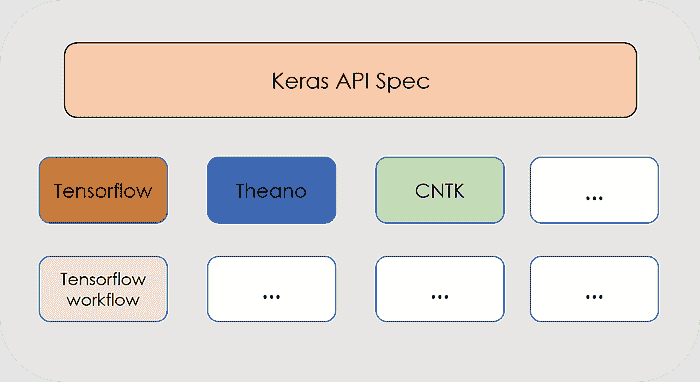
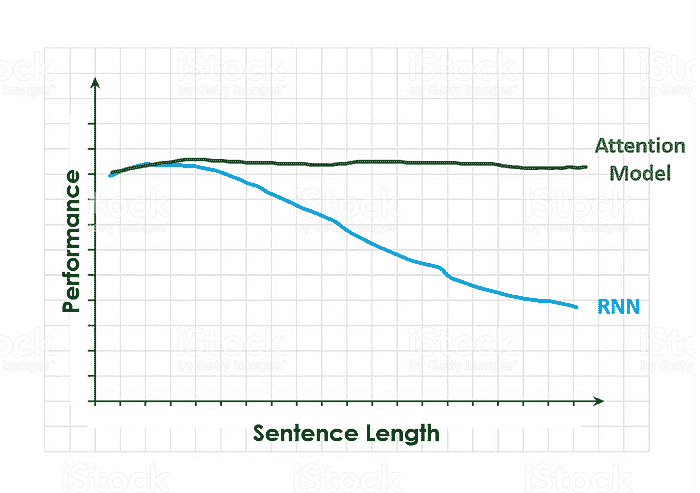
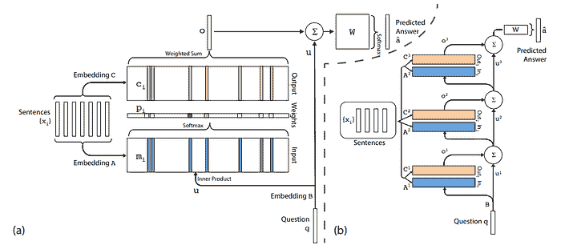

# 深度学习与 NLP：使用 Keras 创建聊天机器人！

> 原文：[`www.kdnuggets.com/2019/08/deep-learning-nlp-creating-chatbot-keras.html`](https://www.kdnuggets.com/2019/08/deep-learning-nlp-creating-chatbot-keras.html)

 评论

**由 [Jaime Zornoza](https://www.linkedin.com/in/jaime-zornoza/)，马德里理工大学**


在上一篇文章中，我们了解了**人工神经网络和深度学习**是什么。还介绍了一些用于处理序列数据（如文本或音频）的神经网络结构。如果你还没有阅读那篇文章，你应该放松一下，拿杯咖啡，慢慢享受它。**它可以在**[**这里**](https://towardsdatascience.com/deep-learning-for-nlp-anns-rnns-and-lstms-explained-95866c1db2e4?source=friends_link&sk=3f07244ea80a8ceaf23ee8a4e8a4beea)**找到**。

这篇新文章将讲解**如何使用 Keras**，这是一个非常流行的神经网络库来构建聊天机器人。将解释该库的主要概念，然后我们将逐步指南如何使用它来创建一个“是/否**回答机器人**”的 Python 示例。我们将利用 Keras 的简便性来实现来自 Sukhbaatar 等人论文中的 RNN 结构（你可以在[这里](https://arxiv.org/pdf/1503.08895.pdf)找到）。

这很有趣，因为在定义了一个任务或应用（创建一个“是/否”聊天机器人以回答特定问题）之后，我们将学习如何**将研究工作中的洞察转化为实际模型**，然后我们可以使用这个模型来实现我们的应用目标。

如果这是你第一次**实现一个 NLP 模型**，不要感到害怕；我会逐步讲解每一步，并在最后提供代码的链接。为了获得**最佳学习体验**，我建议你先阅读文章，然后在查看代码的同时，浏览与之相关的文章部分。

那我们开始吧！

### **Keras：Python 中的简单神经网络**

Keras 是一个**开源的高级库**，用于开发神经网络模型。它由 Google 的深度学习研究员 François Chollet 开发。它的核心原则是使构建神经网络、训练它，然后使用它进行预测的过程**对任何具有基础编程知识的人都简单易用**，同时仍允许开发者完全自定义 ANN 的参数。

基本上，Keras 实际上只是一个可以运行在不同深度学习框架之上的接口，比如**CNTK、Tensorflow 或 Theano**。无论使用哪个后端，它的工作方式都是一样的。



Keras API 的分层结构。如图所示，它可以无缝运行在不同的框架之上。

正如我们在上一篇文章中提到的，在神经网络中，每个特定层的节点都会对来自上一层的输出进行加权求和，应用数学函数，然后将结果传递到下一层。

使用 Keras，我们可以创建一个表示每一层的模块，其中这些数学操作和层中的节点数量可以轻松定义。这些不同的层可以通过输入直观的**单行代码**来创建。

**创建 Keras 模型的步骤**如下：

**步骤 1：** 首先，我们必须定义一个网络模型，大多数时候，这将是**顺序模型**：网络将被定义为一系列层，每层具有其自定义大小和激活函数。在这些模型中，第一层将是**输入层**，我们需要定义将输入到网络中的输入大小。之后，可以添加更多层并进行自定义，直到达到最终的输出层。

```py
#Define Sequential Model
model = Sequential() 
#Create input layer
model.add(Dense(32, input_dim=784))
#Create hidden layer 
model.add(Activation('relu')) 
#Create Output layer
model.add(Activation('sigmoid'))  
```

**步骤 2：** 在以这种方式创建网络结构之后，我们需要**编译它**，这将简单的层序列转变为复杂的矩阵运算组，这些运算组决定了网络的行为。在这里，我们必须定义将用于训练网络的优化算法，并选择需要最小化的损失函数。

```py
#Compiling the model with a mean squared error loss and RMSProp #optimizer
model.compile(optimizer='rmsprop',loss='mse')
```

**步骤 3：** 一旦完成，我们可以*训练*或***拟合***网络，这将使用上一篇文章中提到的反向传播算法完成。

```py
*# Train the model, iterating on the data in batches of 32 samples* model.fit(data, labels, epochs=10, batch_size=32)
```

**步骤 4：** 太棒了！我们的网络已经训练好了。现在我们可以用它对新数据进行预测。

正如你所看到的，**使用 Keras 构建网络非常简单**，所以让我们开始并使用它来创建我们的聊天机器人吧！上述代码块并不代表实际的具体神经网络模型，它们只是帮助说明如何使用 Keras API 简单地构建神经网络的每一步的示例。

你可以在其[官方网站](https://keras.io/)上找到所有关于 Keras 的文档以及如何安装它的信息。

### 项目：使用递归神经网络构建一个聊天机器人

现在我们知道了所有这些不同类型的神经网络，让我们使用它们来**构建一个聊天机器人**，它可以回答我们的一些问题！

大多数时候，神经网络的结构比标准的输入-隐藏层-输出更复杂。有时我们可能会想要**自己设计一个神经网络**，并尝试不同的节点或层组合。此外，在某些情况下，我们可能会想要**实现我们在某处看到的模型**，比如在科学论文中。

在这篇文章中，我们将通过一个例子来说明这种第二种情况，并**构建来自论文“*端到端记忆网络*”**的神经模型，由 Sukhbaatar 等人编写（你可以在[这里](https://arxiv.org/pdf/1503.08895.pdf)找到）。

我们还将看到如何保存训练好的模型，以便在使用我们构建的模型进行预测时无需每次都重新训练网络。**那么我们开始吧！**

### 模型：灵感

如前所述，本篇文章中使用的 RNN 来源于论文[“*End to End Memory Networks*”](https://arxiv.org/pdf/1503.08895.pdf)，因此建议你在继续之前先查看一下，尽管我会在接下来的内容中解释最相关的部分。

本文实现了一个类似 RNN 的结构，使用**注意力模型**来弥补我们在前一篇文章中讨论的 RNN 的长期记忆问题。

不知道什么是注意力模型？**不用担心**，我会用简单的术语来解释。注意力模型引起了很多关注，因为它们在**机器翻译**等任务中取得了很好的结果。它们解决了之前提到的**长序列**和 RNN 的短期记忆问题。

为了获取**注意力的直观理解**，想象一下一个**人类如何翻译**一个长句子从一种语言到另一种语言。**而不是**一次性翻译**整句话**，你会将句子拆分成更小的部分，然后逐一翻译这些小块。我们逐部分处理句子，因为**一次性记住整个句子真的很困难**。


人类如何将上面的文本从英语翻译成西班牙语

注意力机制正是实现了这一点。在每个时间步，t**模型会在输出中对输入句子中与任务相关性更高的部分赋予更大的权重**。这就是名字的由来：**它*关注*重要的部分**。上面的例子很好的说明了这一点；为了翻译句子的第一部分，查看整个句子或最后一部分几乎没有意义。

下图展示了**RNN 与 Attention 模型在输入句子长度增加时的表现**。当面对一个非常长的句子并要求执行特定任务时，RNN 在处理完所有句子后可能已经忘记了最初的输入。



RNN 和注意力模型的性能与句子长度的关系。

好了，现在我们知道什么是注意力模型了，我们来详细看看我们将使用的模型结构。这个模型接收**输入 *xi***（一个句子），一个**查询 *q***关于这个句子的，并输出一个是/否的**答案** *a*。



左侧（a）是模型单层的表示。右侧（b）是堆叠在一起的 3 层。

在之前图像的左侧部分，我们可以看到**该模型的单层表示**。每个句子计算两个不同的嵌入，***A*** 和 ***C***。同时，查询或问题 q 也被嵌入，使用 ***B*** 嵌入。

A 嵌入的 ***mi***，然后通过与问题嵌入 ***u*** 的内积计算（这是进行**注意力机制**的部分，通过计算这些嵌入之间的**内积**，我们实际上是在寻找**查询和句子中的词汇匹配**，然后使用*Softmax* 函数对点积结果进行加权）。

最后，我们使用来自 C 的嵌入 ***(ci)*** 和从点积获得的权重或概率 ***pi*** 计算输出向量 ***o***。有了这个输出向量 ***o***、权重矩阵 ***W*** 和问题的嵌入 ***u***，我们最终可以计算预测答案 ***a hat***。

为了构建**整个网络**，我们只需在不同层上重复这些过程，使用一个层的预测输出作为下一个层的输入。这在之前图像的右侧部分展示了。

如果所有这些内容对你来说来得太快，不用担心，希望在我们通过不同步骤**在 Python 中实现这个模型**时，你会有更好、更完整的理解。

### 数据：故事、问题和答案

2015 年，Facebook 提出了**bAbI 数据集**及 20 个用于测试文本理解和推理的任务，这些任务在 bAbI 项目中进行。**任务的详细描述可以在论文中找到[**这里**](https://arxiv.org/abs/1502.05698#)**。**

每个任务的目标是**挑战机器文本相关活动的独特方面**，测试学习模型的不同能力。在这篇文章中，我们将面临其中一个任务，特别是“*具有单一支持事实的 QA*”。

下方的块展示了这种 QA 机器人期望的行为示例：

```py
FACT: Sandra went back to the hallway. Sandra moved to the office.  QUESTION: Is Sandra in the office?ANSWER: yes
```

数据集已分为**训练数据（10k 实例）** 和 **测试数据（1k 实例）**，每个实例包含一个**事实**、一个**问题**和对该问题的“是/否”**答案**。

现在我们已经了解了数据的结构，我们需要**构建一个词汇表**。在**自然语言处理**模型中，词汇表基本上是一个**模型了解并能够理解的词汇集合**。如果在构建词汇表后，模型在句子中看到一个词不在词汇表中，它将给该词在句子向量中的值设为 0，或者将其表示为未知。

```py
VOCABULARY:
'.', '?', 'Daniel', 'Is', 'John', 'Mary', 'Sandra', 'apple','back','bathroom', 'bedroom', 'discarded', 'down','dropped','football', 'garden', 'got', 'grabbed', 'hallway','in', 'journeyed', 'kitchen', 'left', 'milk', 'moved','no', 'office', 'picked', 'put', 'the', 'there', 'to','took', 'travelled', 'up', 'went', 'yes'
```

由于我们的**训练数据变化不大**（大多数问题使用相同的动词和名词，但组合不同），我们的词汇表不是很大，但在**中等规模的 NLP 项目**中，词汇表可能非常庞大。

请注意，为了构建词汇表，我们大多数时候只应该使用**训练数据**；**测试数据应该从一开始就与训练数据分开**，直到评估所选择和调整的模型性能时才触碰。

构建词汇表后，我们需要***向量化***我们的数据。由于我们使用的是普通单词作为模型的输入，而**计算机在底层只能处理数字**，我们需要一种方式来**表示**我们的句子，即单词组，**作为数字向量。向量化就是做这件事的**。

向量化句子的方式有很多种，比如***词袋模型***或***Tf-Idf***，然而，为了简便，我们将只使用一种索引向量化技术，即给词汇表中的每个单词分配一个从 1 到词汇表长度的唯一索引。

```py
VECTORIZATION INDEX:
'the': 1, 'bedroom': 2, 'bathroom': 3, 'took': 4, 'no': 5, 'hallway': 6, '.': 7, 'went': 8, 'is': 9, 'picked': 10, 'yes': 11, 'journeyed': 12, 'back': 13, 'down': 14, 'discarded': 15, 'office': 16, 'football': 17, 'daniel': 18, 'travelled': 19, 'mary': 20, 'sandra': 21, 'up': 22, 'dropped': 23, 'to': 24, '?': 25, 'milk': 26, 'got': 27, 'in': 28, 'there': 29, 'moved': 30, 'garden': 31, 'apple': 32, 'grabbed': 33, 'kitchen': 34, 'put': 35, 'left': 36, 'john': 37}
```

请注意，这种向量化是使用随机种子开始的，因此即使你使用与我相同的数据，**你可能会得到每个单词的不同索引**。不要担心；这不会影响项目的结果。此外，我们的词汇表中的单词有大写和小写；在进行这种向量化时，为了统一性，所有单词都被**转为小写**。

在这之后，**由于 Keras 的工作方式**，我们**需要对句子进行填充**。这是什么意思？这意味着我们需要找到最长句子的长度，将每个句子转换为该长度的向量，并用零填充每个句子的单词数量与最长句子的单词数量之间的差距。

完成后，数据集中的一个随机句子应该是这样的：

```py
FIRST TRAINING SENTENCE VECTORIZED AND PADDED:
array([ 0,  0,  0,  0,  0,  0,  0,  0,  0,  0,  0,  0,  0,  0,  0,  0,  0,
        0,  0,  0,  0,  0,  0,  0,  0,  0,  0,  0,  0,  0,  0,  0,  0,  0,
        0,  0,  0,  0,  0,  0,  0,  0,  0,  0,  0,  0,  0,  0,  0,  0,  0,
        0,  0,  0,  0,  0,  0,  0,  0,  0,  0,  0,  0,  0,  0,  0,  0,  0,
        0,  0,  0,  0,  0,  0,  0,  0,  0,  0,  0,  0,  0,  0,  0,  0,  0,
        0,  0,  0,  0,  0,  0,  0,  0,  0,  0,  0,  0,  0,  0,  0,  0,  0,
        0,  0,  0,  0,  0,  0,  0,  0,  0,  0,  0,  0,  0,  0,  0,  0,  0,
        0,  0,  0,  0,  0,  0,  0,  0,  0,  0,  0,  0,  0,  0,  0,  0,  0,
        0,  0,  0,  0,  0,  0,  0,  0, 20, 30, 24,  1,  3,  7, 21, 12, 24, 1,  2,  7])
```

如我们所见，它到处都是零，除了末尾（这个句子比最长句子短很多），那里有一些数字。这些数字是什么？嗯，它们是代表句子中不同单词的索引：20 是代表单词***Mary***的索引，*30* 是****moved****，*24 是***to***，1 是***the***，3 代表***bathroom***，依此类推。实际句子是：

```py
FIRST TRAINING SENTENCE: 
"Mary moved to the bathroom . Sandra journeyed to the bedroom ."
```

好的，既然我们已经准备好了数据，我们现在可以开始构建我们的神经网络了！

### 神经网络：构建模型

创建网络的第一步是在 Keras 中创建被称为***占位符***的输入，在我们的案例中是**故事**和**问题**。简单来说，这些占位符是容器，批量的训练数据会被放置在这些容器中，然后再输入到模型中。

```py
*#Example of a Placeholder
question = Input((max_question_len,batch_size))*
```

它们必须具有与将要输入的数据相同的维度，并且还可以定义一个批量大小，尽管如果在创建占位符时不知道这个值，我们可以留空。

现在我们需要创建论文中提到的**嵌入**，**A, C 和 B**。嵌入将一个整数（在本例中是单词的索引）转换为***d***维向量，其中**考虑了上下文**。单词嵌入在**自然语言处理（NLP）中被广泛使用**，并且是近年来使这一领域取得显著进展的技术之一。

```py
#Create input encoder A:
input_encoder_m = Sequential()
input_encoder_m.add(Embedding(input_dim=vocab_len,output_dim = 64)) 
input_encoder_m.add(Dropout(0.3))#Outputs: (Samples, story_maxlen,embedding_dim) -- Gives a list of #the lenght of the samples where each item has the
#lenght of the max story lenght and every word is embedded in the embbeding dimension
```

上面的代码是论文中完成的一个嵌入（A 嵌入）的示例。像往常一样，在**Keras**中，我们首先定义模型（Sequential），然后添加嵌入层和一个丢弃层，通过触发网络节点的关闭来减少模型过拟合的机会。

一旦我们创建了输入句子的两个嵌入和问题的嵌入，我们可以开始定义模型中发生的操作。如前所述，我们通过计算问题的嵌入和故事嵌入之间的**点积**来计算注意力，然后进行 softmax。下面的代码块展示了如何实现这一点：

```py
match = dot([input_encoded_m,question_encoded], axes = (2,2))
match = Activation('softmax')(match)
```

接下来，我们需要计算输出***o***，将匹配矩阵与第二个输入向量序列相加，然后使用这个输出和编码的问题来计算**响应**。

```py
response = add([match,input_encoded_c])
response = Permute((2,1))(response)
answer = concatenate([response, question_encoded])
```

最后，完成这一过程后，我们将添加模型的其余层，包括一个**LSTM**层（而不是像论文中提到的 RNN）、一个丢弃层和一个最终的 softmax 来计算输出。

```py
answer = LSTM(32)(answer)
answer = Dropout(0.5)(answer)
#Output layer:
answer = Dense(vocab_len)(answer) 
#Output shape: (Samples, Vocab_size) #Yes or no and all 0s
answer = Activation('softmax')(answer)
```

请注意，这里的输出是一个词汇表大小的向量（即模型已知的单词数量的长度），其中所有位置应该是零，除了**‘yes’ 和 ‘no’**的索引位置。

### 从数据中学习：训练模型

现在我们准备好编译模型并进行训练了！

```py
model = Model([input_sequence,question], answer)
model.compile(optimizer='rmsprop', loss = 'categorical_crossentropy', metrics = ['accuracy'])
```

使用这两行代码我们**构建最终模型**并编译它，也就是通过指定一个**优化器**、一个**损失函数**和一个**度量标准**来定义后台的所有数学运算。

现在是**训练模型的时候**，在这里我们需要定义**训练的输入**（即输入故事、问题和答案）、**批量大小**（即一次输入的数量）和**训练轮数**（即模型将通过训练数据的次数以更新权重）。我使用了 1000 轮训练，并获得了 98%的准确率，但即使使用 100 到 200 轮，你也应该能获得相当不错的结果。

请注意，根据你的硬件，这个训练可能需要一段时间。放轻松，坐下来，**继续阅读 Medium**，等到训练完成。

训练完成后，你可能会想*“每次使用模型时我都需要等待这么久吗？”* 明显的答案是，***不***。Keras 允许开发者**保存特定的模型**，包括权重和所有配置。下面的代码块展示了如何实现这一点。

```py
filename = 'medium_chatbot_1000_epochs.h5'
model.save(filename)
```

现在，当我们想要使用模型时，可以像这样**加载**它：

```py
model.load_weights('medium_chatbot_1000_epochs.h5')
```

很酷。现在我们已经训练了模型，让我们看看它在新数据上的表现，并**玩一玩吧！**

### 看到结果：测试和玩耍

让我们看看我们的模型在测试数据上的表现吧！

```py
pred_results = model.predict(([inputs_test,questions_test]))
```

这些结果是**一个数组**，如前所述，包含每个词汇位置的概率，表示每个词是问题答案的概率。如果我们查看这个数组的第一个元素，我们会看到一个词汇表大小的向量，其中所有的值接近 0，除了对应于**yes 或 no**的值。

从这些中，如果我们选择**数组中最大值的索引**，然后查看它对应的单词，我们应该**找出答案**是肯定的还是否定的。

现在我们可以做一件有趣的事，那就是**创建我们自己的故事和问题**，并将其输入到机器人中，看看它会怎么说！

```py
my_story = 'Sandra picked up the milk . Mary travelled left . '
my_story.split()
my_question = 'Sandra got the milk ?'
my_question.split()
```

我创建了一个故事和一个问题，某种程度上**类似于我们的小机器人之前见过的内容**，并在将其调整为神经网络希望的格式后，机器人回答了‘***yes***’（虽然是小写的，他不像我那样热情）。

我们换点不同的东西试试：

```py
my_story = 'Medium is cool . Jaime really likes it. '
my_story.split()
my_question = 'Does Jaime like Medium ?'
my_question.split()
```

这次的回答是：‘***当然了，谁不呢？***’

只是开个玩笑，我没有尝试那个故事/问题组合，因为包含的许多词汇**不在我们小回答机器的词汇表中**。而且，它只会说‘yes’和‘no’，通常不会给出其他答案。**不过，通过更多的训练数据和一些变通方法，这是可以轻松实现的。**

今天就到这里！我希望你们阅读这篇文章和我写它时一样开心。祝你们一天愉快，保重，并享受人工智能！

你可以在我的[Github](https://github.com/jaimezorno/Deep-Learning-for-NLP-Creating-a-Chatbot/blob/master/Deep%20Learning%20for%20NLP-%20Creating%20a%20chatbot.ipynb)页面找到代码和数据。

### 其他资源：

如果你想深入了解注意力模型，或者理解我提到的一些词向量化技术，查看我为你整理的这些额外资源吧。祝好运！

[初学者的注意力机制和记忆网络指南](https://skymind.ai/wiki/attention-mechanism-memory-network)

[Andrew 的 Ng 关于注意力模型的直观视频。](https://www.youtube.com/watch?v=SysgYptB198&t=486s)

[初学者的 Tf-Idf 和词袋指南](https://skymind.ai/wiki/bagofwords-tf-idf)。

[Keras 构建同一模型的指南。](https://keras.io/examples/babi_memnn/)

随时可以在[LinkedIn](https://www.linkedin.com/in/jaime-zornoza/)上与我联系，或在 Twitter 上关注我@jaimezorno。同时，你也可以查看我在数据科学和机器学习方面的其他文章[这里](https://medium.com/@jaimezornoza)。**阅读愉快！**

**简介：[Jaime Zornoza](https://www.linkedin.com/in/jaime-zornoza/)** 是一位工业工程师，拥有电子学学士学位和计算机科学硕士学位。

[原文](https://towardsdatascience.com/deep-learning-for-nlp-creating-a-chatbot-with-keras-da5ca051e051)。经许可转载。

**相关：**

+   深度学习 NLP：ANNs、RNNs 和 LSTMs 解释！

+   训练神经网络以模仿洛夫克拉夫特风格写作

+   适配器：一种紧凑且可扩展的 NLP 转移学习方法

* * *

## 我们的前三大课程推荐

 1\. [Google 网络安全证书](https://www.kdnuggets.com/google-cybersecurity) - 快速进入网络安全职业生涯。

 2\. [Google 数据分析专业证书](https://www.kdnuggets.com/google-data-analytics) - 提升你的数据分析技能

 3\. [Google IT 支持专业证书](https://www.kdnuggets.com/google-itsupport) - 支持你的组织的 IT 部门

* * *

### 更多相关话题

+   [停止学习数据科学以寻找目标，并通过找到目标……](https://www.kdnuggets.com/2021/12/stop-learning-data-science-find-purpose.html)

+   [学习数据科学统计的顶级资源](https://www.kdnuggets.com/2021/12/springboard-top-resources-learn-data-science-statistics.html)

+   [一个 90 亿美元的 AI 失败，深入探讨](https://www.kdnuggets.com/2021/12/9b-ai-failure-examined.html)

+   [成功数据科学家的 5 个特征](https://www.kdnuggets.com/2021/12/5-characteristics-successful-data-scientist.html)

+   [是什么让 Python 成为初创公司的理想编程语言](https://www.kdnuggets.com/2021/12/makes-python-ideal-programming-language-startups.html)

+   [每个数据科学家都应该知道的三个 R 语言库（即使你使用 Python）](https://www.kdnuggets.com/2021/12/three-r-libraries-every-data-scientist-know-even-python.html)
