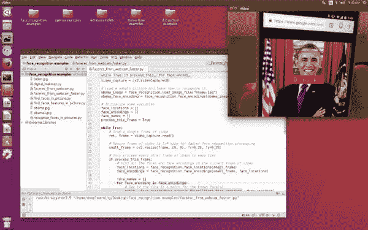

# 几分钟内使用这个预配置的 Python VM 镜像进行深度学习

> 原文：[`www.kdnuggets.com/2017/05/deep-learning-pre-configured-python-vm-image.html`](https://www.kdnuggets.com/2017/05/deep-learning-pre-configured-python-vm-image.html)

[Adam Geitgey](https://medium.com/@ageitgey)在他的博客中撰写有关机器学习、深度学习、图像和语音识别及相关主题的文章。他既讲理论也讲实践，并重点介绍了开发者如何快速开始使用这些技术。Geitgey 表示：

> 但我收到的最常见问题是“**我到底怎么才能在我的计算机上安装并运行所有这些开源库？**”

为此，Geitgey 整理了一个虚拟机镜像，他在[这篇近期文章](https://medium.com/@ageitgey/try-deep-learning-in-python-now-with-a-fully-pre-configured-vm-1d97d4c3e9b)中进行了介绍。基于 Ubuntu Linux Desktop 16.04 LTS 64-bit，这个镜像包括了以下工具和库：

+   Python 3.5

+   带有 Python 3 绑定的 OpenCV 3.2

+   带有 Python 3 绑定的 dlib 19.4

+   Python 3 的 TensorFlow 1.0

+   Keras 2.0 for Python 3

+   Theano

+   Python 3 的 face_recognition（用于人脸识别的玩耍）

它还包括了一些预制的项目，以便立即上手：

> 如果你从左侧边栏启动 PyCharm Community Edition，将会看到几个预创建的项目可以打开。尝试运行 face_recognition、OpenCV 或 Keras 项目的一些演示。在代码窗口上右键点击并选择“运行”，以在 PyCharm 中运行当前文件。

阅读关于这个镜像的更多信息[这里](https://medium.com/@ageitgey/try-deep-learning-in-python-now-with-a-fully-pre-configured-vm-1d97d4c3e9b) -- 包括下载和安装说明、用户名和密码信息，以及一些使用技巧 -- 并从[这里直接获取镜像](https://archive.org/details/DeepLearningVM_Ubuntu_16.04_64Bit_vmware)。

一旦你启动了虚拟机，开始的一个很好的地方就是 Geitgey 的“机器学习是有趣的”系列文章：

+   [机器学习是有趣的！](https://medium.com/@ageitgey/machine-learning-is-fun-80ea3ec3c471)

+   [机器学习是有趣的！第二部分](https://medium.com/@ageitgey/machine-learning-is-fun-part-2-a26a10b68df3)

+   [机器学习是有趣的！第三部分：深度学习和卷积神经网络](https://medium.com/@ageitgey/machine-learning-is-fun-part-3-deep-learning-and-convolutional-neural-networks-f40359318721)

+   [机器学习是有趣的！第四部分：现代人脸识别与深度学习](https://medium.com/@ageitgey/machine-learning-is-fun-part-4-modern-face-recognition-with-deep-learning-c3cffc121d78)

+   [机器学习是有趣的！第五部分：使用深度学习和序列的魔力进行语言翻译](https://medium.com/@ageitgey/machine-learning-is-fun-part-5-language-translation-with-deep-learning-and-the-magic-of-sequences-2ace0acca0aa)

+   [机器学习趣味第六部分：如何使用深度学习进行语音识别](https://medium.com/@ageitgey/machine-learning-is-fun-part-6-how-to-do-speech-recognition-with-deep-learning-28293c162f7a)

+   [机器学习趣味第七部分：滥用生成对抗网络制作 8 位像素艺术](https://medium.com/@ageitgey/abusing-generative-adversarial-networks-to-make-8-bit-pixel-art-e45d9b96cee7)

**相关**：

+   一台深度学习虚拟机统治一切

+   如何在 TensorFlow 中构建递归神经网络

+   与 Python 机器学习的游击指南

* * *

## 我们的前三大课程推荐

 1\. [谷歌网络安全证书](https://www.kdnuggets.com/google-cybersecurity) - 加速你的网络安全职业生涯。

 2\. [谷歌数据分析专业证书](https://www.kdnuggets.com/google-data-analytics) - 提升你的数据分析技能

 3\. [谷歌 IT 支持专业证书](https://www.kdnuggets.com/google-itsupport) - 支持你的组织的 IT 需求

* * *

### 了解更多相关话题

+   [使用管道编写干净的 Python 代码](https://www.kdnuggets.com/2021/12/write-clean-python-code-pipes.html)

+   [是什么让 Python 成为初创公司理想的编程语言](https://www.kdnuggets.com/2021/12/makes-python-ideal-programming-language-startups.html)

+   [每个数据科学家都应该知道的三个 R 库（即使你使用 Python）](https://www.kdnuggets.com/2021/12/three-r-libraries-every-data-scientist-know-even-python.html)

+   [停止学习数据科学以寻找目标，并寻找目标来…](https://www.kdnuggets.com/2021/12/stop-learning-data-science-find-purpose.html)

+   [学习数据科学统计的顶级资源](https://www.kdnuggets.com/2021/12/springboard-top-resources-learn-data-science-statistics.html)

+   [一项 90 亿美元的 AI 失败，详解](https://www.kdnuggets.com/2021/12/9b-ai-failure-examined.html)
