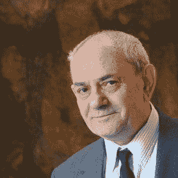
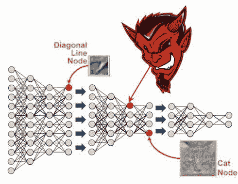

# **深度学习**来自魔鬼吗？

> 原文：[`www.kdnuggets.com/2015/10/deep-learning-vapnik-einstein-devil-yandex-conference.html`](https://www.kdnuggets.com/2015/10/deep-learning-vapnik-einstein-devil-yandex-conference.html)

 评论

在过去一周的柏林，我参加了“机器学习：前景与应用”会议，这是一个来自学术机器学习社区的邀请讲者会议。由俄罗斯最大搜索引擎 Yandex 组织，会议显著地突出**深度学习**和**智能学习**这两个常常被认为对立的概念。尽管我以深度学习小组的讲者和参与者身份参加了会议，但会议的亮点是见证了许多领先理论家和从业者表达的经验主义与数学之间的哲学冲突。

第一日的深度学习主题结束时，进行了一个晚间小组讨论。由李登博士主持，该讨论挑战了深度学习社区的讲者，包括我自己，解释机器学习的数学基础，并展望其未来。关于模型可解释性的问题，这是我在之前的帖子中讨论的一个话题，尤其是针对医学应用的问题特别多。在周三，举行了第二晚的讨论。在这里，支持向量机的共同发明者、被广泛认为是统计学习理论奠基人的弗拉基米尔·瓦普尼克阐述了他的知识传递理论，并提供了涉及机器学习、数学和智能源的哲学视角。或许最具争议的是，他对深度学习提出了挑战，质疑其特设的方法。

在过去的夏天，我发布了一篇文章，建议深度学习的成功更广泛地反映了经验主义在大数据环境中的胜利。 我认为，若没有过拟合的风险，可在真实数据上验证的方法集合可能远大于那些我们可以从数学第一原则保证有效的方法。会议结束后，我想继续探讨这个话题，特别是那些弗拉基米尔·瓦普尼克在会议上提出的挑战。

为了避免任何混淆，我是一名深度学习研究员。我个人并不否定深度学习，并尊重它的开创者和继承者。但我也相信，我们应该对最终某些数学理论将更全面地解释其成功或指引新的方法持开放态度。显然，理解深度学习方法的论点及其批评观点都有其价值，因此我呈现了一些会议的亮点，特别是来自 Vapnik 教授的讲座。

**大数据与深度学习作为蛮力方法**

尽管 Vapnik 教授对深度学习有多个角度的看法，但也许最核心的观点是：在关于*智能学习*的观众讨论中，Vapnik 提到了爱因斯坦的隐喻神的观点。简而言之，Vapnik 认为，想法和直觉要么来自上帝，要么来自魔鬼。他提出的区别是**上帝聪明，而魔鬼则不聪明**。

在他的数学家和机器学习研究员职业生涯中，Vapnik 表示魔鬼总是以蛮力的形式出现。此外，虽然承认深度学习系统在解决实际问题上的出色表现，但他认为**大数据和深度学习都带有蛮力的色彩**。有一位观众问 Vapnik 教授是否认为进化（这可能导致了人类智能）是一个蛮力算法。由于明确表示不喜欢猜测，Vapnik 教授拒绝对进化提出任何猜测。还值得一提的是，虽然爱因斯坦关于上帝如何设计宇宙的直觉非常有成效，但并不总是奏效。最著名的是爱因斯坦认为“上帝不掷骰子”的直觉似乎与我们对量子力学的现代理解相冲突[(见斯蒂芬·霍金关于这个话题的精彩易读文章)](http://www.hawking.org.uk/does-god-play-dice.html)。

虽然我可能不同意深度学习必然等同于蛮力的观点，但我更清楚地看到了对现代大数据态度的反对论点。正如 Vapnik 博士和纳撒尼尔·因特拉托尔教授在特拉维夫大学所建议的，一个婴儿在学习时并不需要数十亿个标注样本。换句话说，虽然使用巨大的标注数据集进行有效学习可能很容易，但依赖这些数据集可能会错过关于学习本质的一些根本问题。也许，如果我们的算法只能通过巨大的数据集进行学习，而这些本应通过数百个样本即可学习的内容，那我们可能已经陷入了懒惰。

**深度学习还是深度工程**

瓦普尼克教授对深度学习的另一种看法是，它不是科学。具体来说，他表示深度学习偏离了机器学习的核心使命，他认为机器学习的核心在于理解机制。更详细的说，他认为研究机器学习就像是在试图制造一把斯特拉迪瓦里小提琴，而工程解决实际问题更像是成为一名小提琴手。从这个角度来看，小提琴手可以演奏出美妙的音乐，并对如何演奏有直觉，但未必正式理解自己在做什么。由此，他建议许多深度学习从业者对数据和工程有很好的感觉，但同样不真正理解自己在做什么。

**人类是否发明了什么？**

瓦普尼克教授提出的一个尖锐的观点是，我们是发现还是发明算法和模型。在瓦普尼克看来，我们实际上并没有发明任何东西。他具体对观众说，他“并不聪明到可以发明什么”。由此推测，可能没有其他人也如此聪明。更委婉地说，他认为我们发明的东西（如果有的话），与那些本质上固有的事物相比微不足道，真正的知识来源于对数学的理解。深度学习中模型经常被发明、命名和技术专利，这与更具数学动机的机器学习相比显得有些人为。在这段时间里，他挑战观众提供一个深度学习的定义。大多数观众似乎不愿意提供定义。在其他时候，观众通过引用深度学习的生物学启发来挑战他的观点。对此，瓦普尼克教授问道：“你知道大脑是如何工作的？”

 **[扎克瑞·蔡斯·利普顿](http://zacklipton.com)** 是加州大学圣地亚哥分校计算机科学工程系的博士生。由[生物医学信息学部](http://healthsciences.ucsd.edu/som/medicine/divisions/dbmi/pages/default.aspx)资助，他对机器学习的理论基础和应用都感兴趣。除了在 UCSD 的工作外，他还曾在微软研究院实习，并担任亚马逊的机器学习科学家，是 KDnuggets 的特约编辑，并在 Manning Publications 签约成为作者。

**相关：**

+   深度学习与经验主义的胜利

+   模型可解释性的神话

+   (深度学习的深层缺陷)

+   数据科学中最常用、最困惑和被滥用的术语

+   差分隐私：如何使隐私与数据挖掘兼容

* * *

## 我们的三大课程推荐

 1\. [Google 网络安全证书](https://www.kdnuggets.com/google-cybersecurity) - 快速进入网络安全职业轨道。

 2\. [Google 数据分析专业证书](https://www.kdnuggets.com/google-data-analytics) - 提升你的数据分析水平

 3\. [Google IT 支持专业证书](https://www.kdnuggets.com/google-itsupport) - 支持你所在组织的 IT 需求

* * *

### 更多相关话题

+   [数据来自哪里？](https://www.kdnuggets.com/2022/08/data-come.html)

+   [机器学习为何无法为我的业务创造价值？](https://www.kdnuggets.com/2021/12/machine-learning-produce-value-business.html)

+   [ETL 与机器学习有什么关系？](https://www.kdnuggets.com/2022/08/etl-machine-learning.html)

+   [数据科学家做什么？](https://www.kdnuggets.com/2021/12/what-does-a-data-scientist-do.html)

+   [随机森林算法是否需要归一化？](https://www.kdnuggets.com/2022/07/random-forest-algorithm-need-normalization.html)

+   [KDnuggets 新闻，11 月 30 日：什么是切比雪夫定理及其应用…](https://www.kdnuggets.com/2022/n46.html)
