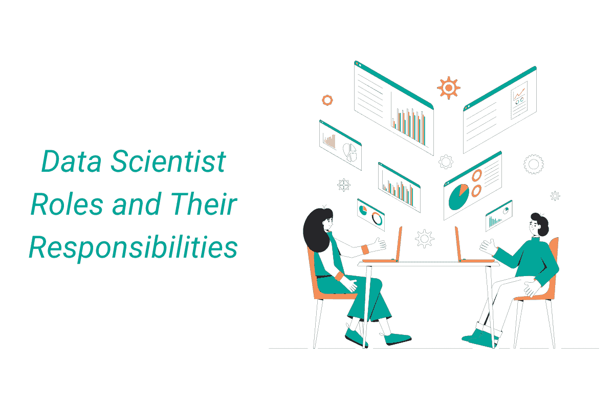

# 深入了解 13 种数据科学家角色及其职责

> 原文：[`www.kdnuggets.com/2022/01/deep-look-13-data-scientist-roles-responsibilities.html`](https://www.kdnuggets.com/2022/01/deep-look-13-data-scientist-roles-responsibilities.html)

在科技领域，数据科学家的职位和工作职责可能是最为多样的。数据科学家需要扮演多种角色，[在亚马逊的数据科学家](https://www.stratascratch.com/blog/amazon-data-scientist-position-guide/)的日常工作可能与[在微软的数据科学家](https://www.stratascratch.com/blog/microsoft-data-scientist-position-guide/)的工作有很大的不同。从寻找公司业务中可以从数据收集、分析和理解中受益的领域，到决定必须做出的战略决策以提高客户满意度或购买完成率，公司对数据科学家的要求可以非常高。

数据科学家需要具备专家级的统计、机器学习以及通常还包括经济学的技能和知识。[数据科学家需要具备高超的技能](https://www.stratascratch.com/blog/most-in-demand-data-science-technical-skills/)，包括数学、统计、机器学习、可视化、沟通和算法实现。

此外，数据科学家必须深入了解其数据的业务应用。如果你在分析树木生长数据，你需要理解[树高与冠基高度的区别](https://www.nature.com/articles/sdata201877)。这种背景知识可以在工作中逐步积累，但如果你已经有相关行业的工作经验，那么成为数据科学家的机会将会更大。如果你有五年的银行工作经验，那么在金融科技领域获得数据科学职位的机会要远大于在医疗行业。

## 数据科学家所戴的各种“帽子”

数据科学是一个相对较新的领域，对于非数据科学家来说，很难向外行解释[数据科学家做什么](https://www.stratascratch.com/blog/what-does-a-data-scientist-do/)。这导致了现代数据科学家可能会面临各种各样的职责和职位名称，这些职责和名称有时显得颇为滑稽。

一名[数据科学家](https://www.northeastern.edu/graduate/blog/what-does-a-data-scientist-do/)，根据公司和具体工作职责，可能需要负责数据收集和清理。你也可能需要开发机器学习模型和管道，或作为公司的可视化专家。有些数据科学家更多的是[面向内部](https://svpg.com/leveraging-data-science/)，而其他人则需要与内部非技术团队或甚至客户密切合作。如果你与技术水平较低的人员合作，你需要具备[出色的沟通技能](https://www.martinsights.com/?p=1256)，无论是撰写总结分析的报告，还是展示你的发现并为未来的行动提供建议。

数据科学家的关键职责（或公司对从事数据收集、分析、可视化或预测的人员的称谓）是讲述[数据的故事](https://www.nugit.co/what-is-data-storytelling/#:~:text=Data%20storytelling%20is%20a%20methodology,a%20means%20of%20sharing%20information.)。数据的来源是什么？我们从中可以学到什么关于过去的知识？它如何指导我们未来的行动？为了成功地做到这一点，你需要是业务领域专家或拥有上下文知识，以便将拼图 pieces 拼接在一起，并向周围人解释数据的意义和你从中获得的见解。

数据科学领域的具体职责差异很大，领域内有很多不同的角色。无论你是想进入这一领域还是想换工作，保持对职位名称和行业的开放态度非常重要。我将为你详细介绍数据科学领域中十三种不同角色的一般职责。

公司通常不擅长[为数据科学领域的人物命名](https://www.stratascratch.com/blog/14-different-data-science-job-titles/)，因此你应将这些分类作为参考原则，而非确切定义。如果其中一个角色对你来说非常合适，你可以将搜索范围缩小到这个职位，但如果多个角色都适合你，那么在搜索时标题可以更具灵活性。（如果职位名称对你真的很重要，你可以在接受工作邀请时将其作为谈判的一部分！）

任何一家具有一定规模的现代公司都有数据科学部门，而在一家公司的数据工程师可能会有与另一家公司市场科学家相同的职责。数据科学职位标识不明确，因此要广泛考虑。

## 数据科学家职责角色分解

### 1\. 数据分析师

[数据分析师](https://www.techopedia.com/definition/33638/data-analyst)更多地关注数据收集、清理和聚合。你必须能够自如地处理复杂的 SQL 查询。你将负责设计并向非技术人员展示报告。你还将有机会设计数据模型、可视化以及预测模型。

### 2\. 数据库管理员

数据库管理员管理数据库实例，包括本地和云实例。作为 [数据库管理员](https://searchsqlserver.techtarget.com/definition/database-administrator)，你需要建立、配置和维护生产环境。你还将负责数据库的性能、可用性和安全性。准备好领导数据操作并提供关键的呼叫支持。

### 3\. 数据建模师

数据建模师创建概念性、技术性、逻辑性，有时还包括物理数据模型。你将需要果断地选择并维护数据建模和设计标准，以为公司的数据创建一个统一的愿景。

[数据建模师](https://www.jobhero.com/career-guides/interviews/prep/what-is-a-data-modeler)还必须开发实体关系模型和设计数据库。你可能需要改进数据收集和分析，以确保数据集具有代表性，特别是对于团队或公司中未充分代表的数据类别。

### 4\. 软件工程师

软件工程师 [设计和维护](https://www.coursera.org/articles/software-engineer)软件系统。当你成为软件工程师时，要准备好编写可扩展、可靠且高效的代码。你将需要将设计要求转化为文档齐全、经过良好测试的代码，使产品设计师的愿景得以实现。

### 5\. 数据工程师

识别和解决数据质量挑战将是你作为数据工程师的重要任务。你还需要支持将数据源导入数据存储解决方案。数据工程师工作中令人兴奋的一部分是有机会架构和设计数据工程解决方案。你还应准备好构建 ETL 管道，以提取、转换和加载数据到数据仓库中用于下游报告。数据工程师还负责数据复制、提取、加载、清理和策划。

### 6\. 数据架构师

[数据架构师](https://www.cio.com/article/190852/what-is-a-data-architect-its-data-framework-visionary.html)主要负责设计和维护数据管道。数据架构师工作的重要部分还包括管理数据库。作为数据架构师，你将编写高效的查询并优化现有查询，以最大化可扩展性和成本效益。你还将把数据转化为可操作的报告、自动化和洞察。

### 7\. 统计学家

统计学家理解业务需求，提出假设，并设计统计上可靠的实验。作为[统计学家](https://www.northeastern.edu/graduate/blog/what-do-statisticians-do/)，你将验证其他业务团队实验计划的统计有效性。你还需要指导和培训项目或研究主管，开发统计上合理的实验和验证策略或指标。

除了实验，统计学家还开发和执行分析报告策略。你可能需要充当[统计学啦啦队员](https://unstats.un.org/unsd/dnss/docViewer.aspx?docID=1810)，因为一些[数据科学公司](https://www.stratascratch.com/blog/ultimate-guide-to-the-top-5-data-science-companies/)让统计学家积极推广统计方法，并发现新的业务领域，这些领域可能从统计上可靠的分析中受益。

### 8\. 商业智能分析师

[商业智能分析师](https://asuonline.asu.edu/newsroom/online-learning-tips/look-your-career-business-intelligence-analyst/)的数据科学领域略显柔和。作为商业智能分析师，你需要收集业务和功能需求，并致力于将技术解决方案与业务战略对齐。你还将从事数据采购和处理策略的创建或发现。

你将负责提取和处理大量数据，创建分析报告。商业智能分析师还需要向关键利益相关者报告、展示和沟通分析结果。

### 9\. 营销科学家

[营销科学家](https://www.greenbook.org/mr/market-research-news/what-do-marketing-scientists-really-do/)向当前和潜在客户展示想法和发现。他们还应用数据挖掘和分析策略于数据，如人口统计或市场营销数据。根据[Stone Alliance Group’s](https://www.stonealliancegroup.com/career-opportunities/)对营销科学家的描述，你必须“跟踪和评估客户获取工作、市场趋势和客户行为。”营销科学家是一种专门从事广告、市场营销或用户/客户人口统计数据的数据科学家。

### 10\. 业务分析师

根据[MaxisIT Inc’s](https://www.maxisit.com/careers/)的要求，业务分析师“分析业务和用户需求，记录需求，并设计系统和报告的功能规格”。如果你是[业务分析师](https://www.guru99.com/introduction-business-analysis.html)或希望成为业务分析师，你需要理解业务和行业需求，并利用这些需求来制定系统范围和技术目标。你还需要定义不同系统和数据库之间的数据交互。

### 11\. 定量分析师

[定量分析师](https://www.investopedia.com/articles/professionals/121615/quantitative-analyst-job-description-average-salary.asp)使用大量数据集开发复杂模型，以支持内部报告并产生商业洞察。[资源开发协会](https://rdaconsulting.com/careers/job-openings/)的定量分析师“开发并领导分析计划的实施，概述研究方法、问题、采样和迭代计划”。定量分析师还会自动化工作流程并验证数据完整性。

### 12\. 数据科学家

作为数据科学家，你需要[提取](https://www.indeed.com/jobs?q=Data%20Scientist&mna=5&aceid&gclid=CjwKCAiAn5uOBhADEiwA_pZwcDVeOnqYlwQz8FvNk-AHTF5U1o1Q6sfE6LzCpVmutdekrz4qLgEvyRoCnrEQAvD_BwE&vjk=6d3e09b2b991f714)、汇总、清理和转换来自多个来源的数据。你需要识别问题的重要背景因素。数据科学家分析数据以提供业务改进性能的关键可操作洞察。根据公司情况，你可能需要预测市场趋势，以帮助公司战略性地发展其分支机构。

数据科学涉及在短期分析指导与长期预测和实验之间找到一个[平衡](https://www.indeed.com/jobs?q=Data%20Scientist&mna=5&aceid&gclid=CjwKCAiAn5uOBhADEiwA_pZwcDVeOnqYlwQz8FvNk-AHTF5U1o1Q6sfE6LzCpVmutdekrz4qLgEvyRoCnrEQAvD_BwE&vjk=6d3e09b2b991f714)。你需要在合适的时间传达重要信息，因此能[展示](https://www.indeed.com/jobs?q=Data%20Scientist&mna=5&aceid&gclid=CjwKCAiAn5uOBhADEiwA_pZwcDVeOnqYlwQz8FvNk-AHTF5U1o1Q6sfE6LzCpVmutdekrz4qLgEvyRoCnrEQAvD_BwE&vjk=6d3e09b2b991f714)易于理解的数据可视化和引人入胜的演示至关重要。

作为数据科学家，你将从数据中提取价值和洞察，并向非技术利益相关者展示。你将有机会主动发现公司内部可以从数据驱动决策中获益的领域，并与其他团队合作实现这些目标。

### 13\. 机器学习工程师

构建用于生产的机器学习模型是[机器学习工程师](https://www.techtarget.com/searchenterpriseai/definition/machine-learning-engineer-ML-engineer)的主要工作重点。他们设计和实施可扩展、可靠、高效的数据管道和服务。根据公司及其重点领域，你可以通过将机器学习模型应用于历史和实时数据来改善产品的个性化或更好地预测行业市场趋势。

## 角色和职责交叉，区分仍然重要

这些角色之间有很多交叉。有些角色更专注于纯粹的数字计算，而另一些则更侧重于将数据分析产生的洞察应用于业务决策。无论你的具体职位是什么，如果你从事数据科学领域的工作，你都应该参与数据驱动的产品开发周期中的许多不同步骤。你应该准备好发现需要优化的新领域，确定重要的指标，找到这些指标所需的数据，设计和执行实验，并以简明、准确和有说服力的方式展示实验/模型的结果。

数据科学领域仍然年轻且定义模糊。很多时候，你会发现不同职位下的工作描述在数据科学的范畴内听起来非常相似。公司通常会意识到他们有数据或可以收集数据，然后利用这些数据改善他们的商业模式。然而，这些职位描述及其指定的职位标题通常由非技术人员编写，因此存在很多重叠。

一家公司中的数据工程师可能与另一家公司中的数据分析师做着相同的工作。所有这些职位都涉及到数据的收集或验证、应用某种形式的分析，然后通过报告、预测或可视化向非技术同事解释结果。

如果其中一个职位对你来说完美无瑕，那么你可以将搜索范围缩小到那个标题，但如果几个职位都很吸引你，那么在搜索时对职位标题保持更大的灵活性。如果标题对你来说真的很重要，你可以在收到工作报价时将其作为谈判的一部分。不要让这些职责列表吓跑你，阻止你从事一个有趣的工作。如果你真的想成为数据建模师，但不喜欢组织数据沿袭信息，你可以考虑不同公司的数据建模师职位或数据架构师职位。

让对这十三种最常见数据科学角色的分析成为你寻找数据科学工作的新起点。

**[Nate Rosidi](https://www.stratascratch.com)** 是一名数据科学家，专注于产品策略。他还是一名兼职教授，教授分析课程，并且是 [StrataScratch](https://www.stratascratch.com/)、一个帮助数据科学家准备面试的平台的创始人。你可以在 [Twitter: StrataScratch](https://twitter.com/StrataScratch) 或 [LinkedIn](https://www.linkedin.com/in/nathanrosidi/) 上与他联系。

### 更多相关话题

+   [KDnuggets™ 新闻 22:n03, 1 月 19: 深入探讨 13 种数据…](https://www.kdnuggets.com/2022/n03.html)

+   [AI 在亲密角色中的应用: 女朋友和治疗师](https://www.kdnuggets.com/ai-in-intimate-roles-girlfriends-and-therapists)

+   [针对特定数据角色的编程语言](https://www.kdnuggets.com/2023/06/programming-languages-specific-data-roles.html)

+   [庆祝科技行业女性领导者](https://www.kdnuggets.com/2022/07/celebrating-women-leadership-roles-tech-industry.html)

+   [2024 年每位数据科学家工具箱中的 5 个必备工具](https://www.kdnuggets.com/5-tools-every-data-scientist-needs-in-their-toolbox-in-2024)

+   [KDnuggets™ 新闻 22:n04，1 月 26 日：高薪兼职工作…](https://www.kdnuggets.com/2022/n04.html)
