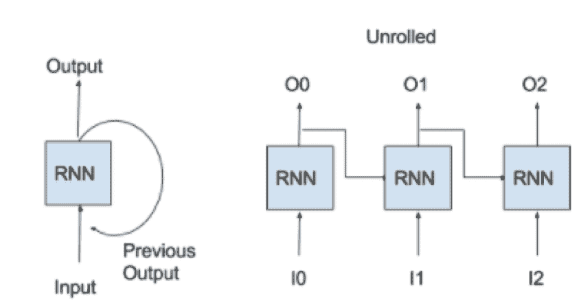
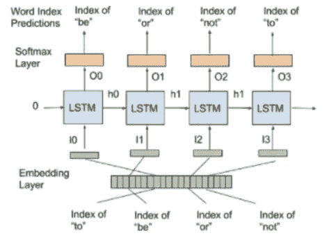
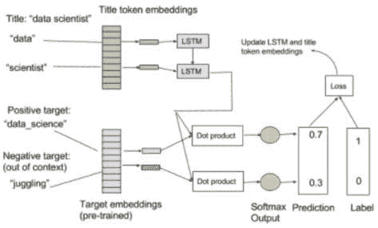

# 深入了解递归网络：序列到词袋模型

> 原文：[`www.kdnuggets.com/2017/08/deeper-recurrent-networks-sequence-bag-words-model.html`](https://www.kdnuggets.com/2017/08/deeper-recurrent-networks-sequence-bag-words-model.html)

**由 Solomon Fung, [MarianaIQ](https://www.marianaiq.com/)。**

在过去五年左右之前，若没有强大的计算资源，很难在网络上揭示话题和情感。工程师们没有高效的方法来大规模地理解单词和文档。现在，借助深度学习，我们可以将非结构化文本转换为可计算的格式，有效地结合语义知识来训练机器学习模型。利用数字世界的庞大数据资源可以帮助我们更直接地理解人们，超越通过测量和调查结果收集数据点的局限。以下是我们在 MarianaIQ 如何实现这一目标的简要介绍。

* * *

## 我们的前三个课程推荐

 1\. [Google 网络安全证书](https://www.kdnuggets.com/google-cybersecurity) - 快速进入网络安全职业。

 2\. [Google 数据分析专业证书](https://www.kdnuggets.com/google-data-analytics) - 提升您的数据分析水平

 3\. [Google IT 支持专业证书](https://www.kdnuggets.com/google-itsupport) - 支持您的组织的 IT

* * *

**深入了解递归网络**

**递归神经网络（RNN）** 是一种包含有时间反馈回路的神经层的网络。该层的一个神经元接收当前输入以及来自上一个时间步的输出。由于递归层在处理当前输入时“记住”之前的输入，RNN 可以在输入序列中操作。当计算 RNN 网络时，软件会“展开”网络（如下所示），通过快速克隆 RNN 到所有时间步并计算前向传递的信号。在反向传递期间，损失通过时间进行反向传播（BPTT），类似于前馈网络，但参数的调整在克隆之间是共享的。

**图 1. 递归网络架构**

我们使用一种复杂的 RNN，称为**长短期记忆（LSTM）⁷**，其神经元包括像内部开关的门控激活，具有高级记忆能力。LSTM 的另一个特点是将“隐藏状态”传递到下一个时间步，与其输出分开。

通过产品评论数据集，我们可以逐词输入 RNN，并在接收到最后一个词后使用 softmax 层预测评分。另一个 RNN 应用是语言模型，其中每个输入预测下一个输入。训练良好的 RNN 能够生成模仿[莎士比亚戏剧](http://karpathy.github.io/2015/05/21/rnn-effectiveness/)风格的文本，[奥巴马演讲](https://medium.com/@samim/obama-rnn-machine-generated-political-speeches-c8abd18a2ea0)，[计算机代码行](https://github.com/tonybeltramelli/pix2code)甚至是[音乐创作](http://www.hexahedria.com/2015/08/03/composing-music-with-recurrent-neural-networks/)。

**图 2. 训练 RNN 以逐词预测生成莎士比亚作品**

使用双 RNN 编码一种语言并解码到另一种语言，我们可以训练强大而优雅的**序列到序列**翻译模型（“seq2seq”学习）⁸。现在，谷歌翻译的智能大多依赖于这项技术。这些 RNN 可以处理一热编码输入向量或未经训练/预训练的嵌入，代表文本的字符级别或词汇级别。

**解决标题问题：我们的 Seq2BoW 模型**

我们可以将 RNN 与 Word2vec 结合，使用我们称之为“Seq2BoW”（序列到词袋）的模型将职位标题映射到兴趣上。RNN 学习从词序列中构建任何标题的嵌入，这给我们带来了两个优势：

+   首先，我们不再需要词汇表来详尽捕捉如此多的类似标题组合。

+   其次，标题和兴趣存在于相同的嵌入空间中，因此我们可以跨这两个词汇表查询，以查看它们在意义上的关系。我们不仅可以评估标题的相似性，还可以通过对比推断出的兴趣了解原因。

训练集包括包含标题和提取关键词的职位描述。我们使用新的嵌入层处理标题词（标记），并通过 LSTM 计算固定的标题嵌入。这个新的标题嵌入被训练以预测在同一描述中出现的兴趣。

为此，我们使用**线性层**将新的标题嵌入投影到兴趣的向量空间中（在我们的语料库上使用 Word2vec 进行预训练）。线性层是一个没有非线性激活的神经层，因此它只是将 LSTM 输出线性转换到现有的兴趣向量空间。我们像 Word2vec 那样训练词预测，使用根据职位描述中出现的关键词生成的正负嵌入。

为了加速，我们将 RNN 投影与正面词和负面词之间的点积结合在同一训练样本中，使用 softmax 层仅预测正面词，而不是像 Word2vec 那样训练单独的嵌入对。

**图 3. 训练标题 RNN（一个正样本和一个负样本）**

我们使用了[Keras](https://keras.io/)在[Tensorflow](https://www.tensorflow.org/)后端。运行在 NVIDIA GPU 上，使我们能够在 15 分钟内处理 1000 万份职位描述（32 宽 RNN 和 24 宽预训练兴趣词向量）。我们可以通过下面的一些例子展示这些向量的表征能力（所有列表均为计算机“生成”）。

使用我们用 Word2vec 训练的兴趣词汇，我们可以输入任何兴趣关键词，查找其向量并找到所有属于最接近向量的词汇：

**营销内容**：内容生成、企业博客、内容传播、署名文章、社交媒体策略、在线内容创作、内容策划、内容制作

**杂技**：溜冰、腹语、马戏艺术、独轮车、街舞、摇摆舞、喜剧时间、杂技

**脑外科**：医学研究、神经危重病护理、颅底外科、内分泌外科、脑肿瘤、医学教育、小儿心脏病学、肝胆外科

利用 Seq2BoW 标题模型，我们可以找到任何标题的相关兴趣：

**营销分析**：营销组合建模、Adobe 洞察、生命周期价值、归因建模、客户分析、Spss Clementine、数据细分、Spss Modeler

**数据工程师**：Spark、Apache Pig、Hive、Pandas、Map Reduce、Apache Spark、Octave、Vertica

**酿酒师**：葡萄种植学、酿酒、酒庄、红酒、品酒、食品搭配、香槟、啤酒

我们可以通过计算和存储最频繁标题的向量来创建一个单独的标题词汇表。然后，我们可以在这些向量中查询以找到相关标题：

**首席执行官**：主席、总合伙人、首席执行官、首席运营官、总裁、创始人/首席执行官、总裁/首席执行官、董事会成员

**洗碗工**：工作人员、队员、厨房工作人员、餐具清理员、酒吧助手、班组长、送餐员、三明治艺术家

**程序员**：高级软件开发工程师、首席软件开发人员、高级软件工程师 II、软件设计师、软件工程师 III、首席软件工程师、技术负责人、首席软件开发工程师

我们还可以找到任何兴趣附近的标题：

**电话销售**：账户管理、销售演示、直接销售、销售流程、销售运营、外勤销售、销售、销售管理

**烘焙**：厨师讲师、烹饪艺术讲师、烹饪讲师、面包师、首席面包师、糕点师、糕点、助理糕点师

**神经网络**：高级数据科学家、首席数据科学家、机器学习、数据科学家、算法工程师、定量研究员、研究程序员、首席科学家

我们可以超越兴趣和标题的关系，向 Seq2BoW 模型中添加各种输入或输出。例如，我们可以考虑公司信息、教育背景、地理位置或其他个人社会和消费者见解，并利用深度学习的灵活性来理解这些如何相关。

**理解文本在规模上推动 ABM**

MarianaIQ 使用的 ABM 智能依赖于强大且简洁的身份表示。我们使用深度学习来计算关键词和标题的语义嵌入。为了训练有用的机器学习模型，我们输入独特的标记向量，每个向量包含与我们的嵌入相连接的属性——这是一种结构化和非结构化数据的异质但和谐的组合。

通过学习来自网络的数据，**我们避免了传统顾问的狭隘和偏见视角。** 我们可以快速准确地提供定量评估，例如决定谁对特定主题反应更快或识别谁更像潜在买家。这些分析只有通过今天的机器学习才可行，但它们是让 ABM 能够在大规模为我们的客户服务的秘诀。

**个人简介：** [所罗门·冯](https://www.marianaiq.com/company-team/sol/)拥有多种学位，反映了他广泛的兴趣。从斯坦福大学获得硕士学位以来，他一直居住在加利福尼亚州，原籍加拿大。他在 MarianaIQ 的当前重点是大数据——他的算法旨在帮助公司更好地理解和预测个体消费者的行为。

**相关：**

+   构建、训练及改进现有的递归神经网络

+   如何在 TensorFlow 中构建递归神经网络

+   使用 TensorFlow API：入门教程系列

### 更多相关主题

+   [Python 中的情感分析：超越词袋模型](https://www.kdnuggets.com/sentiment-analysis-in-python-going-beyond-bag-of-words)

+   [如何跟上 AI 世界的动态](https://www.kdnuggets.com/2022/03/stay-top-going-ai-world.html)

+   [使用最先进的深度学习进行可解释的预测和实时预测…](https://www.kdnuggets.com/2021/12/sota-explainable-forecasting-and-nowcasting.html)

+   [Segment Anything Model: 图像分割的基础模型](https://www.kdnuggets.com/2023/07/segment-anything-model-foundation-model-image-segmentation.html)

+   [神经网络前的 10 个简单尝试](https://www.kdnuggets.com/2021/12/10-simple-things-try-neural-networks.html)

+   [使用 PyTorch 的可解释神经网络](https://www.kdnuggets.com/2022/01/interpretable-neural-networks-pytorch.html)
