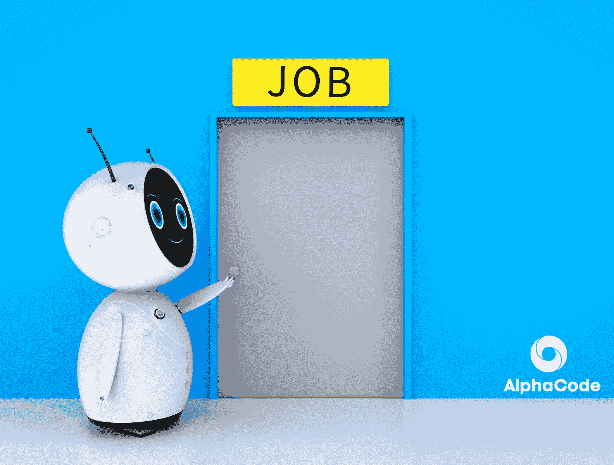
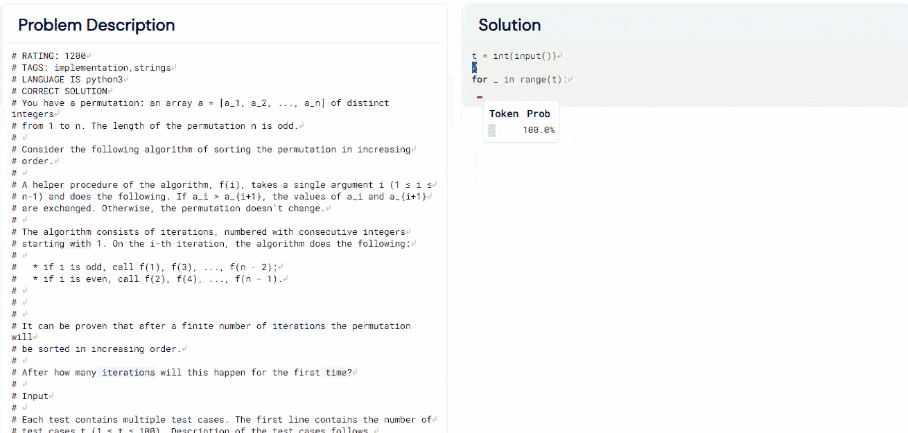
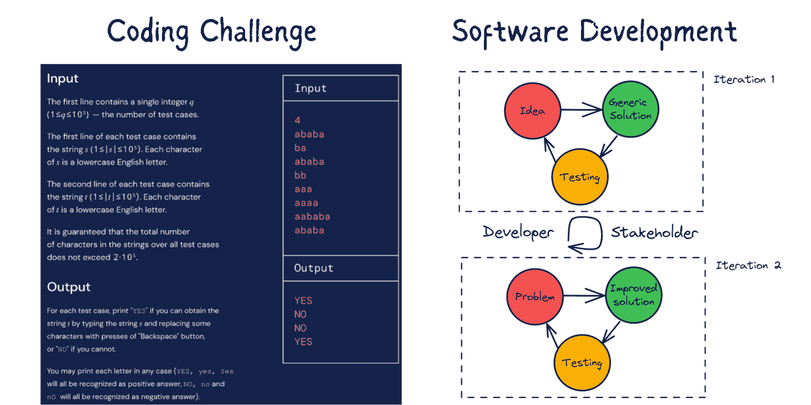
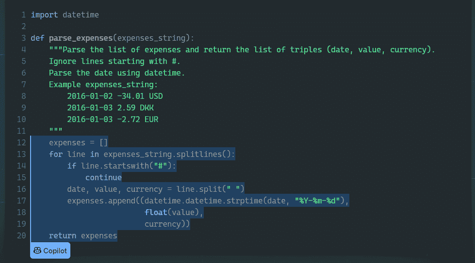
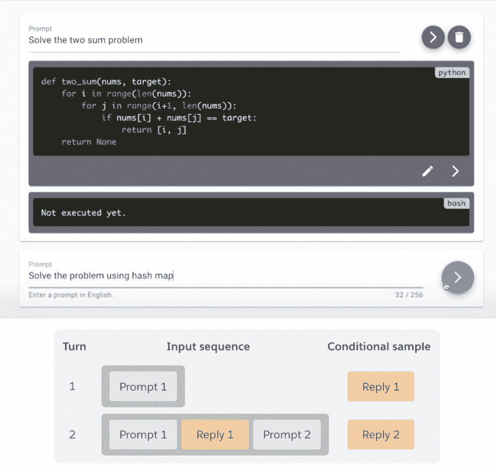

# DeepMind 的 AlphaCode 会替代程序员吗？

> 原文：[`www.kdnuggets.com/2022/04/deepmind-alphacode-replace-programmers.html`](https://www.kdnuggets.com/2022/04/deepmind-alphacode-replace-programmers.html)

图片由作者提供

字母表子公司 DeepMind 再次取得了成功，这一次，他们正在测试 AI 在软件开发领域的边界。DeepMind 的 [AlphaCode](https://arxiv.org/abs/2203.07814) 在编码挑战中与人类表现进行了对比，并在 [Codeforces](https://codeforces.com/) 上获得了**前 54%** 的排名。这是一个显著的成就，因为它是独一无二的。还有其他代码生成机器学习模型，例如 [OpenAI Codex](https://openai.com/blog/openai-codex/)，但没有一个尝试与人类程序员竞争。

编程挑战就像解谜。要解决这些挑战，个人必须具备逻辑、数学和编程技能。

> 谷歌的软件工程师 Petr Mitrichev 说：“解决竞争性编程问题是一件非常困难的事情。这需要人类具备良好的编码技能和解决问题的创造力。”

竞争性编程很难掌握，而 AlphaCode 的第一个版本已经超越了平均水平的编码人员。我们将学习 AlphaCode 的工作原理，并讨论 AI 替代人类程序员的可能性。我们还将了解 AI 辅助编程以及它如何塑造未来。

# 什么是 AlphaCode？

简而言之，AlphaCode 读取结构化问题陈述并生成最佳解决方案。这只有通过大规模的变换器才能实现，这些变换器在代码生成方面展示了令人满意的结果。这些变换器在来自 GitHub 的 **175 GB** 数据上进行了预训练，然后在小规模的竞争编程数据上进行了微调 - [Tech Monitor](https://techmonitor.ai/technology/ai-and-automation/deepmind-alphacode-ai-software-developer)。

AlphaCode 读取问题陈述并提出数千种潜在解决方案。这些解决方案经过筛选过程，最终减少到十种。之后，这些结果会提交到编程竞赛中进行评估。提出数千种解决方案并筛选到十种的缺点是，如果我们希望 AlphaCode 解决更复杂的问题，就需要策划一个大型复杂的编程数据集。

AlphaCode 解决了在 Codeforces 平台上已有 5,000 名用户尝试过的十个挑战。它被排在了过去六个月在该网站上参与竞争的用户中**28%**的前列。这对于初次发布而言是相当了不起的成就。DeepMind 团队表示，AlphaCode 目前仅限于竞争编程领域，他们正扩展这一领域以使其编程更加便捷和完全自动化 - [The Verge](https://www.theverge.com/2022/2/2/22914085/alphacode-ai-coding-program-automatic-deepmind-codeforce)。

Gif 来源于 [AlphaCode](https://alphacode.deepmind.com/)

# AI 会替代人类程序员吗？

简而言之，**不**。我们距离 AI 替代人类还有光年之遥。AlphaCode 对 AI 研究做出了有益的贡献，但距离达到人类程序员的熟练水平还远远不够。

> “这不是在击败人类方面的[AlphaGo](https://deepmind.com/research/case-studies/alphago-the-story-so-far)，也不是在彻底改变一个科学领域方面的[AlphaFold](https://deepmind.com/blog/article/alphafold-a-solution-to-a-50-year-old-grand-challenge-in-biology)。”，对 AlphaCode 有深入了解的研究科学家 Dzmitry Bahdanau 说道。

除此之外，代码生成中存在的安全漏洞可能会对公司造成严重损害。在 [研究](https://arxiv.org/abs/2108.09293) 中，研究人员发现 **40%** 的 GitHub [Copilot 生成](https://copilot.github.com/) 的代码含有安全漏洞。即使我们通过清理数据集在某种程度上解决了这个问题，我们也还未准备好应对那些试图在互联网发布有缺陷代码的恶意行为者，这些代码可能被用来训练 AI 模型。没有人类的参与，就没有安全的 AI 开发，因此我们始终需要软件开发人员和工程师来监控进展。

即使我们能够解决我上面提到的所有问题，现实世界的软件开发与编码挑战有很大不同。在软件开发中，项目的需求往往模糊，你需要通过逐步迭代来改进初始想法。这是程序员与利益相关者之间的反复谈判。没有固定的输入和输出，你需要通过每次迭代来确定输出。很难将所有利益相关者的需求以结构化的形式编写，因此 AlphaCode 只是一个实验，而不是对人类的真正威胁。

作者图像 | 编码挑战与软件开发 | 编码挑战来自 [DeepMind](https://www.deepmind.com/blog/competitive-programming-with-alphacode)

# AI 辅助编程

让我们讨论一下 AlphaCode 和类似的 AI 应用程序的实用性。GitHub Copilot 通过自动补全代码来帮助开发者，有时它会根据你的编码实践学习并提供个性化解决方案，自动化大量软件开发。AlphaCode 的未来是帮助编码者和非编码者。主要任务是使重复任务自动化，使软件开发对程序员和非技术人员都变得轻松。最近，我们看到无代码或少代码软件开发的兴起，这只是一个开始。这些 AI 程序不会取代人类，但会使我们更好地创建软件解决方案。

图像来自 [OpenAI Codex | Python 自动补全](https://openai.com/blog/openai-codex/)

# 未来

未来是对话式 AI 代码生成。这就像与一个智能机器人交谈，机器人记住过去的对话并像人类一样交流。[SalesForce CodeGen](https://blog.salesforceairesearch.com/codegen/) 模仿真实的软件开发，你写一个提示，然后查看结果。每次迭代中，我们都在添加和删除内容，AI 不断改进初始代码。例如，**Prompt 1**：“解决两数之和问题”和 **Prompt 2**：“使用哈希表解决问题”。最终代码是通过理解之前的输入序列生成的。通过这种方式，我们不断发展我们的代码，添加新功能并修复现有的 bug。

总结我们的讨论，我认为 AI 是来帮助我们的。它是一个先进的工具，将帮助我们解决复杂的问题并自动化重复的任务。

图像来自 [SalesForce CodeGen | 对话式 AI 编程](https://blog.salesforceairesearch.com/codegen/)

**[Abid Ali Awan](https://www.polywork.com/kingabzpro)** ([@1abidaliawan](https://twitter.com/1abidaliawan)) 是一位认证的数据科学专业人士，喜欢构建机器学习模型。目前，他专注于内容创作，并撰写有关机器学习和数据科学技术的技术博客。Abid 拥有技术管理硕士学位和电信工程学士学位。他的愿景是利用图神经网络构建一个 AI 产品，帮助那些面临心理问题的学生。

* * *

## 我们的前三大课程推荐

 1\. [谷歌网络安全证书](https://www.kdnuggets.com/google-cybersecurity) - 快速进入网络安全职业生涯。

 2\. [谷歌数据分析专业证书](https://www.kdnuggets.com/google-data-analytics) - 提升你的数据分析技能

 3\. [谷歌 IT 支持专业证书](https://www.kdnuggets.com/google-itsupport) - 支持您的组织进行 IT 工作

* * *

### 更多相关话题

+   [程序员的 10 个数学概念](https://www.kdnuggets.com/10-math-concepts-for-programmers)

+   [人工智能不是来取代我们的](https://www.kdnuggets.com/2023/02/ai-replace-us.html)

+   [ChatGPT 会取代数据科学家吗？](https://www.kdnuggets.com/2023/06/chatgpt-replace-data-scientists.html)

+   [人工智能会取代人类吗？](https://www.kdnuggets.com/will-ai-replace-humanity)

+   [你应该用哪些 AI 搜索引擎替代谷歌](https://www.kdnuggets.com/top-8-ai-search-engine-that-you-should-replace-with-google)

+   [深入了解 DeepMind 在利用深度学习推进数学方面的新努力](https://www.kdnuggets.com/2021/12/inside-deepmind-new-efforts-deep-learning-advance-mathematics.html)
