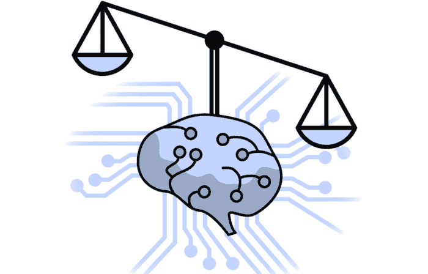

# DeepMind 依靠这种旧的统计方法来构建公平的机器学习模型

> 原文：[`www.kdnuggets.com/2020/10/deepmind-relies-statistical-method-build-fair-machine-learning-models.html`](https://www.kdnuggets.com/2020/10/deepmind-relies-statistical-method-build-fair-machine-learning-models.html)

评论

来源：[`sitn.hms.harvard.edu/uncategorized/2020/fairness-machine-learning/`](http://sitn.hms.harvard.edu/uncategorized/2020/fairness-machine-learning/)

> 我最近开始了一份新的新闻通讯，专注于人工智能教育。TheSequence 是一份无废话（即没有炒作、没有新闻等）的 AI 专注新闻通讯，阅读时间为 5 分钟。目标是让你了解最新的机器学习项目、研究论文和概念。请通过下面的订阅尝试一下：

机器学习系统经常被用来支持的一个论点是，它们能够做出决策，而不容易受到人类主观性的影响。然而，这个论点只有部分正确。虽然机器学习系统不会基于情感或情绪做出决策，但它们确实通过训练数据集继承了大量的人类偏见。偏见是重要的，因为它会导致不公平。在过去几年里，已经有了很多进展，开发出可以减轻偏见影响并改善机器学习系统公平性的技术。几个月前，[DeepMind 发布了一篇研究论文，提出使用一种称为因果贝叶斯网络（CBN）的旧统计技术来构建更公平的机器学习系统](https://arxiv.org/abs/1907.06430)。

我们如何在机器学习系统的背景下定义公平性？人类通常通过主观标准来定义公平性。在机器学习模型的背景下，公平性可以表示为敏感属性（如种族、性别等）与模型输出之间的关系。虽然这个定义在方向上是正确的，但它是不完整的，因为在不考虑模型的数据生成策略的情况下，不可能评估公平性。大多数公平性定义表达了模型输出相对于敏感信息的属性，而没有考虑数据生成机制下相关变量之间的关系。由于不同的关系要求模型满足不同的属性以保证公平，这可能导致错误地将具有不良/合法偏见的模型分类为公平/不公平。从这个角度来看，识别数据生成机制中的不公平路径与理解模型本身一样重要。

关于分析机器学习模型中的公平性，另一个相关点是其特征超越了技术构造，通常涉及社会学概念。从这个意义上说，数据集的可视化是识别潜在偏见和不公平的关键组成部分。在市场上的不同框架中，DeepMind 依赖于一种称为[Causal](https://www.cambridge.org/gb/academic/subjects/philosophy/philosophy-science/causality?format=HB) [Bayesian](https://pdfs.semanticscholar.org/c4bc/ad0bb58091ecf9204ddb5db7dce749b0d461.pdf) [networks](https://mitpress.mit.edu/books/causation-prediction-and-search-second-edition) (CBNs)的方法来表示和估计数据集中的不公平性。

### 因果贝叶斯网络作为不公平性的可视化表示

因果贝叶斯网络 (CBNs) 是一种用于表示因果关系的统计技术，采用图结构。概念上，CBN 是由表示随机变量的节点构成的图，这些节点通过表示因果影响的链接连接起来。DeepMind 方法的新颖之处在于使用 CBN 来建模数据集中不公平属性的影响。通过将不公平定义为图中敏感属性存在有害影响，CBN 提供了一个简单而直观的可视化表示，用于描述数据集中潜在的不同不公平场景。此外，CBN 为我们提供了一个强大的定量工具，以衡量数据集中的不公平性，并帮助研究人员开发解决这些问题的技术。

CBN 的一个更正式的数学定义是一个由表示个体变量的节点组成的图，这些节点通过因果关系连接。在 CBN 结构中，从节点 X 到节点 Z 的路径被定义为从 X 开始到 Z 结束的链接节点序列。如果存在从 X 到 Z 的因果路径，即路径中的链接指向序列中的后续节点，则 X 是 Z 的原因（对 Z 有影响）。

让我们在一个著名的统计案例研究中说明 CBNs。1975 年，一组伯克利大学的研究人员发表了一项关于统计学中偏见和不公平性最著名的研究之一。该研究基于一个大学录取场景，在该场景中，申请人根据资格 Q、部门选择 D 和性别 G 被录取；女性申请人更常申请某些部门（为了简单起见，我们将性别视为二元，但这不是框架强加的必要限制）。将该场景建模为 CBN，我们得到以下结构。在该图中，路径 G→D→A 是因果的，而路径 G→D→A←Q 是非因果的。

来源：[`arxiv.org/abs/1907.06430`](https://arxiv.org/abs/1907.06430)

### CBNs 和不公平性

CBNs 如何帮助确定数据集中的不公平因果关系？我们的大学录取示例展示了如何将不公平关系建模为 CBN 中的路径的一个清晰例子。然而，尽管 CBN 可以清楚地测量直接路径中的不公平性，但间接因果关系高度依赖于上下文因素。例如，考虑我们大学的三种变体，我们可以在这些变体中评估不公平性。在这些例子中，总的或部分的红色路径用于分别表示不公平和部分不公平的链接。

第一个例子说明了一个情境，其中女性申请者自愿申请接受率较低的部门，因此路径 G→D 被认为是公平的。

来源: [`arxiv.org/abs/1907.06430`](https://arxiv.org/abs/1907.06430)

现在，考虑之前例子的一个变体，其中女性申请者因系统性历史或文化压力而申请接受率较低的部门，因此路径 G→D 被认为是不公平的（因此路径 D→A 变成部分不公平）。

来源: [`arxiv.org/abs/1907.06430`](https://arxiv.org/abs/1907.06430)

继续考虑上下文游戏，如果我们的大学降低了女性更频繁选择的部门的录取率，会发生什么呢？路径 G→D 仍被认为是公平的，但路径 D→A 是部分不公平的。

来源: [`arxiv.org/abs/1907.06430`](https://arxiv.org/abs/1907.06430)

在所有三个例子中，CBNs（条件贝叶斯网络）提供了描述可能不公平情境的可视化框架。然而，对不公平关系影响的解释通常依赖于 CBN 之外的上下文因素。

直到现在，我们已经使用 CBNs 来识别数据集中的不公平关系，但如果我们能够测量它们呢？事实证明，我们技术的小变体可以用来量化数据集中的不公平性，并探索缓解方法。量化不公平性的主要思路在于引入反事实情境，允许我们询问模型的特定输入是否被不公平对待。在我们的情境中，反事实模型将允许我们询问一个被拒绝的女性申请者（G=1, Q=q, D=d, A=0）在一个性别为男性的反事实世界中是否会获得相同的决定，即直接路径 G→A。在这个简单的例子中，假设录取决定是作为 G、Q 和 D 的确定性函数 f 获得的，即 A = f(G, Q, D)，这相当于询问 f(G=0, Q=q, D=d) = 0，即一个具有相同部门选择和资格的男性申请者是否也会被拒绝。

来源: [`arxiv.org/abs/1907.06430`](https://arxiv.org/abs/1907.06430)

随着机器学习在软件应用中变得越来越重要，创建公平模型的重要性将变得更加相关。DeepMind 论文表明，CBNs 可以提供一个视觉框架来检测机器学习模型中的不公平性，并量化其影响。这种技术可以帮助我们设计出最符合人类价值观并减少偏见的机器学习模型。

[原文](https://jrodthoughts.medium.com/deepmind-relies-on-this-old-statistical-method-to-build-fair-machine-learning-models-bf5e7859787f)。已获得许可转载。

**相关：**

+   DeepMind 建立强大机器学习系统的三大支柱

+   神经网络能否展示想象力？DeepMind 认为它们可以

+   关于 AI 中意识辩论的一个有趣理论

* * *

## 我们的前三个课程推荐

 1\. [Google 网络安全证书](https://www.kdnuggets.com/google-cybersecurity) - 快速迈入网络安全职业。

 2\. [Google 数据分析专业证书](https://www.kdnuggets.com/google-data-analytics) - 提升您的数据分析技能

 3\. [Google IT 支持专业证书](https://www.kdnuggets.com/google-itsupport) - 支持您的组织 IT 工作

* * *

### 更多相关话题

+   [在 Pandas 数据框中使用 apply() 方法](https://www.kdnuggets.com/2022/07/apply-method-pandas-dataframes.html)

+   [__getitem__ 的介绍：Python 中的魔法方法](https://www.kdnuggets.com/2023/03/introduction-getitem-magic-method-python.html)

+   [利用 AI 设计公平和公正的电动车充电网](https://www.kdnuggets.com/leveraging-ai-to-design-fair-and-equitable-ev-charging-grids)

+   [DeepMind 利用深度学习推动数学发展的新努力](https://www.kdnuggets.com/2021/12/inside-deepmind-new-efforts-deep-learning-advance-mathematics.html)

+   [DeepMind 的 AlphaCode 会取代程序员吗？](https://www.kdnuggets.com/2022/04/deepmind-alphacode-replace-programmers.html)

+   [DeepMind 的 AlphaTensor 的首个开源实现](https://www.kdnuggets.com/2023/03/first-open-source-implementation-deepmind-alphatensor.html)
