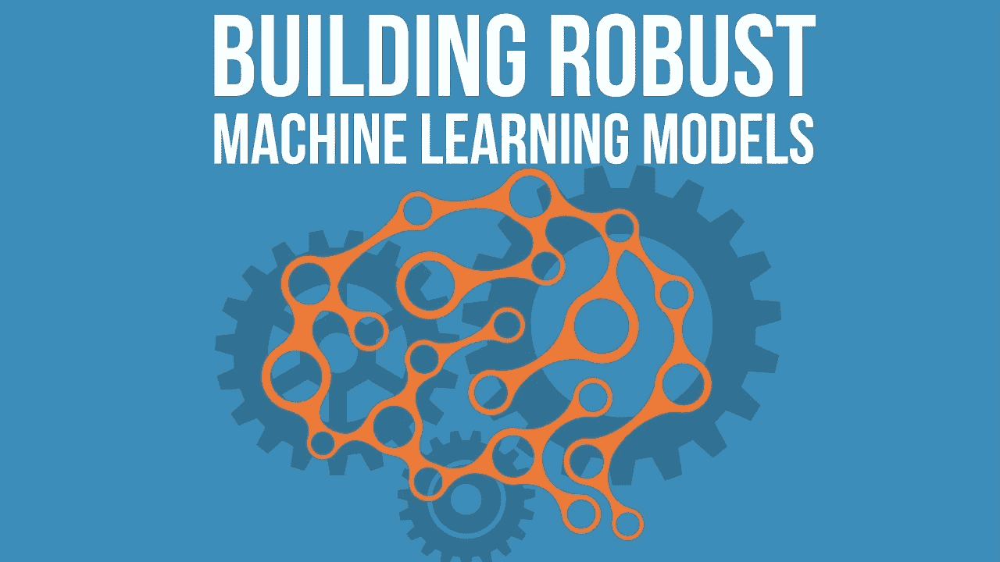
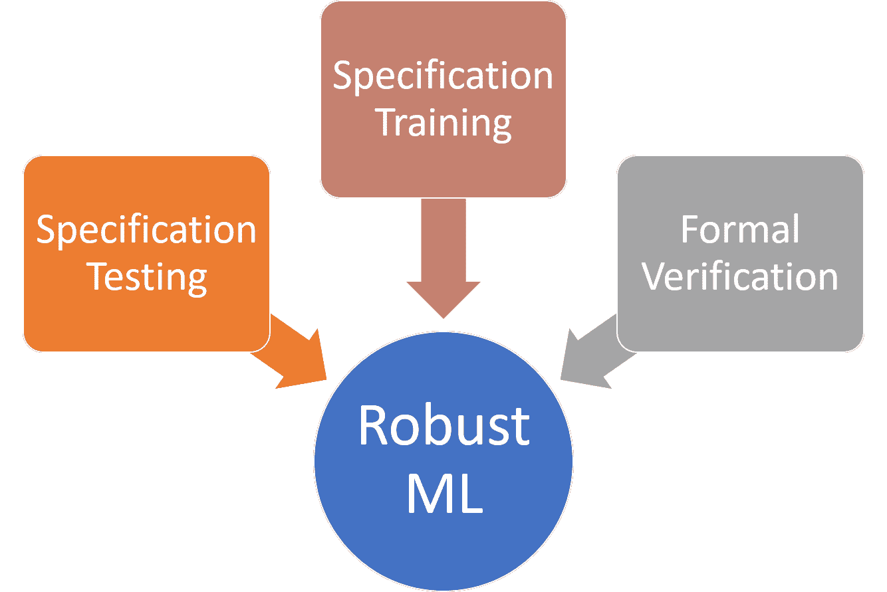
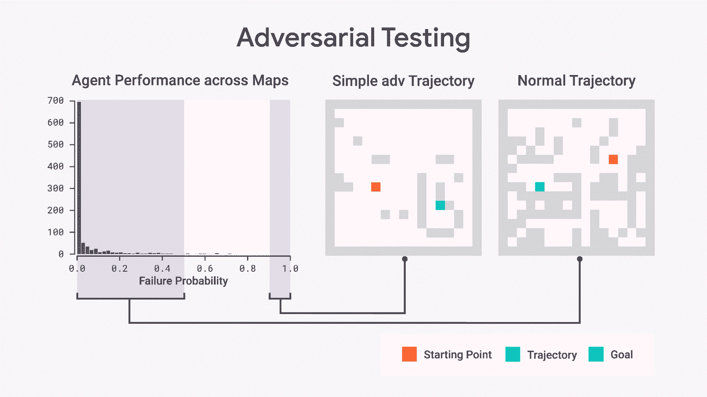
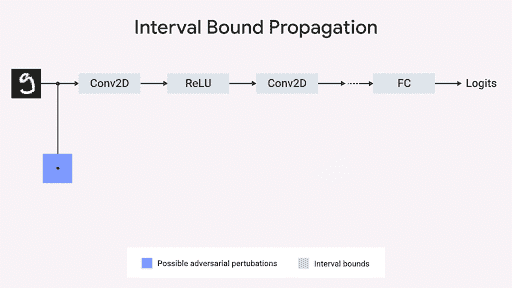
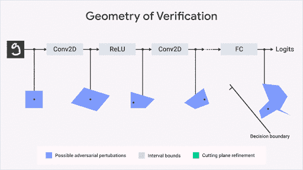

# DeepMind 构建稳健机器学习系统的三大支柱

> 原文：[`www.kdnuggets.com/2020/08/deepmind-three-pillars-building-robust-machine-learning-systems.html`](https://www.kdnuggets.com/2020/08/deepmind-three-pillars-building-robust-machine-learning-systems.html)

评论

来源：[`tutorials.datasciencedojo.com/building-robust-machine-learning-models/attachment/2412/`](https://tutorials.datasciencedojo.com/building-robust-machine-learning-models/attachment/2412/)

> 我最近开始了一个新的专注于 AI 教育的通讯。《TheSequence》是一个没有虚假信息（即没有炒作，没有新闻等）的 AI 专题通讯，阅读时间为 5 分钟。其目标是让你了解最新的机器学习项目、研究论文和概念。请通过下面的订阅试试吧：

构建机器学习系统在许多方面与传统软件开发不同。对于机器学习模型，传统的软件测试、调试和故障排除方法往往显得不够实际。传统软件组件如网站、移动应用或 API 的行为完全由其代码决定，而机器学习模型则根据特定数据集随时间演变其知识。如何定义和编写稳健的机器学习代理是整个领域面临的存在性挑战之一。去年，DeepMind 的人工智能（AI）研究人员 [发布了一些关于这个话题的想法](https://deepmind.com/blog/article/robust-and-verified-ai)。

当我们想到编写稳健的软件时，我们立即联想到两个根据预定义规范行为的代码。然而，在机器学习的情况下，没有确立的正确规范或稳健行为的定义。接受的做法是使用特定数据集训练机器学习模型，并使用不同的数据集进行测试。这种方法在两个数据集上都能实现高于平均水平的表现，但在处理边缘案例时并不总是有效。这些挑战的经典例子是图像分类模型，它们可能会因引入对人眼完全不可察觉的小变化而受到彻底干扰。

机器学习模型中的稳健性概念应该超越对训练和测试数据集的良好表现，还应根据描述系统期望行为的预定义规范进行行为。以我们之前的例子为例，需求规范可能会详细说明机器学习模型对对抗扰动或特定安全约束的预期行为。

编写鲁棒的机器学习程序是多个方面的结合，从准确的训练数据集到高效的优化技术。然而，大多数这些过程可以建模为构成 DeepMind 研究核心的三大支柱之一的变体：

1.  ***测试与规范的一致性：*** 测试机器学习系统是否符合设计者和用户期望的属性（如不变性或鲁棒性）的技术。

1.  ***训练机器学习模型以符合规范：*** 即使有大量的训练数据，标准的机器学习算法也可能产生与期望规范如鲁棒性或公平性不一致的预测模型——这需要我们重新考虑那些不仅能很好拟合训练数据，还能符合一系列规范的训练算法。

1.  ***正式证明机器学习模型符合规范：*** 需要能够验证模型预测在所有可能输入下与感兴趣的规范一致的算法。尽管形式化验证领域已经研究了这些算法几十年，但这些方法在现代深度学习系统中并不容易扩展，尽管取得了显著进展。

### 规范测试

对抗性样本是测试机器学习模型在给定规范下行为的极好机制。不幸的是，大多数相关的对抗训练工作都局限于图像分类模型。将这些思想扩展到诸如强化学习等更通用的领域，可能会提供一种通用机制来测试机器学习模型的鲁棒性。

跟随对抗训练的一些思想，DeepMind 开发了两种互补的方法来进行强化学习代理的对抗测试。第一种技术使用无导数优化直接最小化代理的期望奖励。第二种方法学习一个对抗值函数，从经验中预测哪些情况最有可能导致代理失败。然后利用学习到的函数进行优化，以将评估重点放在最有问题的输入上。这些方法只是潜在算法丰富、不断增长空间的一小部分，我们对未来在代理严格评估中的发展感到兴奋。

来源: [`deepmind.com/blog/article/robust-and-verified-ai`](https://deepmind.com/blog/article/robust-and-verified-ai)

对抗性方法在强化学习代理中显示出比传统测试方法更显著的改进。对抗性测试揭示了通常会被忽视的错误，同时也暴露了在代理中基于训练数据集的组成不期望的定性行为。例如，以下图展示了对抗性训练在 3D 导航任务中的效果。尽管代理可以实现人类水平的表现，但对抗性训练显示它在超级简单任务中仍然可能失败。

### 规格训练

对抗性测试在检测错误方面非常有效，但仍未能揭示偏离给定规格的例子。如果我们从机器学习的角度思考需求的概念，它们可以被建模为输入和输出之间的数学关系。基于这一思路，DeepMind 团队创建了一种方法，通过使用上下界几何计算模型与给定规格的一致性。该方法称为区间界限传播，DeepMind 的方法将规格映射到一个可以在网络的每一层进行评估的有界框，如下图所示。这项技术在各种机器学习模型中证明能降低可证明的错误率。

来源：[`deepmind.com/blog/article/robust-and-verified-ai`](https://deepmind.com/blog/article/robust-and-verified-ai)

### 形式验证

准确的测试和训练是实现机器学习模型鲁棒性所必需的步骤，但在很大程度上不足以确保系统按预期行为。在大规模模型中，枚举给定输入集的所有可能输出（例如，对图像进行微小扰动）由于输入扰动的选择数量庞大而不可行。形式验证技术是一个活跃的研究领域，专注于寻找基于给定规格设置几何界限的有效方法。

DeepMind 最近开发了一种形式验证方法，该方法将验证问题建模为一个优化问题，试图找到被验证属性的最大违反。该技术会进行多次迭代，直到找到正确的界限，这间接保证了不会出现进一步的属性违反。尽管最初应用于强化学习模型，但 DeepMind 的方法很容易推广到其他机器学习技术。

来源：[`deepmind.com/blog/article/robust-and-verified-ai`](https://deepmind.com/blog/article/robust-and-verified-ai)

测试、训练和规格的正式验证的结合构成了实现强大机器学习模型的三个关键支柱。DeepMind 的想法是一个很好的起点，但我们应当期待这些概念发展成能够建模和验证机器学习模型相关规格的功能性数据集或框架。迈向强大机器学习的道路也将由机器学习推动。

[原文](https://medium.com/swlh/deepminds-three-pillars-for-building-robust-machine-learning-systems-a9679e56250a)。经许可转载。

**相关：**

+   通过遗忘学习：深度神经网络与詹妮弗·安妮斯顿神经元

+   DeepMind 对 #AtHomeWithAI 的学习建议

+   Facebook 使用贝叶斯优化进行更好的机器学习模型实验

* * *

## 我们的前三个课程推荐

 1\. [Google 网络安全证书](https://www.kdnuggets.com/google-cybersecurity) - 加速你的网络安全职业生涯。

 2\. [Google 数据分析专业证书](https://www.kdnuggets.com/google-data-analytics) - 提升你的数据分析技能

 3\. [Google IT 支持专业证书](https://www.kdnuggets.com/google-itsupport) - 支持你的组织的 IT

* * *

### 更多相关主题

+   [每个数据科学家都应该了解的三个 R 语言库（即使你使用 Python）](https://www.kdnuggets.com/2021/12/three-r-libraries-every-data-scientist-know-even-python.html)

+   [DeepMind 在深度学习推动数学发展的新努力](https://www.kdnuggets.com/2021/12/inside-deepmind-new-efforts-deep-learning-advance-mathematics.html)

+   [DeepMind 的 AlphaCode 会取代程序员吗？](https://www.kdnuggets.com/2022/04/deepmind-alphacode-replace-programmers.html)

+   [DeepMind 的 AlphaTensor 首个开源实现](https://www.kdnuggets.com/2023/03/first-open-source-implementation-deepmind-alphatensor.html)

+   [设计有效且可靠的机器学习系统！](https://www.kdnuggets.com/2023/05/manning-design-effective-reliable-machine-learning-systems.html)

+   [人工智能系统中的不确定性量化](https://www.kdnuggets.com/2022/04/uncertainty-quantification-artificial-intelligencebased-systems.html)
